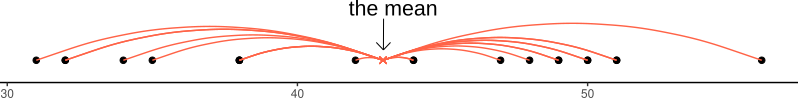

```{r setup, include=FALSE}
source('../assets/setup.R')

library(tidyverse)
```


## Central tendency  

In the following examples, we are going to use some data on 120 participants' IQ scores (measured on the Wechsler Adult Intelligence Scale (WAIS)), their ages, and their scores on two other tests.  
It is available at <https://uoepsy.github.io/data/wechsler.csv>  

```{r}
wechsler <- read_csv("https://uoepsy.github.io/data/wechsler.csv")
summary(wechsler)
```


### Mode and median revisited {-}  

We saw for categorical data two different measures of central tendency:

+ __Mode:__ The most frequent value (the value that occurs the greatest number of times).  
+ __Median:__ The value for which 50% of observations a lower and 50% are higher. It is the mid-point of the values when they are rank-ordered. 

We applied both of these to categorical data, but we can also use them for __numeric__ data.

|   |  Mode |  Median |  Mean |
|--:|--:|--:|--:| 
|  Nominal (unordered categorical) | &#10004; | &#10008; | &#10008; | 
|  Ordinal (ordered categorical) | &#10004; | &#10004; | **?**<br>(you may see it sometimes for certain types of ordinal data - there's no consensus) |
|  Numeric Continuous  | &#10004; | &#10004; | &#10004; |

<br>
The mode of numeric variables is not frequently used. Unlike categorical variables where there are a distinct set of possible values which the data can take, for numeric variables, data can take a many more (or infinitely many) different values. Finding the "most common" is sometimes not possible.  
<br>
The most frequent value (the __mode__) of the _iq_ variable is 97:
```{r}
# take the "wechsler" dataframe |>
# count() the values in the "iq" variable (creates an "n" column), and
# from there, arrange() the data so that the "n" column is descending - desc()
wechsler |>
    count(iq) |>
    arrange(desc(n))
```

Recall that the __median__ is found by ordering the data from lowest to highest, and finding the mid-point. 
In the _wechsler_ dataset we have IQ scores for 120 participants. 
We find the median by ranking them from lowest to highest IQ, and finding the mid-point between the $60^{th}$ and $61^{st}$ participants' scores.  
  
We can also use the `median()` function with which we are already familiar:
```{r}
median(wechsler$iq)
```

### Mean {-}  

One of the most frequently used measures of central tendency for __numeric__ data is the __mean__. 

:::{.callout-note}
__Mean:__ $\bar{x}$  

The mean is calculated by summing all of the observations together and then dividing by the total number of obervations ($n$). 

When we have sampled some data, we denote the mean of our sample with the symbol $\bar{x}$ (sometimes referred to as "x bar"). The equation for the mean is:

$$\bar{x} = \frac{\sum\limits_{i = 1}^{n}x_i}{n}$$

:::{.callout-note collapse="true"}
#### Help reading mathematical formulae
This might be the first mathematical formula you have seen in a while, so let's unpack it.  

The $\sum$ symbol is used to denote a _series of additions_ - a __"summation".__  
  
When we include the bits around it: $\sum\limits_{i = 1}^{n}x_i$ we are indicating that we add together all the terms $x_i$ for values of $i$ between $1$ and $n$: 
$$\sum\limits_{i = 1}^{n}x_i \qquad = \qquad x_1+x_2+x_3+...+x_n$$ 

So in order to calculate the mean, we do the summation (adding together) of all the values from the $1^{st}$ to the $n^{th}$ (where $n$ is the total number of values), and we divide that by $n$. 
:::


:::{.callout-note collapse="true"}
#### Samples and populations

Statistics is all about drawing inferences from some __sampled__ data about the larger __population__ from which it is sampled.  

A statistic which we calculate from our sample provides us with _an estimate_ of something in the population (for instance, we might take the average age of students at Edinburgh University as an estimate of the age of _all_ students).  

Because of this, statisticians have different notations for when we are talking about populations vs talking about samples:  

|  |  Sample|  Population|
|--:|--:|--:|
|  Number of observations |  $n$|  $N$|
|  Mean |  $\bar{x} = \frac{\sum\limits_{i = 1}^{n}x_i}{n}$ |  $\mu = \frac{\sum\limits_{i = 1}^{N}x_i}{N}$ |

:::


:::

We can do the calculation by summing the _iq_ variable, and dividing by the number of observations (in our case we have 120 participants):
```{r}
# get the values in the "iq" variable from the "wechsler" dataframe, and
# sum them all together. Then divide this by 120
sum(wechsler$iq)/120
```

Or, more easily, we can use the `mean()` function:
```{r}
mean(wechsler$iq)
```

### Summarising variables {-}

Functions such as `mean()`, `median()`, `min()` and `max()` can quickly summarise data, and we can use them together really easily in combination with `summarise()`.  

:::{.callout-note}
__summarise()__

The `summarise()` function is used to reduce variables down to a single summary value.
```{r eval=FALSE}
# take the data |>
# summarise() it, such that there is a value called "summary_value", which
# is the sum() of "variable1" column, and a value called 
# "summary_value2" which is the mean() of the "variable2" column.
data |>
  summarise(
    summary_value = sum(variable1),
    summary_value2 = mean(variable2)
  )
```
__Note:__ Just like with `mutate()` we don't have to keep using the dollar sign `$`, as we have already told it what dataframe to look for the variables in. 
:::

So if we want to show the mean IQ score and the mean age of our participants:
```{r}
# take the "wechsler" dataframe |>
# summarise() it, such that there is a value called "mean_iq", which
# is the mean() of the "iq" variable, and a value called 
# "mean_age" which is the mean() of the "age" variable. 
wechsler |>
    summarise(
        mean_iq = mean(iq),
        mean_age = mean(age)
    )
```

## Spread  

### Interquartile range {-}

If we are using the __median__ as our measure of central tendency and we want to discuss how spread out the spread are around it, then we will want to use quartiles (recall that these are linked: the $2^{nd}$ quartile = the median). 

We have already briefly introduced how for __ordinal__ data, the 1st and 3rd quartiles give us information about how spread out the data are across the possible response categories. 
For numeric data, we can likewise find the 1st and 3rd quartiles in the same way - we rank-order all the data, and find the point at which 25% and 75% of the data falls below. 

The _difference_ between the 1st and 3rd quartiles is known as the __interquartile range (IQR)__.  
<small>( __Note__, we couldn't take the _difference_ for ordinal data, because "difference" would not be quantifiable - the categories are ordered, but intervals are between categories are unknown)</small>

In R, we can find the IQR as follows:
```{r}
IQR(wechsler$age)
```

Alternatively, we can use this inside `summarise()`:
```{r}
# take the "wechsler" dataframe |>
# summarise() it, such that there is a value called "median_age", which
# is the median() of the "age" variable, and a value called "iqr_age", which
# is the IQR() of the "age" variable.
wechsler |> 
  summarise(
    median_age = median(age),
    iqr_age = IQR(age)
  )
```


### Variance {-}

If we are using the __mean__ as our as our measure of central tendency, we can think of the spread of the data in terms of the __deviations__ (distances from each value to the mean).

Recall that the mean is denoted by $\bar{x}$. If we use $x_i$ to denote the $i^{th}$ value of $x$, then we can denote deviation for $x_i$ as $x_i - \bar{x}$.  
The deviations can be visualised by the red lines in Figure \@ref(fig:deviations).  

```{r deviations, echo=FALSE, fig.cap="Deviations from the mean"}

```

:::{.callout-note}
__The sum of the deviations from the mean, $x_i - \bar x$, is always zero__

$$
\sum\limits_{i = 1}^{n} (x_i - \bar{x}) = 0
$$

The mean is like a center of gravity - the sum of the positive deviations (where $x_i > \bar{x}$) is equal to the sum of the negative deviations (where $x_i < \bar{x}$).
:::

Because deviations around the mean always sum to zero, in order to express how spread out the data are around the mean, we must we consider __squared deviations__.  
Squaring the deviations makes them all positive. Observations far away from the mean _in either direction_ will have large, positive squared deviations. The average squared deviation is known as the __variance,__ and denoted by $s^2$

:::{.callout-note}
__Variance:__ $s^2$

The variance is calculated as the average of the squared deviations from the mean.  

When we have sampled some data, we denote the mean of our sample with the symbol $\bar{x}$ (sometimes referred to as "x bar"). The equation for the variance is:

$$s^2 = \frac{\sum\limits_{i=1}^{n}(x_i - \bar{x})^2}{n-1}$$

:::{.callout-note collapse="true"}
#### Why n minus 1?

The top part of the equation $\sum\limits_{i=1}^{n}(x_i - \bar{x})^2$ can be expressed in $n-1$ terms, so we divide by $n-1$ to get the average.  
<br>
__Example:__ If we only have two observations $x_1$ and $x_2$, then we can write out the formula for variance in full quite easily. The top part of the equation would be:
$$
\sum\limits_{i=1}^{2}(x_i - \bar{x})^2 \qquad = \qquad (x_1 - \bar{x})^2 + (x_2 - \bar{x})^2
$$

The mean for only two observations can be expressed as $\bar{x} = \frac{x_1 + x_2}{2}$, so we can substitute this in to the formula above. 
$$
(x_1 - \bar{x})^2 + (x_2 - \bar{x})^2 \qquad = \qquad \left(x_1 - \frac{x_1 + x_2}{2}\right)^2 + \left(x_2 - \frac{x_1 + x_2}{2}\right)^2 
$$
Which simplifies down to one value:
$$
\left(x_1 - \frac{x_1 + x_2}{2}\right)^2 + \left(x_2 - \frac{x_1 + x_2}{2}\right)^2 \qquad = \qquad  \left(\frac{x_1 - x_2}{\sqrt{2}}\right)^2
$$
<br>
So although we have $n=2$ datapoints ($x_1$ and $x_2$), the top part of the equation for the variance has only 1 ($n-1$) units of information. In order to take the average of these bits of information, we divide by $n-1$. 
:::

:::

We can get R to calculate this for us using the `var()` function:
```{r}
wechsler |>
  summarise(
    variance_iq = var(iq)
  )
```


### Standard deviation {-}

One difficulty in interpreting __variance__ as a measure of spread is that it is in units of __squared deviations.__  It reflects the typical _squared_ distance from a value to the mean.  
Conveniently, by taking the square root of the variance, we can translate the measure back into the units of our original variable. This is known as the __standard deviation.__  

:::{.callout-note}
__Standard Deviation:__ $s$

The standard deviation, denoted by $s$, is a rough estimate of the typical distance from a value to the mean.  
It is the square root of the variance (the typical _squared_ distance from a value to the mean). 

$$
s = \sqrt{\frac{\sum\limits_{i=1}^{n}(x_i - \bar{x})^2}{n-1}}
$$

:::  


We can get R to calculate the standard deviation of a variable `sd()` function:
```{r}
wechsler |>
  summarise(
    variance_iq = var(iq),
    sd_iq = sd(iq)
  )
```


## Skew 

Skewness is a measure of _asymmetry_ in a distribution. Distributions can be _positively skewed_ or _negatively skewed_, and this influences our measures of central tendency and of spread to different degrees (see Figure \@ref(fig:skewplot)). 

```{r, skewplot, echo=FALSE, fig.cap = "Skew influences the mean and median to different degrees."}
library(sn)
tibble(
  x = seq(0, 200, 1),
  y = dnorm(x, 100, 15),
  y2 = dsn(x, xi = 180, omega=27.5, alpha = -5),
  y3 = dsn(x, xi = 20, omega=27.5,alpha = 5),
) |>
  ggplot(aes(x=x))+
  geom_ribbon(aes(ymin=0, ymax=y, fill="Symmetric"), alpha=0.2)+
  geom_ribbon(aes(ymin=0, ymax=y2, fill="Negative Skew"), alpha=0.2)+
  geom_ribbon(aes(ymin=0, ymax=y3, fill="Positive Skew"), alpha=0.2)+
  theme_classic()+
  scale_fill_manual("",breaks=c("Positive Skew","Symmetric","Negative Skew"), values=c("chartreuse3","blue","red"))+
  scale_y_continuous(NULL, breaks=NULL,)+
  theme(axis.line.y = element_blank(), axis.text.x = element_blank(), 
        axis.title.x = element_blank(), legend.position="bottom")+
  
  geom_vline(aes(xintercept=100), lty="dashed", col="blue")+
  annotate("label",x=100, y=0.029, label="Mode", vjust=1,hjust=0.5, col="blue")+
  annotate("label",x=100, y=0.031, label="Median", vjust=1,hjust=0.5, col="blue")+
  annotate("label",x=100, y=0.033, label="Mean", vjust=1,hjust=0.5, col="blue")+
  
  geom_vline(xintercept=c(155,165,170), lty="dashed", col="red")+
  annotate("label",x=170, y=0.029, label="Mode", vjust=1,hjust=0.5, col="red")+
  annotate("label",x=165, y=0.031, label="Median", vjust=1,hjust=0.5, col="red")+
  annotate("label",x=155, y=0.033, label="Mean", vjust=1,hjust=0.5, col="red")+
  
  geom_vline(xintercept=c(45,35,30), lty="dashed", col="chartreuse3")+
  annotate("label",x=30, y=0.029, label="Mode", vjust=1,hjust=0.5, col="chartreuse3")+
  annotate("label",x=35, y=0.031, label="Median", vjust=1,hjust=0.5, col="chartreuse3")+
  annotate("label",x=45, y=0.033, label="Mean", vjust=1,hjust=0.5, col="chartreuse3")+
  NULL
```


## Glossary

+ __Interquartile Range (IQR):__ The $3^{rd}$ quartile minus the $1^{st}$ quartile. 
+ __Mean:__ The sum of all observations divided by the total number of observations. The center of gravity of a variable. 
+ __Deviation:__ The distance from an observation to the mean value.
+ __Variance:__ The average squared distance from observations to the mean value. 
+ __Standard deviation:__ Square root of variance - can be thought of as the average distance from observations to the mean value.
+ __Skew:__ A measure of _asymmetry_ in a distribution.
<br><br>
+ `summarise()` To summarise variables into a single value according to whatever calculation we give it. 
+ `IQR()` To calculate the interquartile range for a given variable. 
+ `mean()` To calculate the mean of a given variable.
+ `sd()` To calculate the standard deviation of a given variable.
+ `var()` To calculate the variance of a given variable. 
