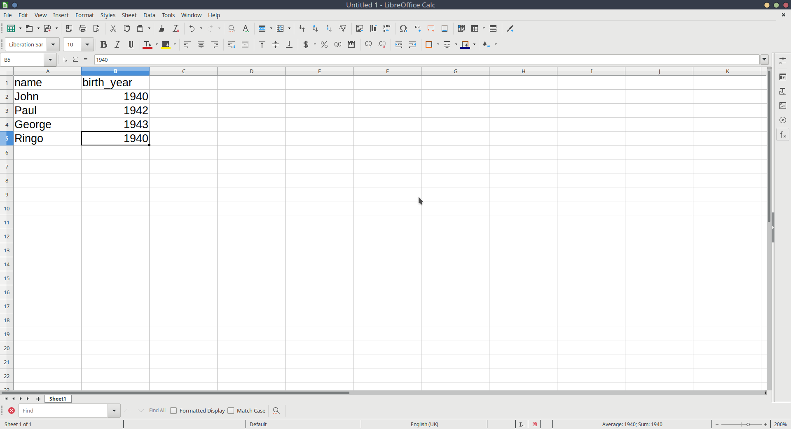

```{r setup, include=FALSE}
source('../assets/setup.R')
```


While we can manually input data like we did above, more often, we will need to read in data which has been created elsewhere (like in excel, or by some software which is used to present participants with experiments).  


:::{.frame}

Open Microsoft Excel, or LibreOffice Calc, or whatever spreadsheet software you have available to you, and create some data with more than one variable.  

It can be whatever you want, but we've used a very small example here for you to follow, so feel free to use it if you like. 

We've got two sets of values here: the names and the birth-years of each member of the Beatles. The easiest way to think of this would be to have a row for each Beatle, and a column for each of name and birth-year.   




:::


:::{.frame}


Save the data as a __.csv__ file.  
  
Although R can read data when it's saved in Microsoft/LibreOffice formats, the simplest, and most universal way to save data is as simple text, with the values separated by some character - __.csv__ stands for __comma separated values__.  
 
In Microsoft Excel, if you go to __File > Save as__

In the Save as Type box, choose to save the file as __CSV (Comma delimited)__.  

__Important:__ save your data in the project folder you created at the start of this lab. 

:::


Back in RStudio...

Next, we're going to read the data into R. We can do this by using the `read_csv()` function, and directing it to the file you just saved.  

**If you are using RStudio on the server**, you will need to upload the file you just saved to the server. The video below shows an example of this:  

<!-- <center> -->
<!-- <video width="320" height="240" controls> -->
<!--   <source src="images/rstudio_intro/uploaddataserver.mp4" type="video/mp4"> -->
<!-- </video> -->
<!-- </center> -->




:::{.frame}

Attach the package `tidyverse` by writing at the top of your R script (if you haven't already)

```{r}
library(tidyverse)
```

and then to load in your CSV file, type

```{r eval=F}
read_csv("name-of-your-data.csv")
```

but replace _name-of-your-data_ with whatever you just saved your data as in your spreadsheet software.  
:::

__Helpful tip__  
If you have your text-cursor inside the quotation marks, and press the tab key on your keyboard, it will show you the files inside your project. You can then use the arrow keys to choose between them and press Enter to add the code: 

<!-- <center> -->
<!-- <video width="320" height="240" controls> -->
<!--   <source src="images/rstudio_intro/readdatatab.mp4" type="video/mp4"> -->
<!-- </video> -->
<!-- </center> -->




When you run the line of code you just wrote, it will print out the data, but will not store it. To do that, we need to assign it as something:
```{r echo=FALSE}
beatles <- read_csv("https://uoepsy.github.io/data/data_from_excel.csv")
```
```{r eval=FALSE}
beatles <- read_csv("data_from_excel.csv")
```
Note that this will now turn up in the _Environment_ pane of RStudio.  


Now that we've got our data in R, we can print it out by simply invoking its name:  
```{r}
beatles
```

And we can do things such as ask R how many rows and columns there are:
```{r}
dim(beatles)
```

This says that there are four members of the Beatles, and for each we have two measurements.

To get more insight into what the data actually are, you can either use the structure `str()` function, or `glimpse()` function to get a glimpse at the data:

```{r}
str(beatles)
glimpse(beatles)
```


:::{.frame}

Use `dim()` to confirm how many rows and columns are in your data.  

Use `str()` or `glimpse()` to take a look at the structure of the data. Don't worry about the output of `str()` right now, we'll pick up with this in the next chapter.
:::
