```{r setup, include=FALSE}
source('../assets/setup.R')
```


## Accessing the software

**Recommended option**: access it via the RStudio Server Online:

a. Go to the course LEARN page.
b. Click "Quick Links"
c. Click "RStudio Server Online (by Noteable)"
d. Select "RStudio" from the dropdown menu
e. Click "Start"

**Alternative**: install it locally on your PC following [these instructions](https://uoepsy.github.io/files/install-update-r.html).


### Setting up your folder

- Create a new folder on the server. Give it a useful name like the name of the course: DAPR1. (In the picture we have used "USMR" but please use "DAPR1").   

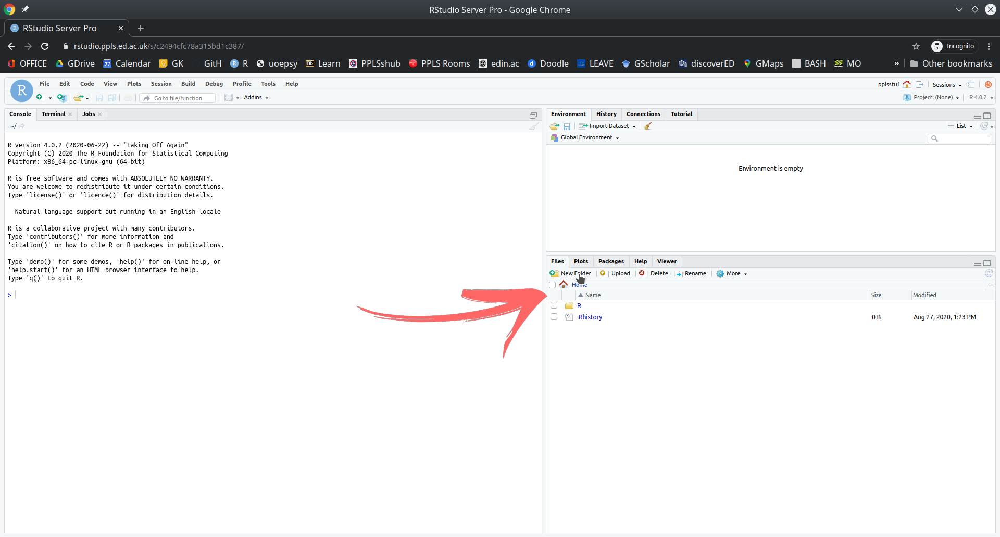  

- In the top right, click Project > New Project

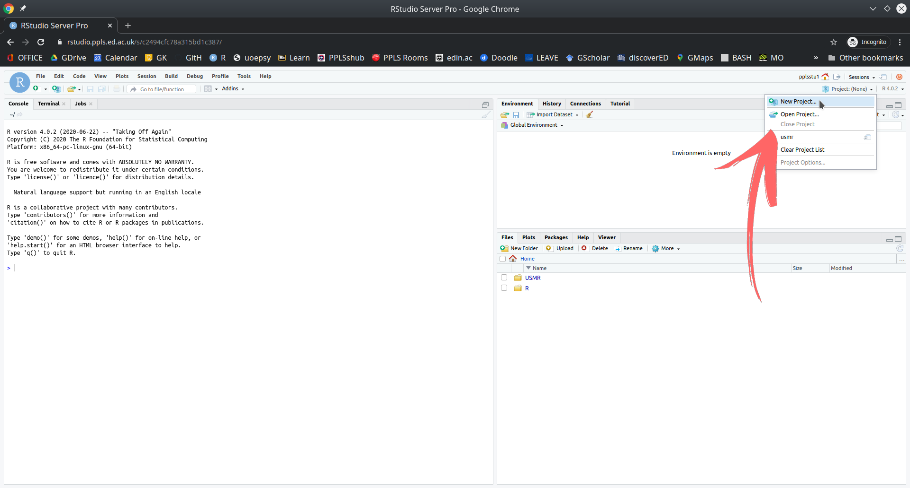  

- Click "Existing Directory"

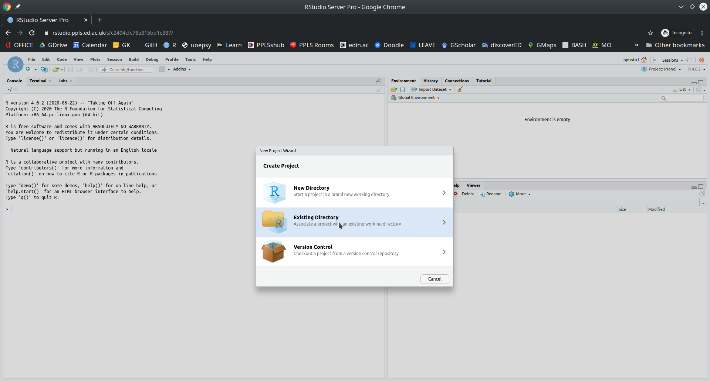  

- Click "Browse" and then choose the folder you just created. Click "Choose" and then click "Create Project".

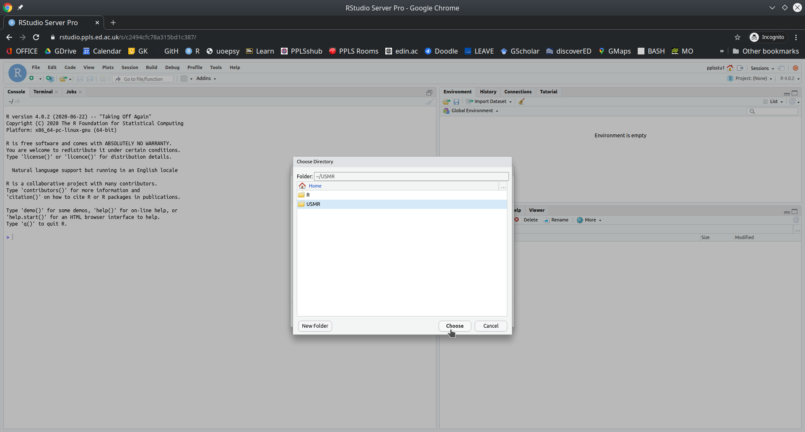  

- You should now be able to tell that you have the project open, because it shows you in the top right. 

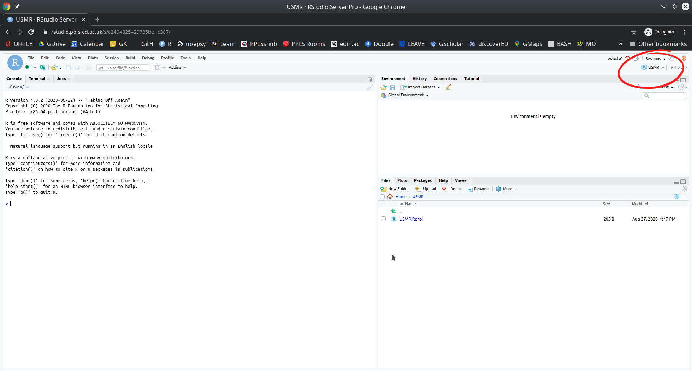  

You're ready to go!


## A first look at RStudio

Okay, now you should have RStudio and a project open, and you should see something which looks more or less like the image below, where there are several little windows.  

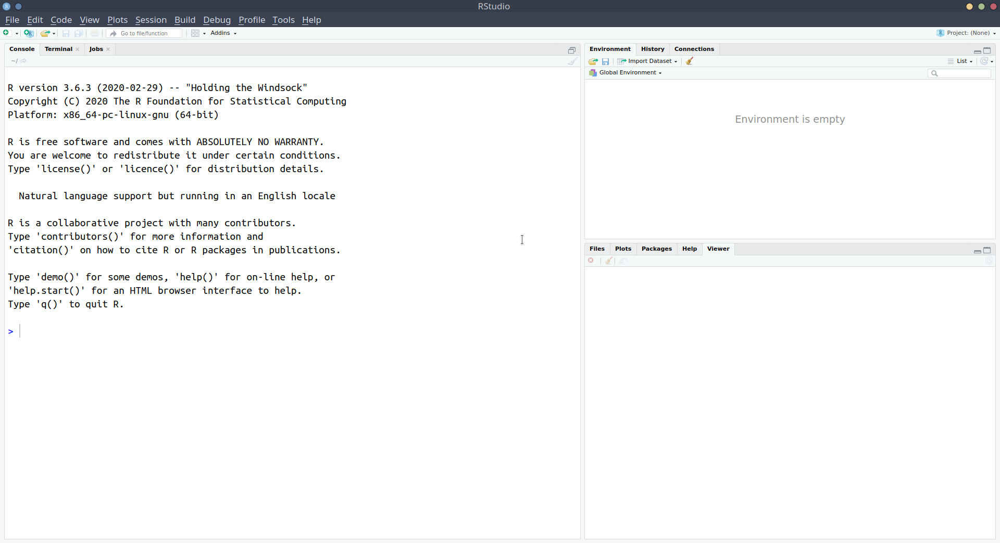

We are going to explore what each of these little windows offer by just diving in and starting to do things. 

### R as a calculator

Starting in the left-hand window, you'll notice the blue sign > which is where we R code gets _executed_. 

Type 2+2, and hit Enter &#8629;. You should discover that R is a calculator.

Let's work through some of the basic operations (adding, subtracting, etc).
Try these commands yourself:

+ `2 + 5`
+ `10 - 4`
+ `2 * 5`
+ `10 - (2 * 5)`
+ `(10 - 2) * 5` 
+ `10 / 2`
+ `3^2` (Hint, interpret the `^` symbol as "to the power of")


:::{.callout-note}
Whenever you see the blue sign >, it means R is ready and waiting for you to provide a command.

If you type `10 +` and press Enter, you'll see that instead of a blue > you are left with a blue +. This means that R is waiting for more. Either give it more, or cancel the command by pressing the escape key on your keyboard. 
:::

As well as performing calculations, we can _ask_ R things, such as "Is 3 less than 5?":
```{r}
3 < 5
```

As the computation above returns TRUE, we notice that such questions return either TRUE or FALSE. These are not numbers and are called _logical_ values.

Try the following:  

+ `3 > 5` "is 3 greater than 5?"
+ `3 <= 5` "is 3 less than or equal to 5?"
+ `3 >= 3` "is 3 greater than or equal to 3?"
+ `3 == 5` "is 3 equal to 5?"
+ `(2 * 5) == 10` "is 2 times 5 equal to 10?"
+ `(2 * 5) != 11` "is 2 times 5 NOT equal to 11?"

### R as a calculator with a memory

We can also store things in R's memory, and to do that we just need to give them a name. Type `x <- 5` and press Enter.
  
What has happened? We've just stored something named `x` which has the value `5`.
We can now refer to the name and it will give us the value!
Try typing `x` and hitting Enter. It should give you the number 5.
What about `x * 3`?

## Storing things in R

The `<-` symbol, pronounced arrow, is used to _assign_ a value to a named object:

`[name] <- [value]`

Note, there are a few rules about names in R:  

+ No spaces - spaces _inside_ a name are not allowed (the spaces around the `<-` don't matter):  
    + `lucky_number <- 5` &#10004; &emsp; `lucky number <- 5` &#10060;  
+ Names must start with a letter:  
    + `lucky_number <- 5` &#10004; &emsp; `1lucky_number <- 5` &#10060;  
+ Case sensitive:  
    + `lucky_number` is different from `Lucky_Number`  
+ Reserved words - there is a set of words you can't use as names, including: if, else, for, in, TRUE, FALSE, NULL, NA, NaN, function  
(Don't worry about remembering these, R will tell you if you make the mistake of trying to name a variable after one of these). 

You might have noticed that something else happened when you executed the code `x <- 5`.
The thing we named __x__ with a value of __5__ suddenly appeared in the top-right window. This is known as the __environment__, and it shows everything that we store things in R: 

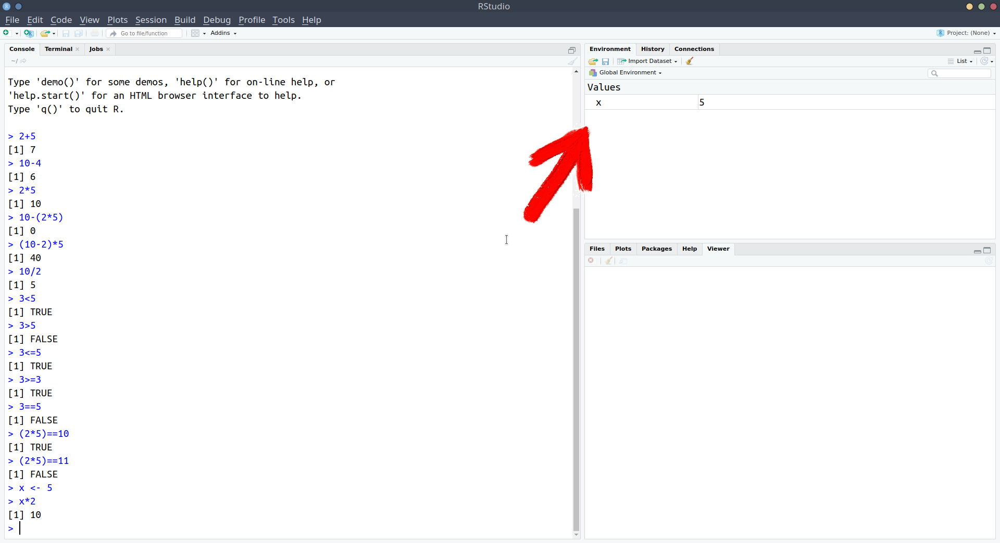 

We've now used a couple of the windows - we've been executing R code in the __console__, and learned about how we can store things in R's memory (the __environment__) by assigning a name to them:  

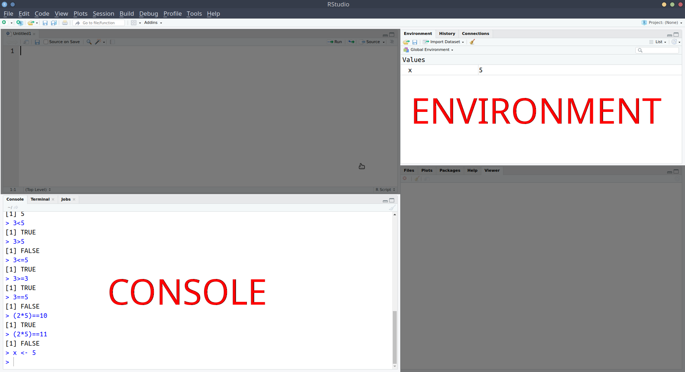


Notice that in the screenshot above, we have moved the __console__ down to the bottom-left, and introduced a new window above it. This is the one that we're going to talk about next. 


## R scripts

What if we want to edit our code?
Whatever we write in the console just disappears upwards. What if we want to change things we did earlier on?  

Well, we can write and edit our code in a separate place _before_ sending it to the __console__ to be executed.
That place is an R script.

:::{.frame}

1. Open an R script
    + __File > New File > R script__

2. Copy and paste the following into the R script
```{r eval=FALSE}
x <- 210
y <- 15
x / y
```

3. Position your text-cursor (blinking vertical line) on the top line and press:
    + Ctrl + Enter on Windows
    + Cmd + Enter on macOS
:::

Notice what has happened - it has sent the command `x <- 210` to the console, where it has been executed, and __x__ is now in your environment.
Additionally, it has moved the text-cursor to the next line.  

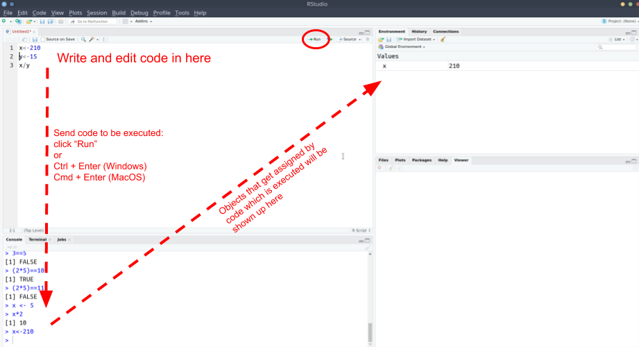

:::{.frame}

Press Ctrl + Enter (Windows) or Cmd + Enter (macOS) again.
Do it twice (this will run the next two lines).

Then, change __x__ to some other number in your R script, and run the lines again (starting at the top).
:::

:::{.frame}

Add the following line to your R script and execute it (send it to the console pressing Ctrl/Cmd + Enter):
```{r eval=FALSE}
plot(1,5)
```
:::


A very basic plot should have appeared in the bottom-right of RStudio.
The bottom-right window actually does some other useful things. 

:::{.frame}

1. Save the R script you have been working with:
    + File > Save
    + give it an appropriate name, and click save.

1. Check that you can now see that file in the file pane, by clicking on the "Files" tab of the bottom-right window. 
:::

**NOTE:** When you save R script files, they terminate with a .R extension.


__Comments in code__  
Note that using `#` in R code makes that line a comment, which basically means that R will ignore the line. Comments are useful for you to remind yourself of what your code is doing.


## Recap

Okay, so we've now seen all of the different windows in RStudio in action:

+ The __console__ is where R code gets executed
+ The __environment__ is R's memory, you can _assign_ something a name and store it here, and then refer to it by name in your code.
+ The __editor__ is where you can write and edit your R code in an R script. You can then send this code to the console for it to be executed.
+ The bottom-right window shows you the __plots__ that you create, the __files__ in your project, and some other things (we'll get to these later). 

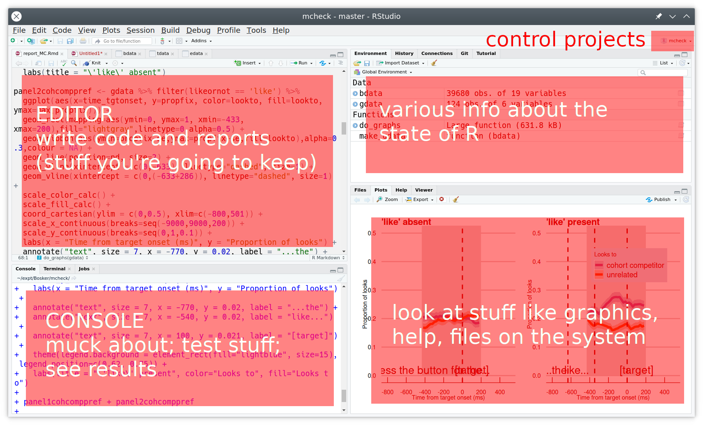


## Settings to update

Below are a couple of our recommended settings for you to change as you begin your journey in R.

:::{.frame}
__Useful Settings 1: Clean environments__  

As you use R more, you will store lots of things with different names. Throughout this course alone, you'll probably name hundreds of different things.
This could quickly get messy within our project.
  
We can make it so that we have a clean environment each time you open RStudio. This will be really handy.


1. In the top menu, click __Tools > Global Options...__
1. Then, _untick_ the box for "Restore .RData into workspace at startup", and change "Save workspace to .RData on exit" to _Never_:

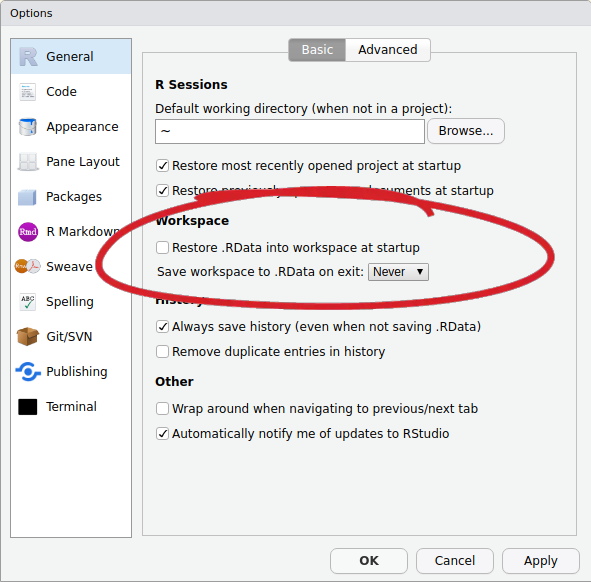

:::

:::{.frame}
__Useful Settings 2: Wrapping code__  

In the editor, you might end up with a line of code which is really long, but you can make RStudio 'wrap' the line, so that you can see it all, without having to scroll:
```{r eval=FALSE}
x <- 1+2+3+6+3+45+8467+356+8565+34+34+657+6756+456+456+54+3+78+3+3476+8+4+67+456+567+3+34575+45+2+6+9+5+6
```

1. In the top menu, click __Tools > Global Options...__
1. In the left menu of the box, click "Code"
1. _Tick_ the box for "Soft-wrap R source files"
:::
