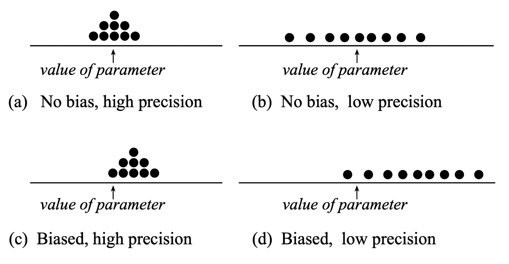

```{r setup, include=FALSE}
source('../assets/setup.R')
```


Smaller sample sizes lead to more variable statistics, while larger sample sizes lead to more **precise** statistics, i.e. the estimates are more concentrated around the true parameter value.
__This teaches us that, when we have to design a study, it is better to obtain just one sample with size $n$ as large as we can afford.__


What would the sampling distribution of the mean look like if we could afford to take samples as big as the entire population, i.e. of size $n = N$?

If we could afford to measure the entire population, then we would find the exact value of the parameter all the time.
By taking multiple samples of size equal to the entire population, every time we would obtain the population parameter exactly, so the distribution would look like a histogram with a single bar on top of the true value: we would find the true parameter with a probability of one, and the estimation error would be 0.


To summarize:

- We have __high precision__ when the estimates are less variable, and this happens for a __large sample size__. 

- We have __no bias__ when we select samples that are representative of the population, and this happens when we do __random sampling__. No bias means that the estimates will be centred at the true population parameter to be estimated.


```{r echo=FALSE, out.width='80%'}

```


