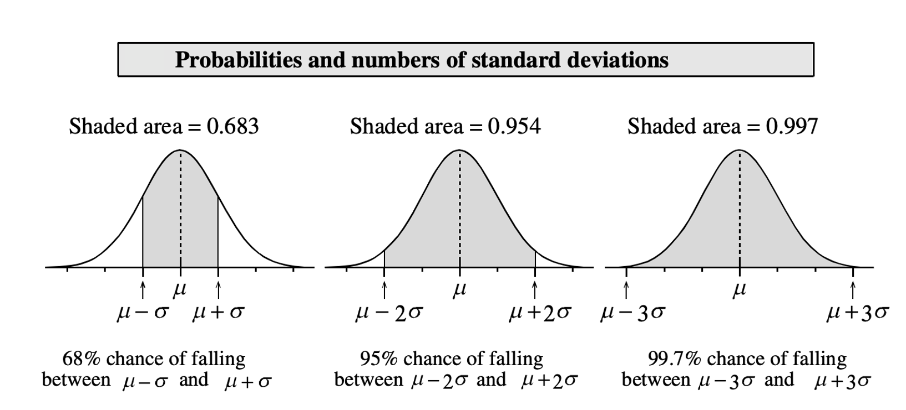
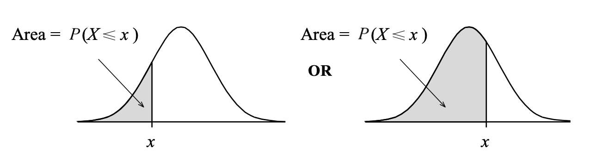
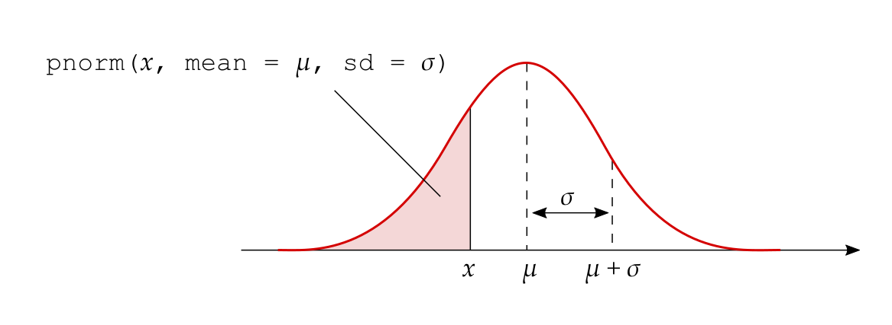
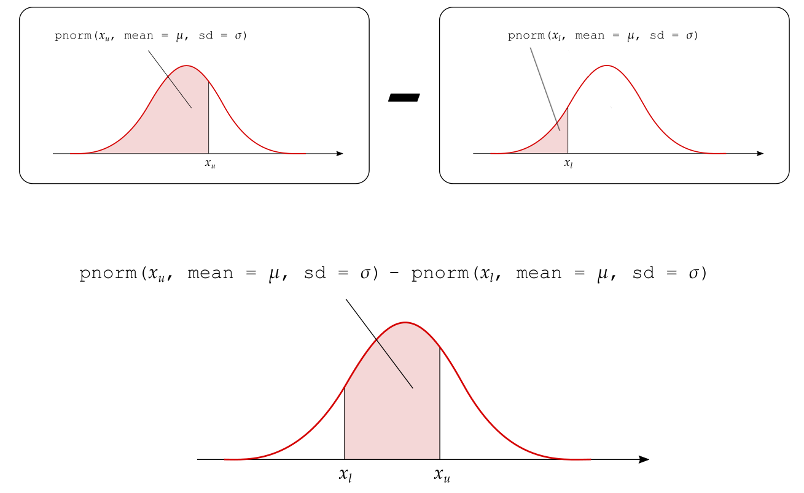
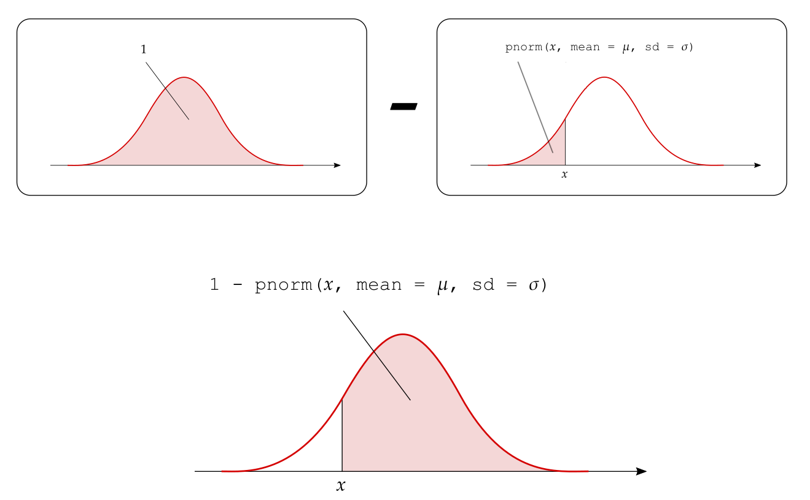
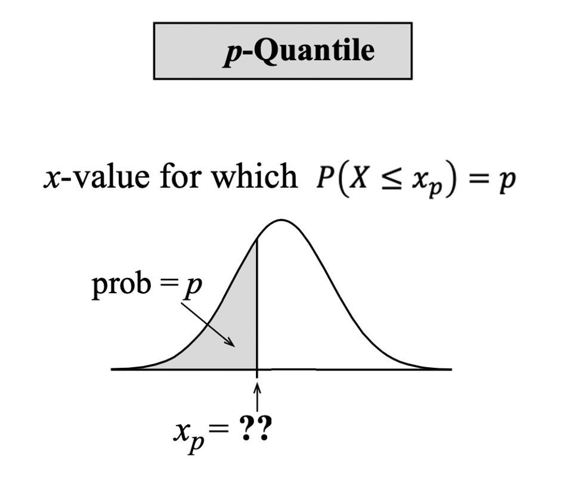

```{r setup, include=FALSE}
source('../assets/setup.R')
library(patchwork)
```


A continuous random variable is said to be _**normally distributed**_, or to have a _**normal probability distribution**_, if its distribution has the shape of a normal curve (it is symmetric and bell-shaped).

The normal density function is the function used to calculate probabilities (as areas under the density curve) for a normally distributed random variable.

A normal distribution can be centred at any value and have basically any spread. Hence, we need to specify:

1. where the normal curve should be centred at;
1. what should the spread of the normal curve be.


From this we can see that the normal curve depends on two quantities called the _**parameters**_ of the normal distribution (see @fig-normal-vary-params):

1. the mean $\mu$, specifying the centre of the distribution;
1. the standard deviation $\sigma$, specifying the spread of the distribution.


```{r, echo=FALSE, fig.width=8, fig.height=4.5, out.width = '100%'}
#| label: fig-normal-vary-params
#| fig-cap: "Normal curves for different means and standard deviations."
x <- seq(-5, 6, by = 0.05)

p1 <- ggplot(data = data.frame(x = x), aes(x)) +
    stat_function(fun = dnorm, args = list(mean = 0, sd = 1), mapping = aes(color = '0')) + 
    stat_function(fun = dnorm, args = list(mean = 2, sd = 1), mapping = aes(color = '2')) + 
    labs(y = "", title = expr(Varying~mu),
         subtitle = expr('(Keeping'~sigma~'= 1)')) + 
    scale_colour_manual(expr(mu), values = c("0"="black", "2"="darkolivegreen3")) +
    theme_minimal() +
    theme(legend.position = 'bottom')

p2 <- ggplot(data = data.frame(x = x), aes(x)) +
    stat_function(fun = dnorm, args = list(mean = 0, sd = 2), mapping = aes(color = '2')) + 
    stat_function(fun = dnorm, args = list(mean = 0, sd = 0.5), mapping = aes(color = '0.5')) + 
    labs(y = "", title = expr(Varying~sigma),
         subtitle = expr('(Keeping'~mu~'= 0)')) + 
    scale_colour_manual(expr(sigma), values = c("0.5"="black", "2"="darkolivegreen3")) +
    theme_minimal() +
    theme(legend.position = 'bottom')

p1 | p2
```

As we can see, changing $\mu$ shifts the curve along the axis, while increasing $\sigma$ increases the spread and flattens the curve.

The formula for the normal density curve which we plotted above is provided below. However, you do not have to memorise it as this is already implemented in R:
$$
f(x) = \frac{1}{\sigma \sqrt{2 \pi}} e^{-\frac{(x - \mu)^2}{2 \sigma^2}}
$$
for some values of $\mu$ and $\sigma$.


The same function in R is:
```
dnorm(x, mean = <mean>, sd = <sd>)
```
where:

- `x` represents the value of the random variable
- `mean` the mean of the normal curve
- `sd` the standard deviation of the curve


We write that a random variable $X$ _follows_ a normal distribution with mean $\mu$ and standard deviation $\sigma$ as
$$
X \sim N(\mu, \sigma)
$$

Clearly, the mean and standard deviation of $X$ will be $E(X) = \mu$ and $SD(X) = \sigma$ respectively.

We use lowercase letters such as $x, a, b$ to denote an observed value, or a particular value, of the random variable $X$.


## The 68-95-99.7% rule

A variable which is normally distributed has:

- 68% of the observations (values) within $1\sigma$ of the $\mu$

- 95% of its observations (values) within $2\sigma$ of the $\mu$

- 99.7% of its observations (values) within $3\sigma$ of the $\mu$

```{r norm-dist-rule, echo=FALSE, out.width='80%'}

```


## Obtaining probabilities


Before describing how to compute the probabilities for a continuous random variable using R, we need to discuss an important property that only holds for _continuous_ random variables:

::: callout-note
__Interval endpoints for continuous random variables__

When performing calculations involving a _continuous_ random variable, we do not have to worry about whether interval endpoints are included or not in the calculation:
$$
P(a \leq X \leq b) = P(a \leq X < b) = P(a < X \leq b) = P(a < X < b)
$$

This is due to the fact that the probability of $X$ being equal to a specific value is 0: 
$$
\begin{aligned}
P(X \leq x) &= P(X < x) + P(X = x) \\
&= P(X < x) + 0 \\
&= P(X < x)
\end{aligned}
$$
:::


We compute areas under the normal curve using the function `pnorm(x, mean, sd)`. 
This returns the area to the left of `x` in a normal curve centred at `mean` and having standard deviation `sd`:
$$
P(X \leq x) = P(X < x) = \texttt{pnorm}(x, \texttt{ mean = } \mu, \texttt{ sd = } \sigma)
$$

The following figure shows the type of areas returned by the `pnorm` function:

```{r norm-dist-pnorm, echo=FALSE, out.width='80%', fig.cap = "R computes lower-tail probabilities."}

```


For example, the probability that the random variable $X \sim N(\mu = 5, \sigma = 2)$ is less than 1 is:
```{r}
pnorm(1, mean = 5, sd = 2)
```

<br>

There are three types of probabilities that we might want to compute:

1. The probability that $X$ is less than a given value: $P(X < x)$

2. The probability that $X$ is between a lower and an upper value: $P(x_l < X < x_u)$

3. The probability that $X$ is greater than a given value: $P(X > x)$

We will now analyse each case in turn and show how each of these is computed.


### 1. Area to the left of a value $x$

The probability that $X < x$ is directly returned by `pnorm()`:

```{r, echo=FALSE, out.width='80%'}

```


### 2. Area between the values $x_l$ and $x_u$

The probability that $X$ is between a lower ($x_l$) and an upper ($x_u$) value can be obtained as:
$$
P(x_l < X < x_u) = P(X < x_u) - P(X < x_l)
$$

```{r, echo=FALSE, out.width='100%'}

```


### 3. Area to the right of $x$

The probability to the right of $x$ is one minus the probability to the left of $x$:
$$
P(X > x) = 1 - P(X < x)
$$

```{r, echo=FALSE, out.width='100%'}

```


## The inverse problem: quantiles and percentiles

In this section we will examine the inverse problem to the one of calculating the probability that $X < x$.

Given a probability $p$, what's the value $x$ that cuts to its left a probability of $p$?

```{r, echo=FALSE, out.width='40%'}

```

That value, called the _**$p$-quantile**_, is the value $x_p$ for which the lower-tail probability is $p$:

$$
\text{value }x_p\text{ such that} \qquad P(X \leq x_p) = p
$$

Percentiles and quantiles are two words used to express the same idea.
We use _**percentile**_ when speaking in terms of percentages and _**quantile**_ when speaking in terms of proportions (or probabilities) between 0 and 1.

The 50th percentile (or $0.5$-quantile) is the value $x_{0.5}$ that cuts a 0.5 probability to its left. You actually know that the value such that 50% of the observations are lower and 50% are higher is called the median.


<br>
In R, you calculate the $p$-quantile with the function
```
qnorm(p, mean, sd)
```

This will return the value $x$ such that $P(X \leq x) = p$. That value is typically written $x_p$.

<br>
For example, if $X \sim N(0, 1)$, the value cutting an area of 0.025 to its left is
```{r}
qnorm(0.025, 0, 1)
```
while that cutting an area of 0.975 to its left is
```{r}
qnorm(0.975, 0, 1)
```

The $0.025$-quantile is $x_{0.025} = -1.96$, and the $0.975$-quantile is $x_{0.975} = 1.96$.


## Glossary

- **Continuous random variable.** A variable that takes on numerical values determined by a chance process which can have any number of decimals.
- **Density function.** The function which provides the probability that a random variable is within an interval in terms of the area under that curve between that interval.
- **Normal distribution.** The probability distribution of a random variable which has a symmetric and bell shaped density curve.
- $p$-**quantile.** The $x_p$ value cutting an area = $p$ to its left. In other words, the $x_p$ value such that $P(X \leq x_p) = p$.
