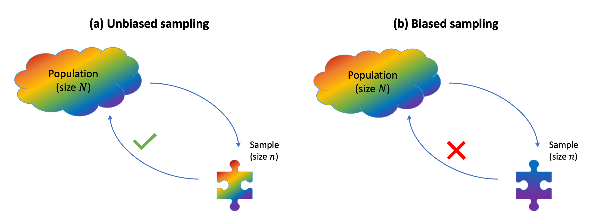

```{r setup, include=FALSE}
source('../assets/setup.R')
```


Typically:

- We do not have data for the entire population. There are different possible reasons:
    - It's too expensive to collect them
    - Because of deadlines, there is not sufficient time
    - It's not possible to reach the entire population
- It's much easier to obtain data by taking a sample from that population of interest and measuring only the units chosen in the sample. 
    - Note that units do not necessarily have to be individuals, but they could be schools, companies, etc.
- We wish to use the sample data to:
    - Investigate a claim about the whole population.
    - Test an hypothesis about the entire population.
    - Answer a question about the whole population.

The process of using information from a sample in order to draw conclusions about the entire population is known as statistical inference.


## Parameters vs statistics

As we do not typically have the data for the entire population, the population is considered as "unknown" with respect the data that we wish to investigate. We could shortly say that the population data are unknown.

For example, if we are interested in the average IQ in the population, we don't have the resources to go to every single individual and test their IQ score. So, in this respect, the population IQ scores are unknown.

As a consequence of this, any numerical summary of the population data is also unknown. In the above example, the population mean IQ score is unknown and needs to be estimated.

Sample data are more readily available or feasible to collect. Imagine collecting a sample of 50 individuals, chosen at random from the population, and testing each to obtain their IQ score. If you performed the random experiment, you would then obtain a sequence of 50 IQ measurements.

At the same time, it is also feasible to compute any numerical summary of the sample data. For example, you can compute the mean IQ score for those 50 individuals in the sample.

::: callout-tip
We typically use this terminology to distinguish a numerical summary when computed in the population (unknown) or in the collected sample (known).

- A **parameter** is a numerical summary of a population.

- A **statistic** is a numerical summary of the sample.

A statistic is often used as a "best guess" or "estimate" for the unknown parameter. That is, we use the (sample) statistic to estimate a (population) parameter.
:::

In the above example, the population mean IQ score is the parameter of interest, while the sample mean IQ score is the statistic.

It is typical to use special notation to distinguish between parameters and statistics in order to convey with a single letter: (1) which numerical summary is being computed, and (2) if it is computed on the population or on the sample data.

The following table summarizes standard notation for some population parameters, typically unknown, and the corresponding estimates computed on a sample.

|Numerical summary  | Population parameter   | Sample statistic         |
|:------------------|:----------------------:|:------------------------:|
|Mean               | $\mu$                  | $\bar{x}$ or $\hat{\mu}$ |
|Standard deviation | $\sigma$               | $s$ or $\hat{\sigma}$    |
|Proportion         | $p$                    | $\hat{p}$                |

Table: Notation for common parameters and statistics.


The Greek letter $\mu$ (mu) represents the population mean (parameter), while $\bar{x}$ (x-bar) or $\hat{\mu}$ (mu-hat) is the mean computed from the sample data (sample statistic).

The Greek letter $\sigma$ (sigma) represents the population standard deviation (parameter), while $s$ or $\hat{\sigma}$ (sigma-hat) is the standard deviation computed from the sample data (sample statistic).

The Greek letter $p$ represents the population proportion (parameter), while $\hat{p}$ (p-hat) is the proportion computed from the sample data (sample statistic).


::: {.callout-caution collapse="true"}
#### Statistics are random variables


The process of sampling $n$ people at random from the population is a random experiment, as it leads to an uncertain outcome. Hence, a statistic is a numerical summary of a random experiment and for this reason it is a random variable (random number).

Before actually performing the random experiment and picking individuals for the sample, the sample mean is a random number, as its value is uncertain. 
Once we actually perform the random experiment and measure the individuals in the sample, we have an observed value for the sample mean, i.e. a known number.

We will then distinguish between:

- a *statistic* - a random variable (random number) that is uncertain because it involves a random experiment.
- an *observed statistic* - the actual number that is computed once the sample data have been collected by performing the chance experiment.

Notation-wise we distinguish between a statistic (random variable) and an observed statistic (observed number) by using, respectively, an uppercase letter or a lowercase letter.

Uppercase letters refer to random variables. Recall that a random variable represents a well defined number, but whose value is uncertain as it involves an experiment of chance in order to reach to an actual value.  
For example, $\bar X$ = "mean IQ score in a random sample of 50 individuals" is a random variable. It is clearly defined in operational terms by: (1) take a sample of 50 individuals at random, (2) measure their IQ score, and (3) compute the mean of their 50 IQ scores. However, the actual value that we can obtain is uncertain as it is the result of an experiment of chance involving random sampling from a population. There are many possible values we could obtain, so we are not sure which one we will see.  
Another example: $X$ = "number  of heads in 10 flips of a coin". This is also a clearly defined experiment: (1) flip a coin 10 times and (2) count the number of heads. However, the result is a random number, which is uncertain and will be unknown until we actually perform the experiment and flip a coin 10 times.

Lowercase letters refer to observed (i.e., realised) values of the random variable. An observed value of a random variable is just a number.  
For example, once we actually collect 50 individuals and measure their IQ scores, we can sum those 50 numbers and divide the sum by 50 to obtain the observed sample mean. Say the sample mean IQ score is 102.3, we would write $\bar x = 102.3$.

In short, we would use for a sample mean:

- Statistic (sample mean): an uppercase letter before the value is actually known: $\bar X$
- Observed statistic (observed sample mean): a lowercase letter once the value is actually known: $\bar x$

:::

## Avoiding bias due to sampling

Sampling bias occurs when the method used to select which units enter the sample causes the sample to not be a good representation of the population.

If sampling bias exists, we cannot generalise our sample conclusions to the population.

```{r echo=FALSE, out.width = '95%'}

```

To be able to draw conclusions about the population, we need a representative sample. The key in choosing a representative sample is _random sampling_. 
Imagine an urn with tickets, where each ticket has the name of each population unit. Random sampling would involve mixing the urn and blindly drawing out some tickets from the urn.
Random sampling is a strategy to avoid sampling bias.


::: callout-tip
__Simple random sampling__

When we select the units entering the sample via simple random sampling, each unit in the population has an equal chance of being selected, meaning that we avoid sampling bias.

When instead some units have a higher chance of entering the same, we have misrepresentation of the population and sampling bias.
:::


In general, we have _bias_ when the method of collecting data causes the data to inaccurately reflect the population.


## Glossary

- **Statistical inference.** The process of drawing conclusions about the population from the data collected in a sample.
- **Population.** The entire collection of units of interest.
- **Sample.** A subset of the entire population.
- **Random sample.** A subset of the entire population, picked at random, so that any conclusion made from the sample data can be generalised to the entire population.
- **Representation bias.** Happens when some units of the population are systematically underrepresented in samples.
- **Generalisability.** When information from the sample can be used to draw conclusions about the entire population. This is only possible if the sampling procedure leads to samples that are representative of the entire population (such as those drawn at random).
- **Parameter.** A fixed but typically unknown quantity describing the population.
- **Statistic.** A quantity computed on a sample.