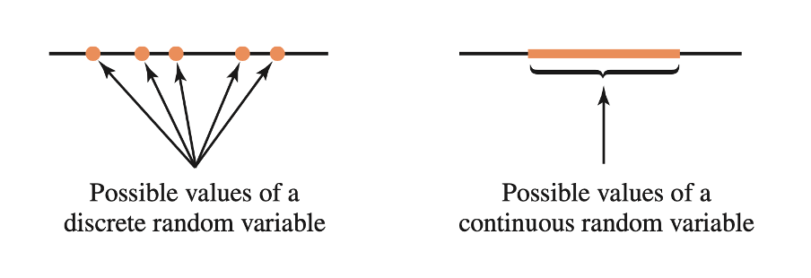

```{r setup, include=FALSE}
source('../assets/setup.R')
```


Consider throwing three fair coins. The sample space of this random experiment is 

$$
S = \{
    TTT, \ 
    TTH, \ 
    THT, \ 
    HTT, \ 
    THH, \ 
    HTH, \ 
    HHT, \ 
    HHH
\}
$$

Each outcome has an equal chance of occurring of $1 / 8 = 0.125$, computed as one outcome divided by the total number of possible outcomes.


Often, we are only interested in a numerical summary of the random experiment. One such summary could be the total number of heads.


We call a numerical summary of a random process a **random variable**. 

Random variables are typically denoted using the last uppercase letters of the alphabet ($X, Y, Z$). Sometimes we might also use an uppercase letter with a subscript to distinguish them, e.g. $X_1, X_2, X_3$.

A random variable, like a random experiment, also has a sample space and this is called the **support** or **range** of $X$, written $R_X$. This represents the set of possible values that the random variable can take.


## Discrete vs continuous random variables

There are two different types of random variables, and the type is defined by their range.

We call a variable discrete or continuous depending on the "gappiness" of its range, i.e. depending on whether or not there are gaps between successive possible values of a random variable.

```{r echo=FALSE, out.width='90%'}

```


- A **discrete** random variable has gaps in between its possible values. An example is the number of children in a randomly chosen family (0, 1, 2, 3, ...). Clearly, you can't have 2.3 children...

- A **continuous** random variable has no gaps in between the its possible values. An example is the height in cm of a randomly chosen individual.


## Glossary

- **Random variable.** A numerical summary of a random experiment.
- **Range of a random variable.** The set of possible values the random variable can take. 