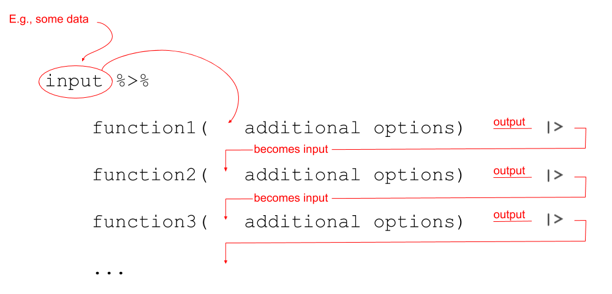

```{r setup, include=FALSE}
source('assets/setup.R')
```


```{r include=FALSE}
library(tidyverse)
library(patchwork)
starwars2 <- read_csv("https://uoepsy.github.io/data/starwars2.csv")
```


<!-- # Handling categorical data {#chap-categorical} -->

:::green
Be sure to check the [**solutions to last week's exercises**](01_data_types.html).<br>You can still ask any questions about previous weeks' materials if things aren't clear!
:::

:::lo
**LEARNING OBJECTIVES**

+ LO1: Understand the appropriate visualization for categorical data.
+ LO2: Understand methods to calculate the spread of categorical data.
+ LO3: Understand methods to calculate central tendency for categorical data

:::


Before we get started on the statistics, we're going to briefly introduce a crucial bit of R code. 

`r optbegin("IMPORTANT READING: A different style of R code. Click to expand", olabel=FALSE)`
We have seen already seen a few examples of R code such as: 
```{r eval=FALSE}
# show the dimensions of the data
dim(somedata)

# show a summary of the data
summary(somedata)

# factorise and show the "somevariable" variable in the "somedata" dataframe 
as.factor(somedata$somevariable)
```

And we can actually wrap functions inside functions: 
```{r eval=FALSE}
# factorise the "somevariable" variable in the "somedata" dataframe, 
# then show a summary of it
summary(as.factor(somedata$somevariable))
```

:::yellow
__R evaluates code from the inside-out!__ 

You can end up with functions inside functions inside functions ... 
```{r}
# Don't worry about what all these functions do, 
# it's just an example -
round(mean(log(cumsum(diff(1:10)))))
```
:::

We can write in a different style, however, and this may help to keep code tidy and easily readable - we can write __sequentially__:  



Notice that what we are doing is using a new symbol: `%>%`  
This symbol takes the output of whatever is on it's left-hand side, and uses it as an _input_ for whatever is on the right-hand side. The `%>%` symbol gets called a "pipe".  

Let's see it in action with the starwars2 dataset from the previous lab. First we need to load the tidyverse packages, because that is where `%>%` is found.
```{r}
library(tidyverse)

starwars2 %>%
    summary()
```

We can now write code that requires reading it from the inside-out:
```{r eval=FALSE}
summary(as.factor(starwars2$homeworld))
```
or which requires reading it from left to right:
```{r}
starwars2$homeworld %>%
    as.factor() %>%
    summary()
```

And that long line of code from above:
```{r eval=FALSE}
# again, don't worry about all these functions, 
# just notice the difference in the two styles.
round(mean(log(cumsum(diff(1:10)))))
```
becomes:
```{r eval=FALSE}
1:10 %>%
    diff() %>%
    cumsum() %>%
    log() %>%
    mean() %>%
    round()
```
<br>
We're going to use this way of writing a lot throughout the course, and it pairs really well with a group of functions in the __tidyverse__ packages, which were designed to be used in conjunction with `%>%`, a couple of which you will learn about in this lab.  
`r optend()`

# Data Exploration

Once we have collected some data, one of the first things we want to do is explore it - and we can do this through describing (or summarising) and visualising variables.  

We are already familiar with the function `summary()`, which provides high-level information about our data, showing us things such as the minimum and maximum and mean of continuous variables, or the numbers of entries falling into each possible response level for a categorical variable:
```{r}
summary(starwars2)
```

What we are doing here is providing numeric descriptions of the __distributions__ of values in each variable. 

:::yellow
__Distribution__
  
The distribution of a variable shows how often different values occur. In this lab, we're going to focus on describing and visualising distributions of categorical data. 

The graph showing the distribution of a variable shows us where the values are centred, how the values vary, and gives some information about where a typical value might fall. It can also alert you to the presence of outliers (unexpected observations).
:::  

# Unordered Categorical (Nominal) Data

For variables with a discrete number of response options, we can easily measure "how often" values occur in terms of their __frequency__. 

:::yellow
__Frequency distribution__  
  
A frequency distribution is an overview of all distinct values in some variable and the __number of times__ they occur. 
:::

Supposing that we have surveyed the people working in a psychology department and asked them what sub-discipline of psychological research they most strongly identify as working within (If you would like to work along with the reading, the data is available at https://uoepsy.github.io/data/psych_survey.csv).  

| Variable Name | Description            |
|---------------|--------------------|
| participant   | Subject identifier |
| area          | Respondent's sub-discpline of psychology |  
<br>
First, we read our data in to R and store it in an object called "psych_disciplines":
```{r}
psych_disciplines <- read_csv("https://uoepsy.github.io/data/psych_survey.csv")
psych_disciplines
```

We can get the frequencies of different response levels of the _discipline_ variable by using the following code: 
```{r}
# start with the psych_disciplines dataframe 
# %>%
# count() the values in the "area" variable 
psych_disciplines %>%
    count(area)
```

`r optbegin("Extra detail on how this works. Click to expand", olabel=FALSE)`
In the code above, R knows to look for the _area_ variable inside the psych_disciplines data because we used `%>%` to "pipe" in the psych_disciplines dataframe.  
We could have also done:
```{r}
# count(data, variable)
count(psych_disciplines, area)
```
But this would not work:
```{r eval=FALSE}
count(area)
```
<p style="color:red">Error in group_vars(x) : object 'area' not found</p>   
`r optend()`

## Frequency table {-}  

To describe a distribution like this, we can simply provide the frequency table.  
Let's store it as an object in R:  
```{r}
# make a new object called "freq_table", and assign it:
# the counts of values of "area" variable in 
# the psych_discipline dataframe.
freq_table <- 
    psych_disciplines %>%
    count(area)

# show the object called "freq_table"
freq_table
```

For a report, we might want to make it a little more easily readable:
```{r eval=FALSE, echo=FALSE}
knitr::kable(count(psych_disciplines, area) %>% 
                 arrange(desc(n)) %>%
                 rename(`sub-discipline`=area, `number of respondents`=n))
```

## Central tendency {-}  

Often, we might want to summarise data into a single summary value, reflecting the point at (or around) which most of the values tend to cluster. This is known as a measure of __central tendency.__  For numeric data, we can use measures such as the mean, which you will likely have heard of. For nominal data (unordered categorical data), however, our only option is to use the __mode__.  

:::yellow
__Mode__
  
The most frequent value (the value that occurs the greatest number of times).  
:::

In our case, the mode is the "Cognitive Neuroscience" category. 

## Relative frequencies {-}  

We might alternatively want to show the _percentage_ of respondents in each category, rather than the raw frequencies.  
The percentages show the __relative frequency distribution__

:::yellow
__Relative frequency distribution__

A relative frequency distribution shows the __proportion of times__ each value occurs  
(contrast this with the frequency distribution which shows the __number__ of times).  
Relative frequencies can be written as fractions, percents, or decimals.
:::
  
In the object "freq_table", we have a variable called _n_, which is the frequencies (the number in each category).   
The total of this column is equal to the total number of respondents:
```{r}
# sum all the values in the "n" variable in the "freq_table" object
sum(freq_table$n)
```
And therefore, each value in `freq_table$n`, divided by the total, is equal to the proportion in each category:  
( __Tip:__ Proportions are percentages/100. So 0.4 is another way of expressing 40%)
```{r}
# take the values in the "n" variable from the "freq_table" object, 
# and divide by the sum of all the values in the "n" variable in "freq_table"
freq_table$n/sum(freq_table$n)
```
We can then simply add the proportions as a new column to our table of frequencies by assigning the values we just calculated to a new variable:
```{r}
# the variable "prop" in the "freq_table" object is now assigned 
# the values we calculated above (the proportions)
freq_table$prop <- freq_table$n/sum(freq_table$n)

# print the "freq_table" object
freq_table
```
<br>
However, we can also do this within a sequence of pipes (`%>%`). To do so, we use a new function called `mutate()`.  

:::yellow
__mutate()__  

The `mutate()` function is used to add or modify variables to data.  
```{r eval=FALSE}
# take the data
# %>%
# mutate it, such that there is a variable called "newvariable", which
# has the values of a variable called "oldvariable" multiplied by two.
data %>%
  mutate(
    newvariable = oldvariable * 2
  )
```
__Note:__ Inside `mutate()`, we don't have to keep using the dollar sign `$`, as we have already told it what data to look for variables in.  
  
To ensure that our additions/modifications of variables are stored in R's environment (rather than simply printed out), we need to *reassign* the name of our dataframe:
```{r eval=FALSE}
data <- 
  data %>%
  mutate(
    newvariable = oldvariable * 2
  )
```
:::

We can actually _add this step to our earlier code:_
```{r}
# make a new object called "freq_table", and assign it:
# the counts of values of "area" variable in 
# the psych_discipline dataframe.
# from there, 'mutate' such that there is a variable called "prop" which
# has the values of the "n" variable divided by the sum of the "n" variable.
freq_table <- 
  psych_disciplines %>%
  count(area) %>%
  mutate(
    prop = n/sum(n)
  )

# show the object called "freq_table"
freq_table
```

## Visualising {-}  

:::frame
_"By visualizing information, we turn it into a landscape that you can explore with your eyes. A sort of information map. And when you’re lost in information, an information map is kind of useful."_ – [David McCandless](https://informationisbeautiful.net/)
:::

We're going to now make our first steps into the world of data visualisation. R is an incredibly capable language for creating visualisations of almost any kind. It is used by many media companies (e.g., the BBC), and has the capability of producing 3d visualisations, animations, interactive graphs, and more.  

We are going to use the most popular R package for visualisation, __ggplot2__. This is actually part of the __tidyverse__, so if we have an Rmarkdown document and have loaded the __tidyverse__ packages at the start (by using `library(tidyverse)`), then __ggplot2__ will be loaded too).  

Recall our __frequency distribution table:__
```{r}
# show the object called "freq_table"
freq_table
```

We can plot these values as a bar chart:
```{r}
ggplot(data = freq_table, aes(x = area, y = n)) +
    geom_col()
```

```{r echo=FALSE, fig.cap="Artwork by \\@allison_horst"}
knitr::include_graphics("images/ahorst/ggplot2_masterpiece.png")
```


:::yellow
__ggplot components__  

Note the key components of the ggplot code. 

*  `data = ` where we provide the name of the dataframe. 
*  `aes = ` where we provide the _aesthetics_. These are things which we map from the data to the graph. For instance, the x-axis, or if we wanted to colour the columns/bars according to some aspect of the data. 

Then we add (using `+`) some _geometry_. These are the shapes (in our case, the columns/bars), which will be put in the correct place according to what we specified in `aes()`.  

* `+ geom_col()` Adds columns to the plot. 
:::

`r optbegin("Optional - Different aes() and geoms, and labels. Click to expand", olabel=FALSE)`
Use these as reference for when you want to make changes to the plots you create.  
Additionall, remember that google is your friend - there are endless forums with people asking how to do something in ggplot, and you can just copy and paste bits of code to add to your plots!  
  
  
1. Fill the geoms: 
```{r}
ggplot(data = freq_table, aes(x = area, y = n, fill = area)) +
    geom_col()
```
2. Change the axis labels:
```{r}
ggplot(data = freq_table, aes(x = area, y = n, fill = area)) +
    geom_col()+
    labs(title="Counts of respondents by sub-discipline", y = "Number of respondents", x = "Sub-discipline")
```
3. Change the geom:  
(Note that using `geom_col` had the y axis starting at 0, but geom_point starts just below the lowest value.
```{r}
# note that we also need to change "fill = area" to "col = area". 
ggplot(data = freq_table, aes(x = area, y = n, col = area)) +
    geom_point()+
    labs(title="Counts of respondents by sub-discipline", y = "Number of respondents", x = "Sub-discipline")
```
4. Change the limits of the axes:
```{r}
ggplot(data = freq_table, aes(x = area, y = n, fill = area)) +
    geom_col()+
    labs(title="Counts of respondents by sub-discipline", y = "Number of respondents", x = "Sub-discipline")+
    ylim(0,50)
```
5. Remove (or reposition) the legend:
```{r}
# setting legend.position as "bottom" would put it at the bottom!

ggplot(data = freq_table, aes(x = area, y = n, fill = area)) +
    geom_col()+
    labs(title="Counts of respondents by sub-discipline", y = "Number of respondents", x = "Sub-discipline")+
    ylim(0,50)+
    theme(legend.position = "none") 
```
6. Changing the theme:
```{r}
# there are many predefine themes, including: 
# theme_bw(), theme_classic(), theme_light()

ggplot(data = freq_table, aes(x = area, y = n, fill = area)) +
    geom_col()+
    labs(title="Counts of respondents by sub-discipline", y = "Number of respondents", x = "Sub-discipline")+
    ylim(0,50)+
    theme_minimal()
```
`r optend()`

# Ordered Categorical (Ordinal) Data 

Recall that __ordinal__ data is categorical data which has a natural ordering of the possible responses. 
One of the most common examples of ordinal data which you will encounter in psychology is the __Likert Scale__.
You will probably have come across these before, perhaps when completing online surveys or questionnaires.

:::yellow
__Likert Scale__

A five or seven point scale on which an individual express how much they agree or disagree with a particular statement.
:::

With Likert data, there is a set of discrete response options (it is __categorical__ data).
The response options can be ranked, making it __ordered categorical__ ( _strongly disagree_ < _disagree_ < _neither_ < _agree_ < _strongly agree_ ).
Importantly, the distance between responses is __not__ measurable.

## Frequency table {-}  

Let's suppose that as well as collecting information on the sub-discipline of psychology they identified with, we also asked our respondents to rate their level of happiness from 1 to 5, as well as their job satisfaction from 1 to 5.  

| Variable Name | Description            |
|---------------|--------------------|
| participant   | Subject identifier |
| happiness     | Respondent's level of happiness from 1 to 5 |
| job_sat     | Respondent's level of job satisfaction from 1 to 5 |

```{r}
psych_survey <- read_csv("https://uoepsy.github.io/data/psych_survey2.csv")
psych_survey
```

For these questions (variables _happiness_ and _job_sat_), we could do the same thing as we did above for unordered categorical data, and summarise this into  frequencies:
```{r}
# take the "psych_survey" dataframe %>%
# count() the values in the "happiness" variable 
psych_survey %>%
    count(happiness)
    
# take the "psych_survey" dataframe %>%
# count() the values in the "job_sat" variable 
psych_survey %>%
    count(job_sat)
```

## Central tendency {-}  

We could again use the __Mode__ - the most common value - to summarise this data. 
However, because the responses are __ordered__, it can be more useful to think about the percentages of respondents in and below/above each category. 
For instance, we might want to talk about asking which category has 50% of the observations in a lower category, and 50% of the observations in a higher category. This is mid-point is known as the __Median__. 

:::yellow
__Median__ 

The value for which 50% of observations a lower and 50% are higher. It is the mid-point of a list of ordered values. 

To find the median:  

1. rank order the values
2. find the middle value:
    + If there are $n$ values, find the value at position $\frac{n+1}{2}$.  
    + If $n$ is even, $\frac{n+1}{2}$ will not be a whole number.  
    For instance, if $n = 20$, you are looking for the $\frac{n+1}{2} = \frac{20+1}{2} = 10.5^{th}$ value.  
        + When calculating the __median for ordinal data,__ if the $\frac{n}{2}^{th}$ and $\frac{n+1}{2}^{th}$ values are different, report both. 
        + When calculating the __median for numeric data,__ report the midpoint of the $\frac{n}{2}^{th}$ and $\frac{n+1}{2}^{th}$ values.

:::


In the previous lab we discussed how to tell R explicitly that a variable is of a certain type using functions such as `as.factor()`, `as.numeric()`, and so on.   
You may notice that we haven't done this yet with the data we have been working with in so far today:
```{r}
# inside the "psych_survey" dataframe, take ($) the "happiness" variable,
# and tell me what type/class it is
class(psych_survey$happiness)
```
This is because _there are some benefits to letting R think your data is numeric, even when it is not._ 
It means we can use functions such as `median()` to quickly find the median:

```{r}
# inside the "psych_survey" dataframe, take ($) the "happiness" variable,
# and find the median
median(psych_survey$happiness)
```

:::red
__Be careful__  
While we can make R treat this data is numeric, it is important to remember that it is actually measured on an __ordinal__ scale. 

For example, if the median falls _between_ levels, R will tell us that the median is the mid-point:
```{r}
# for the values 2,1,2,3,4,5, 
# find the median
median(c(2,1,2,3,5,4))
```
But because our data is ordinal, then we know that 2.5 is not a valid response. 
:::

We can also use functions such as `min()` and `max()` to find the minimum and maximum values:
```{r}
# inside the "psych_survey" dataframe, take ($) the "happiness" variable,
# and find the minimum value
min(psych_survey$happiness)

# and find the maximum value
max(psych_survey$happiness)
```


## Cumulative percentages, Quartiles {-}  

In calculating the median, we are going beyond talking about the __relative frequencies__ (i.e., the percentage in each category), to talking about the __cumulative percentage.__ 

:::yellow
__Cumulative percentage__

Cumulative percentages are another way of expressing a frequency distribution.  
They are the __successive addition of percentages__ in each category. For example, the cumulative percentage for the 3rd category is the percentage of respondents in the 1st, 2nd and 3rd category:
```{r echo=FALSE}
tibble(
  Category = paste0("Response ",1:5),
  n = c(10,10,20,25,10)
) %>% mutate(
  p = n/sum(n)*100,
  cn = cumsum(n),
  cp = cumsum(p)
) %>% rename(`Frequency count (n)`=n,
             `Relative frequency (%)`=p,
             `Cumulative frequency`=cn,
             `Cumulative percentage`=cp
             ) %>%
  knitr::kable()
```
:::

We saw before how we can calculate the proportions/percentages in each category:  
( __Note:__ We multiply by 100 here to turn the proportion into a percentage)
```{r}
# take the "psych_survey" dataframe %>%
# count() the values in the "happiness" variable (creates an "n" column), and
# from there, 'mutate' such that there is a variable called "percent" which
# has the values of the "n" variable divided by the sum of the "n" variable.
psych_survey %>%
  count(happiness) %>%
  mutate(
    percent = n/sum(n)*100
  )
```

We can add another variable, and make it the cumulative percentage, by using the `cumsum()` function. 
```{r}
# take the "psych_survey" dataframe %>%
# count() the values in the "happiness" variable (creates an "n" column), and
# from there, 'mutate' such that there is a variable called "percent" which
# has the values of the "n" variable divided by the sum of the "n" variable,
# and also make a variable called "cumulative_percent" which is the 
# successive addition of the values in the "percent" variable
psych_survey %>% 
  count(happiness) %>% 
  mutate(
    percent = n/sum(n)*100,
    cumulative_percent = cumsum(percent)
  )
```
`r optbegin("Optional extra. Click to expand", olabel=FALSE)`
Think about why this will not work:
```{r eval=FALSE}
psych_survey %>% 
  count(happiness) %>% 
  mutate(
    cumulative_percent = cumsum(percent),
    percent = n/sum(n)*100
  )
```
<p style="color:red">Error: object 'percent' not found</p>   
  
__Answer:__ Inside the `mutate()` function, we are trying to assign the _cumulative_percent_ variable based on the values of the _percent_ variable. But in the code above, _percent_ gets defined __after__ _cumulative_percent_, and so it will not work. Hence the error message ("percent not found").
`r optend()`

While the __median__ splits the data in two (50% either side), you will often see data being split into four equal blocks.  
The points which divide the four blocks are known as __quartiles__. 

:::yellow
__Quartiles__

Quartiles are the points in rank-ordered data below which falls 25%, 50%, and 75% of the data.

+ The first quartile is the first category for which the cumulative percentage is $\geq 25\%$.  
+ The median is the first category for which the cumulative percentage is $\geq 50\%$.  
+ The third quartile is the first category for which the cumulative percentage is $\geq 75\%$.  

:::

By looking at the quartiles, it gives us an idea of _how spread out the data is_.  
As an example, if we had 10 categories _A, B, C, D, E, F, G, H, I, J_, and we knew that:

+ $Q_1$ (the $1^{st}$ quartile) = _G_,
+ $Q_2$ (the $2^{nd}$ quartile, the __median__) = _H_,
+ $Q_3$ (the $3^{rd}$ quartile) = _H_,  

This tells us that the first 25% of the data falls in one of the categories from _A_ to _G_ (quite a large range), the second 25% falls in categories _G_ and _H_ (a small range), and the third 25% of the data falls entirely in category _H_.  
So a lot of the data is between _G_ and _H_, with the data being more sparse in the lower and higher categories.  

:::frame
__Looking ahead to numeric data__

We will talk about quartiles in numeric data too, where we commonly use the _difference_ between the first and third quartile as a measure of how spread out the data are. This gets known as the __inter-quartile range (IQR).__  
:::

## Visualising {-}  

We can visualise ordered categorical data in the same way we did for unordered.  
First we save our frequencies/percentages as a new object:
```{r}
freq_table2 <- psych_survey %>%
  count(happiness) %>%
  mutate(
    percent = n/sum(n)*100
  )
```

Then we give that object to our __ggplot__ code, with the appropriate `aes()` mappings:
```{r}
# make a ggplot with the object "freq_table2". 
# on the x axis put the possible values in the "happiness" variable,
# on the y axis put the possible values in the "n" variable.
# add columns for each entry in the data. 
ggplot(data = freq_table2, aes(x = happiness, y = percent)) + 
  geom_col()
```

    
--- 

# Glossary


+ __distribution:__ How often different possible values in a variable occur.
+ __frequency:__ Number of occurrences (count) in a given response value.
+ __relative frequency:__ Percentage/proportion of occurrences in a given response value.
+ __cumulative percentage:__ Percentage of occurrences in _or below_ a given reponse value (requires ordered data).
+ __mode:__ Most common value.
+ __median:__ Middle value.
<br><br>
+ `%>%` Takes the output of whatever is on the LHS and gives it as the input of whatever is on the RHS.
+ `count()` Counts the number of occurrences of each unique value in a variable.
+ `mutate()` Used to add variables to the dataframe, or modify existing variables. 
+ `min()` Returns the minimum value of a variable. 
+ `max()` Returns the maximum value of a variable. 
+ `median()` Returns the median value of a variable.
+ `ggplot()` Creates a plot. Takes `data=` and a set of mappings `aes()` from the data to properties of the plot (e.g., x/y axes, colours).
+ `geom_col()` Adds columns to a ggplot. 

---


# Exercises


`r qbegin(1)`
Open a new Rmarkdown document for this set of exercises.

__File > New File > R Markdown..__  
  
In your first code-chunk, load the _tidyverse_ packages with the following command: 
```{r eval=FALSE}
library(tidyverse)
```
  
Make sure you run the chunk. 
`r qend()`

---

`r qbegin(2)`  
We're going to use the data on popular passwords which we saw in the previous lab.  
The data is available online at https://uoepsy.github.io/data/passworddata.csv.  
  
Read in the data from the link.  
`r qend()`

`r solbegin(show=params$SHOW_SOLS, toggle=params$TOGGLE)`
```{r}
pwords <- read_csv("https://uoepsy.github.io/data/passworddata.csv")
```
`r solend()`

---

`r qbegin(3)`
Produce a table of frequencies and relative frequencies (percentages/proportions) of different types of passwords
`r qend()`
`r solbegin(show=params$SHOW_SOLS, toggle=params$TOGGLE)`
```{r}
# assigned to an object called "type_freqs" : 
  # take the "pwords" dataframe %>%
  # count() the values in the "type" variable (creates an "n" column), and
  # from there, 'mutate' such that there is a variable called "percent" which
  # has the values of the "n" variable divided by the sum of the "n" variable,
type_freqs <- pwords %>% 
  count(type) %>%
  mutate(
    percent = n/sum(n)*100
  )

type_freqs
```
`r solend()`

---

`r qbegin(4)`
What is the mode of password type? and what is the least common?
`r qend()`
`r solbegin(show=params$SHOW_SOLS, toggle=params$TOGGLE)`
The Mode (most common) of password type is "name", with 36.6\% of passwords falling into this category.  
Password categories of "food" and "rebellious-rude" are the least common (2.2\% in each category). 
`r solend()`

---

`r qbegin(5)`
Produce a plot of the frequencies of password types:
`r qend()`
`r solbegin(show=params$SHOW_SOLS, toggle=params$TOGGLE)`
We have added the line `scale_x_discrete(labels = abbreviate)` here, which will make abbreviate the labels on the x-axis! 
```{r}
# make a ggplot with the data "type_freqs", and map the "type" variable
# to the x axis, and the "n" variable to the y axis. 
# add a geom_cols for each entry in the data
# abbreviate the labels on the x axis
ggplot(data = type_freqs, aes(x = type, y = n)) +
  geom_col()+
  scale_x_discrete(labels = abbreviate)
```
`r solend()`

---

`r qbegin(6)`
In the previous exercises using this dataset we worked with the _strength_cat_ variable, and made R treat it as an ordered categorical variable (_weak_ < _medium_ < _strong_).    
The _strength_ variable is also an ordered categorical variable, but contains more levels, measuring password strength on values from 1 to 10.  
  
Produce a table showing the frequencies and cumulative percentages of the different strength levels of passwords in the data
`r qend()`
`r solbegin(show=params$SHOW_SOLS, toggle=params$TOGGLE)`
```{r}
# assigned to an object called "strength_table" : 
  # take the "pwords" dataframe %>%
  # count() the values in the "strength" variable (creates an "n" column), and
  # from there, 'mutate' such that there is a variable called "percent" which
  # has the values of the "n" variable divided by the sum of the "n" variable,
  # and also make a variable called "cumulative_percent" which is the 
  # successive addition of the values in the "percent" variable
strength_table <- pwords %>% 
  count(strength) %>% 
  mutate(
    percent = n/sum(n)*100,
    cumulative_percent = cumsum(percent)
  )

# show the object called "strength_table"
strength_table
```
`r solend()`

---

`r qbegin(7)`
From looking _only_ at the table you made in the previous question, what is the median strength level? 
`r qend()`
`r solbegin(show=params$SHOW_SOLS, toggle=params$TOGGLE)`
The median password strength is 7/10.  
Remember, it is the first level for which the cumulative percentage is $\geq 50\%$.
`r solend()`

---

`r qbegin(8)`
Check that your answer is correct by passing the _strength_ variable to the `median()` function. 
Find also the minimum and maximum values.  

**Note:** Did you make the _strength_ variable a factor in one of the earlier questions? If so, `median(pwords$strength)` will not work, because `median()` needs it to be numeric.  
If needed, you can convert the variable back to numeric:  
`pwords$strength <- as.numeric(pwords$strength)`.  
Or simply do so temporarily:  
`median(as.numeric(pwords$strength))`

`r qend()`
`r solbegin(show=params$SHOW_SOLS, toggle=params$TOGGLE)`
```{r}
# for the "strength" variable in the "pwords" dataframe,
# show the median value
median(pwords$strength)

#find min and max
min(pwords$strength)
max(pwords$strength)
```
`r solend()`

---

`r qbegin(9)`
Create a plot of the percentages of passwords in each strength level
`r qend()`
`r solbegin(show=params$SHOW_SOLS, toggle=params$TOGGLE)`
```{r}
# make a ggplot with the data "strength_table", and map the "strength" variable
# to the x axis, and the "percent" variable to the y axis. 
# add a geom_cols for each entry in the data
# add title and edit the x and y axis names
# use the classic theme
ggplot(data = strength_table, aes(x = strength, y = percent)) + 
  geom_col()+
  labs(title = "Relative frequencies of different password strengths", x = "Password Strength", y = "Percentage of passwords")+
  theme_classic()
```
`r solend()`

---

`r qbegin(10)`
Think back at the definition of quartiles.  
At what point is the fourth quartile?  

a. The maximum value  
a. The first category for which the cumulative percentage is $\geq 100\%$.  
a. Both of the above

`r qend()`
`r solbegin(show=params$SHOW_SOLS, toggle=params$TOGGLE)`
Both!   
The first category for which the cumulative percentage is $\geq 100\%$ has to be the maximum, because only at the maximum will $100\%$ of the data fall below.
`r solend()`

---

`r qbegin(11)`
Take a look at the two plots below. Why is one more useful than the other? 
```{r echo=FALSE}
p1 <- ggplot(freq_table2, aes(x=happiness, y=n))+
  geom_col()

p2 <- freq_table2 %>% mutate(
  happiness = factor(happiness, levels = c("3","1","5","2","4"))) %>% 
  ggplot(., aes(x=happiness, y=n))+
  geom_col()

p1 + p2
```
`r qend()`
`r solbegin(show=params$SHOW_SOLS, toggle=params$TOGGLE)`
Because the different response levels of the happiness variable have a natural ordering, it is much more useful to plot them in this order on the x-axis (the left-hand plot).  
Notice that this plot also begins to show a distinct _shape,_ and we can see that only few of our respondents gave extreme responses (1 or 5), with more responding 2 or 4, and finally the most common response being 3. 
`r solend()`

<div class="tocify-extend-page" data-unique="tocify-extend-page" style="height: 0;"></div>
