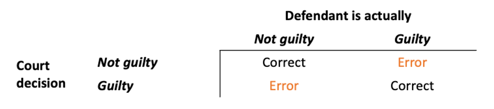

```{r setup, include=FALSE}
library(knitr)

options(htmltools.dir.version = FALSE)
options(digits = 4, scipen = 2)
options(knitr.table.format = "html")

knitr::opts_chunk$set(
  echo = FALSE,
  warning = FALSE, message = FALSE,
  cache = FALSE,
  dev = "png",
  fig.align = 'center',
  fig.height = 5, fig.width = 6,
  out.width = "80%",
  dpi = 300
)
```

```{r xaringan-panelset, echo=FALSE}
xaringanExtra::use_panelset()
```

```{r xaringan-themer, include = FALSE}
library(xaringanthemer)
style_mono_accent(
  base_color = "#0F4C81", # DAPR1
  # base_color = "#BF1932", # DAPR2
  # base_color = "#88B04B", # DAPR3 
  # base_color = "#FCBB06", # USMR
  # base_color = "#a41ae4", # MSMR
  header_color = "#000000",
  header_font_google = google_font("Source Sans Pro"),
  header_font_weight = 400,
  text_font_google = google_font("Source Sans Pro", "400", "400i", "600", "600i"),
  code_font_google = google_font("Source Code Pro"),
  outfile = "un-xaringan-themer.css"
)
```


```{r preamble, echo=FALSE, warning=FALSE, message=FALSE}
library(tidyverse)
library(patchwork)

theme_set(
    theme_classic(base_size = 15) +
    theme(plot.title = element_text(hjust = 0.5))
)
```


# Learning objectives

1. Understand what are Type I and Type II errors in hypothesis testing.

1. Recognise the significance level as measuring the tolerable chance of committing a Type I error.

1. Recognise the effect of sample size on power.

1. Be able to check the assumptions underlying the t-test for a population mean.


---
class: inverse, center, middle

---
class: inverse, center, middle

# Part A
## Errors and Power


---
# Where we're going to

- Hypothesis testing lets us determine whether, for example, an observed difference between a sample mean and an hypothesised value is real or just due to random sampling variation.

--

- However, statistical significance sometimes may lead us to wrong conclusions!

--

- It is possible to make two kinds of wrong decisions:

--

  - rejecting a true null hypothesis 
  
--

  - not rejecting a false null hypothesis

--

- This week we will discuss common pitfalls of hypothesis testing, as well as the factors that influence the probability of committing these errors.


---
# Errors in hypothesis testing

- Whether your decision is either to (a) reject the null hypothesis or (b) not reject the null hypothesis, you might be making an error.

--

- The reasoning of hypothesis tests is often compared to that of a court trial. The possibilities in such a trial are given below.

<br>

- Possible outcomes of testing $H_0 : \text{Defendant = Not guilty}$:

```{r}

```


---
# Errors in hypothesis testing

- In our system of justice, convicting an innocent person is considered worse than letting a guilty person go.

<br>

- Possible outcomes of testing $H_0 : \text{Defendant = Not guilty}$:

```{r}
knitr::include_graphics('images/tbl2.png')
```


---
# Errors in hypothesis testing

- Similarly, there are two types of errors in hypothesis testing.

.pull-left[
__Type I error__  

- You could convict an innocent

- i.e., you could reject "not guilty" when the person is truly "not guilty"

- i.e., you could reject the null hypothesis when it is true
]

.pull-right[
__Type II error__  

- You could fail to convict a guilty defendant

- i.e., you could fail to reject "not guilty" when the defendant is guilty

- i.e., you could fail to reject the null hypothesis when it is false
]
  
  
  

--

- Like convicting an innocent person, the error of rejecting a true null hypothesis is considered more serious, and so a null hypothesis isn't rejected unless the evidence against it is convincing beyond reasonable doubt.


---
# Errors in hypothesis testing

- Whether your decision is either to reject the null hypothesis or to not reject the null hypothesis, you might be making an error.

    + You make a **Type I error** when you reject a true null hypothesis

    + You make a **Type II error** when you don't reject a false null hypothesis

<br>

- Possible outcomes of testing $H_0 : \mu = \mu_0$

```{r}
knitr::include_graphics('images/tbl3.png')
```


---
# When is a Type II error worse?

- Sometimes, we are more worried about committing a Type II error than a Type I error.

    + This is application-specific, but it happens less often.
    
    + You should think about your particular study to see if this is the case.
    
- Example: developing a rapid test for diabetes:
    
```{r}
knitr::include_graphics('images/ht-errors-type2.png')
```


---
# When is a Type II error worse?

- Null hypothesis: Patient is not diabetic

- Alternative hypothesis: Patient is diabetic

- __Type I error__ = __False Positive__:

    + a test that indicates a patient has diabetes when in reality they don't.

- __Type II error__ = __False Negative__:

    + A test that indicates the patient does not have diabetes when in fact they do have it. That is, a test that fails to detect an actual diabetic.

    + More of a concern, as a person will miss out on treatment.


---
# Visually

```{r}
knitr::include_graphics('images/e1.png')
```

.pull-left[
- Null hypothesis tests the claim that $\mu = 0$
- True value of $\mu = 1.5$
]

.pull-right[
- $n = 30$
- $\sigma = 3$
- $\alpha = 0.05$
]

---
# Visually

```{r}
knitr::include_graphics('images/e2.png')
```

- In red:  
  $\alpha = 0.05$ = P(Rejecting $H_0$ | $H_0$ is true)

---
# Visually

```{r}
knitr::include_graphics('images/e3.png')
```

- In blue:  
  $\beta$ = P(Not rejecting $H_0$ | $H_0$ is false)

---
# Visually

```{r}
knitr::include_graphics('images/e4.png')
```

- In green:  
  Power = $1 - \beta$ = P(Rejecting $H_0$ | $H_0$ is false)

---
# Visually

```{r}
knitr::include_graphics('images/e5.png')
```

- Effect of increasing the sample size. Remember: the sampling distributions will get narrower because $SE = \frac{\sigma}{\sqrt n}$
- In the previous slide $n = 30$, in this slide $n = 60$

---
# Visually

```{r}
knitr::include_graphics('images/e6.png')
```

---
# Visually

```{r}
knitr::include_graphics('images/e7.png')
```

- Effect of increasing the distance between the alternative and the null.
- Power = $1 - \beta$ = P(Rejecting $H_0$ | $H_0$ if false)


---
# Visually

```{r}
knitr::include_graphics('images/e8.png')
```

---
# Visually

```{r}
knitr::include_graphics('images/e9.png')
```

- Effect of increasing the population standard deviation, $\sigma$. Here it was doubled.
- Sampling distribution will have a larger spread because $SE = \frac{\sigma}{\sqrt n}$.

---
# Visually

```{r}
knitr::include_graphics('images/e8.png')
```

---
# Visually

```{r}
knitr::include_graphics('images/e10.png')
```

- Effect of decreasing the population standard deviation $\sigma$. Here it was halved.
- Sampling distribution will have a lower spread because $SE = \frac{\sigma}{\sqrt n}$.

---
# Visually

```{r}
knitr::include_graphics('images/e8.png')
```

---
# Visually

```{r}
knitr::include_graphics('images/e11.png')
```

- Effect of increasing $\alpha$ from 0.05 (previous slide) to 0.1 (this slide).

---
# In symbols

**Probability of Type I error**

- The significance level $\alpha$ represents the tolerable probability of committing a Type I error

$$\alpha = P(\text{Reject } H_0 \mid H_0 \text{ is true}) = P(\text{Type I error})$$

- If you are worried about committing a Type I error, then your best strategy is to have a low significance level.

--

**Probability of Type II error**

- The probability of committing a Type II error is denoted 

$$\beta = P(\text{Do not reject } H_0 \mid H_0 \text{ is false}) = P(\text{Type II error})$$

- If the null hypothesis is false, setting a low significance level increases the probability of making a Type II error.


---
# In symbols

__Power__

The power of a test is the probability that the test correctly rejects a **false** null hypothesis.

$$
\begin{aligned}
\text{Power} 
&= P(\text{Reject }H_0 \mid H_0 \text{ is false}) \\
&= 1 - P(\text{Do not reject }H_0 \mid H_0 \text{ is false}) \\
&= 1 - \beta
\end{aligned}
$$

<br>

Recall, instead, that the probability of rejecting a **true** null hypothesis is the significance level:

$$
\alpha = P(\text{Reject }H_0 \mid H_0 \text{ is true})
$$
Be careful to not confuse the two!


---
# Recap

```{r echo=FALSE, out.width = '75%'}
knitr::include_graphics('images/ht-errors-table-2.png')
```


---

# Factors affecting power

- Power increases as the sample size increases, all else being held constant. 

  This is because the distributions of the sample statistics become "narrower", and there will be less statistics on the left of the critical value.

--

- Power increases as the value of $\alpha$ increases, all else being held constant.

--

- Power increases when the true value of the parameter is farther from the hypothesised value in the null.

    + I.e., power increases as the effect size increases (more on this later).
  
--

- In practice you __cannot__ change the distance of the true parameter value from the null, so you can increase power by either taking a larger sample size, or making $\alpha$ larger (the latter however is not good practice).


---

# Significance level and errors


**IDEALLY**

While we wish to avoid both types of errors ...

--

**IN REALITY**

... in reality we have to accept some trade-off between them. 

--

- If we make it very hard to reject $H_0$, we could reduce the chance of making a Type I error, but then we would make Type II errors more often. 

- On the other hand, making it easier to reject $H_0$ would reduce the chance of making a Type II error, but increase the chance of making a Type I error and we would end up rejecting too many $H_0$'s that were actually true. 

- This balance is set by how easy or hard it is to reject $H_0$, which is exactly determined by the significance level!


---
class: inverse, center, middle

---
class: inverse, center, middle

# Part B
## Effect size


---
# Effect size

- Effect size is related to the magnitude of the the difference between the true population mean $\mu$ and the hypothesised value $\mu_0$

- We saw that a statistically significant result may not be important at all, i.e. may not have much real-world value.
    
    + Importance is related to the practical distance between the hypothesised value and the true population mean. I.e., it is related to the effect size.
    
    + In practice we don't know the true value of the population mean $\mu$, so to calculate effect size we typically replace $\mu$ with its estimate $\bar x$.
    
    + A difference between $\bar x$ and $\mu_0$ can be statistically significant and yet be too small in actual units to be of much importance
    
    + Remember in the body temperature example the sample mean was $\bar x = 36.81$ °C, which was found to be significantly different from the hypothesised value of 37 °C. However, the difference is tiny and not important in practice.

---
# Formal effect size index: Cohen's D

- Cohen's $D$ was introduced as a measure of "effect size", to report whether the result may be of real-world value or not.

- Consider a test for __one population mean__:

$$H_0 : \mu = \mu_0 \\ H_1 : \mu \neq \mu_0$$

- For a test of __one population mean__, Cohen'D is defined as:

$$D = \frac{\bar x - \mu_0}{s}$$

that is, the difference between the sample and the hypothesised mean, measured in units of the __standard deviation__. (Careful: not the standard error!)

---
# Effect size

- Why not just the difference $\bar x - \mu_0$?

--

- It depends on the units of measurement of the data.

--

- __Scenario 1__: $$D = 5 - 3 = 2$$

--

- __Scenario 2__: $$D = 500000 - 499998 = 2$$

--

- Clearly a difference of $D = 2$ in Scenario 1 is more substantial and of higher practical impact. However, a difference of $D = 2$ in Scenario 2 is less substantial and of pretty much no practical impact.

--

- Dividing the difference by the SD of the data (which is in the same unit of measurement as the data itself), gives you a measure that does not depend on the unit of measurement.


???

km to cm

---
# Effect size

Below are some rough guidelines on how to interpret the size of the effect.

These are not exact labels, but a loose guidance based on empirical research.

| Verbal label | Magnitude of $D$ |
|:-------------|:-----------------|
| Small        | $d \leq 0.20$    |
| Medium       | $d \approx 0.50$ (e.g., $D$ between 0.20 and 0.79)   |
| Large        | $d \geq 0.80$    |


---
class: inverse, center, middle

---
class: inverse, center, middle

# Part C
## Example on power


---
# Example on power

- Suppose the population standard deviation is $\sigma = 5$ and you will take a sample of size $n = 15$.

    + The $SE = \sigma / \sqrt{n} = 5 / \sqrt{15} = 1.291$

--

- The true population mean is $\mu = 3$.

    + The sampling distribution of the mean will be $N(3, 1.291)$

--

- You want to perform a test to check whether the population mean is 0 or different from 0. $$H_0: \mu = 0 \quad \text{vs} \quad H_1 : \mu \neq 0$$

    + The value 0 is the value $\mu_0$ specified in the null hypothesis.
    
    + The sampling distribution of the mean will be $N(0, 1.291)$

--

- We do not reject $H_0$ if the observed mean falls in the middle 95% of the $N(0, 1.291)$ distribution:

```{r echo = TRUE}
qnorm(c(0.025, 0.975), mean = 0, sd = 1.291)
```

---
# Example on power

- What's the power of the test?

--

- I.e. what's the probability of rejecting $H_0$ when $H_0$ is indeed false?

--

- If $H_0$ is false, then the sample means follow a $N(3, 1.291)$ distribution

--

- So it's the probability (in that distribution) to the right of 2.53

```{r echo=T}
1 - pnorm(2.53, mean = 3, sd = 1.291)
pnorm(2.53, mean = 3, sd = 1.291, lower.tail = FALSE)
```

- Power = 0.64


---
class: inverse, center, middle

---
class: inverse, center, middle

# Part D
## The t-test assumptions


---
# The t-test assumptions

- Check the technical conditions before reporting and interpreting any t-test results. If those are violated, the results may be incorrect.

--

- The results from a t-test for a population mean are valid when:

    1. The obtained sample data are a random sample from population of interest
    
        + (This is called "independence" by some authors.)

    2. __Either__ the population follows a normal distribution __or__ the sample size is sufficiently large ( $n \geq 30$ as a guideline )
    
        + (This is called "normality" by some authors, but the goal is normality of the sampling distribution of the mean)


---
# Random sample

- Consider whether the sample was randomly selected from the population of interest before generalizing the test conclusion to that population.

    - Each unit should have been sampled independently of the others.
    
    - The sample should be representative of the population to avoid sampling bias.


---
# Normality

- Normality

--

- But of what?

--

- __The sampling distribution of the sample mean__! This is what we ultimately want to follow a normal distribution.

--


- All our formulas for confidence intervals and hypothesis testing started from the prerequisite that, when the population data are known, the sampling distribution of the mean is normal:

$$\overline X \sim N(\mu, \frac{\sigma}{\sqrt n})$$

--

- From this prerequisite, we derived a similar distribution to the standard normal distribution, called the __t-distribution__. We used the t-distribution when the population data are not known.

--

__Key question__  

- When is the sample mean normally distributed?


---
# The t-test assumptions

__Key question__  

- When is the sample mean normally distributed?


__Answer__

When EITHER one of these holds:

- The sample size is large enough ( $n \geq 30$ as a guideline )

    + irrespectively of the distribution of the population data

- The population data follow a normal distribution

    + irrespectively of the sample size


---
# Large enough sample size

.pull-left[
```{r, out.width = '100%', fig.height = 8, fig.width = 8, fig.asp = 0.9}
par(mfrow = c(1,1))
set.seed(0)

par(mfrow = c(4, 1), 
    oma = c(1,5,2,3),
    mar = c(5,0,2,0))

x <- rchisq(10000, 4)
XLIM = c(0, 20)
BW = "nrd"

hist(x, main = "Population data", freq = FALSE,
     col = 'lightblue', border = 'lightblue4', breaks = 30,
     xlab = "Data", cex.main = 1.5, cex.lab = 1.5, xlim = XLIM)

fcn <- function(n, XLIM) {
  
  s1 <- replicate( 1000, mean(sample(x, size = n)) )
  
  hist(s1, breaks = 20, freq = FALSE,
       col = 'darkolivegreen2', border = 'darkolivegreen4',
       main = paste0("Means from samples of size n = ", n, " each"),
       xlab = "Means", xlim = XLIM,
       cex.main = 1.5, cex.lab = 1.5)
  lines(density(s1, bw = BW), col = 'darkorange', lwd = 2)
}

fcn(5, XLIM)

fcn(30, XLIM)

fcn(100, XLIM)
par(mfrow = c(1,1))
```
]

.pull-right[
```{r, out.width = '100%', fig.height = 8, fig.width = 8, fig.asp = 0.9}
par(mfrow = c(1,1))
set.seed(0)

par(mfrow = c(4, 1), 
    oma = c(1,5,2,3),
    mar = c(5,0,2,0))

x <- runif(10000, 10, 20)
XLIM = c(10, 20)

hist(x, main = "Population data", freq = FALSE,
     col = 'lightblue', border = 'lightblue4', breaks = 30,
     xlab = "Data", cex.main = 1.5, cex.lab = 1.5, xlim = XLIM)

fcn <- function(n, XLIM) {
  
  s1 <- replicate( 1000, mean(sample(x, size = n)) )
  
  hist(s1, breaks = 20, freq = FALSE,
       col = 'darkolivegreen2', border = 'darkolivegreen4',
       main = paste0("Means from samples of size n = ", n, " each"),
       xlab = "Means", xlim = XLIM,
       cex.main = 1.5, cex.lab = 1.5)
  lines(density(s1, bw = BW), col = 'darkorange', lwd = 2)
}

fcn(2, XLIM)

fcn(30, XLIM)

fcn(100, XLIM)
par(mfrow = c(1,1))
```
]


---
# Population data normally distributed

.pull-left[
```{r, out.width = '100%', fig.height = 8, fig.width = 8, fig.asp = 0.9}
par(mfrow = c(1,1))
set.seed(0)

par(mfrow = c(4, 1), 
    oma = c(1,5,2,3),
    mar = c(5,0,2,0))

x <- rnorm(10000, 12, 2)

XLIM = c(12 - 3 * 2, 12 + 3 * 2)

hist(x, main = "Population data", freq = FALSE,
     col = 'lightblue', border = 'lightblue4', breaks = 30,
     xlab = "Data", cex.main = 1.5, cex.lab = 1.5, xlim = XLIM)

fcn <- function(n, XLIM) {
  
  s1 <- replicate( 1000, mean(sample(x, size = n)) )
  
  hist(s1, breaks = 20, freq = FALSE,
       col = 'darkolivegreen2', border = 'darkolivegreen4',
       main = paste0("Means from samples of size n = ", n, " each"),
       xlab = "Means", xlim = XLIM,
       cex.main = 1.5, cex.lab = 1.5)
  lines(density(s1, bw = BW), col = 'darkorange', lwd = 2)
}

fcn(2, XLIM)

fcn(5, XLIM)

fcn(15, XLIM)
par(mfrow = c(1,1))
```
]


.pull-right[
```{r, out.width = '100%', fig.height = 8, fig.width = 8, fig.asp = 0.9}
par(mfrow = c(1,1))
set.seed(0)

par(mfrow = c(4, 1), 
    oma = c(1,5,2,3),
    mar = c(5,0,2,0))

x <- rnorm(10000, 12, 2)

XLIM = c(12 - 3 * 2, 12 + 3 * 2)

hist(x, main = "Population data", freq = FALSE,
     col = 'lightblue', border = 'lightblue4', breaks = 30,
     xlab = "Data", cex.main = 1.5, cex.lab = 1.5, xlim = XLIM)

fcn <- function(n, XLIM) {
  
  s1 <- replicate( 1000, mean(sample(x, size = n)) )
  
  hist(s1, breaks = 20, freq = FALSE,
       col = 'darkolivegreen2', border = 'darkolivegreen4',
       main = paste0("Means from samples of size n = ", n, " each"),
       xlab = "Means", xlim = XLIM,
       cex.main = 1.5, cex.lab = 1.5)
  lines(density(s1, bw = BW), col = 'darkorange', lwd = 2)
}

fcn(20, XLIM)

fcn(30, XLIM)

fcn(100, XLIM)
par(mfrow = c(1,1))
```
]

---
# Checking for normality of the population data

- Example data: a sample of 20 IQ scores:

```{r}
set.seed(0)
iq_sample <- tibble(iq = rnorm(20, 100, 10) %>% round(0))
```

```{r echo=T}
head(iq_sample)
```


---
# Checking for normality of the population data

.pull-left[
Histogram

```{r echo=T}
ggplot(iq_sample, aes(x = iq)) + 
    geom_histogram(color = 'white')
```


]


.pull-right[
Density plot

```{r echo=T}
ggplot(iq_sample, aes(x = iq)) + 
    geom_density()
```
]

---
# Checking for normality of the population data

Quantile-Quantile plot (qq-plot): the points should roughly follow the line.

.pull-left[
```{r echo=T, eval=F}
ggplot(iq_sample, aes(sample = iq)) + 
    geom_qq() +
    geom_qq_line() + 
    labs(x = "Theoretical quantiles", 
         y = "Sample quantiles")
```
]

.pull-right[
```{r echo=F}
ggplot(iq_sample, aes(sample = iq)) + 
    geom_qq() +
    geom_qq_line() +
    labs(x = "Theoretical quantiles", 
         y = "Sample quantiles")
```
]

---
# Shapiro-Wilk normality test

Another hypothesis test, but this time:

- the null hypothesis states that the population data follow a normal distribution
- the alternative hypothesis states that the population data do not follow a normal distribution


```{r echo=T}
shapiro.test(iq_sample$iq)
```

At the 5% significance level, we performed a Shapiro-Wilk test against the null hypothesis of normality of the population data: $W = 0.95, p = 0.3$. The sample data do not provide sufficient evidence to reject the null hypothesis of normality in the population.

---
class: inverse, center, middle
