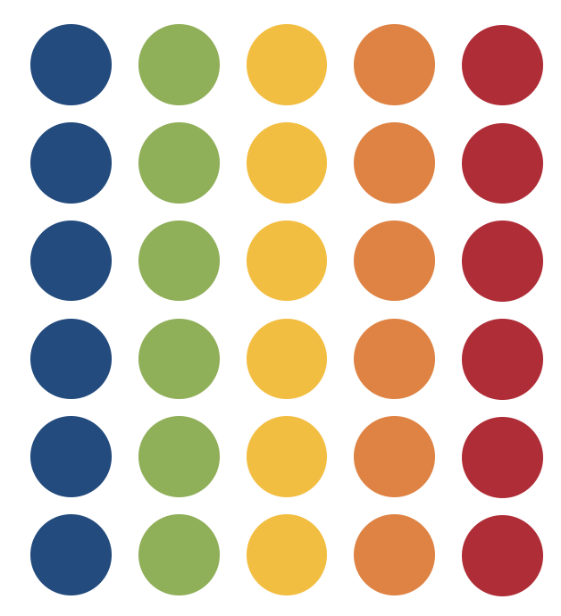

```{r}
#| label: setup
#| include: false

library(tidyverse)
library(patchwork)
library(kableExtra)
library(simglm)

source('_theme/theme_quarto.R')

```


# Course Overview 

<br>

:::: {.columns}

::: {.column width="50%"}

```{r}
#| echo: false
#| warning: false
#| results: asis

block1_name = "Exploratory Data Analysis"
block1_lecs = c("W1",
                "W2",
                "W3",
                "W4",
                "W5")
block2_name = "Inference"
block2_lecs = c("W7",
                "W8",
                "W9",
                "W10",
                "W11")

source("https://raw.githubusercontent.com/uoepsy/junk/main/R/course_table.R")
course_table(block1_name,block2_name,block1_lecs,block2_lecs, week = 0)
```

:::

::: {.column width="50%"}

```{r}
#| echo: false
#| warning: false
#| results: asis

block3_name = "Basic Tests"
block3_lecs = c("W1",
                "W2",
                "W3",
                "W4",
                "W5")
block4_name = "Intro Linear Models"
block4_lecs = c("W6",
                "W7",
                "W8",
                "W9",
                "W10")

source("https://raw.githubusercontent.com/uoepsy/junk/main/R/course_table.R")
course_table(block3_name,block4_name,block3_lecs,block4_lecs,week=3)
```

:::

::::


## This Week's Learning Objectives

<br>

::: {style="font-size: 125%;"}

::: {.fragment}
::: {.dapr3callout}
Understand when to use a $\chi^2$ goodness-of-fit test
:::
:::


::: {.fragment}
::: {.dapr3callout}
Know how to conduct a $\chi^2$ goodness-of-fit in `R`
:::
:::

::: {.fragment}
::: {.dapr3callout}
Understand when to use a $\chi^2$ test of independence
:::
:::

::: {.fragment}
::: {.dapr3callout}
Know how to conduct a $\chi^2$ test of independence in `R`
:::
:::

::: {.fragment}
::: {.dapr3callout}
Understand the data requirements and assumptions for a $\chi^2$ test
:::
:::

::: {.fragment}
::: {.dapr3callout}
Know how to calculate the effect size for a $\chi^2$ test
:::
:::

:::


# Introduction to $\chi^2$

## Purpose
- Used when we want to test whether data are distributed across categories in the way that we would expect
- Used to compare **frequencies** across categories in your data

<br>

- Two types of $\chi^2$ test:   
  - Goodness of Fit  
  - Test of Independence  


## $\chi^2$ Distribution


```{r, fig.height = 2.5, fig.width = 4.5}
#| echo: false

chiDist <- ggplot(data.frame(x = c(0, 15)), aes(x = x)) +
  stat_function(fun = dchisq, args = list(df = 2), colour = '#002060', size = 1) +
  stat_function(fun = dchisq, args = list(df = 4), colour = '#BF1932', size = 1) +
  stat_function(fun = dchisq, args = list(df = 6), colour = '#88B04B', size = 1) +
  stat_function(fun = dchisq, args = list(df = 8), colour = '#FCBB06', size = 1) +
  labs(x=expression(chi^{2}), y = 'Probability') +
  annotate(geom = 'text', x = 12, y = 0.45, label = 'df = 2', colour = '#002060', size = 4) +
  annotate(geom = 'text', x = 12, y = 0.4, label = 'df = 4', colour = '#BF1932', size = 4) +
  annotate(geom = 'text', x = 12, y = 0.35, label = 'df = 6', colour = '#88B04B', size = 4) +
  annotate(geom = 'text', x = 12, y = 0.3, label = 'df = 8', colour = '#FCBB06', size = 4) +
  theme(axis.text = element_text(size = 12), axis.title = element_text(size = 14, face = 'bold'))

chiDist
```


- Shape of the distribution depends on the degrees of freedom $(df)$ 
  - For $\chi^2$ distribution, $df$ is based on the number of groups $(g)$ within your data

- As the number of comparison groups increases, the distribution curve flattens
  - Larger $\chi^2$ values become more probable
  - A wider range of $\chi^2$ values become more likely

- The $\chi^2$ distribution begins at 0
  - Categorical variables don't have direction
  - $p$-value is computed only in one direction (right-tail) as the Probability of observing a $\chi^2$ statistic as big or bigger than the one obtained


## Data Requirements & Assumptions of $\chi^2$ Tests

- Data requirements  
  - Variables should be measured at an ordinal or nominal level (i.e., categorical data)

    
- Assumptions
  - Expected counts $\geq$ 5  
  - Observations are independent   
      - Each observation appears only in a single cell  


# $\chi^2$ Goodness of Fit Test

## Overview

:::: {.columns}

::: {.column width="55%"}

- Tests whether the proportions / relative frequencies you actually have are consistent with the expected proportions / relative frequencies

- Looks at the distribution of data across a single category

<br>

**Hypotheses:**

  - $H_0: p_1 = p_{1,0},\ p_2 = p_{2,0},\ ...,\ p_k = p_{k,0}$
  
  - $H_1:$ Some $p_i \neq p_{i,0}$

:::

::: {.column width="45%"}

**Expected Values** 

```{r}
#| echo: false
#| out-width: '40%'


```

**Observed Values**

```{r}
#| echo: false
#| out-width: '40%'


```

:::

::::


## $\chi^2$-statistic

$$
\chi^2 = \sum\limits_{i=1}^k \frac{(O_i - E_i)^2}{E_i} \quad = \quad \text{sum over the number of levels, from 1 through k} \quad \frac{\text{squared difference between observed and expected frequencies}}{\text{expected frequency}}
$$

<br> 

- TO DO: LINK TO FLASHCARDS/HANDOUT FOR HOW TO DO BY HAND


# Example

## Flower Shop Sales

- A new flower shop is trying to decide which days of the week they will be open 

- They want to know whether order number is consistent across days of the week

- They count the total number of orders they take each day of the week over the course of a month


## Hypotheses

- I elect to use a two-tailed test with alpha $(\alpha)$ of .05

<br>

- I specify the following hypotheses:   
   
  + $H_0$: Orders will be consistent throughout the week 
      + $p_{Monday}=p_{Tuesday}=\cdots =\ p_{Sunday}$
  
  + $H_1$: Orders will differ across the week
      + Some $p_{i}\not=p_{i0}$


## Data

```{r}
#| echo: false

flowerDat <- tibble(Day=as.factor(c('Monday', 'Tuesday', 'Wednesday', 'Thursday', 'Friday', 'Saturday', 'Sunday')),
                    Orders = c(54, 39, 44, 47, 68, 72, 53))
```

```{r}
#| echo: false

flowerDat
```


## Data Visualisation

```{r}
#| echo: true

ggplot(data = flowerDat, aes(Day, Orders, fill = Day)) +
  geom_col() +
  theme_minimal() +
  labs(title = "Flower Orders per Day", 
       x = "Day", 
       y = "Number of Orders")
```


## $\chi^2$ Goodness of Fit Test **in R**


:::: {.columns}

::: {.column width="50%"}

```{r}
#| echo: true

#Option 1
observed <- c(54, 39, 44, 47, 68, 72, 53)
expected <- c(1/7,1/7,1/7,1/7,1/7,1/7,1/7)

GOFtest <- chisq.test(x = observed, 
                      p = expected)
GOFtest
```

   
- where:
  + x: A numerical vector of observed frequencies
  + p: A numerical vector of expected proportions

:::

::: {.column width="50%"}

```{r}
#| echo: true

#Option 2
GOFtest <- chisq.test(flowerDat$Orders)
GOFtest
```

:::

::::

## Exploring our Results Further

- If our results are significant, we are likely interested in knowing which levels within our category had the biggest differences

- We can get this information by looking at the Pearson residuals (AKA, *standardized residuals*)
    + $\frac{O_i-E_i}{\sqrt{E_i}}$  
    
    
**In R**

```{r}
#| echo: true
#| eval: false

GOFtest$residuals
```

```{r}
#| echo: false
#| eval: true

options(width=50)
GOFtest$residuals
```


## Exploring our Results Further

:::: {.columns}

::: {.column width="50%"}

+ Positive residuals indicate that the observed frequency of the corresponding level is higher than the expected frequency  

+ Negative residuals indicate that the observed frequency of the corresponding level is lower than the expected frequency  

<br>

+ More extreme residuals indicate that the values are contributing more strongly to the results

  + Values $\leq$ -2 indicate the observed frequency of that level is **much lower** than expected
  
  + Values $\geq$ 2 indicate the observed frequency of that level is **much higher** than expected

:::

::: {.column width="50%"}


```{r}
#| echo: false

GOFtest <- chisq.test(flowerDat$Orders)
flowerDat$Residuals <- GOFtest$residuals
kable(flowerDat[,c('Day', 'Orders', 'Residuals')], digits = 2)
```

:::

::::


## $\chi^2$ Goodness of Fit Test Interpretation TO DO!! 

[INSERT WOOCLAP]

QUESTION:

- Is there a statistically significant difference in the proportion of flower orders placed across each day of the week?

- If you owned the flower shop, which two days would you choose to close each week?

 ANSWER:

- Yes, there was a difference and proportions not equal - statistically significant since p < .001. Thus, reject the null. 

- Close a Tuesday and a Wednesday (values with largest -ve residuals)


## Checking Data Requirements & Assumptions

*Data requirements* 
      
- Variables should be measured at an ordinal or nominal level (i.e., categorical data)   
  - Review dataset / data dictionary to ensure that variables were measured in categories and are coded as such (i.e., as factors)

<br>
    
*Assumptions*   
      
- Observations are independent
      
  - Cannot directly test - need to verify based on study design     
  
- Expected counts $\geq$ 5
      
  - Calculate expected counts (where $E_i=n\cdot\ p_i$) or extract from `R`:    
  
```{r}
#| echo: true

GOFtest$expected 
```


## Write Up

A $\chi^2$ Goodness of Fit test was conducted in order to determine whether the proportion of flower orders was equal across each day of the week. The goodness of fit test was significant $(\chi^2(6, n = 377) = 16.62, p = .011)$, and thus, with $\alpha = .05$, we reject the null hypothesis as the proportion of flower orders differed across the days of the week. 


# $\chi^2$ Test of Independence


## Overview

:::: {.columns}

::: {.column width="50%"}

- Tests whether two categorical variables from a single population are independent of each other

- Specifically, tests whether membership in Variable 1 is dependent upon / associated with membership in Variable 2

<br>

**Hypotheses:**

- $H_0:$ Variables A and B are independent 
  
- $H_1:$ There is an association between Variable A and Variable B

:::

::: {.column width="50%"}

**Expected Values** 

```{r, echo = F, out.width='80%'}

```

**Observed Values**

```{r, echo = F, out.width = '80%'}

```

:::

::::


## $\chi^2$-statistic

$$
\chi^2 = \sum\limits_{i=1}^r \sum\limits_{j=1}^c \frac{(O_{ij} - E_{ij})^2}{E_{ij}} \quad = \quad \text{sum over all rows and columns} \quad \frac{\text{squared difference between observed and expected frequencies}}{\text{expected frequency}}
$$

<br> 

- TO DO: LINK TO FLASHCARDS/HANDOUT FOR HOW TO DO BY HAND


# Example

## Flower Shop Stock

- The flower shop is trying to decide on their flower stock

- They want to know whether the flower type that sells the best depends on the season

- They count the number of lilies, roses, and tulips ordered across the four seasons in a year

## Hypotheses

- I elect to use a two-tailed test with alpha $(\alpha)$ of .05

<br>

- I specify the following hypotheses:   
   
  + $H_0$: Flower orders will be independent of season
      + $\text{Flower orders} \perp \text{Season}$
  
  + $H_1$: Flower orders will be dependent on season
      + $\text{Flower orders} \not\perp \text{Season}$


## Data

```{r}
#| echo: false
#| results: asis

seasonDat <- tibble(Season=as.factor(rep(c('Spring', 'Summer', 'Autumn', 'Winter'), times=c(603, 592, 551, 602))), 
                    Flowers=as.factor(c(rep('Roses', 232), rep('Tulips', 185), rep('Lilies', 186), rep('Roses', 228),
                              rep('Tulips', 192), rep('Lilies', 172), rep('Roses', 219), rep('Tulips', 164),
                              rep('Lilies', 168), rep('Roses', 246), rep('Tulips', 173), rep('Lilies', 183))))

seasonDat$Season <- factor(seasonDat$Season, levels = c('Spring', 'Summer', 'Autumn', 'Winter'))
flowerCols <- c('Lilies', 'Roses', 'Tulips')
ObsVals <- table(seasonDat$Season, seasonDat$Flowers)
#kable(ObsVals)

```

```{r}
#| echo: false

seasonDat
```


## Contingency Table

- We need to create a contingency table to see the distribution of flowers sold across seasons:

:::: {.columns}

::: {.column width="50%"}

```{r}
#| echo: true
#| eval: true

#Option 1
xtabs(~ Season + Flowers, data = seasonDat)
```


:::

::: {.column width="50%"}

```{r}
#| echo: true
#| eval: true
#| 
#Option 2 
seasonDat |>
  table() |>
  addmargins()
```

:::

::::


## Data Visualisation

```{r}
#| echo: true
#| eval: false

library(ggmosaic)
ggplot(data = seasonDat) +
  geom_mosaic(aes(x = product(Flowers, Season), fill = Season)) +
  labs(title = "Flower Type Ordered by Season", 
       x = "Season", 
       y = "Flower Type")
```


## $\chi^2$ Test of Independence **in R**

```{r}
#| echo: true

TOItest <- chisq.test(seasonDat$Season, seasonDat$Flowers)
TOItest
```


## Exploring our Results Further

We can compute standardized residuals for the Test of Independence:

+ $\frac{O_{ij}-E_{ij}}{\sqrt{E_{ij}}}$
    
    
**In R**

```{r}
#| echo: true
#| eval: false

TOItest$residuals
```

```{r}
#| echo: false
#| eval: true

options(width=50)
TOItest$residuals
```


## Exploring our Results Further

:::: {.columns}

::: {.column width="50%"}

+ Positive residuals indicate that the observed frequency of the corresponding level is higher than the expected frequency  

+ Negative residuals indicate that the observed frequency of the corresponding level is lower than the expected frequency  

<br>

+ More extreme residuals indicate that the values are contributing more strongly to the results

  + Values $\leq$ -2 indicate the observed frequency of that level is **much lower** than expected
  
  + Values $\geq$ 2 indicate the observed frequency of that level is **much higher** than expected


:::

::: {.column width="50%"}


```{r}
#| echo: false

kable(TOItest$residuals, digits = 2)
```

:::

::::


## $\chi^2$ Test of Independence Interpretation TO DO!! 

[INSERT WOOCLAP]

QUESTION:

- Is there a statistically significant association between flower orders and season?

- If you owned the flower shop, would you vary what type of flower you stocked by season?

 ANSWER:

- No significant association between type of flowers ordered and season. Thus, fail to reject the null 

- No, wouldn't examine residuals either given non-sig finding


## Checking Data Requirements & Assumptions

*Data requirements* 
      
- Variables should be measured at an ordinal or nominal level (i.e., categorical data)   
  - Review dataset / data dictionary to ensure that variables were measured in categories and are coded as such (i.e., as factors)

<br>
    
*Assumptions*   
      
- Observations are independent
      
  - Cannot directly test - need to verify based on study design     
  
- Expected counts $\geq$ 5
      
  - Calculate expected counts (where $E_{ij}=\frac{R_i\ \cdot\ C_j}{n}$) or extract from `R`:    
  
```{r}
#| echo: true

TOItest$expected 
```


## Write Up

A $\chi^2$ test of independence was performed to examine whether the type of flower sold was independent of season. There was no significant association between these variables $(\chi^2(6, n = 2348) =  2.40, p = .880)$. Therefore, using an $\alpha = .05$, we failed to reject the null hypothesis.


# Effect Size

## Effect Sizes

There are 3 options depending on the size of your contingency table:    
    
+ Phi coefficient $(\phi)$
+ Cramer's V $(V)$
+ Odds Ratios $(OR)$ - more on this in DAPR2
  

## Phi Coefficient

$$
\phi \quad =\quad \sqrt{\frac{\chi^2}{n}} \quad = \quad \sqrt{\frac{\text{chi-square statistic}}{\text{total number of observations}}}
$$


<br>

+ Should only be used when you have a 2x2 contingency table (2 categorical variables with 2 levels each)

<br>

+ Common 'cut-offs' for $\phi$-scores:

| Verbal label         | Magnitude of $\phi$ |
|:--------------------:|:-------------------:|
| Small effect         | 0.1                 |
| Medium effect        | 0.3                 |
| Large effect         | 0.5                 |


## Phi Coefficient **in R**

:::: {.columns}

::: {.column width="50%"}

*Not Bias-Corrected*

```{r}
#| echo: true
#| eval: false


library(effectsize)
#matches by-hand calc
#overwriting auto-adjustment: adjust = FALSE 
phi(TOItest, adjust = FALSE)
```

:::

::: {.column width="50%"}

*Bias-Corrected (Automatically Applied)*

```{r}
#| echo: true
#| eval: false

library(effectsize)
#good for small samples & large tables
#will not match by-hand calc
phi(TOItest, adjust = TRUE) #default
```

:::

::::


## Cramer's $V$


$$
V \quad = \quad \sqrt{\frac{\chi^2}{n\cdot\ df^*}} \quad = \sqrt{\frac{\text{chi-square statistic}}{\text{total number of observations} \cdot \text{min(rows-1, columns-1)}}}
$$

<br>
  
- Can be used when you are not working with a 2x2 contingency table

<br>

**Interpretation**

:::: {.columns}

::: {.column width="50%"}

+ Cramer's $V$ is interpreted based on $df^*$  
  
+ Cramer's $V$ must fall between 0 and 1 
    + 0 = complete independence
    + 1 = complete dependence 

:::

::: {.column width="50%"}

| $df^*$ | small | medium | large |
|--------|-------|--------|-------|
|   1    |  .10  |  .30   |  .50  |
|   2    |  .07  |  .21   |  .35  |
|   3    |  .06  |  .17   |  .29  |
|   4    |  .05  |  .15   |  .25  |
|   5    |  .04  |  .13   |  .22  |

:::

::::

## Cramer's $V$ **in R**

```{r}
cont_table <- table(seasonDat$Flowers, seasonDat$Season)
```


<br>

:::: {.columns}

::: {.column width="50%"}

*Not Bias-Corrected*

```{r}
#| echo: true

library(effectsize)
#matches by-hand calc
#overwriting auto-adjustment: adjust = FALSE 
cramers_v(cont_table, adjust = FALSE)
```

:::

::: {.column width="50%"}

*Bias-Corrected (Automatically Applied)*

```{r}
#| echo: true

library(effectsize)
#good for small samples & large tables
#will not match by-hand calc
cramers_v(cont_table, adjust = TRUE) #default
```

:::

::::


## Revisiting This Week's Learning Objectives

<br>

::: {}
::: {.dapr3callout}
**Understand when to use a $\chi^2$ goodness-of-fit test**

- When we want to test whether observed frequencies are consistent with expected frequencies
- When we want to investigate whether observed sample proportions are consistent with a hypothesis about the proportional breakdown of the various categories in the population

Examples:  
   
- Are people equally likely to be born on any of the seven days of the week?
- Are 15% of M&Ms red?

:::
:::

::: {}
::: {.dapr3callout}
**Know how to conduct a $\chi^2$ goodness-of-fit in `R`**


```{r}
#| eval: false

chisq.test(x = observed_counts, p = expected_proportions)
```

**OR**

```{r}
#| eval: false

chisq.test(dataframe$var1)
```

:::
:::

## Revisiting This Week's Learning Objectives

<br>

::: {}
::: {.dapr3callout}
**Understand when to use a $\chi^2$ test of independence**

- When we want to test whether two categorical variables are dependent on one another
- Used to determine whether or not there is a significant association between two categorical variables

Examples:    
    
- Are people who carry the APOE-4 gene (Y/N) more likely to have mild cognitive impairment (Y/N)?
- Is social media usage (Y/N) associated with levels of anxiety (low, medium, high)?
  
:::
:::

::: {}
::: {.dapr3callout}
**Know how to conduct a $\chi^2$ test of independence in `R`**

```{r}
#| eval: false

chisq.test(dataframe$var1, dataframe$var2)
```

:::
:::

## Revisiting This Week's Learning Objectives

<br>

::: {}
::: {.dapr3callout}
**Understand the data requirements and assumptions for a $\chi^2$ test**

- Variables should be measured at an ordinal or nominal level   
    
- Observations are independent    
    
- Expected counts $\geq$ 5    

:::
:::

::: {}
::: {.dapr3callout}
**Know how to calculate the effect size for a $\chi^2$ test**

- For $2 \times 2$ contingency tables, calculate $\phi \quad =\quad \sqrt{\frac{\chi^2}{n}}$

```{r}
#| eval: false

phi()
```

- For non-$2 \times 2$ contingency tables, calculate $\text{Cramers } V \quad = \quad \sqrt{\frac{\chi^2}{n\cdot\ df^*}}$

```{r}
#| eval: false

cramers_v()
```


:::
:::

## This Week 

