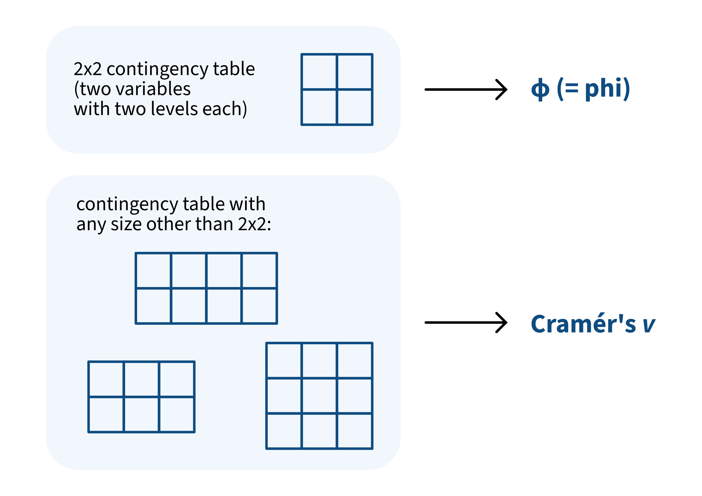
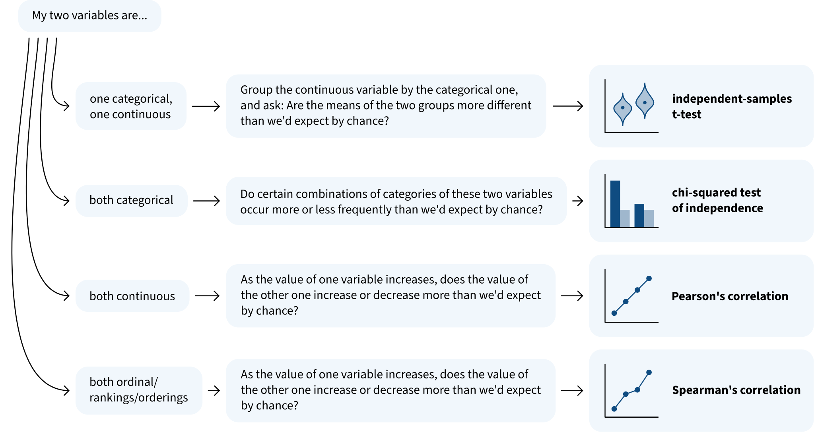

```{r}
#| label: setup
#| include: false

library(tidyverse)
library(patchwork)

dapr1blue <- '#0F4C81'

source('_theme/theme_quarto.R')

theme_update(
  text = element_text(family = 'Source Sans 3'),
  panel.grid.minor = element_blank(),
  strip.background = element_blank(),
  strip.text.x = element_text(size = 24)
)
```

# Welcome back!

## This week's learning objectives

<br>

:::{.dapr1callout .fragment}
What's the difference between "statistical significance" and "practical significance"?

<!-- - "Statistical significance" is achieved whenever $p$ < $\alpha$, usually .05 -->
<!-- - An effect can be absolutely tiny and still be statistically significant (usually because the sample is really really big) -->
<!-- - For an effect to be *practically* significant, its effect size (as measured by a standardised effect size measure) should be medium or large -->
:::


:::{.dapr1callout .fragment}
How do we know what kind of effect is "small", "medium", or "large" for each test we've seen in Block 3?

<!-- - We convert our test result into the appropriate measure of effect size: -->
<!--   - For t-tests: Cohen's D -->
<!--   - For chi-squared tests with 2x2 contingency tables: phi, pronounced "fye", Greek letter $\phi$ -->
<!--   - For chi-squared tests with non-2x2 contingency tables: Cramér's $v$ (name pronounced kruh-MAYR) -->
<!--   - For Pearson or Spearman's correlations: the correlation coefficent itself -->
:::


# Statistical significance vs. practical significance

## Imagine reading this in a paper

```{r include=F}
n_obs_per_group <- 2000
set.seed(1)
sig_data <- tibble(
  group = c(
    rep('Control', n_obs_per_group),
    rep('Treatment', n_obs_per_group)
  ),
  score = c(
    rnorm(n_obs_per_group, mean = 51, sd = 10),
    rnorm(n_obs_per_group, mean = 51.5, sd = 10)
  )
)

sig_data |>
  group_by(group) |>
  summarise(
    M = mean(score),
    SD = sd(score)
  )

sig_data |>
  ggplot(aes(x = group, y = score, fill = group, colour = group)) +
  geom_violin(alpha = 0.5) +
  geom_jitter(alpha = 0.5) +
  stat_summary(fun = mean, geom = 'point', colour = 'black', size = 3) +
  theme(legend.position = 'none') +
  NULL

sig_t <- t.test(
  sig_data$score ~ sig_data$group,  
  mu = 0,   
  var.equal = TRUE,   
  conf.level = .95   
)
sig_t

sig_cohensD <- effectsize::cohens_d(
  sig_data$score ~ sig_data$group,  
  mu = 0,   
  var.equal = TRUE,   
  conf.level = .95  
)
sig_cohensD
```

::::{.columns}
:::{.column width="50%"}

```{r fig.width=7, fig.height=7}
#| code-fold: true

p_sig_violin <- sig_data |>
  ggplot(aes(x = group, y = score, fill = group, colour = group)) +
  geom_violin(alpha = 0.5) +
  geom_jitter(alpha = 0.3, size = 3) +
  stat_summary(fun = mean, geom = 'point', colour = 'black', size = 5) +
  theme(legend.position = 'none') +
  labs(
    y = 'Wellbeing score',
    x = 'Experimental group'
  )
p_sig_violin
```


:::
:::{.column width="50%"}

<br>

> "As predicted, the treatment group in our experiment achieved significantly higher wellbeing scores ($N$ = 2000, $M$ = 51.7, $SD$ = 10.3) compared to the control group ($N$ = 2000, $M$ = 50.9, $SD$ = 10.4); $t$(3998) = –2, $p$ = .01.
We therefore conclude that our intervention worked."


<br>

:::{.dapr1callout}

Do you think the researcher's conclusion is supported by the data? Why or why not?

:::hcenter
:::woo
https://app.wooclap.com/events/DBCMAYL/
:::
:::

:::

:::
::::


## How big is the difference between groups?

```{r fig.width=8, fig.height=7, fig.align="center"}
#| code-fold: true

mean_treatment <- sig_data |>
  filter(group == 'Treatment') |>
  summarise(M = mean(score)) |>
  pull(M) |>
  round(1)

mean_control <- sig_data |>
  filter(group == 'Control') |>
  summarise(M = mean(score)) |>
  pull(M) |>
  round(1)

p_sig_violin +
  annotate(geom = 'text', size = 8, x = 1.15, y = mean_control, label = mean_control) +
  annotate(geom = 'text', size = 8, x = 2.15, y = mean_treatment, label = mean_treatment)
```

## Now imagine reading this in a paper

```{r include=F}
set.seed(2)
weight_data <- tibble(
  group = c(
    rep('Unsatisfied', 78),
    rep('Satisfied', 92)
  ),
  birthweight = c(
    rnorm(78, mean = 2.4, sd = .5),
    rnorm(92, mean = 3.2, sd = .5)
  )
)

weight_data |>
  group_by(group) |>
  summarise(
    M = mean(birthweight),
    SD = sd(birthweight)
  )

weight_data |>
  ggplot(aes(x = group, y = birthweight, fill = group, colour = group)) +
  geom_violin(alpha = 0.5) +
  geom_jitter(alpha = 0.5) +
  stat_summary(fun = mean, geom = 'point', colour = 'black', size = 3) +
  theme(legend.position = 'none') +
  NULL

weight_t <- t.test(
  weight_data$birthweight ~ weight_data$group,  
  mu = 0,   
  var.equal = TRUE,   
  conf.level = .95   
)
weight_t

weight_cohensD <- effectsize::cohens_d(
  weight_data$birthweight ~ weight_data$group,  
  mu = 0,   
  var.equal = TRUE,   
  conf.level = .95  
)
weight_cohensD
```


::::{.columns}
:::{.column width="50%"}
```{r fig.width=7, fig.height=7}
#| code-fold: true

p_weight_violin <- weight_data |>
  ggplot(aes(x = group, y = birthweight, fill = group, colour = group)) +
  geom_violin(alpha = 0.5) +
  geom_jitter(alpha = 0.5, size = 3) +
  stat_summary(fun = mean, geom = 'point', colour = 'black', size = 5) +
  theme(legend.position = 'none') +
  labs(
    y = 'Infant birth weight (kg)',
    x = "Perception of social support\nreceived during pregnancy"
  )
p_weight_violin
```

:::
:::{.column width="50%"}

> "We found that people who reported less satisfaction with the social support they received during pregnancy gave birth to infants with significantly lower birth weight ($N$ = 92, $M$ = 2.42 kg, $SD$ = 0.56) compared to people who were more satisfied with their social support ($N$ = 78, $M$ = 3.22 kg, $SD$ = 0.55); $t$(268) = 9, $p$ < .01.
We conclude that social support is important not just for parents' wellbeing but also for their infants'."

<br>


:::{.dapr1callout}

Do you think the researcher's conclusion is supported by the data? Why or why not?

:::hcenter
:::woo
https://app.wooclap.com/events/DBCMAYL/
:::
:::

:::

:::
::::


(This data is based on findings from [Costa et al., 2000](http://www.tandfonline.com/doi/full/10.3109/01674820009075621){target="_blank"}.)

## How big is the difference between groups?

```{r fig.width=8, fig.height=7}
#| code-fold: true

mean_sat <- weight_data |>
  filter(group == 'Satisfied') |>
  summarise(M = mean(birthweight)) |>
  pull(M) |>
  round(1)

mean_unsat <- weight_data |>
  filter(group == 'Unsatisfied') |>
  summarise(M = mean(birthweight)) |>
  pull(M) |>
  round(1)

p_weight_violin +
  annotate(geom = 'text', size = 8, x = 1.15, y = mean_sat, label = mean_sat) +
  annotate(geom = 'text', size = 8, x = 2.15, y = mean_unsat, label = mean_unsat)
```

## Is one of these effects more <br> *practically* significant than the other?

::::{.columns}
:::{.column width="50%"}
```{r fig.width = 7, fig.height = 6}
#| code-fold: true
p_sig_violin +
  annotate(geom = 'text', size = 8, x = 1.15, y = mean_control, label = mean_control) +
  annotate(geom = 'text', size = 8, x = 2.15, y = mean_treatment, label = mean_treatment)
```

:::
:::{.column width="50%"}
```{r fig.width = 7, fig.height = 6}
#| code-fold: true
p_weight_violin +
  annotate(geom = 'text', size = 8, x = 1.15, y = mean_sat, label = mean_sat) +
  annotate(geom = 'text', size = 8, x = 2.15, y = mean_unsat, label = mean_unsat)
```
:::
::::


<!-- Both group means differ by the same amount, and both are statistically significant. -->

<!-- But in the context of the rest of the data, one effect is bigger than the other. -->


# How can we measure <br> practical significance?

<!-- ## First, think back to z-scores -->

<!-- ::::{.columns} -->
<!-- :::{.column width="30%"} -->

<!-- ```{r} -->

<!-- ``` -->


<!-- ::: -->
<!-- :::{.column width="5%"} -->
<!-- ::: -->
<!-- :::{.column width="30%"} -->
<!-- b -->
<!-- ::: -->
<!-- :::{.column width="5%"} -->
<!-- ::: -->
<!-- :::{.column width="30%"} -->
<!-- c -->
<!-- ::: -->
<!-- :::: -->

<!-- The purpose of a z-score is to **standardise** a variable. -->
<!-- All z-scored variables are on the same scale, which means that they use the same units (namely, standard deviations). -->

<!-- Z-scores let us compare between two variables more easily. -->

## We want numbers that reflect our intuitions

We want to be able to say:

::::{.columns}
:::{.column width="50%"}

**"This effect is smaller and therefore less practically significant..."**

<br>

```{r fig.width = 7, fig.height = 6}
#| code-fold: true
p_sig_violin +
  annotate(geom = 'text', size = 8, x = 1.15, y = mean_control, label = mean_control) +
  annotate(geom = 'text', size = 8, x = 2.15, y = mean_treatment, label = mean_treatment)
```

:::
:::{.column width="50%"}

<br>

**"... than this effect, which is larger and more practically significant."**

```{r fig.width = 7, fig.height = 6}
#| code-fold: true
p_weight_violin +
  annotate(geom = 'text', size = 8, x = 1.15, y = mean_sat, label = mean_sat) +
  annotate(geom = 'text', size = 8, x = 2.15, y = mean_unsat, label = mean_unsat)
```
:::
::::


## For t-tests, that measure is called Cohen's D

::::{.columns}
:::{.column width="50%"}

**Cohen's D for this example: –0.08** 


```{r fig.width = 7, fig.height = 6}
#| code-fold: true
p_sig_violin +
  annotate(geom = 'text', size = 8, x = 1.15, y = mean_control, label = mean_control) +
  annotate(geom = 'text', size = 8, x = 2.15, y = mean_treatment, label = mean_treatment)
```

:::
:::{.column width="50%"}

**Cohen's D for this example: 1.44**  🎉

```{r fig.width = 7, fig.height = 6}
#| code-fold: true
p_weight_violin +
  annotate(geom = 'text', size = 8, x = 1.15, y = mean_sat, label = mean_sat) +
  annotate(geom = 'text', size = 8, x = 2.15, y = mean_unsat, label = mean_unsat)
```
:::
::::


The greater the value of Cohen's D (whether it's big and positive or big and negative), the more practically significant the effect.


## Running Cohen's D in R

We use the function `cohens_d()` from the library `effectsize`.
It takes the same arguments as `t.test()`.

```{r}
library(effectsize)
```

<br>

::::{.columns}
:::{.column width="50%"}
**Effect size in the wellbeing data:**

```{r}
cohens_d(
  sig_data$score ~ sig_data$group,  
  mu = 0,   
  var.equal = TRUE,   
  conf.level = .95  
)
```

:::
:::{.column width="50%"}

**Effect size in the birth weight data:**

```{r}
cohens_d(
  weight_data$birthweight ~ weight_data$group,  
  mu = 0,   
  var.equal = TRUE,   
  conf.level = .95  
)
```
:::
::::

:::dapr1callout

Interpreting Cohen's D:

- **Small or weak effect:** around 0.2 (whether positive or negative)
- **Medium or moderate effect:** around 0.5 (whether positive or negative)
- **Large or strong effect:** around 0.8 or greater (whether positive or negative)

:::

## For chi-squared tests: Two options

Depending on the size of your contingency table (that is, how many levels your two categorical variables have):

{fig-align="center"}


## Chi-squared ADHD/ASD co-occurrence: $\phi$ 

<br>

```{r include=F}
# counts from Table 1, p. 3
federico <- tribble(
  ~sex, ~yesADHD_noASD, ~noADHD_yesASD, ~yesADHD_yesASD, ~noADHD_noASD,
  'female', 2437, 224, 233, 31385,
  'male', 4971, 883, 906, 29874
) |>
  pivot_longer(
    cols = yesADHD_noASD:noADHD_noASD,
    names_to = 'diagnosis',
    values_to = 'count'
  )

# aggregating over sex for this lecture
neurotype_data <- federico |>
  group_by(diagnosis) |>
  summarise(count = sum(count)) |>
  separate(diagnosis, into = c('ADHD', 'ASD')) |>
  # mutate(
  #   ADHD = gsub('ADHD', '', ADHD),
  #   ASD = gsub('ASD', '', ASD),
  # ) |>
  uncount(count) |>
  mutate(
    ADHD = factor(ADHD),
    ASD = factor(ASD)
  )
```

::::{.columns}
:::{.column width="40%"}

**A 2x2 contingency table:**

```{r}
#| code-fold: true
library(stats)
xtabs(~ ADHD + ASD, data = neurotype_data)
```
:::
:::{.column width="5%"}
:::
:::{.column width="55%"}

Use the function `phi()` from the `effectsize` package.

It takes the same arguments as `chisq.test()`.

```{r}
phi(
  neurotype_data$ADHD, 
  neurotype_data$ASD
)
```


:::
::::

<br>

:::dapr1callout

Interpreting $\phi$:

- **Small effect:** around 0.1 (whether positive or negative)
- **Medium effect:** around 0.3 (whether positive or negative)
- **Large effect:** around 0.5 or greater (whether positive or negative)

:::


## Chi-squared sexuality/attachment style: Cramér's $v$


```{r include=F}
# Frequencies from RidgeFeeney1998, Table 2, p. 853

ridgefeeney1998_tab2 <- tribble(
  ~style,   ~sex, ~sexuality, ~count,
  'Secure', 'M',  'Homo', 26,
  'Secure', 'F',  'Homo', 41,
  'Fearful', 'M', 'Homo', 19,
  'Fearful', 'F', 'Homo', 22,
  'Preoccupied', 'M', 'Homo', 16,
  'Preoccupied', 'F', 'Homo', 12,
  'Dismissing', 'M', 'Homo', 16,
  'Dismissing', 'F', 'Homo', 25,
  'Secure', 'M',  'Hetero', 15,
  'Secure', 'F',  'Hetero', 53,
  'Fearful', 'M', 'Hetero', 8,
  'Fearful', 'F', 'Hetero', 26,
  'Preoccupied', 'M', 'Hetero', 10,
  'Preoccupied', 'F', 'Hetero', 11,
  'Dismissing', 'M', 'Hetero', 6,
  'Dismissing', 'F', 'Hetero', 21
)

# aggregating over sex for simplicity's sake
attach_data <- ridgefeeney1998_tab2 |>
  group_by(style, sexuality) |>
  summarise(
    count = sum(count)
  ) |>
  ungroup() |>
  uncount(count)

# attach_data
```

::::{.columns}
:::{.column width="40%"}

**A 4x2 contingency table:**

```{r}
#| code-fold: true
xtabs(~ style + sexuality, data = attach_data)
```
:::


:::{.column width="60%"}
Use the function `cramers_v()` from the `effectsize` package.

It also takes the same arguments as `chisq.test()`.

```{r}
cramers_v(
  attach_data$style,
  attach_data$sexuality
)
```

:::
::::

<br>

:::dapr1callout

Interpreting Cramér's $v$ depends on the test's degrees of freedom, which you can calculate yourself or see in the output from `chisq.test()`.
For this data, **df = 3.**

| Effect size | df = 1 | df = 2 | df = 3 | df = 4 | df = 5 |
| ----------- | -----: | -----: | -----: | -----: | -----: |
| **Small**       | .10    | .07    | .06    | .05    | .04    |
| **Medium**      | .30    | .21    | .17    | .15    | .13    |
| **Large**       | .50    | .35    | .29    | .25    | .22    |


:::


## For correlations: The correlation coefficient

```{r include=F}
# sample size from Table 3 on p. 32
zwick_n <- 98391

# correlation from Table 7 on p. 36 (total within-school correlation between income and SAT verbal score)
zwick_cor <- 0.219

# mean score on SAT verbal from Table 3 on p. 33, arbitrary SD of 100, thanks google
zwick_SAT_mean <- 504.5
zwick_SAT_sd <- 100

# income mean and SD approximated from income distribution from Table 3 on p. 32
zwick_income_dist <- c(
  rep(5000, 41),
  rep(15000, 81),
  rep(25000, 99),
  rep(35000, 111),
  rep(45000, 92),
  rep(55000, 96),
  rep(65000, 87),
  rep(75000, 85),
  rep(90000, 122),
  rep(120000, 187)
)
zwick_income_mean <- mean(zwick_income_dist)
zwick_income_sd <- sd(zwick_income_dist)

# create vcov mtx
zwick_cov  <- zwick_cor * zwick_income_sd * zwick_SAT_sd
zwick_vcov <- matrix(c(zwick_income_sd^2, zwick_cov, zwick_cov, zwick_SAT_sd^2), nrow = 2)

set.seed(1)
ses_data <- MASS::mvrnorm(
  n = 800,
  mu = c(zwick_income_mean, zwick_SAT_mean),
  Sigma = zwick_vcov
)
colnames(ses_data) <- c('Income', 'Score')
ses_data <- ses_data |>
  as_tibble() |>
  # filter for realism
  filter(Income > 0, Score >= 200, Score <= 800)
```


::::{.columns}
:::{.column width="50%"}

```{r fig.width=7, fig.height=6}
#| code-fold: true
ses_data |>
  ggplot(aes(x = Income, y = Score)) +
  geom_point(size = 3) +
  labs(
    x = "Parents' income (USD)",
    y = 'Score on SAT Verbal'
  ) +
  geom_smooth(method = 'lm', se = F, linewidth = 2)
```

:::
:::{.column width="50%"}

**Same code that we ran last week!**

```{r}
cor.test(
  ses_data$Income,
  ses_data$Score,
  method = 'spearman'
)
```


:::
::::


:::dapr1callout

Interpreting correlation coefficients $r$ and $\rho$:

- **Weak correlations:** between .1 and .3 (whether positive or negative)
- **Moderate correlations:** between .3 and .5 (whether positive or negative)
- **Strong correlations:** greater than .5 (whether positive or negative)

:::

# Different RQs require different tests

## Different RQs require different tests

<br>

For each research question that I'm about to show you, vote on what kind of test would be the most appropriate.

:::hcenter
:::woo
https://app.wooclap.com/events/DBCMAYL/
:::
:::


## If time, reflect: What features of a research question indicate which test to use?

RQs:

- Are patients' therapy outcomes (improved/no change/worsened) associated with the type of therapy they received (CBT/EMDR/psychodynamic)? <!-- chisq -->
- Is there a difference in people's attention span (measured in seconds) between people who consume caffeine and people who do not?  <!-- indept -->
- Compared to the recommended minimum sleep duration of 7 hours per night, do new parents sleep significantly less? <!-- one-sample t-->
- For teenagers, is the amount of screen time per day associated with their sleep quality scores? <!-- cor -->
- Do people with a four-day work week report job satisfaction that differs from the industry standard of 3.5 on a 5-point Likert scale? <!-- one-sample t -->
- Is there an association between people's emotional intelligence test scores and their peer-rated leadership ability scores? <!-- cor -->
- Is teenagers' level of social media usage (low/medium/high) associated with the severity of depressive symptoms (none/mild/moderate/severe)? <!-- chisq -->
- Do sleep quality scores differ between people who do only cardio training and people who do only strength training? <!-- indept -->


:::{style="font-size:300%;" .hcenter}

⏳

:::


# Q+A on all of Block 3

## Q+A on all of Block 3

{fig-align="center"}

<br>

:::hcenter
:::woo
https://app.wooclap.com/events/DBCMAYL/
:::
:::


# Back matter {.appendix}

## Revisiting this week's learning objectives


:::{.dapr1callout}
**What's the difference between "statistical significance" and "practical significance"?**

- "Statistical significance" is achieved whenever $p$ < $\alpha$, usually .05
- An effect can be absolutely tiny and still be statistically significant (usually because the sample is really really big)
- For an effect to be *practically* significant, its effect size (as measured by a standardised effect size measure) should be medium or large
:::


:::{.dapr1callout}
**How do we know what kind of effect is "small", "medium", or "large" for each test we've seen in Block 3?**

- We convert our test result into the appropriate measure of effect size:
  - For t-tests: Cohen's D
  - For chi-squared tests with 2x2 contingency tables: phi, pronounced "fye", Greek letter $\phi$
  - For chi-squared tests with non-2x2 contingency tables: Cramér's $v$ (name pronounced kruh-MAYR)
  - For Pearson or Spearman's correlations: the correlation coefficent itself
:::


## Block 3 skills involved in this week's lecture and/or workshop

- **S5:**	I can compute measures that summarise how two variables are related.
- **A6:**	I can implement a given statistical test.
- **A4:**	I can check the assumptions underlying basic statistical tests.
- **A5:**	I can identify the appropriate type of basic statistical test for a given question/design.
- **I5:**	I can identify whether I can or cannot reject the null hypothesis.
- **I6:**	I can tell the difference between statistical significance and practical significance.
- **C1:**	I can describe the steps taken in a given analysis.
- **C2:**	I can describe in writing the results of a given basic statistical test.

