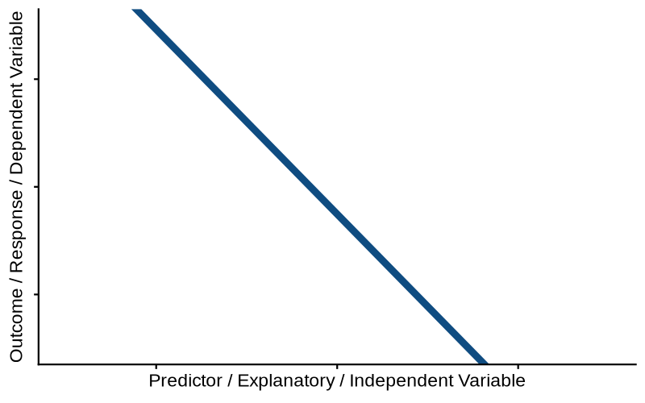

```{r}
#| label: setup
#| echo: false
library(tidyverse)
library(gganimate)
library(patchwork)
```


# Course Overview {.smaller}
:::: {.columns}

::: {.column width="50%"}

```{r}
#| echo: false
#| warning: false
#| results: asis

block1_name = "block  1 name"
block1_lecs = c("week 1 topic",
                "week 2 topic",
                "week 3 topic",
                "week 4 topic",
                "week 5 topic")
block2_name = "block 2 name"
block2_lecs = c("week 7 topic",
                "week 8 topic",
                "week 9 topic",
                "week 10 topic",
                "week 11 topic")

source("https://raw.githubusercontent.com/uoepsy/junk/main/R/course_table.R")

course_table(block1_name,block2_name,block1_lecs,block2_lecs,week=11)
```

:::

::: {.column width="50%"}

```{r}
#| echo: false
#| warning: false
#| results: asis

block3_name = "block 3 name"
block3_lecs = c("week 1 topic",
                "week 2 topic",
                "week 3 topic",
                "week 4 topic",
                "week 5 topic")
block4_name = "block 4 name"
block4_lecs = c("week 7 topic",
                "week 8 topic",
                "week 9 topic",
                "week 10 topic",
                "week 11 topic")

source("https://raw.githubusercontent.com/uoepsy/junk/main/R/course_table.R")

course_table(block3_name,block4_name,block3_lecs,block4_lecs,week=6)
```

:::

::::

## This week

1. A quick recap
2. Lines lines lines! 
3. outcome = model + error
4. Using models to answer questions

# The story so far... 

## Block 1 - Exploratory Data Analysis {.smaller}

- We were "Exploratory" because we weren't yet talking about research questions or hypotheses.  
- More generally, think "how to summarise/visualise distributions" 
    - mean/median/mode
    - variance/standard deviation
    - counts/frequencies/proportions

All things we can use to specify questions! 

<br> 

|    |    |
| -- | -- |
| Has the average body temperature of healthy humans changed from the long-thought 37 °C? | mean $\neq$ 37?   |
| Are first year undergraduate students more optimistic than adults in general? | mean > 35? |
| TODO from EP lec 2 sample t test q | mean - mean $\neq$ 0? |
| TODO from EP lec chi-squ test q | observed proportions - expected proportions $\neq$ 0? |
| TODO from EP lec corr q | variance of XX coincide with variance of YY? | 


## Block 2 - Introduction to Inference

```{r}
#| echo: false
#| fig-height: 4
#| fig-width: 12
set.seed(2394)
samplemeans <- replicate(2000, mean(rnorm(n=100, mean=0, sd=5)))
ss = sd(samplemeans)
g <- ggplot(data=tibble(samplemeans),aes(x=samplemeans))+
  #geom_histogram(alpha=.3)+
  stat_function(geom="line",fun=~dnorm(.x, mean=0,sd=sd(samplemeans))*270,lwd=1)

ld <- layer_data(g) |> filter(x <= sd(samplemeans)+.02 & x >= (-sd(samplemeans)-.02))
ld2 <- layer_data(g) |> filter(x <= 2*sd(samplemeans)+.02 & x >= (-2*sd(samplemeans))-.02)
ld3 <- layer_data(g) |> filter(x >= 1.2)
ld4 <- layer_data(g) |> filter(x <= -1.2)

g + geom_area(data=ld,aes(x=x,y=y),fill="grey30",alpha=.3) + 
  geom_area(data=ld2,aes(x=x,y=y),fill="grey30",alpha=.1) +
  geom_area(data=ld3,aes(x=x,y=y),fill="tomato1",alpha=.3) +
  geom_area(data=ld4,aes(x=x,y=y),fill="tomato1",alpha=.3) +
  geom_segment(aes(x=0,xend=0,y=0,yend=dnorm(0,0,sd=sd(samplemeans))*280), lty="dashed")+
  geom_segment(aes(x=1.2,xend=1.2,y=0,yend=180), lty="dashed", col="#2b8ce0")+ 
  # geom_vline(aes(xintercept=1.2),lty="dashed",col="tomato1")+
  labs(x = "statistic")+
  scale_y_continuous(NULL, breaks=NULL, limits=c(0,275))+
  annotate("text",x=0, y=265, label="population mean\naccording to\nnull hypothesis", col="grey30")+
  annotate("text",x=-1.5, y=210, label="means we would expect from\nsamples of size n if the\nnull hypothesis is true", col="grey30")+
  annotate("text",x=1.2, y=220, label="mean we observe\nin our sample", col="#2b8ce0")+
  annotate("text",x=1.5, y=40, label="probability of seeing\na mean at least\nas extreme\nif null is true", col="tomato1", hjust=0,size=4)+
  
  annotate("text",x=-1.5, y=40, label="probability of seeing\na mean at least\nas extreme (in other\ndirection) if null is true", col="tomato1", hjust=1,size=4)+
  
  
  geom_curve(aes(x=0, xend=0, y=240, yend=225), col="grey30", size=0.5, curvature = 0, arrow = arrow(length = unit(0.03, "npc")))+
  geom_curve(aes(x=-1, xend=-0.5, y=190, yend=150), col="grey30", size=0.5, curvature = 0.2, arrow = arrow(length = unit(0.03, "npc")))+
  geom_curve(aes(x=1.2, xend=1.2, y=205, yend=185), col="#2b8ce0", size=0.5, curvature = 0, arrow = arrow(length = unit(0.03, "npc"))) +
  geom_curve(aes(x=1.45, xend=1.3, y=35, yend=2.5), col="tomato1", size=0.5, curvature = 0, arrow = arrow(length = unit(0.02, "npc")))+
  geom_curve(aes(x=-1.45, xend=-1.3, y=35, yend=2.5), col="tomato1", size=0.5, curvature = 0, arrow = arrow(length = unit(0.02, "npc")))+
  scale_x_continuous(NULL, breaks=c(-2:2)*ss, 
                     labels=c("-2*SE","-1*SE","","1*SE","2*SE"),
                     limits=c(-2.5,2.5))+
  theme_minimal()+
  theme(panel.grid.major = element_blank(), panel.grid.minor = element_blank())
  
```

TODO ask UN for key 2/3 bullet summary

## Block 3 - Common Statistical Tests

Testing how two variables are related

TODO flowchart

# Lines

## Correlation

> If two variables are correlated, then as the value of one variable changes, the value of the other variable changes too.

> Put differently: you can make a reasonable guess about the value of one variable based on the value of the other one.


## Correlation

```{r}
#| echo: false
library(patchwork)
#eseed=round(runif(1,1,1e6))
set.seed(884721)
df1 <- MASS::mvrnorm(n=50,mu=c(0,0),Sigma=matrix(c(1,.6,.6,1),nrow=2),empirical=TRUE) |>
  as.data.frame() |>
  mutate(
    bac = 1000*(scale(V1)[,1]*.02+.06),
    RT = round(scale(V2)[,1]*265 + 650)
  )
p1 <- ggplot(df1, aes(x=bac,y=RT))+
  geom_point(size=3)+
  labs(x="Blood Alcohol Volume (mg/dL)",y="Reaction Time (MS)",
       title = "r = 0.6")


df2 <- MASS::mvrnorm(n=50,mu=c(0,0),Sigma=matrix(c(1,0,0,1),nrow=2),empirical=TRUE) |>
  as.data.frame() |>
  mutate(
    shoe = round((scale(V1)[,1]*2.2+36)*2)/2,
    IQ = round(scale(V2)[,1]*15 + 100)
  )
p2 <- ggplot(df2, aes(x=shoe,y=IQ))+
  geom_point(size=3)+
  labs(x="Shoe Size (EU)",y="IQ Score",
       title = "r = 0")

df3 <- MASS::mvrnorm(n=50,mu=c(0,0),Sigma=matrix(c(1,-.4,-.4,1),nrow=2),empirical=TRUE) |>
  as.data.frame() |>
  mutate(
    hrs_awake = round((scale(V1)[,1]*6.5+12)*4)/4,
    wpm = round(scale(V2)[,1]*20 +51.5)/10
  )
p3 <- ggplot(df3, aes(x=hrs_awake,y=wpm))+
  geom_point(size=3)+
  labs(x="Time since waking (Hrs)",y="Typing Speed (10WPM)",
       title = "r = -0.4")


df4 <- MASS::mvrnorm(n=50,mu=c(0,0),Sigma=matrix(c(1,.9,.9,1),nrow=2),empirical=TRUE) |>
  as.data.frame() |>
  mutate(
    notifications = round(scale(V1)[,1]*45+120),
    unlocks = round(scale(V2)[,1]*30 + 80)
  )
p4 <- ggplot(df4, aes(x=notifications,y=unlocks))+
  geom_point(size=3)+
  labs(x="Number of Notifications",y="Number of Phone Unlocks",
       title = "r = 0.9")

(p1 + p2) / (p3 + p4)

```

## Correlation ++ 

```{r}
#| echo: false

( p1 + stat_smooth(method=lm,se=F,col="#0F4C81",lwd=2) + 
  p2 + stat_smooth(method=lm,se=F,col="#0F4C81",lwd=2) ) / 
( p3 + stat_smooth(method=lm,se=F,col="#0F4C81",lwd=2) + 
  p4 + stat_smooth(method=lm,se=F,col="#0F4C81",lwd=2) )

```


# A shift in focus

## i like lines


## What defines a line?

```{ojs}
//| echo: false

viewof linearModel = {
  const width = 580;
  const height = 320;
  const margin = 50;

  // init vals
  let y1 = 20;
  let y2 = 80;

  const svg = d3.create("svg")
    .attr("viewBox", [0, 0, width, height])
    .style("border", "1px solid #ddd")
    .style("background", "#fafafa");

  // domains. x is -2 to 10, y is 0 to 11
  const xScale = d3.scaleLinear().domain([-2, 10]).range([margin, width - margin]);
  const yScale = d3.scaleLinear().domain([0, 100]).range([height - margin, margin]);

  // axes
  svg.append("g")
    .attr("transform", `translate(0,${height - margin})`)
    .call(d3.axisBottom(xScale).ticks(12));
  svg.append("g")
    .attr("transform", `translate(${xScale(0)},0)`)
    .call(d3.axisLeft(yScale));
  // make thicker line for dragging
  const lineHitArea = svg.append("line")
    .attr("stroke", "transparent")
    .attr("stroke-width", 16)
    .attr("cursor", "grab");
  // make visible reg line
  const line = svg.append("line")
    .attr("x1", xScale(-2))
    .attr("x2", xScale(10))
    .attr("stroke", "#0F4C81")
    .attr("stroke-width", 3)
    .attr("pointer-events", "none");
  // add rise run triangle
  const slopeHorizontal = svg.append("line")
    .attr("stroke", "#000000")
    .attr("stroke-width", 2)
    .attr("stroke-dasharray", "4,4");
  const slopeVertical = svg.append("line")
    .attr("stroke", "#000000")
    .attr("stroke-width", 2)
    .attr("stroke-dasharray", "4,4");
  // intercept
  const interceptMarker = svg.append("circle")
    .attr("r", 5)
    .attr("fill", "#27ae60");
  // intercept circle
  const handleLeft = svg.append("circle")
    .attr("r", 6)
    .attr("fill", "#c0392b")
    .attr("cursor", "ns-resize");
  // right hand drag point. invisible
  const handleRight = svg.append("circle")
    .attr("r", 15) 
    .attr("fill", "transparent")
    .attr("cursor", "ns-resize");
  // LABELS!
  const labelRun = svg.append("text")
    .attr("fill", "#000000")
    .attr("font-size", "13px")
    .attr("font-weight", "bold")
    .attr("text-anchor", "middle");
  const labelRise = svg.append("text")
    .attr("fill", "#000000")
    .attr("font-size", "13px")
    .attr("font-weight", "bold");
  const interceptText = svg.append("text")
    .attr("fill", "#c0392b")
    .attr("font-size", "13px")
    .attr("font-weight", "bold");

  function update() {
    const slope = (y2 - y1) / 10;
    const intercept = y1;

    // calculate line and extend to x=-2
    const yNeg2 = y1 + slope * (-2);

    // update line pos
    line.attr("x1", xScale(-2)).attr("y1", yScale(yNeg2))
        .attr("x2", xScale(10)).attr("y2", yScale(y2));

    lineHitArea.attr("x1", xScale(-2)).attr("y1", yScale(yNeg2))
               .attr("x2", xScale(10)).attr("y2", yScale(y2));

    // update dragpoint
    handleLeft.attr("cx", xScale(0)).attr("cy", yScale(y1));
    handleRight.attr("cx", xScale(10)).attr("cy", yScale(y2));

    // update annotation labels
    interceptMarker.attr("cx", xScale(0)).attr("cy", yScale(y1));
    interceptText
      .attr("x", xScale(0) + 12)
      .attr("y", yScale(y1) + 4)
      .text(`${intercept.toFixed(2)}`);

    // put rise run triangle 3-4
    const xStart = 3;
    const xEnd = 4;
    const yStart = y1 + slope * xStart;
    const yEnd = y1 + slope * xEnd;

    slopeHorizontal
      .attr("x1", xScale(xStart)).attr("y1", yScale(yStart))
      .attr("x2", xScale(xEnd)).attr("y2", yScale(yStart));

    slopeVertical
      .attr("x1", xScale(xEnd)).attr("y1", yScale(yStart))
      .attr("x2", xScale(xEnd)).attr("y2", yScale(yEnd));

    labelRun
      .attr("x", (xScale(xStart) + xScale(xEnd)) / 2)
      .attr("y", yScale(yStart) + (slope >= 0 ? 14 : -6))
      .text("+1");

    labelRise
      .attr("x", xScale(xEnd) + 6)
      .attr("y", (yScale(yStart) + yScale(yEnd)) / 2 + 4)
      .text(`${slope >= 0 ? "+" : ""}${slope.toFixed(2)} y`);

    svg.node().value = { slope, intercept, y1, y2 };
    svg.node().dispatchEvent(new CustomEvent("input"));
  }

  // listeners for drags
  const dragLeft = d3.drag().on("drag", (event) => {
    y1 = Math.max(0, Math.min(100, yScale.invert(event.y)));
    update();
  });

  const dragRight = d3.drag().on("drag", (event) => {
    y2 = Math.max(0, Math.min(100, yScale.invert(event.y)));
    update();
  });

  let dragStartMouseY = 0;
  let dragStartY1 = 0;
  let dragStartY2 = 0;

  const dragLine = d3.drag()
    .on("start", (event) => {
      dragStartMouseY = event.y;
      dragStartY1 = y1;
      dragStartY2 = y2;
      lineHitArea.attr("cursor", "grabbing");
    })
    .on("drag", (event) => {
      const deltaY = yScale.invert(event.y) - yScale.invert(dragStartMouseY);
      
      let newY1 = dragStartY1 + deltaY;
      let newY2 = dragStartY2 + deltaY;

      if (newY1 < 0) {
        newY2 -= newY1;
        newY1 = 0;
      } else if (newY1 > 100) {
        newY2 -= (newY1 - 100);
        newY1 = 100;
      }

      if (newY2 < 0) {
        newY1 -= newY2;
        newY2 = 0;
      } else if (newY2 > 100) {
        newY1 -= (newY2 - 100);
        newY2 = 100;
      }

      y1 = newY1;
      y2 = newY2;
      update();
    })
    .on("end", () => {
      lineHitArea.attr("cursor", "grab");
    });

  handleLeft.call(dragLeft);
  handleRight.call(dragRight);
  lineHitArea.call(dragLine);

  update();
  return svg.node();
}
```

## correlations...
 
```{r}
#| echo: false
p3a <- ggplot(df3, aes(y=hrs_awake,x=wpm))+
  geom_point(size=3)+
  labs(y="Time since waking (Hrs)",x="Typing Speed (10WPM)",
       title = "r = -0.4")
p3 + p3a
```


## ...lines

```{r}
#| echo: false

p3a <- ggplot(df3, aes(y=hrs_awake,x=wpm))+
  geom_point(size=3)+
  labs(y="Time since waking (Hrs)",x="Typing Speed (10WPM)",
       title = "r = -0.4")


m3 <- lm(wpm~hrs_awake,df3)
m3a <- lm(hrs_awake~wpm,df3)

segs3 <- tibble(x1 = 0:5, x2 = x1+1) |> 
  mutate(
    y1 = map_dbl(x1,~(c(1,.)%*%coef(m3))[1]),
    y2 = map_dbl(x2,~(c(1,.)%*%coef(m3))[1]),
    xlp = (x1+x2)/2,
    ylp = (y1+y2)/2
  )
segs3a <- tibble(x1 = 0:5, x2 = x1+1) |> 
  mutate(
    y1 = map_dbl(x1,~(c(1,.)%*%coef(m3a))[1]),
    y2 = map_dbl(x2,~(c(1,.)%*%coef(m3a))[1]),
    xlp = (x1+x2)/2,
    ylp = (y1+y2)/2
  )

p3_1 <- p3 + 
  labs(title=
         paste0("intercept: ",round(coef(m3)[1],1),
                ", slope: ",round(coef(m3)[2],1))) +
  geom_abline(intercept=coef(m3)[1],slope=coef(m3)[2],
              col="#0F4C81",lwd=1) +
  geom_point(x=0,y=coef(m3)[1],size=4,col="#c0392b")+
  geom_segment(data = segs3, aes(x=x1,xend=x2,y=y1,yend=y1),
               lty="dashed",col="#228B22")+
  geom_segment(data = segs3, aes(x=x2,xend=x2,y=y1,yend=y2),
               lty="dashed",col="#228B22") 
 
p3a_1 <- p3a + 
  labs(title=
         paste0("intercept: ",round(coef(m3a)[1],1),
                ", slope: ",round(coef(m3a)[2],1))) +
  geom_abline(intercept=coef(m3a)[1],slope=coef(m3a)[2],
              col="#0F4C81",lwd=1) +
  geom_point(x=0,y=coef(m3a)[1],size=4,col="#c0392b")+
  geom_segment(data = segs3a, aes(x=x1,xend=x2,y=y1,yend=y1),
               lty="dashed",col="#228B22")+
  geom_segment(data = segs3a, aes(x=x2,xend=x2,y=y1,yend=y2),
               lty="dashed",col="#228B22")

p3_1 + p3a_1
```

## a line is a model of y

- A subtle shift has happened!  

- We are moving to a framework in which we model an **outcome**  



```{r}
#| eval: false
#| echo: false
df_animate2 <- tibble(
  f = 1:100,
  int = rnorm(100),
  slp = rnorm(100)
)

pan <- ggplot(df_animate2) +
  geom_abline(aes(intercept = int, slope = slp, group = f),
    col = "#0F4C81", lwd = 2) +
  scale_x_continuous(limits=c(-3,3),labels=NULL)+
  scale_y_continuous(limits=c(-3,3),labels=NULL)+
  labs(x = "Predictor / Explanatory / Independent Variable",
       y = "Outcome / Response / Dependent Variable") +
  theme_classic()+
  transition_states(f, transition_length = 1, state_length = 3) +
  enter_fade() +
  exit_fade()

animp <- animate(pan, nframes = 500, fps = 10, 
                 res = 150, renderer = gifski_renderer(loop = TRUE), 
                 detail = 1, width = 800, height = 500)
anim_save("jk_sandbox/lines.gif",animp)
```

## the only equation you'll ever need

::::{.columns}
:::{.column width="50%"}

$$
\color{red}{\text{outcome}} = \color{blue}{\text{model}} + \color{black}{\text{error}}
$$

:::
:::{.column width="50%" .fragment}
<br>

<<< The $\text{error}$ is the bit that makes it a *statistical* model

- ideally:
  - $\color{blue}{\text{model}}$ contains systematic patterns
  - $\color{black}{\text{error}}$ is just random leftover variation, unrelated to our model

:::
::::

## the linear regression model

::::{.columns}
:::{.column width="50%"}

\begin{align}
\color{red}{\text{outcome}} &= \color{blue}{\text{model}} &+& \color{black}{\text{error}} \\
\quad \\
\quad \\
\quad \\
\color{red}{y} &= \color{blue}{\underset{\underset{\text{intercept}}{\uparrow}}{b_0} + \underset{\underset{\text{slope}}{\uparrow}}{b_1} \cdot x} & +& \color{black}{\epsilon}
\end{align}


:::
:::{.column width="50%"}
:::
::::


## lines

slide correlation++ with values of b0, b1 on them

## aside - how it gets fitted


how does the model get fitted? 
	1. minimise resid SS (just an animation to show the idea of RSS differing depending on line)

https://setosa.io/ev/ordinary-least-squares-regression/

# Activity break! 
quiz - b0 b1 neg/pos, values etc. 

# using models to answer questions

## some models are useful

	1. correlation describes a pattern but lm is a model you can *use*
	2. use how? to estimate a quantity of interest! 
	
## example: continuous RCT. 

	1. wordle_score ~ sleep deprivation. randomised 1 to 7 days sleep disturbance
	2. correlation = when X is higher, Y is higher

## example: continuous RCT:

	1. model predictions (use faces as units of interest - see old dapr3 refresh)
		1. wordle score with 1 day of disrupted sleep: hat y = b0 + b1 (x=1)
		2. wordle score with 1 week (7 days) of disrupted sleep: hat y = b0 + b1 (x=7)
		3. difference that an extra day makes: hat y(1) - hat y(0) 
			1. oh look, it's the coefficient b1! 

## the how to (fitting models in R)
	1. formula notation  outcome ~ model
	2. lm(wordle ~ sleep_dep)

## the how to (model predictions in R)

	1. predict.lm


# End


