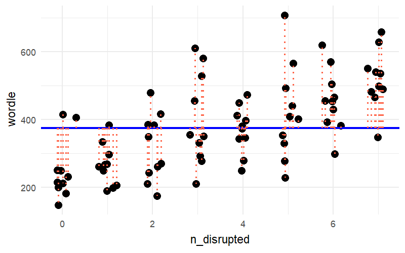

```{r}
#| label: setup
#| echo: false
library(tidyverse)
library(gganimate)
library(patchwork)
source("_theme/helpers.R")
```


# Course Overview {.smaller}
:::: {.columns}

::: {.column width="50%"}

```{r}
#| echo: false
#| warning: false
#| results: asis

block1_name = "block  1 name"
block1_lecs = c("week 1 topic",
                "week 2 topic",
                "week 3 topic",
                "week 4 topic",
                "week 5 topic")
block2_name = "block 2 name"
block2_lecs = c("week 7 topic",
                "week 8 topic",
                "week 9 topic",
                "week 10 topic",
                "week 11 topic")

source("../../../../uoepsy_other/junk/R/course_table.R")

course_table(block1_name,block2_name,block1_lecs,block2_lecs,week=11)
```

:::

::: {.column width="50%"}

```{r}
#| echo: false
#| warning: false
#| results: asis

block3_name = "block 3 name"
block3_lecs = c("week 1 topic",
                "week 2 topic",
                "week 3 topic",
                "week 4 topic",
                "week 5 topic")
block4_name = "block 4 name"
block4_lecs = c("week 7 topic",
                "week 8 topic",
                "week 9 topic",
                "week 10 topic",
                "week 11 topic")

source("../../../../uoepsy_other/junk/R/course_table.R")

course_table(block3_name,block4_name,block3_lecs,block4_lecs,week=7)
```

:::

::::

## This week

1. Where my p-values at? (tests & CIs for the intercept and slope)
3. The other bits.. 

# Where did we get to last week?

## the linear model {.smaller}

::::{.columns}
:::{.column width="50%"}
$$
\begin{align}
\color{red}{\text{outcome}} &= \color{blue}{\text{model}} &+& \quad \quad \color{black}{\text{error}} \\
\quad \\
\quad \\
\quad \\
\color{red}{y} &= \color{blue}{\underset{\underset{\text{intercept}}{\uparrow}}{b_0} + \underset{\underset{\text{slope}}{\uparrow}}{b_1} \cdot x} & + & \quad \quad \color{black}{\epsilon}
\end{align}
$$
:::
:::{.column width="50%" .fragment fragment-index=1}
```{r}
#| include: false
somedata <- tibble(
  x = round(runif(10,4,20)),
  y = round(rnorm(10,40+1*x,4))
)
# egfit <- lm(y~x,somedata)
# egsegs <- tibble(x1 = 0:6, x2 = x1+1) |> 
#   mutate(
#     y1 = map_dbl(x1,~(c(1,.)%*%coef(egfit))[1]),
#     y2 = map_dbl(x2,~(c(1,.)%*%coef(egfit))[1]),
#     xlp = (x1+x2)/2,
#     ylp = (y1+y2)/2
#   )
# 
# ggplot(somedata,aes(x=x,y=y))+
#   geom_point(alpha=.1,size=3)+
#   stat_smooth(method=lm,se=FALSE,color="#0000FF",lwd=1) +
#   geom_point(x=0,y=coef(egfit)[1],col="#0000FF",size=5)+
#   geom_segment(data = egsegs, aes(x=x1,xend=x2,y=y1,yend=y1),
#                lty="dashed",col="#0000FF")+
#   geom_segment(data = egsegs, aes(x=x2,xend=x2,y=y1,yend=y2),
#                lty="dashed",col="#0000FF") 
```
```{r}
#| echo: true
#| eval: false
my_model <- lm(y ~ 1 + x, data = somedata)

my_model
```
```
Call:
lm(formula = y ~ 1 + x, data = somedata)

Coefficients:
(Intercept)            x  
     ....           ....  
```
:::
::::


## using models {.smaller}

```{r}
#| echo: false
set.seed(65683728)
sleepwordle <- tibble(
  n_disrupted = rep(0:7,e=10),
  time = rgamma(80,(n_disrupted+1)/2,1)*60,
  guesses = rbinom(80, 5, plogis(.6+.5*scale(n_disrupted)))+1,
  wordle = time + (60*guesses)
) |> slice_sample(prop=1)
```


What quantity will answer my question?  

> **RQ:** How does an additional night of interrupted sleep affect cognitive skills?

- expected change in wordle score as the night of disrupted sleep increases by 1.  


::::{.columns}
:::{.column width="50%"}
```{r}
head(sleepwordle)

sleep_mdl <- lm(wordle ~ 1 + n_disrupted, data = sleepwordle)

sleep_mdl
```
:::
:::{.column width="50%"}

```{r}
#| echo: false
fitw = lm(wordle~n_disrupted,sleepwordle)

segsw <- tibble(x1 = 0:6, x2 = x1+1) |> 
  mutate(
    y1 = map_dbl(x1,~(c(1,.)%*%coef(fitw))[1]),
    y2 = map_dbl(x2,~(c(1,.)%*%coef(fitw))[1]),
    xlp = (x1+x2)/2,
    ylp = (y1+y2)/2
  )
sleepwordle |> 
  ggplot(aes(x=n_disrupted,y=wordle))+
  geom_point(size=3,col="tomato1",alpha=.5)+
  stat_smooth(method=lm,se=FALSE,color="#0000FF",lwd=1) +
  geom_point(x=0,y=coef(fitw)[1],col="#0000FF",size=5)+
  geom_segment(data = segsw, aes(x=x1,xend=x2,y=y1,yend=y1),
               lty="dashed",col="#0000FF")+
  geom_segment(data = segsw, aes(x=x2,xend=x2,y=y1,yend=y2),
               lty="dashed",col="#0000FF") 
```

:::
::::


:::{.aside}
We're basing these predictions on groups of _different_ people. i.e., to answer our question we're comparing: 
  person_A with 4 nights sleep dep 
  vs 
  personB with 5 nights sleep dep

this only targets our quantity _if_ we can think of persons A and B as exchangeable!  
the random allocation of people to number of nights disrupted gives us this!  
:::


# Where my p-values at?

## summary()

```{r}
summary(sleep_mdl)
```


## coefficients

```{r}
#| eval: false
summary(sleep_mdl)
```
```{r}
#| echo: false
.pp(summary(sleep_mdl),l = list(0,c(9:12),0))
```

the intercept and slope (b0, b1) in $y = b_0 + b_1 \cdot x$

put another way, as we've seen:

- intercept = predicted Y when X=0
- slope of x =  is predicted Y when X goes from x to x+1

## what are the hypotheses being tested?  

**The intercept:**  
$$H_0: b_0 = 0 \quad\quad\quad\quad H_1: b_0 \neq 0$$   

Often not that interesting.  
Why would we ever believe $H_0$ in first place?  

## what are the hypotheses being tested?  

**The slope:**  

$$H_0: b_1 = 0 \quad\quad\quad\quad H_1: b_1 \neq 0$$   
$b_1$ corresponds to the quantity we're interested in!  

## under the null hypothesis

::::{.columns}
:::{.column width="50%"}

- Pretend universe where $b_1 = 0$ for the *population*.  
  
- What would lines from samples of 80 people look like in that universe?  

:::{.fragment fragment-index=1}
- What did we actually see?  
:::

:::
:::{.column width="50%"}

:::{.r-stack}
```{r}
#| echo: false
sims = MASS::mvrnorm(n=1000,mu=c(coef(sleep_mdl)[1],0),
                     Sigma = vcov(sleep_mdl)) |>
  as.data.frame() |>
  rename(int = `(Intercept)`,slp = V2)

ggplot(sleepwordle, aes(x = n_disrupted,y=wordle))+
  geom_point(alpha=0)+
  geom_abline(data = sims, aes(intercept = int, slope = slp), alpha=.05)+
  ylim(150,700)
```
:::{.fragment fragment-index=1}
```{r}
#| echo: false
sims = MASS::mvrnorm(n=1000,mu=c(coef(sleep_mdl)[1],0),
                     Sigma = vcov(sleep_mdl)) |>
  as.data.frame() |>
  rename(int = `(Intercept)`,slp = V2)

ggplot(sleepwordle, aes(x = n_disrupted,y=wordle))+
  geom_point(alpha=0)+
  geom_abline(data = sims, aes(intercept = int, slope = slp), alpha=.05)+
  geom_abline(intercept=coef(sleep_mdl)[1],slope=coef(sleep_mdl)[2],
              col="blue",lwd=1)+
  ylim(150,700)
```
:::
:::

:::
::::


## A confidence interval

Using that same estimated uncertainty:  

```{r}
#| code-fold: true
#| eval: false
ggplot(sleepwordle, aes(x = n_disrupted,y=wordle))+
  geom_smooth(method = lm)+
  ylim(150,700)
```

:::{.r-stack}

```{r}
#| echo: false
sims = MASS::mvrnorm(n=1000,mu=coef(sleep_mdl),
                     Sigma = vcov(sleep_mdl)) |>
  as.data.frame() |>
  rename(int = `(Intercept)`,slp = n_disrupted)

ggplot(sleepwordle, aes(x = n_disrupted,y=wordle))+
  geom_point(alpha=0)+
  geom_abline(data = sims, aes(intercept = int, slope = slp), alpha=.05)+
  geom_abline(intercept=coef(sleep_mdl)[1],slope=coef(sleep_mdl)[2],
              col="blue",lwd=1)+
  ylim(100,800)
```

:::{.fragment fragment-index=1}
```{r}
#| echo: false
ggplot(sleepwordle, aes(x = n_disrupted,y=wordle))+
  geom_smooth(method = lm)+
  geom_abline(intercept=coef(sleep_mdl)[1],
              slope=coef(sleep_mdl)[2],
              col="blue",lwd=1)+
  ylim(100,800)
```
:::
:::

## write up

TODO example

# the other bits

## ...

```{r}
summary(sleep_mdl)
```

- Instead of individual parameters, consider the model as a whole.  

- Does it explain why the outcome is higher/lower? How much does it explain?  

## All the variance in the outcome

```{r}
#| echo: false
p1 <- sleepwordle |>
  mutate(
         my = mean(wordle),
         f1 = mean(wordle),
         f2 = predict(sleep_mdl),
         xjit = rnorm(n(),n_disrupted,.05)) |>
  pivot_longer(f1:f2,names_to="frame",values_to="pred") |>
  filter(frame=="f1") |>
  ggplot(aes(x=xjit,y=wordle))+
  geom_point(size=3)+
  geom_hline(yintercept = mean(sleepwordle$wordle),
             col="blue",lwd=1,alpha=1,lty="dashed")+
  # geom_abline(intercept=coef(sleep_mdl)[1],
  #             slope=coef(sleep_mdl)[2],
  #             col="blue",lwd=1)+
  geom_segment(aes(x=xjit,xend=xjit,
                   y=pred,yend=my),
               col="black",lty="dotted",lwd=.75)+
  geom_segment(aes(x=xjit,xend=xjit,
                   y=pred,yend=wordle),
               col="tomato1",lty="dotted",lwd=.75)+
  labs(x="n_disrupted")+
  theme_minimal()

p1
```

## aside: the mean is a model! 

::::{.columns}
:::{.column width="50%"}
The simplest possible model: 

- the "intercept-only" model
    - "y is predicted by a single number"  
  
```{r}
sleep_mdl0 <- lm(wordle ~ 1, data = sleepwordle)

sleep_mdl0
```
:::
:::{.column width="50%" .fragment}
```{r}
sleepwordle |>
  summarise(
    meanwordle = mean(wordle)
  )
```
:::

::::


## explaining variance in the outcome

```{r}
#| include: false
#| eval: false
p_anim <-
  sleepwordle |>
  mutate(
         my = mean(wordle),
         f1 = mean(wordle),
         f2 = predict(sleep_mdl),
         xjit = rnorm(n(),n_disrupted,.1)) |>
  pivot_longer(f1:f2,names_to="frame",values_to="pred") |>
  mutate(int = ifelse(frame=="f1",my,coef(sleep_mdl)[1]),
         slp = ifelse(frame=="f1",0,coef(sleep_mdl)[2])) |>
  #filter(frame=="f2") |>
  ggplot(aes(x=xjit,y=wordle))+
  geom_point(size=3)+
  geom_hline(yintercept = mean(sleepwordle$wordle),
             col="blue",lwd=1,alpha=1,lty="dashed")+
  geom_abline(aes(intercept=int,slope=slp),
              col="blue",lwd=1)+
  geom_segment(aes(x=xjit,xend=xjit,
                   y=pred,yend=my),
               col="black",lty="dotted",lwd=.75)+
  geom_segment(aes(x=xjit,xend=xjit,
                   y=pred,yend=wordle),
               col="tomato1",lty="dotted",lwd=.75)+
  theme_minimal() +
  labs(x="n_disrupted") + 
  transition_states(frame, transition_length = 2, state_length = 1)

animp <- animate(p_anim, nframes = 180,
        fps = 15, end_pause = 45, res=150,
        width = 800, height = 500, 
        renderer = gifski_renderer())

anim_save("jk_sandbox/ssmodel.gif",animp)
```

:::{.r-stack}

```{r}
p1
```

:::{.fragment}

:::
:::

- red is residual/unexplained variance in outcome
- black is model explained variance in outcome

## $R^2$

$$\frac{\text{explained}}{\text{explained} + \text{unexplained}}$$

$R^2$ is the "proportion of variance in Y accounted for by X"  

```{r}
#| eval: false
summary(sleep_mdl)
```

```{r}
#| echo: false
.pp(summary(sleep_mdl), l = list(0,c(16:19)))
```

## 2 things explain stuff, n-2 things leftover
... rabbit hole warning

- We've used two things (an intercept and a slope across X) to explain some of the variance in Y

- The unexplained variance in Y is created by $n-2$ things.  

- why $n-2$?  
- i can place $n-2$ of the datapoints *absolutely anywhere*, and still get the same line by fixing the last 2 datapoints. 
- think "give me 5 numbers that add up to 100". Once you've chosen the first 4, the last one is fixed!  
- this is referred to as "degrees of freedom"  

## The F bit

does the addition of the predictor to the model explain more variance than would expect by chance?  

adding the predictor = adding 1 slope, and explaining some variance

$\frac{\text{explained variance}/1}{\text{unexplained variance}/n-2}$

## it's all the same! 

```{r}
#| echo: false
.pp(summary(sleep_mdl), l = list(0,c(9:12),0,c(18:19)))
```

as the slope changes, it explains variance... 

even p-value is identical

## so what's the point

In DAPR1, there isn't really one!  

we have just one predictor, meaning that "the model as a whole" is really just that single slope!  

looking ahead (DAPR2):

outcome ~ predictor1 + predictor2

it might on occasion be useful to ask if \{set of predictors\} explains stuff in Y

## Quick quiz..

what is R2 for lm(y~1)? 


## Block 4 skills involved in this week's lecture and/or workshop

- **A8** I can appropriately interpret the parameters of a simple linear model.
- **I8** I can identify the null hypothesis being tested for the parameters of a linear model.
- **C3** I can describe in writing the results of a given simple linear model.


<!-- - **A7** I can use a fitted simple linear model to predict an outcome value for a given predictor value -->
<!-- - **A8** I can appropriately interpret the parameters of a simple linear model. -->
<!-- - **A9** I can explain how both a t-test and a correlation can be expressed as a linear model. -->
<!-- - **A10** I can represent binary predictors using treatment coding. -->
<!-- - **C3** I can describe in writing the results of a given simple linear model. -->
<!-- - **I8** I can identify the null hypothesis being tested for the parameters of a linear model. -->
<!-- - **V5** I can visually estimate the parameters of a line from a plot. -->


