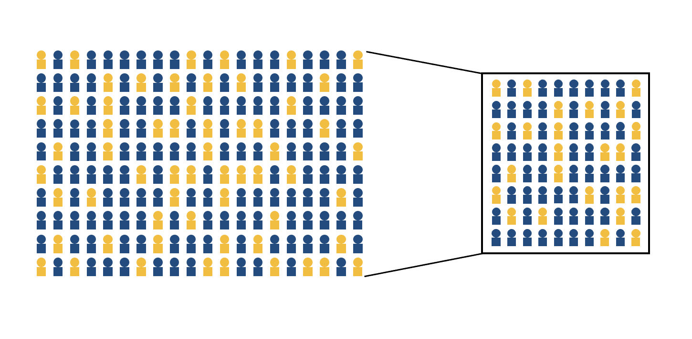

```{r setup, include=FALSE}
options(htmltools.dir.version = FALSE)
```

```{r xaringan-themer, include = FALSE}
library(xaringanthemer)
style_mono_accent(
    base_color = "#0F4C81", # DAPR1
  # base_color = "#BF1932", # DAPR2
  # base_color = "#88B04B", # DAPR3 
  # base_color = "#FCBB06", # USMR
  # base_color = "#a41ae4", # MSMR
  header_color = "#000000",
  header_font_google = google_font("Source Sans Pro"),
  header_font_weight = 400,
  text_font_google = google_font("Source Sans Pro", "400", "400i", "600", "600i"),
  code_font_google = google_font("Source Code Pro")
)
```

```{r premable, echo=FALSE, warning=FALSE, message=FALSE}
library(tidyverse)
library(infer)
library(kableExtra)
knitr::opts_chunk$set(dev = 'svg')

baseColor <- "#0F4C81"
```

# Course Overview

.pull-left[

```{r echo = FALSE, results='asis'}
block1_name = "Exploratory Data Analysis"
block1_lecs = c("Research design and data",
                "Describing categorical data",
                "Describing continuous data",
                "Describing relationships",
                "Functions")
block2_name = "Probability"
block2_lecs = c("Probability theory",
                "Probability rules",
                "Random variables (discrete)",
                "Random variables (continuous)",
                "Sampling")

source("https://raw.githubusercontent.com/uoepsy/junk/main/R/course_table.R")
course_table(block1_name,block2_name,block1_lecs,block2_lecs,week=10)
```


]

.pull-right[


```{r echo = FALSE, results='asis'}
block3_name = "Foundations of inference"
block3_lecs = c("Confidence intervals",
                "Hypothesis testing (p-values)",
                "Hypothesis testing (critical values)",
                "Hypothesis testing and confidence intervals",
                "Errors, power, effect size, assumptions")
block4_name = "Common hypothesis tests"
block4_lecs = c("One sample t-test",
                "Independent samples t-test",
                "Paired samples t-test",
                "Chi-square tests",
                "Correlation")

source("https://raw.githubusercontent.com/uoepsy/junk/main/R/course_table.R")
course_table(block3_name,block4_name,block3_lecs,block4_lecs,week=0)
```

]


---


## This Week's Learning Objectives
1. Understand the difference between a population parameter and a sample statistic
2. Understand the concept and construction of sampling distributions
3. Understand the effect of sample size on the sampling distribution
4. Understand how to quantify the variability of a sample statistic and sampling distribution (standard error)

---
## Concepts to carry forward

+ Data can be of different types

--

+ We can assign probabilities to outcomes of random experiments

--

+ We can define a probability distribution that describes the probability of all possible events

--

+ Dependent on type (continuous vs. discrete), we can visualise and describe the distribution of data differently


---
## Why are these concepts relevant to psych stats?

+ In psychology, we design a study, measure variables, and use these measurements to calculate a value that carries some meaning
    + E.g. the difference in reaction times between groups

--

+ Given it has meaning based on the study design, we want to know something about the value:
    + Is it unusual or not?
    + This is the focus throughout the next semester

--

+ **Today:**
    + We will talk about populations, samples, and sampling
    + Basic concepts of sampling may seem simple and intuitive
    + These concepts will be very useful when we start talking about _statistical inference_, or how we make decisions about data

---
## Populations vs Samples
+ In statistics, we often refer to populations and samples
    + **Population:** The entire group of people about whom you'd like to make inferences
    + **Sample:** The subset of the population from whom you will collect data to make these inferences

--

+ To get the most accurate measure of our variable, it would be ideal to collect data from the entire population; however, this is not feasible

--

+ In almost all cases, researchers need to collect data from samples and use these results to make inferences about the population
  + The population value of the variable of interest is known as a **population parameter**
  + The sample value of the variable of interest is known as a **sample statistic**, or **point-estimate**

---
## Populations vs Samples - Notation

.pull-left[
+ It's important to know that although you may have seen these different types of notation used interchangeably in the past, they are actually slightly different when one is referring to a _population_ versus a _sample_:
]


.pull-right[

|Population | Parameter         | Sample   |
|-----------|-------------------|----------|
| $\mu$     | Mean              | $\bar{x}$|
| $\sigma = \sqrt{\frac{\sum{(x_i-\mu)^2}}{N}}$  | Standard Deviation| $s = \sqrt{\frac{\sum{x_i-\bar{x}}}{n-1}}$   |
| $N$       | Size              | $n$      |

]

---
## Populations vs Samples - Example

+ Suppose I wanted to know the proportion of UG students at the University of Edinburgh who read sci-fi novels

.center[
```{r, echo = F, out.width='50%'}
knitr::include_graphics('figures/PopulationMetric.png')
```
]

> **Test your Understanding:** What is the population in this example?

--

> What is the variable of interest?

--

> What is the parameter?

---
## Populations vs Samples - Example
+ How can we collect this information? 

--

  + We could send out an email requesting all students to tell us if they read sci-fi...but it's not likely that all students will respond

--

  + We could ask instructors to collect this data from students in their classes, but not every student will attend each class, and not every instructor will comply

--

- Even with this relatively small, accessible population, it's unlikely we can collect information from every single member

---
## Populations vs Samples - Example

- Instead, we have to use the data from students who _do_ respond to make inferences about the overall student population 

.center[
```{r, echo = F, out.width='65%'}

```
]


> **Test your Understanding:** What is the sample?

--

> What is the statistic, or the point-estimate?

---
## Parameters, point-estimates, and sampling distributions

.pull-left[
+ It is the population parameter (proportion of UoE students who read sci-fi novels) we are interested in: The *true* value of the world 

+ We can draw a sample, and calculate this proportion in the sample
  + The point-estimate from the sample is our best guess at the population parameter

]

---
count: false

## Parameters, point-estimates, and sampling distributions

.pull-left[
+ It is the population parameter (proportion of UoE students who read sci-fi novels) we are interested in: The *true* value of the world 

+ We can draw a sample, and calculate this proportion in the sample
  + The point-estimate from the sample is our best guess at the population parameter

+ If we draw multiple samples, we can produce a **sampling distribution**, which is a probability distribution of some statistic obtained from repeatedly sampling the population 

]

.pull-right[
.center[
```{r, echo = F}
knitr::include_graphics('figures/Samples.png')
```
]
]

---
## 2021/22 actual proportion

.pull-left[
+ Let's use data from 21/22 to demonstrate this concept

  + These data represent the entire student body from 21/22

+ Using these data, we can:

  1) Simulate gathering multiple samples of UoE students
  
  2) Calculate the proportion students that read sci-fi in each sample
  
  3) Produce a frequency distribution of each sample's results

]

.pull-right[

```{r, echo=FALSE, warning=FALSE, message = FALSE}
#sim data - 8665/9
Edinburgh <- tibble(Scottish = c(rep('Yes', 8665), rep('No', 28755-8665)))

UoE_prop <- Edinburgh %>%
    group_by(Scottish) %>%
    summarise(n=n()) %>%
    mutate(Freq = round(n / sum(n),2))

kable(UoE_prop) %>%
  kable_styling(bootstrap_options = "striped", full_width = F)
```
]


---
## Visualising sampling distributions

.pull-left[
+ Imagine we took a single sample of 10 students

+ This action demonstrates how a statistic from a single small sample may or may not capture the population parameter
]


.pull-right[.center[
```{r, echo=FALSE, warning=FALSE, message=FALSE, fig.height=4}
set.seed(44)
sampDat <- sample(Edinburgh$Scottish, 10)

propDat <- tibble(Prop=as.numeric(table(sampDat) %>% prop.table)[2])

propDat %>%
  ggplot(., aes(x=Prop)) +
  geom_histogram(breaks = seq(0, 1, 0.1), colour='gray', fill=baseColor) +
  scale_x_continuous(breaks = seq(0,1, 0.1), limits = c(0,1)) + 
  scale_y_continuous(limits = c(0, 4), breaks = seq(0, 4, 1)) + 
  labs(x='Proportion', y='Frequency') +
  geom_vline(xintercept = 0.30, col = "red", size = 1) + 
  geom_vline(xintercept = .65, col = '#FCBB06', size = 1) +
  theme(axis.text = element_text(size = 12),
        axis.title = element_text(size = 14, face = 'bold'))

```
]]


---
## Visualising sampling distributions

.pull-left[

+ Imagine that we instead took 10 samples of 10 students each

+ What happens to the difference between the mean sampling statistic and the population parameter?

]


.pull-right[
.center[
```{r, echo=FALSE, warning=FALSE, message=FALSE, fig.height=4}
N <- 10
B <- 10

set.seed(820)

sampProps <- tibble(
    Sample1 = replicate(B, prop.table(table(sample(Edinburgh$Scottish, size = N, replace = TRUE)))[2]),
    Sample2 = replicate(B, prop.table(table(sample(Edinburgh$Scottish, size = N, replace = TRUE)))[2]),
    Sample3 = replicate(B, prop.table(table(sample(Edinburgh$Scottish, size = N, replace = TRUE)))[2])
    )


s10 <- sampProps %>%
  ggplot(., aes(Sample1)) +
  geom_histogram(breaks = seq(0, 1, 0.1), colour='gray', fill=baseColor) +
  labs(x='Proportion', y='Frequency') + 
  scale_x_continuous(limits = c(0, 1), breaks = seq(0, 1, .10)) +
  geom_vline(xintercept = 0.30, color = "red", size = 1) +
  geom_vline(xintercept = mean(sampProps$Sample1), col = '#FCBB06', size = 1) +
  theme(axis.text = element_text(size = 12),
        axis.title = element_text(size = 14, face = 'bold'))

s10
```
]
]

---
## Visualising sampling distributions

+ If we were to repeat this process 2 more times, we can create three sampling distributions, each of which look different.

.center[
```{r, echo=FALSE, warning=FALSE, message=FALSE, fig.height=3.75, fig.width=12}

sampPropsLong <- reshape2::melt(sampProps)

meanDat <- data.frame(variable = c('Sample1', 'Sample2', 'Sample3'), Z = c(mean(sampProps$Sample1, na.rm = T), mean(sampProps$Sample2, na.rm = T), mean(sampProps$Sample3, na.rm = T)))

(sampPropsLong %>%
  ggplot(., aes(value)) +
  geom_histogram(breaks = seq(0, 1, 0.1), colour='gray', fill=baseColor) +
  labs(x='Proportion', y='Frequency') +
  scale_x_continuous(limits = c(0, 1), breaks = seq(0, 1, .10)) +
  geom_vline(xintercept = 0.30, color = "red", size = 1) +
  facet_wrap(~variable) +
  geom_vline(data = meanDat, aes(xintercept = Z), color = '#FCBB06', size = 1) +
  theme(axis.text = element_text(size = 12),
        axis.title = element_text(size = 14, face = 'bold')))

```
]

--

+ Each sampling distribution is characterising the _sampling variability_ in our estimate of the parameter of interest

--

+ **Do samples with values close to the population value tend to be more or less likely?**


---
## Taking more samples
- So far we have taken 10 samples... what if we took more? 
- Let's imagine we sampled 10 students 100 times

--

.pull-left[
.center[**10 Samples of 10 Students**]
```{r, echo = F, fig.height = 4.75}
s10
```

]
.pull-right[
.center[**1000 Samples of 10 Students**]
```{r, echo=FALSE, warning=FALSE, message=FALSE, fig.height = 4.75}
 B <- 1000

set.seed(1022)
samp1000 <- tibble(Sample1=replicate(B, prop.table(table(sample(Edinburgh$Scottish, size = N, replace = TRUE)))[2]))

(s1000 <- samp1000 %>%
  ggplot(., aes(Sample1)) +
  geom_histogram(breaks = seq(0, 1, 0.1), colour='gray', fill=baseColor) +
  labs(x='Proportion Permanent Scottish Residents', y='Frequency') + 
  scale_x_continuous(limits = c(0, 1), breaks = seq(0, 1, .10)) +
  geom_vline(xintercept = 0.30, color = "red", size = 1) +
  geom_vline(xintercept = mean(samp1000$Sample1, na.rm = T), col = '#FCBB06', size = 1) +
  theme(axis.text = element_text(size = 12),
        axis.title = element_text(size = 14, face = 'bold')))
 
sampProps <- tibble(
    Sample1 = replicate(B, prop.table(table(sample(Edinburgh$Scottish, size = N, replace = TRUE)))[2]),
    Sample2 = replicate(B, prop.table(table(sample(Edinburgh$Scottish, size = N, replace = TRUE)))[2]),
    Sample3 = replicate(B, prop.table(table(sample(Edinburgh$Scottish, size = N, replace = TRUE)))[2])
    )

sampPropsLong <- reshape2::melt(sampProps)

meanDat <- data.frame(variable = c('Sample1', 'Sample2', 'Sample3'), Z = c(mean(sampProps$Sample1, na.rm = T), mean(sampProps$Sample2, na.rm = T), mean(sampProps$Sample3, na.rm = T)))

# y <- sampPropsLong %>%
#   ggplot(., aes(value)) +
#   geom_histogram(breaks = seq(0, 1, 0.1), colour='gray', fill=baseColor) +
#   labs(x='Proportion', y='Frequency') + xlim(0, .75) +
#   geom_vline(xintercept = 0.30, color = "red", size = 1) +
#   facet_wrap(~variable) +
#   geom_vline(data = meanDat, aes(xintercept = Z), color = '#FCBB06', size = 1)
# 
# y
# 
# s100 <- sampProps %>%
#   ggplot(., aes(Sample1)) + 
#   geom_histogram(breaks = seq(0, 1, 0.1), colour='gray', fill=baseColor) +
#   labs(x='Proportion', y='Frequency') + xlim(0, .75) +
#   geom_vline(xintercept = 0.30, color = "red", size = 1) +
#   geom_vline(xintercept = mean(sampProps$Sample1), color = '#FCBB06', size = 1)
  
```
]

--

- **What differences do you notice between these two sampling distributions?**
    
---
## Bigger samples

- We've been taking samples of 10 students. Let's see what happens when we increase our sample size to $n = 50$, and then $n = 100$. 

.center[
```{r, echo=FALSE, warning=FALSE, message=FALSE, fig.height=3.75, fig.width=7}

N <- 50
sampProps$Sample2 <- replicate(B, prop.table(table(sample(Edinburgh$Scottish, size = N, replace = TRUE)))[2])

N <- 100
sampProps$Sample3 <- replicate(B, prop.table(table(sample(Edinburgh$Scottish, size = N, replace = TRUE)))[2])

sampPropsLong <- reshape2::melt(sampProps)

meanDat <- data.frame(variable = c('Sample1', 'Sample2', 'Sample3'), Z = c(mean(sampProps$Sample1, na.rm = T), mean(sampProps$Sample2, na.rm = T), mean(sampProps$Sample3, na.rm = T)))

group_names <- list(
  'Sample1'="1000 Samples of 10",
  'Sample2'="1000 Samples of 50",
  'Sample3'="1000 Samples of 100"
)

sample_labeller <- function(variable,value){
  return(group_names[value])
}


z <- sampPropsLong %>%
  ggplot(., aes(value)) +
  geom_histogram(breaks = seq(0, 1, 0.1), colour='gray', fill=baseColor) +
  labs(x='Proportion of Permanent Scottish Residents', y='Frequency') + xlim(0, .75) +
  geom_vline(xintercept = 0.30, color = "red", size = 1) +
  geom_vline(data = meanDat, aes(xintercept = Z), color = '#FCBB06', size = 1) +
  theme(axis.text = element_text(size = 12),
        axis.title = element_text(size = 14, face = 'bold'),
        strip.text = element_text(face = 'bold'))

z
```
]

--

+ **What changes as we increase sample size?**

---
## Properties of sampling distributions
+ Sampling distributions are characterising the variability in sample estimates
    - Variability can be thought of as the spread in data/plots

--

+ So as we increase $n$, we get less variable samples (the distribution of sample statistics is more tightly clustered around the population parameter

  + Harder to get an unrepresentative sample as your $n$ increases

--

+ Let's put this phenomenon in the language of probability: 

  + As sample $n$ increases, the probability of observing a point-estimate that is a long way from the population parameter (here 0.30) decreases (becomes less probable)

--

+ So when we have large samples, the point-estimates from those samples are likely to be closer to the population value

---
## Standard error
- We can formally calculate the variability of a sampling distribution, or the **standard error**

$$SE=\frac{\sigma}{\sqrt{n}}$$

--

- This is essentially calculating the standard deviation of the sampling distribution, with a key difference:
      - The standard deviation describes the variability _within_ one sample
      - The standard error describes variability _across_ multiple samples
      
--

+ With continuous data, the standard error gives you a sense of how different $\bar{x}$ is likely to be from $\mu$

--

+ In this example, we're working with binomial data (Scottish Residency = Yes or No), so the standard error indicates how greatly a particular sample proportion is likely to differ from the proportion in the population

---
## Properties of sampling distributions

.pull-left[
- Mean of the sampling distribution is close to $\mu$, even with a small number of samples

- As the number of samples increases:

  + The sampling distribution approaches a normal distribution
  + Sample $\bar{x}$'s pile up around $\mu$
    
]

.pull-right[

```{r, echo = F, fig.width = 5, fig.height=2.5, message=F, warning=F}
s10
```

```{r, echo = F, fig.width = 5, fig.height=2.5, message=F, warning=F}
s1000
```
]

---
count: false

## Properties of sampling distributions

.pull-left[
- Mean of the sampling distribution is close to $\mu$, even with a small number of samples

- As the number of samples increases:

  + The sampling distribution approaches a normal distribution
  + Sample $\bar{x}$s pile up around $\mu$
    
- As $n$ per sample increases, the SE of the sampling distribution decreases (becomes narrower)
    - With large $n$, all our point-estimates are closer to the population parameter
]

.pull-right[

```{r, echo = F, fig.width=5, fig.height=4, message=F, warning=F}
z
```

]

---
## Two Related Concepts

+ These properties illustrate two important concepts:

+ **The Law of Large Numbers:** As $n$ increases, $\bar{x}$ approaches $\mu$

--

+ **Central Limit Theorem:** When estimates of $\bar{x}$ are based on increasingly large samples ( $n$ ), the sampling distribution of $\bar{x}$ becomes more normal (symmetric), and narrower (quantified by the standard error)

--

+ These concepts hold regardless of the underlying shape of the distribution

+ To demonstrate this, let's explore some different distributions
    
---
## Uniform distribution

.pull-left[
- Continuous probability distribution 

- There is an equal probability for all values within a given range
]

.pull-right[
```{r, echo=FALSE, fig.width=5, fig.height=5, warning=F, message=F}
unif <- tibble(
  x = runif(10000, 0, 5))

uni_pop <- ggplot(unif, aes(x=x)) +
  geom_histogram(color = "white", fill = baseColor) +
    theme(axis.title.y=element_blank(),
        axis.text.y=element_blank(),
        axis.ticks.y=element_blank()) +
  ggtitle("Population")

uni_pop
```
]


---
## Uniform distribution

```{r, echo=FALSE, warning=FALSE, message=FALSE}
uni1 <- unif %>%
  rep_sample_n(size = 10, replace = TRUE, reps = 1000) %>%
  group_by(replicate) %>%
  summarise(x = mean(x)) %>%
  ggplot(., aes(x = x)) + 
  xlim(0,5) +
  geom_histogram(color = "white", fill = baseColor) + 
  labs(x = "\n Mean of X") +
  ggtitle("N = 10") +
      theme(axis.title.y=element_blank(),
        axis.text.y=element_blank(),
        axis.ticks.y=element_blank())

uni2 <- unif %>%
  rep_sample_n(size = 50, replace = TRUE, reps = 1000) %>%
  group_by(replicate) %>%
  summarise(x = mean(x)) %>%
  ggplot(., aes(x = x)) + 
  xlim(0,5) +
  geom_histogram(color = "white", fill = baseColor) + 
  labs(x = "\n Mean of X") +
  ggtitle("N = 50") +
      theme(axis.title.y=element_blank(),
        axis.text.y=element_blank(),
        axis.ticks.y=element_blank())

uni3 <- unif %>%
  rep_sample_n(size = 100, replace = TRUE, reps = 1000) %>%
  group_by(replicate) %>%
  summarise(x = mean(x)) %>%
  ggplot(., aes(x = x)) + 
  xlim(0,5) +
  geom_histogram(color = "white", fill = baseColor) + 
  labs(x = "\n Mean of X") +
  ggtitle("N = 100") +
      theme(axis.title.y=element_blank(),
        axis.text.y=element_blank(),
        axis.ticks.y=element_blank())
```
.pull-left[
.center[
```{r, echo=FALSE, warning=FALSE, message=FALSE, fig.width=5, fig.height=2.5}
uni_pop
uni2
```
]]

.pull-right[
.center[
```{r, echo=FALSE, warning=FALSE, message=FALSE, fig.width=5, fig.height=2.5}
uni1
uni3
```
]]

---
## $\chi$ -square distribution

.pull-left[
+ Continuous probability distribution

+ Non-symmetric
]

.pull-right[
```{r, echo=FALSE, fig.height=5}
ggplot(data.frame(x = c(0,20)), aes(x = x)) +
  stat_function(fun=dchisq,
                geom = "line",
                args = list(df=3)) +
    stat_function(fun=dchisq,
                geom = "line",
                col = "red",
                args = list(df=5)) +
      stat_function(fun=dchisq,
                geom = "line",
                col = "blue",
                args = list(df=10)) +
  xlab("\n X") +
  ylab("Probability \n") +
  ggtitle("Chi-square distributions with 3 (black), 5 (red) & 10 (blue) df")
```
]


---
## $\chi$ -square distribution
```{r, echo=FALSE, warning=FALSE, message=FALSE}
chi <- tibble(
  x = rchisq(10000, 3))

chi_pop <- ggplot(chi, aes(x=x)) +
  geom_histogram(color = "white", fill = baseColor) +
  ggtitle("Population") +
      theme(axis.title.y=element_blank(),
        axis.text.y=element_blank(),
        axis.ticks.y=element_blank())

chi1 <- chi %>%
  rep_sample_n(size = 10, replace = TRUE, reps = 1000) %>%
  group_by(replicate) %>%
  summarise(x = mean(x)) %>%
  ggplot(., aes(x = x)) + 
  xlim(0,15) +
  geom_histogram(color = "white", fill = baseColor) + 
  labs(x = "\n Mean of X") +
  ggtitle("N = 10") +
      theme(axis.title.y=element_blank(),
        axis.text.y=element_blank(),
        axis.ticks.y=element_blank())

chi2 <- chi %>%
  rep_sample_n(size = 50, replace = TRUE, reps = 1000) %>%
  group_by(replicate) %>%
  summarise(x = mean(x)) %>%
  ggplot(., aes(x = x)) + 
  xlim(0,15) +
  geom_histogram(color = "white", fill = baseColor) + 
  labs(x = "\n Mean of X") +
  ggtitle("N = 50") +
      theme(axis.title.y=element_blank(),
        axis.text.y=element_blank(),
        axis.ticks.y=element_blank())

chi3 <- chi %>%
  rep_sample_n(size = 100, replace = TRUE, reps = 1000) %>%
  group_by(replicate) %>%
  summarise(x = mean(x)) %>%
  ggplot(., aes(x = x)) + 
  xlim(0,15) +
  geom_histogram(color = "white", fill = baseColor) + 
  labs(x = "\n Mean of X") +
  ggtitle("N = 100") +
      theme(axis.title.y=element_blank(),
        axis.text.y=element_blank(),
        axis.ticks.y=element_blank())
```
.pull-left[
```{r, echo=FALSE, warning=FALSE, message=FALSE, fig.width=5, fig.height=2.5}
chi_pop
uni2
```
]

.pull-right[
```{r, echo=FALSE, warning=FALSE, message=FALSE, fig.width=5, fig.height=2.5}
chi1
chi3
```
]

---
## $t$ -distribution

.pull-left[
+ Continuous probability distribution

+ Symmetric and uni-modal (similar to the normal distribution)

  + "Heavier/fatter tails" = greater chance of observing a value further from the mean
]

.pull-right[
```{r, echo=FALSE, fig.height=5}
ggplot(data.frame(x=c(-3,3)), aes(x = x)) +
  stat_function(fun=dt,
                geom = "line",
                args = list(df=1)) +
    stat_function(fun=dt,
                geom = "line",
                col = "red",
                args = list(df=5)) +
      stat_function(fun=dt,
                geom = "line",
                col = "blue",
                args = list(df=25)) +
  xlab("\n X") +
  ylab("Probability \n") +
  ggtitle("t-distributions with 1 (black), 5 (red) & 25 (blue) df")
```
]

---
## $t$ -distribution
```{r, echo=FALSE, warning=FALSE, message=FALSE}
t_df <- tibble(
  x = rt(10000, 5))

t_pop <- ggplot(t_df, aes(x=x)) +
  geom_histogram(color = "white", fill = baseColor) +
  ggtitle("Population") +
  xlim(-5,5) +
      theme(axis.title.y=element_blank(),
        axis.text.y=element_blank(),
        axis.ticks.y=element_blank())

t1 <- t_df %>%
  rep_sample_n(size = 10, replace = TRUE, reps = 1000) %>%
  group_by(replicate) %>%
  summarise(x = mean(x)) %>%
  ggplot(., aes(x = x)) + 
  xlim(-5,5) +
  geom_histogram(color = "white", fill = baseColor) + 
  labs(x = "\n Mean of X") +
  ggtitle("N = 10") +
      theme(axis.title.y=element_blank(),
        axis.text.y=element_blank(),
        axis.ticks.y=element_blank())

t2 <- t_df %>%
  rep_sample_n(size = 50, replace = TRUE, reps = 1000) %>%
  group_by(replicate) %>%
  summarise(x = mean(x)) %>%
  ggplot(., aes(x = x)) + 
  xlim(-5,5) +
  geom_histogram(color = "white", fill = baseColor) + 
  labs(x = "\n Mean of X") +
  ggtitle("N = 50") +
      theme(axis.title.y=element_blank(),
        axis.text.y=element_blank(),
        axis.ticks.y=element_blank())

t3 <- t_df %>%
  rep_sample_n(size = 100, replace = TRUE, reps = 1000) %>%
  group_by(replicate) %>%
  summarise(x = mean(x)) %>%
  ggplot(., aes(x = x)) + 
  xlim(-5,5) +
  geom_histogram(color = "white", fill = baseColor) + 
  labs(x = "\n Mean of X") +
  ggtitle("N = 100") +
      theme(axis.title.y=element_blank(),
        axis.text.y=element_blank(),
        axis.ticks.y=element_blank())
```

.pull-left[
```{r, echo=FALSE, warning=FALSE, message=FALSE, fig.width=5, fig.height=2.5}
t_pop
t2
```
]

.pull-right[
```{r, echo=FALSE, warning=FALSE, message=FALSE, fig.width=5, fig.height=2.5}
t1
t3
```
]

---
## Central Limit Theorem

+ These examples all demonstrate the Central Limit Theorem
+ When $n$ is large enough, $\bar{x}$'s approximate a normal distribution around $\mu$, regardless of the underlying population distribution

.center[
```{r, echo=FALSE, warning=FALSE, message=FALSE, fig.width=3, fig.height=2}
uni_pop
chi_pop
t_pop
```
]

.center[
```{r, echo=FALSE, warning=FALSE, message=FALSE, fig.width=3, fig.height=2}
uni2
chi2
t2
```
]

---
## Features of samples
- Is our sample...
    - Biased?
    - Representative?
    - Random?

--

- If a sample of $n$ is drawn at random, it is likely to be unbiased and representative of $N$

- Our point estimates from such samples will be good guesses at the population parameter

---
## Summary of today
- Samples are used to estimate the population
- Samples provide point estimates of population parameters
- Properties of samples and sampling distributions
- Properties of good samples

---
# This week

<script src="https://cdn.jsdelivr.net/npm/iconify-icon@2.1.0/dist/iconify-icon.min.js"></script>

.pull-left[
<iconify-icon icon="clarity:tasks-solid" width="64" height="64"  style="color: #0F4C81"></iconify-icon>

## Tasks

- Attend both lectures

- Attend your lab and work together on the lab tasks

- Complete the weekly quiz
    + Opened Monday at 9am
    + Closes Sunday at 5pm
    
- Submit Formative Report B by 12 noon on Friday the 29th of November 2024
<!-- - Submit Formative Report C by 12 noon on Friday the 14th of February 2025 -->
<!-- - Submit the Assessed Report by 12 noon on Friday the 28th of March 2025 -->
]


.pull-right[
<iconify-icon icon="raphael:help" width="64" height="64"  style="color: #0F4C81"></iconify-icon>

## Support

- **Office hours**: for one-to-one support on course materials or assessments<br>(see LEARN > Course information > Course contacts)
  + Note: No office hours between 2 Dec and 10 Jan

- **Piazza**: help each other on this peer-to-peer discussion forum

- **Student Adviser**: for general support while you are at university<br>(find your student adviser on MyEd/Euclid)
]

