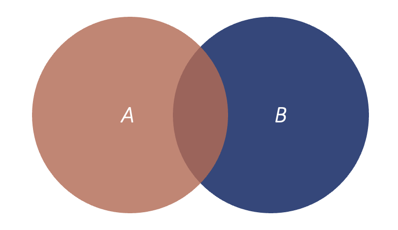

```{r setup, include=FALSE}
options(htmltools.dir.version = FALSE)
```

```{r xaringan-themer, include = FALSE}
library(xaringanthemer)
style_mono_accent(
    base_color = "#0F4C81", # DAPR1
  # base_color = "#BF1932", # DAPR2
  # base_color = "#88B04B", # DAPR3 
  # base_color = "#FCBB06", # USMR
  # base_color = "#a41ae4", # MSMR
  header_color = "#000000",
  header_font_google = google_font("Source Sans Pro"),
  header_font_weight = 400,
  text_font_google = google_font("Source Sans Pro", "400", "400i", "600", "600i"),
  code_font_google = google_font("Source Code Pro")
)
```

```{r premable, echo=FALSE, warning=FALSE, message=FALSE}
library(tidyverse)
library(kableExtra)
library(reshape2)
library(car)
knitr::opts_chunk$set(dev = 'svg')

baseColour <- "#0F4C81"
```

```{css, echo=FALSE}
.link-style1 a {
  color: blue;
  text-decoration: underline;
}
```

# Course Overview

.pull-left[

```{r echo = FALSE, results='asis'}
block1_name = "Exploratory Data Analysis"
block1_lecs = c("Research design and data",
                "Describing categorical data",
                "Describing continuous data",
                "Describing relationships",
                "Functions")
block2_name = "Probability"
block2_lecs = c("Probability theory",
                "Probability rules",
                "Random variables (discrete)",
                "Random variables (continuous)",
                "Sampling")

source("https://raw.githubusercontent.com/uoepsy/junk/main/R/course_table.R")
course_table(block1_name,block2_name,block1_lecs,block2_lecs,week=6)
```


]

.pull-right[


```{r echo = FALSE, results='asis'}
block3_name = "Foundations of inference"
block3_lecs = c("Confidence intervals",
                "Hypothesis testing (p-values)",
                "Hypothesis testing (critical values)",
                "Hypothesis testing and confidence intervals",
                "Errors, power, effect size, assumptions")
block4_name = "Common hypothesis tests"
block4_lecs = c("One sample t-test",
                "Independent samples t-test",
                "Paired samples t-test",
                "Chi-square tests",
                "Correlation")

source("https://raw.githubusercontent.com/uoepsy/junk/main/R/course_table.R")
course_table(block3_name,block4_name,block3_lecs,block4_lecs,week=0)
```

]


---
## Today
- Introduction to Probability

- Sets & Set Notation

- Random Experiments

---
class: inverse, center, middle

# Part 1: Intro to Probability

---
## Why probability?

+ When conducting psychological research, we often ask a question and gather data in an attempt to identify the true answer, AKA the **ground truth**

+ We want to use our data to build a model of the world

  + **Model:** a formal representation of a system
  + Put another way, a model is an idea about the way the world is
  
--

+ Two types of models you could use:

  + Deterministic
  + Probabilistic/Stochastic


---
## Why probability?

+ Imagine you live exactly 1/2 mile from the building and your walking speed is 3.3 miles per hour. You want to compute how long it takes to get to class. 

+ You can use a deterministic model to calculate this:

--

.pull-left[
+ $\frac{distance}{speed}=time$

+ $\frac{0.5\ miles}{3.3\ mph}=0.15\ hours$

+ $0.15*60=9\ minutes$

+ Using this model, you should always be right on time as long as you leave at 8:51
]

--

.pull-right[
But what if...
+ you text while walking?

+ you stop to chat with someone?

+ You get stuck at an intersection for longer than normal?

+ you are so excited about learning statistics that you walk especially quickly?
]

--

+ Suddenly, your deterministic solution isn't such a great model for the world.

---
## Why probability?

- Deterministic models imply certainty and consistency, but real world data (especially human subjects data!) are complex

  - There are many factors that we can't anticipate or account for in our studies.

- With inferential statistics, we make sense of the world using probabilistic models, which take the element of randomness into account.

- Inferential tests tell you something about the probability of your data and this helps guide your decision about the ground truth.


---
## Why probability?

- Imagine that you timed your walk to class over the course of a month. 

--

- These data indicate that by leaving at 8:51, the likelihood you will arrive on time is only about 45%. 

.center[
```{r, echo = F, fig.height=4}
set.seed(208)
walkDat<- data.frame(Minutes=rnorm(20, mean = 9, sd = .75))

ggplot(walkDat, aes(Minutes)) + geom_histogram(fill=baseColour, colour='lightgray', bins = 25) +
  ylab('Frequency') +
  theme(axis.text = element_text(size=12), axis.title = element_text(size=14, face='bold'))

```
]

---
class: center, middle
# Questions

---
## What is probability?

+ Likelihood of event’s occurrence

--

+ The probability of an event is a number between 0 (impossible) and 1 (absolutely certain)

--

+ There are two ways to conceptualise probability:

  1. Analytic Definition
  2. Relative Frequency
  
---
## Probability: Analytic Definition

+ The probability of an event is equal to the ratio of successful outcomes to all possible outcomes

--

.pull-left.right[
### $P(x) = \frac{a}{a+b}$
]

.pull-right[
$a$ = ways that event $x$ can occur

$b$ = ways that event $x$ can fail to occur
]


--

.pull-left[
**x = Drawing a black card**

$a$ = # of black cards

$b$ = # of red cards

$P(x) = \frac{26}{26+26}$

$P(x) = \frac{1}{2} = 0.50$

]

--

.pull-right[
**x = Drawing a spade**

$a$ = # of spades

$b$ = # of diamonds + hearts + clubs

$P(x) = \frac{13}{13+39}$

$P(x) = \frac{13}{52} = 0.25$

]

---
## Probability: Relative Frequency

.pull-left[
  
+ $P(x)$, or probability of x, is the proportion of times you would observe $x$ if you took an infinite number of samples.
    
  + If I roll a die an infinite number of times, the probability I would roll a 4 would be exactly 1/6.


      
+ **The law of large numbers**

  - Given an event $x$ and a probability $P(x)$, over $n$ trials, the probability that the relative frequency of $x$ will differ from $P(x)$ approaches 0 as $n$ approaches infinity

]

---
count: false

## Probability: Relative Frequency

.pull-left[
  
+ $P(x)$, or probability of x, is the proportion of times you would observe $x$ if you took an infinite number of samples.
    
  + If I roll a die an infinite number of times, the probability I would roll a 4 would be exactly 1/6.


      
+ **The law of large numbers**

  - Given an event $x$ and a probability $P(x)$, over $n$ trials, the probability that the relative frequency of $x$ will differ from $P(x)$ approaches 0 as $n$ approaches infinity

]

.pull-right[
.center[
**x = A flipped coin landing on heads**
]
```{r coinFlipDat, echo = F, fig.height = 3.5, fig.width = 5.5}

trialNum <- c(5, 10, 20, 50, 100, 1000)

set.seed(68)
coinDat <- data.frame(Trials = trialNum,
                      Heads = c(sum(sample(c(0, 1), trialNum[1], replace = T)),
                                sum(sample(c(0, 1), trialNum[2], replace = T)),
                                sum(sample(c(0, 1), trialNum[3], replace = T)),
                                sum(sample(c(0, 1), trialNum[4], replace = T)),
                                sum(sample(c(0, 1), trialNum[5], replace = T)),
                                sum(sample(c(0, 1), trialNum[6], replace = T))))

coinDat$Heads <- coinDat$Heads/trialNum
coinDat$Tails <- 1 - coinDat$Heads

coinDatL <- melt(coinDat, id.vars = 'Trials')


ggplot(coinDatL, aes(variable, value)) + geom_bar(stat = 'identity') + 
  facet_wrap(~Trials) + labs(x = 'Outcome', y = 'Proportion') +
  theme(axis.text = element_text(size = 12), axis.title = element_text(size = 14, face = 'bold'),
  strip.background = element_rect(fill = baseColour), 
  strip.text = element_text(colour = 'white', face = 'bold', size = 14))

```
]

---
## What is probability?


- Basic idea: $P(x)$ = the number of ways $x$ can happen divided by the number of possible outcomes (including $x$)

--

- In its most essential sense, the business of probability is figuring out the values of those two numbers
  - the number of ways $x$ can happen
  - the number of possible outcomes

--

- Generally, we base these calculations on structures called *sets*

---
class: center, middle
# Questions

---
class: inverse, center, middle

# Part 2: Sets & Set Notation

---
## Sets

- **Set**: Well-defined collection of objects; composed of **elements** or **members**
    - $A$ = {Element 1, Element 2, Element 3,...Element $i$}
    
    - $A$ = { $x$ | $x$ is a student at the University of Edinburgh}
    
--

- Elements in a set are represented with the following notation:
    - $x\in A$
      
       - $x$ is an element of set $A$
      
--
    - $x\notin A$
      
      - $x$ is not an element of set $A$

--
    - $A$ = { $x$ | $x$ is an integer, $1 \leq x \leq 10$}
       
        - Set $A$ consists of elements _such that_ these elements are integers equal to or larger than 1 and equal to or smaller than 10
--
        - This means that set $A$ contains the numbers 1, 2, 3, 4, 5, 6, 7, 8, 9, 10 and nothing else

---
## Sets

.pull-left[
```{r, echo=FALSE}
knitr::include_graphics("./figures/Sets.png")
```
]

.pull-right[
<span style="color: #9E3E50; font-weight:bold"> A = Set </span>
  
]

---
count: false

## Sets

.pull-left[
```{r, echo=FALSE}
knitr::include_graphics("./figures/Sets.png")
```
]

.pull-right[
<span style="color: #9E3E50; font-weight:bold"> A = Set </span>

<span style="color: #00339B; font-weight:bold"> U = Universal Set </span>: All possible elements in a category of interest
  
]

---
count: false

## Sets

.pull-left[
```{r, echo=FALSE}
knitr::include_graphics("./figures/Sets.png")
```
]

.pull-right[
<span style="color: #9E3E50; font-weight:bold"> A = Set </span>

<span style="color: #00339B; font-weight:bold"> U = Universal Set </span>: All possible elements in a category of interest

<span style="color: #D9B162; font-weight:bold"> B = Subset </span>
  - If $B$ is a subset of $A$ :
    - All elements of $B$ must also be in $A$
    
    - However, all elements in $A$ do not have to exist in $B$ (although they can)
    
    - E.g., $x \in B$ and $x \in A$. $y \in A$, but $y \notin B$
    
]

---
count: false

## Sets

.pull-left[
```{r, echo=FALSE}
knitr::include_graphics("./figures/Sets.png")
```
]

.pull-right[
<span style="color: #9E3E50; font-weight:bold"> A = Set </span>

<span style="color: #00339B; font-weight:bold"> U = Universal Set </span>: All possible elements in a category of interest

<span style="color: #D9B162; font-weight:bold"> B = Subset </span>
  - If $B$ is a subset of $A$ :
    - All elements of $B$ must also be in $A$
    
    - However, all elements in $A$ do not have to exist in $B$ (although they can)
    
    - E.g., $x \in B$ and $x \in A$. $y \in A$, but $y \notin B$
    
$A^c$ = Complement of A
  - $A^c$ = { $x$ | $x \in U, x \notin A$}
  - $A^c$ = $U$ - $A$
  
]

---
## Set Notation

.pull-left[
```{r, echo=FALSE}
knitr::include_graphics("./figures/Sets.png")
```
]

.pull-right[

$B \subseteq A$
 - $B$ is a subset of $A$
 
$B \subset A$
 - $B$ is a **proper** subset of $A$
 - At least one element of $A$ is **not** a member of $B$
 - $B$ is not identical to $A$

$A \not\subset B$
  - $A$ is not a subset of $B$
  - There is at least one element in $A$ that is not in $B$
 

]

---
## Set Example

.pull-left[
```{r, echo=FALSE}
knitr::include_graphics("./figures/Sets.png")
```
]

.pull-right[

$U$ = All DapR1 students

]

---
count: false

## Set Example

.pull-left[
```{r, echo=FALSE}
knitr::include_graphics("./figures/Sets.png")
```
]

.pull-right[

$U$ = All DapR1 students


$A$ = DapR1 students who have a dog


]

---
count: false

## Set Example

.pull-left[
```{r, echo=FALSE}
knitr::include_graphics("./figures/Sets.png")
```
]

.pull-right[

$U$ = All DapR1 students


$A$ = DapR1 students who have a dog


$B$ = DapR1 students who have a bulldog

]

---
count: false

## Set Example

.pull-left[
```{r, echo=FALSE}
knitr::include_graphics("./figures/Sets.png")
```
]

.pull-right[

$U$ = All DapR1 students

$A$ = DapR1 students who have a dog

$B$ = DapR1 students who have a bulldog

$A^c$ = DapR1 students who do not have a dog


]

---
count: false

## Set Example

.pull-left[
```{r, echo=FALSE}
knitr::include_graphics("./figures/Sets.png")
```
]

.pull-right[

$U$ = All DapR1 students

$A$ = DapR1 students who have a dog

$B$ = DapR1 students who have a bulldog

$A^c$ = DapR1 students who do not have a dog


$B \subseteq A$ because all bulldogs are dogs

$A \not\subset B$ because not all dogs are bulldogs

]

---
## Set Operations
+ There are also ways we can describe two distinct sets in terms of how they interact with each other. 

  + **Union:** when an element is a member of either set $A$ _or_ set $B$ (or both)
  
  + **Intersection:** when an element is a member of set $A$ _and_ set $B$
  
  + **Difference:** when an element is a member of set $A$ _but not_ set $B$, or vice versa
  
  + **Empty Set:** a set that does not have any elements in it (e.g. the intersection of two mutually exclusive sets)


---
## Set Operations - Example Data

Imagine we have collected pet name data from 50 dog owners (Set $A$) and 50 cat owners (Set $B$): 

```{r, echo = F}
set.seed(2210)
petDat <- read.csv('https://uoepsy.github.io/data/seattlepets.csv')
petDat <- petDat[!is.na(petDat$animals_name),]
cats <- data.frame(Name=sample(petDat$animals_name[petDat$species=='Cat'], 50, replace = F))
dogs <- data.frame(Name=sample(petDat$animals_name[petDat$species=='Dog'], 50, replace = F))
```

.pull-left[
```{r}
head(dogs, n = 10)
```
]

.pull-right[
```{r}
head(cats, n = 10)
```

]


---
## Set Operations - Union

+ A name is a member of either dogs **or** cats (or both)

.center[
```{r, echo=FALSE, out.width='55%'}

```

$A\bigcup B$ = { $x$| $x\in A$ **or** $x\in B$ **or** $x\in A$ and $B$ }
]

---
## Set Operations - Intersection

+ A name is a member of both dogs **and** cats

+ You can check the intersection of two sets in R using the `intersect` function

.pull-left.center[
```{r, echo=FALSE, out.width='75%'}

```

$A\bigcap B$ = { $x$| $x\in A$ **and** $x\in B$ }
]

.pull-right[
```{r}
intersect(dogs, cats)
```

]

---
## Set Operations - Difference

+ A name used for a dog **but not** a cat, or vice versa

+ You can check the difference between two sets in R using the `setdiff` function


.pull-left.center[
```{r, echo=FALSE, out.width='70%'}
knitr::include_graphics("./figures/Difference.png")
```
]

.pull-right[
```{r}
head(setdiff(dogs, cats), 5)
head(setdiff(cats, dogs), 5)
```
]


---
## Set Operations - Empty Sets

+ People who have a dog and people who don't own a pet are **mutually exclusive** groups; when one occurs, the other cannot


.center[
```{r, echo=FALSE, out.width = '55%'}
knitr::include_graphics("./figures/emptySet.png")
```

$A\bigcap B$ = $\emptyset$

]

---
## Test yourself

Imagine sets $A$ and $B$

+ Which can be bigger: the union of $A$ and $B$, or the intersection of $A$ and $B$?

--

+ Can you think of instances where the union of $A$ and $B$ is equal to the intersection of $A$ and $B$?


---
class: center, middle

# Questions

---
class: inverse, center, middle

# Part 3: Random Experiments

---
## Random Experiments

- A procedure that meets certain criteria:

--
  - Can be repeated infinitely under identical conditions
  
  - Outcome depends on chance and can't be determined in advance

--

- Are the following examples of random experiments?
  
  - Picking a card from a fair deck
  
  - Multiplying 8 and 6 on a calculator
  
  - Determining bus arrival times

--

- By conducting a random experiment, we can make inferences about the likelihood of each of its outcomes

---
## Describing the Sample Space

- All possible outcomes of a random experiment are referred to as the **sample space** ( $S$ )

- Imagine a random experiment where you roll two six-sided dice, where the outcome is the sum of the roll.

--

.pull-left[

- In this example, the total sample space, $S$ , contains 36 elements 

]

  
.pull-right[

|   | **1** | **2** | **3** | **4**  | **5**  | **6**  |
|---|---|---|---|----|----|----|
| **1** | 2 | 3 | 4 | 5  | 6  | 7  |
| **2** | 3 | 4 | 5 | 6  | 7  | 8  |
| **3** | 4 | 5 | 6 | 7  | 8  | 9  |
| **4** | 5 | 6 | 7 | 8  | 9  | 10 |
| **5** | 6 | 7 | 8 | 9  | 10 | 11 |
| **6** | 7 | 8 | 9 | 10 | 11 | 12 |

]

---
## Describing the Sample Space

- All possible outcomes of a random experiment are referred to as the **sample space** ( $S$ )

- Imagine a random experiment where you roll two six-sided dice, where the outcome is the sum of the roll.

.pull-left[

- An **event**, $A$ , is a subset of the outcomes from $S$ 
  - $A \subseteq S$

- $A$ = At least one die landing on 4

]

  
.pull-right[

|   | **1** | **2** | **3** | **4**  | **5**  | **6**  |
|---|---|---|---|----|----|----|
| **1** | 2 | 3 | 4 | <span style="color: #9E3E50; font-weight:bold"> 5 </span>  | 6  | 7  |
| **2** | 3 | 4 | 5 | <span style="color: #9E3E50; font-weight:bold"> 6 </span>   | 7  | 8  |
| **3** | 4 | 5 | 6 | <span style="color: #9E3E50; font-weight:bold"> 7 </span>  | 8  | 9  |
| **4** | <span style="color: #9E3E50; font-weight:bold"> 5 </span> | <span style="color: #9E3E50; font-weight:bold"> 6 </span> | <span style="color: #9E3E50; font-weight:bold"> 7 </span> | <span style="color: #9E3E50; font-weight:bold"> 8 </span>  | <span style="color: #9E3E50; font-weight:bold"> 9 </span>  | <span style="color: #9E3E50; font-weight:bold"> 10 </span> |
| **5** | 6 | 7 | 8 | <span style="color: #9E3E50; font-weight:bold"> 9 </span>  | 10 | 11 |
| **6** | 7 | 8 | 9 | <span style="color: #9E3E50; font-weight:bold"> 10 </span> | 11 | 12 |


]

---
## Describing the Sample Space

- All possible outcomes of a random experiment are referred to as the **sample space** ( $S$ )

- Imagine a random experiment where you roll two six-sided dice, where the outcome is the sum of the roll.

.pull-left[

- A **simple event**, $a$ , refers to a single element in a sample space 
  - $a \in S$

- $a$ = Rolling a 6 and a 6

]

  
.pull-left[

|   | **1** | **2** | **3** | **4**  | **5**  | **6**  |
|---|---|---|---|----|----|----|
| **1** | 2 | 3 | 4 | 5  | 6  | 7  |
| **2** | 3 | 4 | 5 | 6  | 7  | 8  |
| **3** | 4 | 5 | 6 | 7  | 8  | 9  |
| **4** | 5 | 6 | 7 | 8  | 9  | 10 |
| **5** | 6 | 7 | 8 | 9  | 10 | 11 |
| **6** | 7 | 8 | 9 | 10 | 11 | <span style="color: #9E3E50;font-weight:bold"> 12 </span> |

]

---
## Visualising Probability

.pull-left[

- A **probability distribution** is a mathematical function that describes the probability of each event within the sample space

- Plotting a probability distribution allows you to visualise the likelihood of all possible outcomes

]


.pull-right[

| **Event** | 2 | 3 | 4 | 5 | 6 | 7 | 8 | 9 | 10 | 11 | 12 |
|------------------|---|---|---|---|---|---|---|---|----|----|----|
| **Frequency**    | 1 | 2 | 3 | 4 | 5 | 6 | 5 | 4 | 3  | 2  | 1  |
| **Probability**  | $\frac{1}{36}$ |  $\frac{2}{36}$ |  $\frac{3}{36}$ | $\frac{4}{36}$  |  $\frac{5}{36}$ | $\frac{6}{36}$  |  $\frac{5}{36}$ |  $\frac{4}{36}$ |  $\frac{3}{36}$  |   $\frac{2}{36}$ |  $\frac{1}{36}$  |

.center[
```{r, echo=FALSE, fig.width = 6, fig.height=4}
tibble(
  X = factor(c(2,3,3,4,4,4,rep(5,4),rep(6,5), rep(7,6),rep(8,5), rep(9,4),10,10,10,11,11,12))
) %>%
  ggplot(., aes(x=X)) +
  geom_bar(aes(y = after_stat(count)/sum(after_stat(count))), fill = baseColour) +
  labs(x = 'Event', y = 'Probability')
```
]
]

---
class: center, middle

## Questions

---
# Some of today's key takeaways

1. In statistics, we use probabilistic models to make inferences about our data

2. $P(x)$ is the proportion of times you would observe $x$ if you took an infinite number of samples

3. Random experiments refer to procedures that could be repeated infinitely and whose outcomes can't be predicted with certainty

4. We can use the results of random experiments to make inferences about the likelihood of each outcome 


---
# This week

<script src="https://cdn.jsdelivr.net/npm/iconify-icon@2.1.0/dist/iconify-icon.min.js"></script>

.pull-left[
<iconify-icon icon="clarity:tasks-solid" width="64" height="64"  style="color: #0F4C81"></iconify-icon>

## Tasks

- Attend both lectures

- Attend your lab and work together on the lab tasks

- Complete the weekly quiz
    + Opened Monday at 9am
    + Closes Sunday at 5pm
    
<!-- - Submit Formative Report A by 12 noon on Friday the 18th of October 2024 -->
<!-- - Submit Formative Report B by 12 noon on Friday the 29th of November 2024 -->
<!-- - Submit Formative Report C by 12 noon on Friday the 14th of February 2025 -->
<!-- - Submit the Assessed Report by 12 noon on Friday the 28th of March 2025 -->
]


.pull-right[
<iconify-icon icon="raphael:help" width="64" height="64"  style="color: #0F4C81"></iconify-icon>

## Support

- **Office hours**: for one-to-one support on course materials or assessments<br>(see LEARN > Course information > Course contacts)

- **Piazza**: help each other on this peer-to-peer discussion forum

- **Student Adviser**: for general support while you are at university<br>(find your student adviser on MyEd/Euclid)
]


