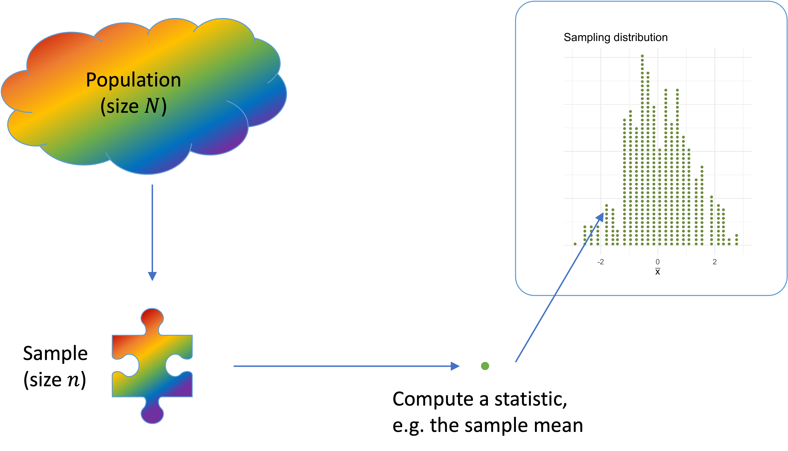
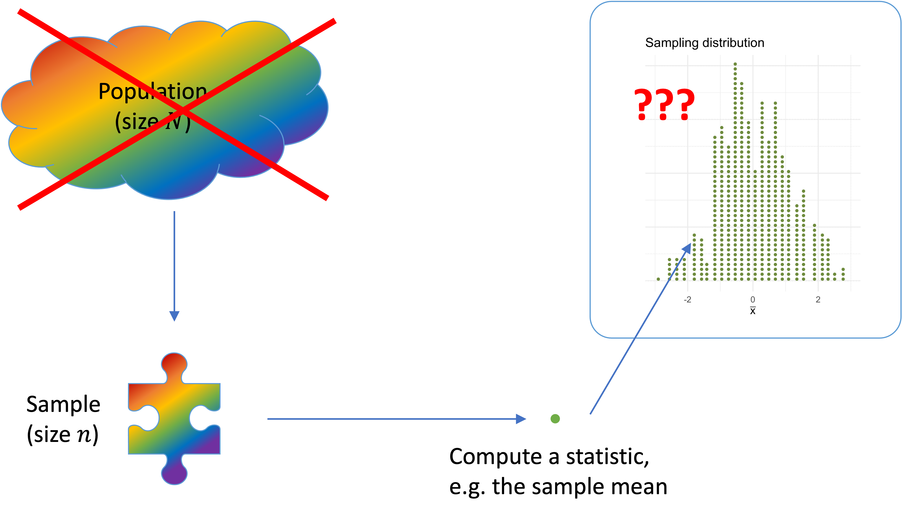
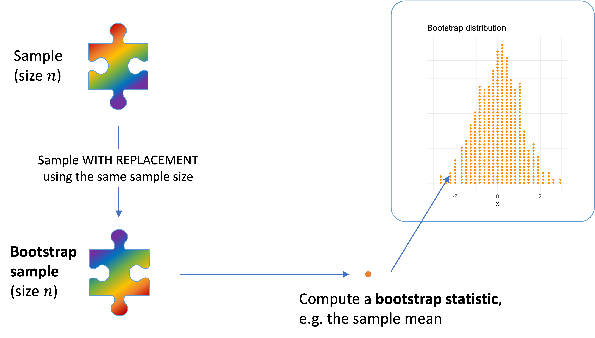
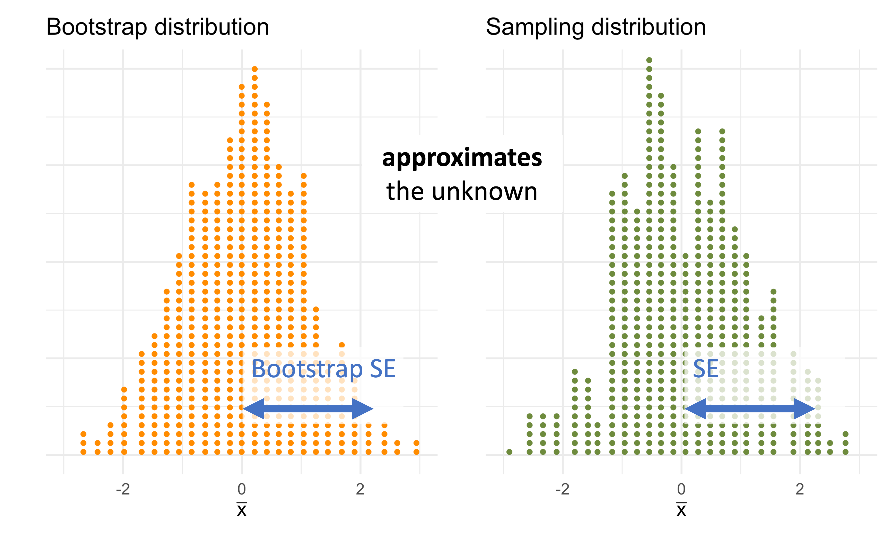
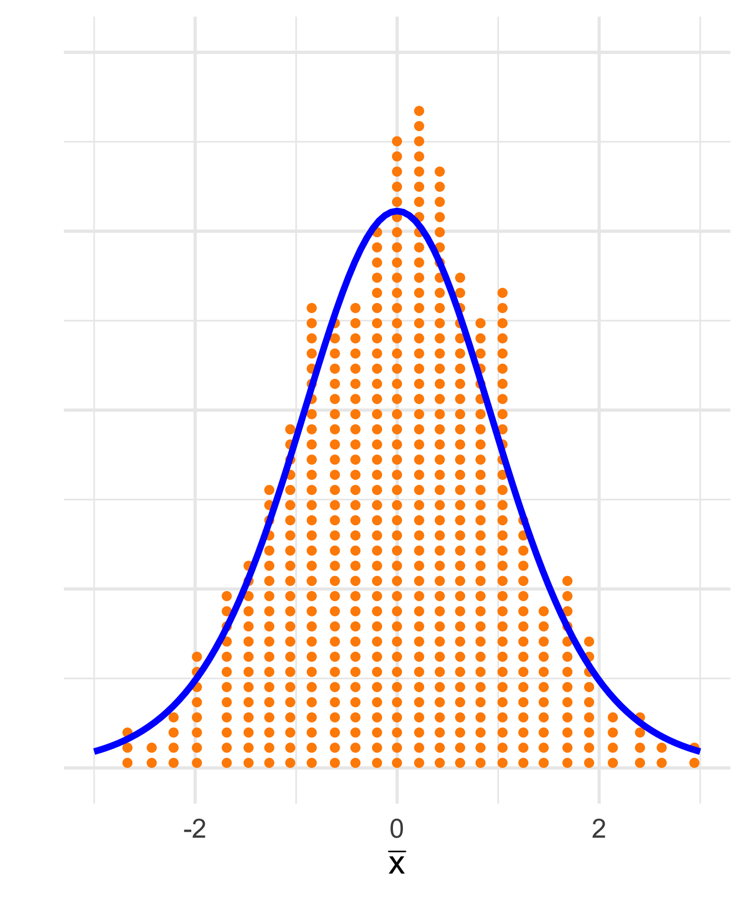

```{r setup, include=FALSE}
library(knitr)
library(tidyverse)

theme_set(
  theme_classic(base_size = 18) +
    theme(plot.title = element_text(hjust = 0.5))
)

options(htmltools.dir.version = FALSE)
options(digits=4, scipen=2)
options(knitr.table.format="html")

knitr::opts_chunk$set(
  dev = "png",
  echo = FALSE,
  warning = FALSE,
  message = FALSE,
  # cache = TRUE,
  fig.align = 'center',
  fig.height = 5, fig.width = 6,
  out.width = "80%",
  dpi = 300
)

# knitr::opts_chunk$set(fig.asp=.9)
# source('R/myfuncs.R')
```

```{r xaringan-themer, include = FALSE}
library(xaringanthemer)
style_mono_accent(
  base_color = "#0F4C81", # DAPR1
  # base_color = "#BF1932", # DAPR2
  # base_color = "#88B04B", # DAPR3 
  # base_color = "#FCBB06", # USMR
  # base_color = "#a41ae4", # MSMR
  header_color = "#000000",
  header_font_google = google_font("Source Sans Pro"),
  header_font_weight = 400,
  text_font_google = google_font("Source Sans Pro", "400", "400i", "600", "600i"),
  code_font_google = google_font("Source Code Pro")
)
```


```{r preamble, echo=FALSE, warning=FALSE, message=FALSE}
library(tidyverse)
library(kableExtra)
library(patchwork)
```


# Learning objectives

1. Understand how bootstrapping can be used to approximate a sampling distribution. 

1. Understand how the bootstrap distribution can be used to construct a range of highly plausible values (a confidence interval).  

1. Understand the link between simulation-based standard errors and theory-based standard errors. 


---
class: inverse, center, middle

# Part A
## Recap of Estimation


---
# Using statistics to estimate parameters

- Without loss of generality, in this lecture we will focus on the mean as the numerical summary of data.
    + Population mean ==> unknown ==> example of a parameter ==> $\mu$
    + Sample mean ==> we can compute it ==> example of a statistic ==> $\bar x$

--

- We are typically interested in __estimating an unknown population summary__ (a __parameter__, $\mu$) using the corresponding __summary computed on a random sample__ (a __statistic__, $\bar x$).

--

- We will also call a statistic the __estimate__.

--

- FACT: statistics vary from sample to sample and have a __sampling distribution__.

--

- We are interested in __how accurate__ is our statistic $\bar{x}$ as an estimate of the unknown parameter $\mu$.
- The sampling distribution of the statistic is used to assess accuracy.


---
# Sampling distribution

```{r}

```


---
# Accuracy of a statistic

- We investigate the accuracy of a statistic by looking at its __bias__ and __precision__

```{r}
knitr::include_graphics('bias_prec.png')
```


---
# Accuracy of a statistic: Precision and Bias

- We aim for a statistic to be precise and not biased.

- Bias is avoided if you select samples at random from the population. You have bias when your samples systematically do not include a part of the population.

- Precision relates to the variability of the sampling distribution, and the Standard Error (SE) is used to quantify precision. 

???

BIAS

- Bias is related to the centre of the sampling distribution, and you have bias when the statistics on average tend to be systematically “off” from the true value, meaning that we don’t have good guesses of the true parameter.

- Example: True IQ is 100, but the average of the statistics is 120. We are very off, we may not have captured specific parts of the population in our samples.

PRECISION

- The lower the SE, the lower is the typical “estimation error”, and hence the higher is the precision. If the SE is high, the precision is low, and this means that we don’t have reliable estimates as they vary too much from one sample to another.

- Example 1: One sample gives an estimate of 70, another sample of 115. They are very different, which one do we trust? Would you trust 70 to be a good guess? And 115?

- Example 2: One sample gives an estimate of 95, another sample of 101. Do you trust the values more now?


---
class: inverse, center, middle

# Part B
## The Bootstrap


---
# 

```{r}

```


---
# 

```{r}

```


---
# 

```{r}

```

---
# 

```{r}
#| out.width = "40%"

```
