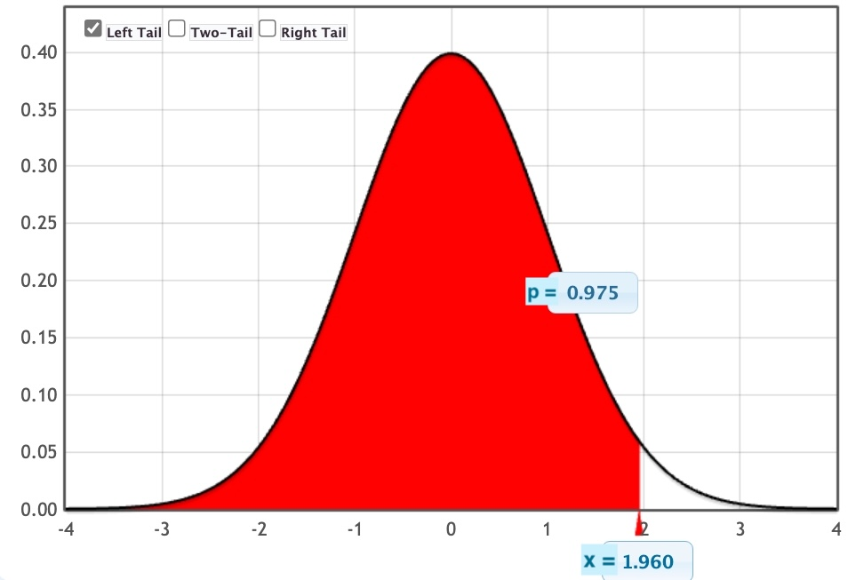
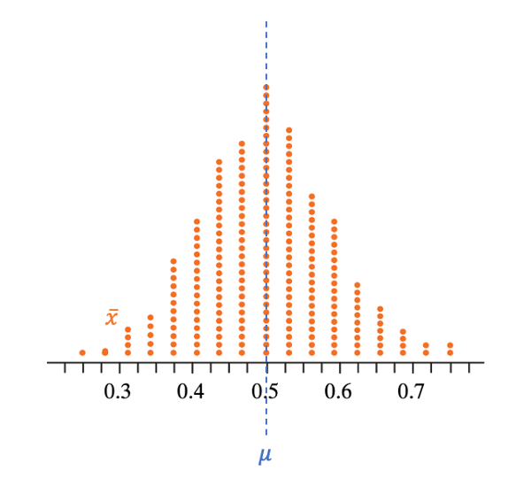
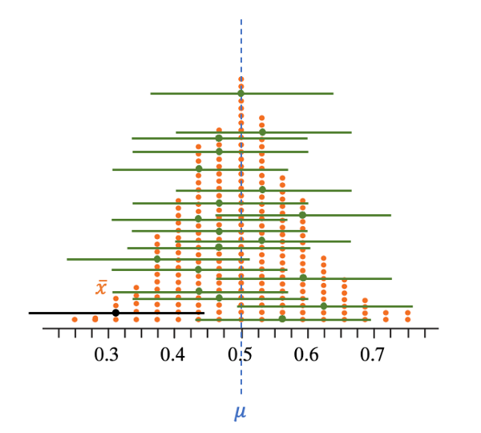

```{r setup, include=FALSE}
library(knitr)
library(tidyverse)

theme_set(
  theme_classic(base_size = 18) +
    theme(plot.title = element_text(hjust = 0.5))
)

options(htmltools.dir.version = FALSE)
options(digits=4, scipen=2)
options(knitr.table.format="html")

knitr::opts_chunk$set(
  dev = "png",
  echo = FALSE,
  warning = FALSE,
  message = FALSE,
  cache = FALSE,
  fig.align = 'center',
  fig.height = 5, fig.width = 6,
  out.width = "80%",
  dpi = 300
)
```

```{r xaringan-panelset, echo=FALSE}
xaringanExtra::use_panelset()
```

```{r xaringan-themer, include = FALSE}
library(xaringanthemer)
style_mono_accent(
  base_color = "#0F4C81", # DAPR1
  # base_color = "#BF1932", # DAPR2
  # base_color = "#88B04B", # DAPR3 
  # base_color = "#FCBB06", # USMR
  # base_color = "#a41ae4", # MSMR
  header_color = "#000000",
  header_font_google = google_font("Source Sans Pro"),
  header_font_weight = 400,
  text_font_google = google_font("Source Sans Pro", "400", "400i", "600", "600i"),
  code_font_google = google_font("Source Code Pro"),
  outfile = "un-xaringan-themer.css"
)
```


```{r preamble, echo=FALSE, warning=FALSE, message=FALSE}
library(tidyverse)
library(kableExtra)
library(patchwork)
```


# Learning objectives

1. Understand the importance of a confidence interval.

1. Understand the link between standard errors and confidence intervals.

1. Understand how to construct a confidence interval for an unknown parameter of interest.


---
class: inverse, center, middle

# Part A
## Recap


---
# Normal distribution

.pull-left[

- Variable = any characteristic of the units under investigation.

- A variable $X$ follows a Normal distribution with mean $\mu$ and standard deviation $\sigma$ if its distribution is bell-shaped and symmetric. 

- Using mathematical symbols, we write that $X$ follows a Normal distribution with mean $\mu$ and standard deviation $\sigma$ as:

$$X \sim N(\mu, \sigma)$$

- $\mu$ specifies the centre of the distribution

- $\sigma$ specifies the spread of the distribution
]

.pull-right[
```{r}
#| out.width = "100%"
xx <- seq(-3, 3, 0.01)
yy <- dnorm(xx)
plot(xx, yy, frame.plot = F, axes = F, type = 'l',
      xlab = expression(mu), cex.lab = 2, ylab = '', lwd = 2,
      col = 'red')
abline(v = 0, col = 'gray', lty = 2, lwd = 2)
arrows(0, 0.01, 1, 0.01, code = 3, lwd = 2, col = 'gray')
text(0.5, 0.04, labels = expression(sigma), cex = 2)
```
]


---
# Normal distribution: probability vs quantile

.pull-left[
Find the probability `p` to the LEFT of a value `x`:

```
p <- pnorm(x, mean = mu, sd = sigma)
```

Find the value `x` having a probability `p` to its LEFT:

```
x <- qnorm(p, mean = mu, sd = sigma)
```

Example with $N(0,1)$:

```{r, echo=T}
qnorm(0.975)
pnorm(1.96)
```
]

.pull-right[
```{r, out.width="100%"}

```
]

---
# Standardisation / z-scoring

- Let $X \sim N(\mu, \sigma)$. _In words: Let $X$ follow a normal distribution with mean $\mu$ and standard deviation $\sigma$._

--

- Define:
$$
Z = \frac{X - \mu}{\sigma}
$$

--

- $Z \sim N(0,1)$. _In words: $Z$ follows a standard normal distribution._

    + $\mu_Z = 0$
    
    + $\sigma_Z = 1$

--

- To transform $Z$ back to $X$ we use this transformation:

$$
X = \mu + Z \cdot \sigma
$$


---
# Normal 68–95–99.7 rule

- Recall that for a random variable $X \sim N(\mu, \sigma)$, __roughly__ 95% of the values fall between $\mu - 2 \sigma$ and $\mu + 2 \sigma$:

```{r}
knitr::include_graphics('images/2_01_confint/normal_rule.png')
```

---
# Normal 68–95–99.7 rule

- The interval below contains __roughly__ 95% of the values in the distribution:
$$
\left[ 
\mu - 2 \cdot \sigma , \
\mu + 2 \cdot \sigma
\right]
$$

--

- To be more accurate, we need to find the x-values (quantiles) that have 0.025 probability to the left and 0.025 probability to the right, leaving 0.95 probability in the middle.

.pull-left[
```{r echo=T}
qnorm(c(0.025, 0.975))   # using a N(0,1)
```
]

.pull-right[
```{r echo=T}
qnorm(0.025) #or qnorm(0.025, lower.tail=TRUE)
qnorm(0.025, lower.tail = FALSE)
```
]


???

- If we want to have 0.95 prob in the middle, we must have 0.05 prob equally divided in the tails, that is 0.025 on each tail.

- qnorm wants the prob to the left, so the for the first quantile we put 0.025 and the second 1-0.025 = 0.975


---
# Normal 68–95–99.7 rule

- The values $-1.96$ and $1.96$ are the quantiles of a standard Normal distribution, cutting a probability of 0.025 in each of the two tails of the distribution.

--

- To have the quantiles for the original variable $X \sim N(\mu, \sigma)$ we need to transform $Z$ back to $X$ with the formula previously mentioned $(x = \mu + z \cdot \sigma)$:

$$
\begin{aligned}
z = -1.96 & \quad \rightarrow \quad x = \mu - 1.96 \cdot \sigma \\
z = 1.96 &\quad \rightarrow \quad x = \mu + 1.96 \cdot \sigma
\end{aligned}
$$

--

- The interval comprising exactly 95% of the values of $X$ is the range of values *from* $\mu - 1.96 \cdot \sigma$ *to* $\mu + 1.96 \cdot \sigma$, which in mathematics is written as:

$$
\left[ 
\mu - 1.96 \cdot \sigma , \
\mu + 1.96 \cdot \sigma
\right]
$$


---
# Estimation

<!-- # Using statistics to estimate parameters -->

- Without loss of generality, we will focus on the mean as the numerical summary of data.

$$\begin{matrix}
\text{Population mean, } \mu & \rightarrow & \text{unknown} & \rightarrow & \text{example of a parameter} \\
\text{Sample mean, } \bar{x} & \rightarrow & \text{we can compute it} & \rightarrow & \text{example of a statistic}
\end{matrix}$$

--

- We are typically interested in __estimating an unknown population mean__ $\mu$ (a __parameter__) using the __mean computed on a random sample__ $\bar x$ (a __statistic__).
    
    + We will equivalently call the statistic (sample mean) the __estimate__.

--

- When estimating an unknown parameter, we should report both 

    a) the estimate;  
    b) a measure of our "uncertainty" in the estimate.

???

We want to report our reader not only an estimate of the unknown parameter, but also a measure of precision of our estimate. In other words, how reliable is it?

---
# Some facts

+ Statistics vary from sample to sample and have a __sampling distribution__.
    
+ The standard deviation of the sampling distribution is called the __standard error__ (SE)
    
+ __Informally__: SE tells us the size of the typical "estimation error" (= $\bar{x} - \mu$).
    
+ $SE = SE_{\bar{x}} = \dfrac{\sigma}{\sqrt{n}}$


???

In other words, SE tells us the average distance between the sample mean and the population mean that is due to sampling variability.

---
# Estimation

- The estimate for a population mean is the sample mean, $\bar{x}$.

- Let's now turn to the key question of reporting uncertainty in the estimate:

> How accurate is our estimate?

- In other words, how accurate is our statistic $\bar{x}$ as an estimate of the unknown parameter $\mu$?

- Accuracy is a combination of two things:

  + No bias
  + Precision

- We avoid bias if we use random sampling. We have bias if our samples systematically do not include a part of the population.
  
  + If you choose convenience samples, you will systematically over-estimate or under-estimate the true value. 

- Precision relates to the variability of the sampling distribution, and the Standard Error (SE) is used to quantify precision.
    
    + As the SE gets smaller, the sample means will tend to be closer to the population mean


???

- We want to report our reader not only an estimate of the unknown parameter, but also a measure of precision of our estimate. In other words, how reliable is it?

- We aim for a statistic to be precise and not biased.

- The sampling distribution of the statistic is used to assess precision.

- SE = sd(of sampling distribution)

BIAS

- Bias is avoided if you select samples at random from the population. You have bias if your samples systematically do not include a part of the population.

- Bias is related to the centre of the sampling distribution, and you have bias when the statistics on average tend to be systematically “off” from the true value, meaning that we don’t have good guesses of the true parameter.

- Example: True IQ is 100, but the average of the statistics is 120. We are very off, we may not have captured specific parts of the population in our samples.

- Example: you want to estimate the average study hours per day of students in your university. If you select 50 students only from the library, your estimate will be higher than the true value. This is because your sample is not a good representation of the population, some students are not well-represented in the sample.


PRECISION

- The lower the SE, the lower is the typical “estimation error”, and hence the higher is the precision. If the SE is high, the precision is low, and this means that we don’t have reliable estimates as they vary too much from one sample to another.

- Example 1: One sample gives an estimate of 70, another sample of 115. They are very different, which one do we trust? Would you trust 70 to be a good guess? And 115?

- Example 2: One sample gives an estimate of 95, another sample of 101. Do you trust the values more now?


---
# Bias vs Precision

```{r}
knitr::include_graphics('images/2_01_confint/bias_prec.png')
```

---
# Sampling distribution

```{r}
knitr::include_graphics('images/2_01_confint/2_01_sampl_dist.png')
```


---
# Sampling distribution

```{r}
knitr::include_graphics('images/2_01_confint/2_01_sampl_dist_t.png')
```

---
# Sampling distribution

```{r}
knitr::include_graphics('images/2_01_confint/2_01_sampl_dist_t_2.png')
```


---
class: inverse, center, middle


---
class: inverse, center, middle

# Part B
## One sample only


---
# One sample only

```{r}
knitr::include_graphics('images/2_01_confint/2_01_one_sample.png')
```


---
# One sample only: Precision of sample mean

- If we do NOT have the population data:

    - we cannot compute $\mu$, the population mean
    
    - we also cannot compute $\sigma$, the population standard deviation

--

- Recall that $\sigma$ is required to assess the precision of the sample mean by computing the SE:

$$
SE = \frac{\sigma}{\sqrt n}
$$

--

- How can we compute the SE of the mean if we __do not have data on the full population__, and we __can only afford one sample__ of size $n$?


---
# One sample only: Precision of sample mean

- We must also estimate $\sigma$ with the corresponding sample statistic.

- Substitute $\sigma$ with the standard deviation computed in the sample, $s$.

- Standard error of the mean becomes:

$$
SE = \frac{s}{\sqrt n}
$$

- Report estimate (sample mean), along with a measure of its precision (the above SE).


---
class: inverse, center, middle


---
class: inverse, center, middle

# Part C
## Confidence Intervals


---
# Key idea

- Parameter estimate = single number. Almost surely the true value will be different from our estimate.

--

- Range of plausible values for the parameter, called __confidence interval__. More likely that the true value will be captured by a range.

--

```{r}
knitr::include_graphics('https://d33wubrfki0l68.cloudfront.net/45f6d2e16255dbcb42de86336e1e49ef732aa5da/8bcd0/images/shutterstock/point_estimate_vs_conf_int.png')
```


---
# Confidence interval

- Confidence interval (CI) = range of plausible values for the parameter.

--

- To create a confidence interval we must decide on a confidence level.

--

- Confidence level = a number between 0 and 1 specified by us. How confident do you want to be that the confidence interval will contain the true parameter value?

--

- The larger the confidence level, the wider the confidence interval.

  + How confident are you that I am between 39 and 42 years old?
  
  + How confident are you that I am between 35 and 50 years old?
  
  + How confident are you that I am between 18 and 70 years old?

--

- Typical confidence levels are 90%, 95%, and 99%.


---
# CI for the population mean

.pull-left[
- Recall that if $X \sim N(\mu, \sigma)$, 95% of the values are between

$$
[
\mu - 1.96 \cdot \sigma, \ 
\mu + 1.96 \cdot \sigma
]
$$
]

.pull-right[

- The sample mean follows a normal distribution:  

$$\bar{X} \sim N(\mu_{\overline{X}},\sigma_{\overline{X}})$$

where:
  
  + $\mu_{\overline X} = \mu$  
  + $\sigma_{\overline X} = SE = \dfrac{\sigma}{\sqrt n}$
]

- Substitute in the interval above:

$$[
\mu_{\bar{X}} - 1.96 \cdot \sigma_{\bar{X}}, \ 
\mu_{\bar{X}} + 1.96 \cdot \sigma_{\bar{X}} 
]$$

- That is:

$$\left[
\mu - 1.96 \cdot \frac{\sigma}{\sqrt n}, \ 
\mu + 1.96 \cdot \frac{\sigma}{\sqrt n} 
\right]$$


---
# Estimates of $\mu$ and $\sigma$

- Recall that we do not have the full population data. __We can only afford one sample!__

--

- We don't have the population mean $\mu$ and we estimated it with the sample mean $\bar{x}$
 
--

- However, we also don't have $\sigma$ so we need to estimate it with $s$, the sample standard deviation:

$$
\left[ 
\bar{x} - 1.96 \cdot \frac{s}{\sqrt n} , \ 
\bar{x} + 1.96 \cdot \frac{s}{\sqrt n}
\right]
$$

--

- However, this interval is now __wrong!__

--

- Because we didn't know $\sigma$ and we had to estimate it with $s$, this brings an __extra element of uncertainty__

--

- As we are unsure about the actual value of the population standard deviation, the reference distribution is no longer Normal, but a distribution that is more "uncertain" and places higher probability in the tails of the distribution.

--

- When the population standard deviation is unknown, the sample mean follows a t-distribution.

--

- The quantiles -1.96 and 1.96 refer to the normal distribution, so these are wrong and we need to find the correct ones!


---
# t-distribution

```{r, out.width = '55%'}
par(mfrow = c(1,1))
xx = seq(-4, 4, 0.01)
plot(xx, dnorm(xx), type = 'l', frame.plot=F, xlab = '', ylab = '', lwd = 4)
lines(xx, dt(xx, 2), col = 'red', lwd = 2, lty = 2)
lines(xx, dt(xx, 5), col = 'blue', lwd = 2, lty = 2)
lines(xx, dt(xx, 50), col = 'green', lwd = 2, lty = 2)
legend('topright', lty = c(1, 2, 2, 2),
       col = c('black', 'red', 'blue', 'green'),
       legend = c('Normal', 't(2)', 't(5)', 't(50)'),
       lwd = c(4, 2, 2, 2))
```


---
# t-distribution

- A distribution similar to the standard Normal distribution, also with a zero mean

--

- Depends on a number called __degrees of freedom__ (DF) = sample size - 1. That is, $df = n - 1$.

--

- We write the distribution as:

$$
t(n - 1)
$$
--

- Suppose the sample size is 20. In R:

```{r echo=T}
qt(0.025, df = 19)    # quantile = t-value with 0.025 prob to the LEFT
pt(-2.093, df = 19)   # prob to the LEFT of t = -2.093
```


---
# Finally: the correct confidence interval

- Now we can finally compute the correct confidence interval. 

--

- We need to replace the quantiles with those from the $t(n-1)$ distribution, denote them by $-t^*$ and $+t^*$, and these will be different all the time as they depend on the sample size.

--

- Generic form the of the CI for the mean:

$$\left[ 
\bar{x} - t^* \cdot \frac{s}{\sqrt n} , \ \bar{x} + t^* \cdot \frac{s}{\sqrt n}
\right]$$

--

- Generic form the of the 95% CI for the mean with a sample of size $n = 20$:

```{r echo=T}
qt(c(0.025, 0.975), df = 20 - 1)
```

$$\left[ 
\bar{x} -2.093 \cdot \frac{s}{\sqrt n} , \ \bar{x} + 2.093 \cdot \frac{s}{\sqrt n}
\right]$$


---
# Other confidence levels

- Generic form the of the 99% CI for the mean with a sample of size $n = 20$:

```{r echo=T}
qt(c(0.005, 0.995), df = 20 - 1)
```

$$\left[ 
\bar{x} -2.861 \cdot \frac{s}{\sqrt n} , \ \bar{x} + 2.861 \cdot \frac{s}{\sqrt n}
\right]$$


---
# Example: 95% CI for the pop. mean salary

- Parameter of interest: mean yearly salary of a NFL player in the year 2019, denoted $\mu$.

- Sample of 50 players:

```{r echo=T}
library(tidyverse)
nfl_sample <- read_csv("https://uoepsy.github.io/data/NFLSample2019.csv")
dim(nfl_sample)
head(nfl_sample)
```

---
# Example: 95% CI for the pop. mean salary

.pull-left[
```{r echo=T}
xbar <- mean(nfl_sample$YearlySalary)
xbar

s <- sd(nfl_sample$YearlySalary)
s

n <- nrow(nfl_sample)
n

SE <- s / sqrt(n)
SE
```
]

.pull-right[
```{r echo=T}
tstar <- qt(c(0.025, 0.975), df = n-1)
tstar

xbar - 2.01 * SE
xbar + 2.01 * SE
```

or:

```{r echo=T}
xbar + tstar * SE
```

]


---
# Example: 95% CI for the pop. mean salary

- The 95% confidence interval for the mean salary of __all__ NFL players in the year 2019 is [2.13, 4.58] million dollars.

--

- Write this up as:

> We are 95% confident that the average salary of a NFL player in 2019 was between 2.13 and 4.58 million dollars.

--

- If it makes more sense in your sentence, you can report the sample mean followed by the CI in brackets (to tell the reader how precise your estimate is). 

- Use the format M = ..., 95% CI [..., ...].

<!-- - However, make sure you always have an interpretation of the confidence interval in context somewhere in your report. -->

<!-- > The average salary of a NFL player in 2019 was M = 3.36 million dollars, 95% CI [2.13, 4.58]. We are 95% confident that the average salary was between 2.13 and 4.58 million dollars. -->


---
class: inverse, center, middle


---
class: inverse, center, middle

# Part D
## Warning on interpretation


---
# Warning!

- If you had many random samples and computed a 95% confidence interval from each sample:

  + about 95% of those intervals will contain the true parameter value
  + about 5% of those intervals will __not__ contain the true parameter value

--

- Example 1: if you had 100 random samples and computed a 95% confidence interval from each sample:
  
  + about 95 (= 100 * 0.95) of those intervals will contain the true parameter value
  + about 5 (= 100 * 0.05) of those intervals will __not__ contain the true parameter value
  
--

- Example 2: if you had 20 random samples and computed a 95% confidence interval from each sample:
  
  + about 19 (= 20 * 0.95) of those intervals will contain the true parameter value
  + about 1 (= 20 * 0.05) of those intervals will __not__ contain the true parameter value


---
# Warning!

- Consider again example 2, where you have 20 random samples and built a confidence interval from each sample.

--

- We speak about __probability__ when we refer to the __collection__ of those 20 confidence intervals.  
That is, the probability the that __collection__ of confidence intervals will contain the true parameter value is 0.95.
  
  + Think of this as

$$
\frac{\text{number of CIs containing }\mu}{\text{total number of CIs}} = \frac{19}{20} = 0.95
$$

--

- We speak of __confidence__ when we refer to just __one__ confidence interval that we have computed.  
Say the 95% CI is [2.5, 5.3] min. We would say: we are 95% confident that the population mean is between 2.5 and 5.3 minutes.
  
  + It is __wrong__ to say that there is a 95% probability that the population mean is between 2.5 and 5.3 minutes.


---
# Warning!

```{r}
#| out.width = "50%"

```


---
# Warning!

```{r}
#| out.width = "50%"

```


<!-- --- -->
<!-- # This week -->

<!-- - Attend the Live R programming lecture -->

<!-- - Read the lab worked example and complete your lab -->

<!-- - Complete any assigned readings -->

<!-- - Go to office hours if you have questions -->

<!-- - Complete the weekly quiz -->

<!--     + Opens Monday at 9am -->
<!--     + Closes Sunday at 5pm -->


---
# This week

<script src="https://cdn.jsdelivr.net/npm/iconify-icon@2.1.0/dist/iconify-icon.min.js"></script>

.pull-left[
<iconify-icon icon="clarity:tasks-solid" width="34" height="34"  style="color: #0F4C81"></iconify-icon>

### Tasks

- Attend both lectures

- Attend your lab and work together on the lab tasks
    - Tip: read the worked example in advance!

- Complete any lecture activities and/or readings

- Complete the weekly quiz
    + Opens Monday at 9am
    + Closes Sunday at 5pm

<!-- - Submit Formative Report A by 12 noon on Friday the 18th of October 2024 -->
<!-- - Submit Formative Report B by 12 noon on Friday the 29th of November 2024 -->
<!-- - Submit Formative Report C by 12 noon on Friday the 14th of February 2025 -->
<!-- - Submit the Assessed Report by 12 noon on Friday the 28th of March 2025 -->
]


.pull-right[
<iconify-icon icon="raphael:help" width="34" height="34"  style="color: #0F4C81"></iconify-icon>

### Support

- **Office hours**: for one-to-one support on course materials or assessments<br>(see LEARN > Course information > Course contacts)

- **Piazza**: help each other on this peer-to-peer discussion forum

- **Student Adviser**: for general support while you are at university<br>(find your student adviser on MyEd/Euclid)
]


---
class: inverse, center, middle
