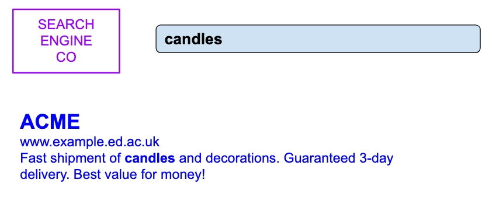
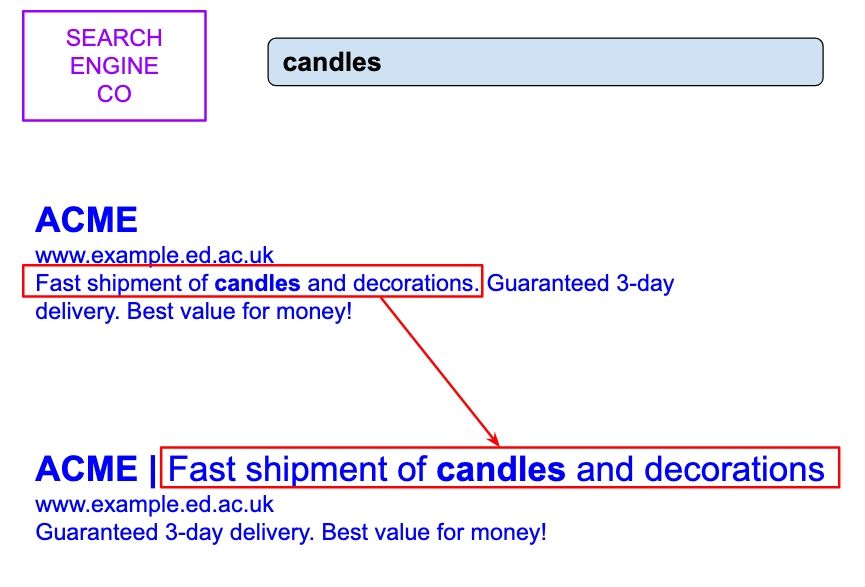

```{r setup, include=FALSE}
library(knitr)
library(tidyverse)

theme_set(
  theme_classic(base_size = 18) +
    theme(plot.title = element_text(hjust = 0.5))
)

options(htmltools.dir.version = FALSE)
options(digits=4, scipen=2)
options(knitr.table.format="html")

knitr::opts_chunk$set(
  dev = "png",
  echo = FALSE,
  warning = FALSE,
  message = FALSE,
  cache = FALSE,
  fig.align = 'center',
  fig.height = 5, fig.width = 6,
  out.width = "80%",
  dpi = 300
)
```

```{r xaringan-panelset, echo=FALSE}
xaringanExtra::use_panelset()
```

```{r xaringan-themer, include = FALSE}
library(xaringanthemer)
style_mono_accent(
  base_color = "#0F4C81", # DAPR1
  # base_color = "#BF1932", # DAPR2
  # base_color = "#88B04B", # DAPR3 
  # base_color = "#FCBB06", # USMR
  # base_color = "#a41ae4", # MSMR
  header_color = "#000000",
  header_font_google = google_font("Source Sans Pro"),
  header_font_weight = 400,
  text_font_google = google_font("Source Sans Pro", "400", "400i", "600", "600i"),
  code_font_google = google_font("Source Code Pro"),
  outfile = "un-xaringan-themer.css"
)
```


```{r preamble, echo=FALSE, warning=FALSE, message=FALSE}
library(tidyverse)
library(kableExtra)
library(patchwork)
```


# Course Overview

.pull-left[

```{r echo = FALSE, results='asis'}
block1_name = "Exploratory Data Analysis"
block1_lecs = c("Research design and data",
                "Describing categorical data",
                "Describing continuous data",
                "Describing relationships",
                "Functions")
block2_name = "Probability"
block2_lecs = c("Probability theory",
                "Probability rules",
                "Random variables (discrete)",
                "Random variables (continuous)",
                "Sampling")

source("https://raw.githubusercontent.com/uoepsy/junk/main/R/course_table.R")
course_table(block1_name,block2_name,block1_lecs,block2_lecs,week=11)
```

]

.pull-right[

```{r echo = FALSE, results='asis'}
block3_name = "Foundations of inference"
block3_lecs = c("Confidence intervals",
                "Hypothesis testing (p-values)",
                "Hypothesis testing (critical values)",
                "Hypothesis testing and confidence intervals",
                "Errors, power, effect size, assumptions")
block4_name = "Common hypothesis tests"
block4_lecs = c("One sample t-test",
                "Independent samples t-test",
                "Paired samples t-test",
                "Chi-square tests",
                "Correlation")

source("https://raw.githubusercontent.com/uoepsy/junk/main/R/course_table.R")
course_table(block3_name,block4_name,block3_lecs,block4_lecs,week=2)
```

]


---
# Learning objectives

1. Understand null and alternative hypotheses, and how to specify them for a given research question.

1. Understand the concept of and how to obtain a null distribution.

1. Understand statistical significance and how to calculate p-values from null distributions.


---
class: inverse, center, middle

# Part A
## Introduction


---
# A simple idea... A substantial impact...


.pull-left[

]

--

.pull-right[

]

--

.clear[
- Hypothesis testing can reveal the true potential of ideas.
- Hypothesis testing is a powerful tool in many areas (e.g. psychology, business, health, ...).
- It helps us make data-driven decisions and uncover hidden opportunities.
]


???

In 2012, a Microsoft employee had a seemingly small idea:

- Change the way Bing displayed ad headlines.
- Initially deemed low priority, it was shelved for over six months.

The Turning Point:

- An engineer decided to run a simple hypothesis test.
- Within hours, the new headline variation produced abnormally high revenue.
- Triggered a "too good to be true" alert, but it was real.

The Impact:

- Revenue increased by 12%, equating to over $100 million annually in the U.S.
- No negative impact on user experience metrics.
- Best revenue-generating idea in Bing's history.

Key Takeaway:

- Hypothesis Testing (like t-tests) can reveal the true potential of ideas.
- Hypothesis Testing is a powerful tool in both business and psychology.
- It helps us make data-driven decisions and uncover hidden opportunities.


---
# Setting

- We cannot afford to collect data for the full population due to time and/or budget constraints

- Data collected for a random sample of size $n$

- We are interested in the population mean $\mu$, but this is unknown as we cannot compute it

- Last week we learned how to:

    + obtain an estimate for the population mean $\rightarrow$ the sample mean $\bar{x}$
    
    + obtain a measure of precision of our estimate $\rightarrow$ the standard error $SE_{\bar{x}} = s / \sqrt{n}$
    
    + compute and report a range of plausible values for the population mean, called __confidence interval__ $\rightarrow$ $CI = \bar{x} \pm t^* \times SE_{\bar{x}}$
    
    + report the estimate along with our uncertainty in the estimate (SE or CI or both)


---
# Where are we going?

- Are children exposed to pesticides more likely to develop ADHD (attention-deficit/hyperactivity disorder) that those who aren't?<sup>1</sup>

    <!-- + Is $p_{\text{exposed}} > p_{\text{not exposed}}? \qquad$ where $p$ is the proportion of all children diagnosed with ADHD. (Population proportion = $p$ = parameter. Sample proportion = $\hat p$ = estimate). -->


.footnote[[1] Bouchard, M. F., Bellinger, D. C., Wright, R. O., & Weisskopf, M. G. (2010). Attention-deficit/hyperactivity disorder and urinary metabolites of organophosphate pesticides. Pediatrics, 125(6), e1270-e1277.]

--

- Do students who eat breakfast achieve more than students who do not eat breakfast?
    
    <!-- + Is $\mu_{\text{breakfast}} > \mu_{\text{no breakfast}}? \qquad$ where $\mu$ is the mean achievement score. -->

--

- Is the audience appreciation of shows appearing on Broadway lower than the audience appreciation of the touring version of the same show?
    
    <!-- + Is $\mu_{\text{Broadway}} < \mu_{\text{Touring}}? \qquad$ where $\mu$ is the mean audience appreciation score. -->

--

- If you want to remember something, should you take a nap or have some caffeine?
    
    <!-- + Is $\mu_{\text{nap}} \neq \mu_{\text{coffee}}? \qquad$ where $\mu$ is the mean recall. -->


---
# Where are we going?

- What do all of the previous questions have in common?  

--

- Testing a claim about a population parameter!


---
# Where are we going?

- Are children exposed to pesticides more likely to develop ADHD (attention-deficit/hyperactivity disorder) that those who aren't?
    
    + Is $p_{\text{exposed}} > p_{\text{not exposed}}? \qquad$ where $p$ is the proportion of all children diagnosed with ADHD.  
    (Population proportion = $p$ = parameter. Sample proportion = $\hat p$ = estimate).

--

- Do students who eat breakfast achieve more than students who do not eat breakfast?
    
    + Is $\mu_{\text{breakfast}} > \mu_{\text{no breakfast}}? \qquad$ where $\mu$ is the mean achievement score.

--

- Is the audience appreciation of shows appearing on Broadway lower than the audience appreciation of the touring version of the same show?
    
    + Is $\mu_{\text{Broadway}} < \mu_{\text{Touring}}? \qquad$ where $\mu$ is the mean audience appreciation score.

--

- If you want to remember something, should you take a nap or have some caffeine?
    
    + Is $\mu_{\text{nap}} \neq \mu_{\text{coffee}}? \qquad$ where $\mu$ is the mean recall.


---
# Where are we going?

- Many research hypotheses involve testing a claim about a population parameter. 

--

- We will look at a widely applicable method (called __hypothesis test__ or __test of significance__) that allows you to test an hypothesis about a population parameter. 

--

- This method will allow you to answer many types of questions you may have about a population. All you have to do is 

    + collect relevant sample data
    + perform a hypothesis test
    + report it correctly

--

- If you have a research question you are interested in, and you perform the steps above correctly, you may end up writing up your research results in your first journal paper after that!


---
# Lecture example: Body temperature

- Today's recurring example will focus on answering the following research question:

> Has the average body temperature for healthy humans changed from the long-thought 37 °C? 

--

- We will use data comprising measurements on body temperature and pulse rate for a sample of $n = 50$ healthy subjects. Data link: https://uoepsy.github.io/data/BodyTemperatures.csv

--


```{r echo=T}
library(tidyverse)
tempsample <- read_csv('https://uoepsy.github.io/data/BodyTemperatures.csv')
glimpse(tempsample)  # n. rows and n. cols, variables, their type, and a preview
tempsample <- tempsample |>  # the older symbol for pipe, %>%, does the same
    drop_na(BodyTemp)
```

---
# Lecture example: Body temperature

```{r, echo=T}
# both n. rows and n. cols
dim(tempsample)
# n. rows only: dim(tempsample)[1]
n <- nrow(tempsample)
n
# sample mean
xbar <- mean(tempsample$BodyTemp)
xbar
```

- The sample mean is $\bar x$ = `r xbar |> round(2)` °C

---
class: inverse, center, middle

---
class: inverse, center, middle

# Part B
## Hypotheses and null distribution


---
# Two hypotheses

- Let's start with an analogy from law. Consider a person who has been indicted for committing a crime and is being tried in a court. 

--

- Based on the available evidence, the judge or jury will make one of two possible decisions:

    1. The person is not guilty.
    2. The person is guilty.

--

- Due to the principle of __presumption of innocence__, at the outset of the trial, the person is presumed not guilty. 

    - "The person is not guilty" corresponds to what is called in statistics the __null hypothesis__, denoted $H_0$.

--

- The prosecutor's job is to prove that the person has committed the crime and, hence, is guilty.

    - "The person is guilty" corresponds to what is called in statistics the __alternative hypothesis__, denoted $H_1$.

--

- The evidence that the prosecutor needs to provide must be __beyond reasonable doubt__.


---
# Two hypotheses

- In the beginning of the trial it is assumed that the person is not guilty.

--

- The null hypothesis $H_0$ is usually the hypothesis that is assumed to be true to begin with. It typically corresponds to "no change", "no effect", "no difference", "no relationship". 
    
    + It involves the equality symbol $(=)$
    + The null hypothesis usually is the skeptical claim that nothing is different / nothing is happening.
    + Are we considering a (New! Improved!) possibly better method? The null hypothesis says, "Really? Convince me!" To convert a skeptic, we must pile up enough evidence against the null hypothesis that we can reasonably reject it.

--

- The alternative hypothesis is the claim that we wish to find evidence for. It is typically the hypothesis that embodies the research question of interest.

    + It involves the less than $(<)$ or greater than $(>)$ or not equal to $(\neq)$ symbols
    + If $H_1$ uses the symbol $<$, the test is called left-tailed or left-sided
    + If $H_1$ uses the symbol $>$, the test is called right-tailed or right-sided
    + If $H_1$ uses the symbol $\neq$, the test is called two-tailed or two-sided


---
# Test of significance

- A __hypothesis test__ (or __test of significance__) is a procedure for testing a claim about a population parameter (i.e. a property of a population).

--

- The test works by weighting the evidence __against__ the null (and in favour of the alternative).

    + We want to be sure the sample data provide enough evidence against $H_0$ before rejecting it in favour of $H_1$.

--

- The evidence in statistics corresponds to the sample statistic (numerical summary of the sample data). 

    + Informally, people say that the evidence corresponds to the sample data.

--

- The evidence provided must be __beyond reasonable doubt__. 

    + If $H_0$ is true, it should be very unlikely for a random sample to give that value of the statistic.  
    If a person is innocent, it should be very unlikely to pile up so much evidence against innocence.
    
    + If it were very likely for a random sample to give that value of the sample statistic when $H_0$ is true, then what we observed could just be a fluke due to random sampling rather than due to $H_1$.


---
# Lecture example: Body temperature

> Has the average body temperature for healthy humans changed from the long-thought 37 °C? 

- State the hypotheses using proper symbols for the population parameters. 

$$H_0: \mu = 37$$
$$H_1: \mu \neq 37$$

--

- From the sample data we can compute the sample mean, which is our estimate of $\mu$

```{r echo=T}
xbar <- mean(tempsample$BodyTemp)
xbar
```

--

- $\overline x = 36.81$ °C, which differs from 37 °C

--

- Is this difference large enough to be really due to a systematic shift in the average body temperature of healthy humans?

--

- Or perhaps the population mean is truly = 37 °C, and the difference between 36.81 °C and 37 °C is simply due to random sampling?


---
# Recap

```{r, out.width = '50%'}
set.seed(5)
yy <- tempsample$BodyTemp
ms <- rnorm(1000, 37, sd(yy)/ sqrt(length(yy)))
ggplot(tibble(x = ms), aes(x = x)) +
    geom_dotplot(fill = 'darkorange',
                 dotsize = 0.3, stackratio = 0.8) +
    labs(y = "", x = expression(bar(x))) +
    theme_classic(base_size = 15) +
    theme(axis.ticks = element_blank(),
          axis.text.y.left = element_blank()) + 
    stat_function(fun = \(x) dnorm(x, 37, sd(yy)/ sqrt(length(yy))), color = 'darkblue', size = 2) +
    geom_vline(xintercept = 37, color = 'darkblue')
```


---
# Null distribution

- The sample mean varies from sample to sample, and all the possible values along with their probabilities form the sampling distribution:
$$\overline X \sim N(\mu, \frac{\sigma}{\sqrt n})$$

--

- If the population mean $\mu$ was truly equal to 37, as the null hypothesis says, how would the sample means look?

--

- If $H_0: \mu = 37$ is true, the sample mean would follow the distribution:
$$\overline X \sim N(37, \frac{\sigma}{\sqrt n})$$

--

- We can standardise it to obtain a distribution with mean = 0 and SD = 1 (__z-score__):
$$
Z = \frac{\overline X - 37}{\frac{\sigma}{\sqrt n}} \sim N(0, 1)
$$


---
# Null distribution

- __However__, we cannot compute the population SD $\sigma$ too...

--

- Estimate it with sample SD, denoted $s$. The distribution however becomes a $t(n-1)$

--

- When you standardise the sample mean using $SE_{\bar{x}} = s / \sqrt{n}$, you have the __t-statistic__:
$$
\underbrace{t = \frac{\overline X - 37}{\frac{s}{\sqrt n}}}_{\textbf{t-statistic}} \sim t(n-1)
$$

--

- The t-statistic is sometimes called the __t-score__ (or t-scored sample mean, same thing)

--

- The distribution of the t-statistic, __assuming the null hypothesis to be true__, is called the __null distribution__. 

    + It tells us which values of the t-statistic we would expect to see if $H_0$ were true.


---
class: inverse, center, middle

---
class: inverse, center, middle

# Part C
## t-statistic and p-value

---
# The t-statistic

- For $H_0 : \mu = \mu_0$ the t-statistic is:

$$t = \frac{\overline x - \mu_0}{\frac{s}{\sqrt n}} = \frac{\text{difference between sample and hypothesised mean}}{\text{variation in sample means due to random sampling}}$$

--

- The __t-statistic__ measures how many standard errors away from $\mu_0$ is our sample mean $\overline x$.

--

- It compares the difference between the sample and hypothesised mean, to the expected variation in the means due to random sampling.

--

- __Note__: The terms __t-score__, __t-statistic__ and __t-value__ are used as synonyms

--

- When referring to the t-statistic computed on the observed sample, people often say:

    + the observed value of the t-statistic 
    + the observed t-value


---
# Visually

.pull-left[
```{r, out.width = '100%'}
xx = seq(-4, 4, 0.01)
yy = dt(xx, df = 14)
plot(xx, yy, type = 'l', frame.plot = F, col = 'darkblue', lwd = 2,
     xlab = 't Values', ylab = 'Probability density',
     main = 'Example: t(14) Null Distribution')
```
]

.pull-right[
Consider $H_0 : \mu = \mu_0$

$$t = 0 
\quad \text{when} \quad
\dfrac{\overline x - \mu_0}{\frac{s}{\sqrt n}} = 0 
\quad \text{when} \quad
\bar x = \mu_0$$

Roughly speaking:

- We are very likely to see a t-score between -2 and 2 if in the population the mean is really $\mu_0$ (37 in the Body Temperature example)

- We are very unlikely to see a t-score smaller than -2 or larger than 2 if in the population mean is really $\mu_0$ (37 in the Body Temperature example)

]


---
# Visually

.pull-left[
```{r, out.width = '100%'}
xx = seq(-4, 4, 0.01)
yy = dt(xx, df = 14)
plot(xx, yy, type = 'l', frame.plot = F, col = 'darkblue', lwd = 2,
     xlab = 't Values', ylab = 'Probability density',
     main = 'Example: t(14) Null Distribution')
abline(v = -1.1, col = 'darkorange', lwd = 2, lty = 2)
text(-1.1 + 0.1, 0, labels = 't_obs = -1.1', 
     col = 'darkorange', adj = 0, cex = 1.2)
```
]

.pull-right[
- If our random sample leads to an observed t-value that has relatively high probability in the null distribution

    + There are many random samples leading to the same t-value when $H_0$ is true
    
    + Hence, it is very likely to obtain such t-value just from random sampling.
]


---
# Visually

.pull-left[
```{r, out.width = '100%'}
xx = seq(-4, 4, 0.01)
yy = dt(xx, df = 14)
plot(xx, yy, type = 'l', frame.plot = F, col = 'darkblue', lwd = 2,
     xlab = 't Values', ylab = 'Probability density',
     main = 'Example: t(14) Null Distribution')
abline(v = 3.4, col = 'darkorange', lwd = 2, lty = 2)
text(3.4 - 0.1, 0, labels = 't_obs = 3.4', 
     col = 'darkorange', adj = 1, cex = 1.2)
```
]

.pull-right[
- If our sample leads to an observed t-value that has relatively low probability, 

    + there are very few random samples leading to the same t-value when $H_0$ is true.
    
    + The observed t-value is __unlikely__ to be obtained from random samples when $H_0$ is true. That surprisingly high or low t-value may be due to something else (our claim), rather than random sampling.
]


---
# Evaluating how unlikely

- We need an objective criterion to evaluating how unlikely it is to see the observed t-value if $H_0$ is true.

- Just plotting a line on a graph can lead to very different conclusions based on the reader's perception of probability and their risk-aversion.


---
# p-value

- In statistics, the evidence against the null hypothesis is provided by data (and not the prosecutor) and we use a probability to say how strong the evidence is.

--

- The probability that measures the strength of the evidence against a null hypothesis is called a __p-value__.

--

> __Definition__  
> The p-value is the probability, computed assuming that $H_0$ is true, of obtaining a value of the t-statistic __at least as extreme as that observed__.

--

- Operationally, extreme corresponds to the direction specified by $H_1$. 

    + If >, find the probability of larger t-scores than that observed
    + If < find the probability of smaller t-scores than that observed
    + If $\neq$ use both tails


---
# Visually: p-value

- If $H_1 : \mu > \mu_0$ and $t = 1.3$, __p-value = B__

```{r, out.width = '70%', fig.width=10}
n <- nrow(tempsample)

mosaic::xpt(1.3, df = n-1, lower.tail = F,
            return = 'plot') +
    geom_vline(xintercept = c(1.3), 
               color = 'darkgreen', size = 2) +
    scale_fill_manual(values = c('lightgray', 'darkblue'))
```


---
# Visually: p-value

- If $H_1 : \mu < \mu_0$ and $t = 1.3$, __p-value = A__

```{r out.width = '70%', fig.width=10}
mosaic::xpt(1.3, df = n-1,
            return = 'plot') +
    geom_vline(xintercept = c(1.3), 
               color = 'darkgreen', size = 2) +
    scale_fill_manual(values = c('darkblue', 'lightgray'))
```

---
# Visually: p-value

- If $H_1 : \mu \neq \mu_0$ and $t = 1.3$, __p-value = A + C__

```{r out.width = '70%', fig.width=10}
mosaic::xpt(c(-1.3, 1.3), df = n-1,
            return = 'plot') +
    geom_vline(xintercept = c(-1.3, 1.3), 
               color = 'darkgreen', size = 2) +
    scale_fill_manual(values = c('darkblue', 'lightgray', 'darkblue'))
```


---
# Body temperature example

- We have that $\bar x = 36.81$ °C. Let's compute the t-statistic, telling us how many SEs away from 37 °C the value 36.81 °C is.

```{r echo=T}
xbar <- mean(tempsample$BodyTemp)
s <- sd(tempsample$BodyTemp)
n <- nrow(tempsample)
SE <- s / sqrt(n)

mu0 <- 37  # null hypothesis value

tvalue <- (xbar - mu0) / SE
tvalue
```


The value of the t-statistic from the observed sample is
$$t = -3.141$$

---
# Body temperature example

- Our alternative is $H_1 : \mu \neq 37$, so something is very different from that value either if it's (a) much bigger or (b) much smaller. 

--

- The observed t-value is $t = -3.141$, so we compute the p-value as $P(T \leq -3.141) + P(T \geq +3.141)$

--

- If you drop the negative sign by using the absolute value $|t| = |-3.141| = 3.141$, you can write this as $P(T \leq -|t|) + P(T \geq +|t|)$. 

--

- However, the t-distribution is symmetric, so those two probabilities will be the same. 

--

- You can also compute it as $2 \cdot P(T \geq |t|)$.

--

- In R, the absolute value function is `abs()`


---
# Body temperature example

```{r echo=T}
tvalue

pvalue <- pt(-3.141, df = n-1) + 
          pt(+3.141, df = n-1, lower.tail = FALSE)
pvalue

pvalue <- pt(-3.141, df = n-1) + 
          (1 - pt(+3.141, df = n-1))
pvalue

pvalue <- 2 * pt(abs(tvalue), df = n-1, lower.tail = FALSE)
pvalue
```


---
# Body temperature example

- We computed the probability of obtaining a t-score at least as extreme as the observed one when $H_0$ is true.

- The p-value is: $p = .003$


---
# p-value

- The smaller the p-value, the stronger the evidence that the data provide against $H_0$.

--

- Small p-values are evidence against $H_0$, because they say that the observed result would be unlikely to occur if $H_0$ was true.

--

- Large p-values fail to provide sufficient evidence against $H_0$ 

--

- However, we need operational definition for _how small_ a p-value should be to provide sufficient evidence against $H_0$. How small is small?


---
class: inverse, center, middle

---
class: inverse, center, middle

# Part D
## Significance level

---
# Significance level

- We can compare a p-value with some fixed value (called __significance level__ and denoted $\alpha$) that is in common use as standard for evidence against $H_0$. 

- The most common fixed values are $\alpha = 0.10$, $\alpha = 0.05$, and $\alpha = 0.01$. 

- The value is chosen by the researcher (__you!__) once for all at the beginning of your study.

- It is important to clearly state the significance level at the start  of your write-ups in every report or journal paper.

- If $p \leq 0.05$, there is no more than 1 chance in 20 that a sample would give evidence at least this strong just by chance when $H_0$ is actually true. 

- If $p \leq 0.01$, we have a result that in the long run would happen no more than once per 100 samples when $H_0$ is true. 


---
# Visually: $\alpha = 0.05$

```{r out.width = '100%', fig.width=15}
p1 <- mosaic::xqt(c(0.025, 0.975), df = n-1,
            return = 'plot') +
    scale_fill_manual(values = c('darkorange', 'lightgray', 'darkorange')) +
    theme_classic(base_size = 15) + 
    labs(title = "Two tailed test") +
    theme(legend.position = 'bottom')

p2 <- mosaic::xqt(c(0.05), df = n-1,
            return = 'plot') +
    scale_fill_manual(values = c('darkorange', 'lightgray')) +
    theme_classic(base_size = 15) + 
    labs(title = "Left-tailed test") +
    theme(legend.position = 'bottom')

p3 <- mosaic::xqt(c(0.95), df = n-1,
            return = 'plot') +
    scale_fill_manual(values = c('lightgray', 'darkorange')) +
    theme_classic(base_size = 15) + 
    labs(title = "Right tailed test") +
    theme(legend.position = 'bottom')

p1 | p2 | p3
```

---
# Statistical significance: interpretation

- If the p-value $\leq \alpha$, we say that the data are statistically significant at level $\alpha$, and we reject $H_0$ in favour of $H_1$.

    + We say that the sample data provide significant evidence against $H_0$ and in favour of $H_1$.

--

- If the p-value $> \alpha$, we say that the data are __not__ statistically significant at level $\alpha$, and we do not reject $H_0$.

    + We say that the sample data do not provide sufficient evidence against $H_0$.

--

- "Significant" is a technical term in scientific research and it doesn't have the same meaning as in everyday English language. 

    + It does __not__ mean "important".  
    
    + It means "unlikely to happen by random variations from sample to sample alone (assuming the null hypothesis is true)".


---
# Guidelines for reporting strenght of evidence

The following table summarizes in words the strength of evidence that the sample results bring in favour of the alternative hypothesis for different p-values:

| Approximate size of p-value  | Loose interpretation                   |
|:----------------------------:|:---------------------------------------|
| p-value $>$ 0.1              | little or no evidence against $H_0$    |
| 0.05 $<$ p-value $\leq$ 0.1  | some evidence against $H_0$            |
| 0.01 $<$ p-value $\leq$ 0.05 | strong evidence against $H_0$          |
| p-value $\leq$ 0.01          | very strong evidence against $H_0$     |


---
# Reporting

- It is important to always report your conclusions in full, without hiding information to the reader.

- Restate your decision on whether you reject or fail to reject $H_0$ in simple non-technical terms, making sure to address the original claim, and provide the reader with a take-home message.

- Report test as follows: t(`df`) = `tvalue`, p = `pvalue`, `one/two`-sided.

    + t(49) = -3.14, p = .003, two-sided

- According to APA style, __don't__ include the zero before the decimal place for p-values.

- Irrespectively of your $\alpha$ level, if your p-value is $\geq$ .001 it is good practice to report it __in full__ but using proper rounding.

- Irrespectively of your $\alpha$ level, if your p-value is < .001 you can just  report it as p < .001 as people don't really care about 5th or 6th decimal numbers.


---
# Body temperature example

At the $\alpha = 0.05$ significance level, we performed a two-sided hypothesis test against the null hypothesis that the mean body temperature for all healthy humans is equal to 37 °C.  
The sample results provide very strong evidence against the null hypothesis and in favour of the alternative one that the average body temperature differs from 37 °C; $t(49) = -3.14, p = .003$, two-sided.


---
# Note

- Failing to find sufficient evidence against $H_0$ means only that the data are __consistent__ with $H_0$, not that we have proven $H_0$ to be true.

- Example: not finding sufficient evidence that person is guilty doesn't necessarily prove they are innocent. They could have just hidden every single possible trace.


---
# This week

<script src="https://cdn.jsdelivr.net/npm/iconify-icon@2.1.0/dist/iconify-icon.min.js"></script>

.pull-left[
<iconify-icon icon="clarity:tasks-solid" width="34" height="34"  style="color: #0F4C81"></iconify-icon>

### Tasks

- Attend both lectures

- Attend your lab and work together on the lab tasks
    - Tip: read the worked example in advance!

- Complete any lecture activities and/or readings

- Complete the weekly quiz
    + Opens Monday at 9am
    + Closes Sunday at 5pm

<!-- - Submit Formative Report A by 12 noon on Friday the 18th of October 2024 -->
<!-- - Submit Formative Report B by 12 noon on Friday the 29th of November 2024 -->
<!-- - Submit Formative Report C by 12 noon on Friday the 14th of February 2025 -->
<!-- - Submit the Assessed Report by 12 noon on Friday the 28th of March 2025 -->
]


.pull-right[
<iconify-icon icon="raphael:help" width="34" height="34"  style="color: #0F4C81"></iconify-icon>

### Support

- **Office hours**: for one-to-one support on course materials or assessments<br>(see LEARN > Course information > Course contacts)

- **Piazza**: help each other on this peer-to-peer discussion forum

- **Student Adviser**: for general support while you are at university<br>(find your student adviser on MyEd/Euclid)
]


---
class: inverse, center, middle
