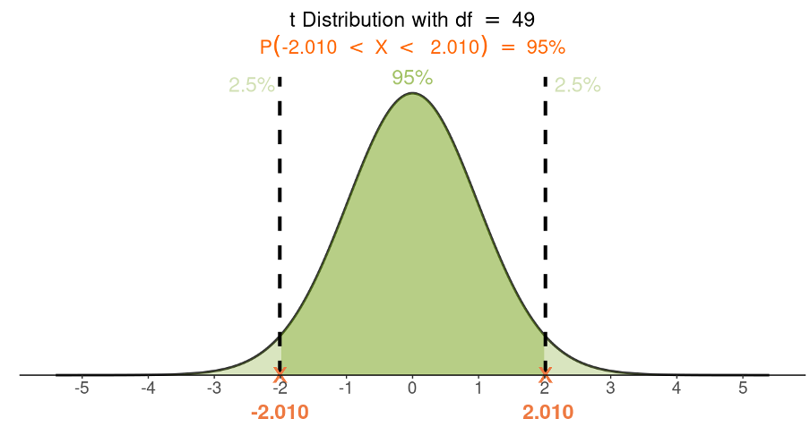

```{r setup, include=FALSE}
library(knitr)

options(htmltools.dir.version = FALSE)
options(digits = 4, scipen = 2)
options(knitr.table.format = "html")

knitr::opts_chunk$set(
  echo = FALSE,
  warning = FALSE, message = FALSE,
  cache = FALSE,
  dev = "png",
  fig.align = 'center',
  fig.height = 5, fig.width = 6,
  out.width = "80%",
  dpi = 300
)
```

```{r xaringan-panelset, echo=FALSE}
xaringanExtra::use_panelset()
```

```{r xaringan-themer, include = FALSE}
library(xaringanthemer)
style_mono_accent(
  base_color = "#0F4C81", # DAPR1
  # base_color = "#BF1932", # DAPR2
  # base_color = "#88B04B", # DAPR3 
  # base_color = "#FCBB06", # USMR
  # base_color = "#a41ae4", # MSMR
  header_color = "#000000",
  header_font_google = google_font("Source Sans Pro"),
  header_font_weight = 400,
  text_font_google = google_font("Source Sans Pro", "400", "400i", "600", "600i"),
  code_font_google = google_font("Source Code Pro"),
  outfile = "un-xaringan-themer.css"
)
```


```{r preamble, echo=FALSE, warning=FALSE, message=FALSE}
library(tidyverse)
library(patchwork)

theme_set(
    theme_classic(base_size = 15) +
    theme(plot.title = element_text(hjust = 0.5))
)
```


# Course Overview

.pull-left[

```{r echo = FALSE, results='asis'}
block1_name = "Exploratory Data Analysis"
block1_lecs = c("Research design and data",
                "Describing categorical data",
                "Describing continuous data",
                "Describing relationships",
                "Functions")
block2_name = "Probability"
block2_lecs = c("Probability theory",
                "Probability rules",
                "Random variables (discrete)",
                "Random variables (continuous)",
                "Sampling")

source("https://raw.githubusercontent.com/uoepsy/junk/main/R/course_table.R")
course_table(block1_name,block2_name,block1_lecs,block2_lecs,week=11)
```

]

.pull-right[

```{r echo = FALSE, results='asis'}
block3_name = "Foundations of inference"
block3_lecs = c("Confidence intervals",
                "Hypothesis testing (p-values)",
                "Hypothesis testing (critical values)",
                "Hypothesis testing and confidence intervals",
                "Errors, power, effect size, assumptions")
block4_name = "Common hypothesis tests"
block4_lecs = c("One sample t-test",
                "Independent samples t-test",
                "Paired samples t-test",
                "Chi-square tests",
                "Correlation")

source("https://raw.githubusercontent.com/uoepsy/junk/main/R/course_table.R")
course_table(block3_name,block4_name,block3_lecs,block4_lecs,week=4)
```

]


---
# Learning objectives

1. Interpret a confidence interval as the plausible values of a parameter that would not be rejected in a two-sided hypothesis test.

1. Determine the decision for a two-sided hypothesis test from an appropriately constructed confidence interval.

1. Be able to explain the difference between a significant result and an important result.


---
class: inverse, center, middle

---
class: inverse, center, middle

# Part A
## Introduction


---
# Population vs Sample

- We performed a study by selecting a sample from the population.

- The goal is to use the sample data to answer questions about the population data. For example:

    + What's the population mean? __Goal A:__ estimating a parameter.
    
    + Could the population mean be zero? __Goal B:__ testing a theory (hypothesis) about a parameter.
    

---
# Confidence interval

```{r out.width = '15%', fig.cap = 'Figure 1. Invisible lady walking her dog.'}
knitr::include_graphics("images/pimpa-1.png")
```

.pull-left[
- We said that the SE of the mean measures how far $\bar x$ is likely to be from the population mean $\mu$.

- Figure 1 is a drawing of an invisible lady walking her dog. The dog, which is visible, is on a leash. The leash is such that the dog is within $t^* \cdot SE$ of the lady 95% of the time.

- __In one picture__ we can see the dog, but we would like to know where the lady is.
]

.pull-right[
- Since the lady and the dog are usually within $t^* \cdot SE$ of each other, we can take the following interval as a range that would __typically__ include the lady:

    $$[\textrm{dog} - t^* \cdot SE , \ \textrm{dog} + t^* \cdot SE]$$

    or, in short:

    $$\textrm{dog} \pm t^* \cdot SE$$

- We could say that we are 95% confident that the lady is within this interval.

]

???

picture (= one sample) 

If the dog pulls too hard or the lady drops the leash, the position of the lady may not be within that interval.


---
# Confidence interval

- We have one picture, which corresponds to one sample.

- We would like to know the value of the population mean $\mu$, which corresponds to the invisible lady, but we cannot directly observe it.

- We can however see the sample mean $\bar x$, corresponding to the dog.

- We use what we can see, $\bar x$, along with its standard error, as a way of constructing an interval that we hope will include what we cannot see, i.e. the population mean $\mu$.

- The interval $\textrm{dog} \pm t^* \cdot SE$ is a 95% confidence interval for the position of the lady.

- The interval $\bar x \pm t^* \cdot SE$ is a 95% confidence interval for the population mean $\mu$. 

    + Recall that the standard error of the mean is computed as $SE = s / \sqrt{n}$.


---
# Hypothesis testing

.pull-left[
Consider this example:

- Sample of $n = 30$, with mean $\bar x = 47$ and $s = 5.5$

- Want to test whether
$$H_0 : \mu = 50 \\ H_1: \mu \neq 50$$

- $SE = s / \sqrt n = 5.5 / \sqrt{30} = 1.004$

- $t = t_{obs} = \frac{47 - 50}{1.004} = -2.99$

- The sample mean (47) is about 3 standard errors smaller than the claimed mean (50)
]

.pull-right[
```{r out.width='100%'}
library(tidyverse)

xbar = 47
se = 5.5 / sqrt(30)
mu0 = 50
tobs = (xbar - mu0) / se

xs = seq(45, 55, by = 0.01)
ys = dnorm(xs, mean = mu0, sd = se)

tvals = seq(-4, 4, 1)
xvals = round(tvals * se + mu0, 0)

plot(xs, ys, type = 'n', frame.plot = FALSE, axes = FALSE, 
     xlab = "", ylab = "")
polygon(xs, ys, col='gray90', border = NA)
lines(xs, ys, type = 'l', lwd = 2)
axis(side=1, at=xvals, labels=NA)
mtext(side=1, text = xvals, at = xvals, adj = 0.5, padj = 1.3, col = 'black')
mtext(side=1, text = tvals, at = xvals, adj = 0.5, padj = 4, col = 'blue')
abline(v = xbar, col = 'blue', lwd = 2)
text(53, 0.38, label = expression(bar(x) * ' ' * values), col = 'black', 
     cex = 1.1, adj = 0)
text(53, 0.35, label = expression(t * ' ' * values), col = 'blue', 
     cex = 1.1, adj = 0)
text(xbar, 0.10, label = expression(bar(x) == 47), col = 'black', 
     cex = 1.1, adj = 1.18)
text(xbar, 0.07, label = expression(t[obs] == -2.99), col = 'blue', 
     cex = 1.1, adj = 1.1)

arrows(50, 0.1, 50, 0, col = 'black')
text(50, 0.15, label = 'Hypothesised mean\nmu = 50',
     col = 'black', cex = 1.1)
```
]

---
# Hypothesis testing

.pull-left[
- Critical values for a $t(29)$ distribution with $\alpha = 0.05$:

```{r echo=T}
tstar <- qt(c(0.025, 0.975), df = 29)
tstar
```

- As $t_{obs} \leq -t^*$, we reject $H_0$.

]

.pull-right[
```{r out.width='100%'}
library(tidyverse)

xbar = 47
se = 5.5 / sqrt(30)
mu0 = 50
tobs = (xbar - mu0) / se

xs = seq(45, 55, by = 0.01)
ys = dnorm(xs, mean = mu0, sd = se)

tvals = seq(-4, 4, 1)
xvals = round(tvals * se + mu0, 0)

plot(xs, ys, type = 'n', frame.plot = FALSE, axes = FALSE, 
     xlab = "", ylab = "")
polygon(xs, ys, col='gray90', border = NA)
lines(xs, ys, type = 'l', lwd = 2)
axis(side=1, at=xvals, labels=NA)
mtext(side=1, text = xvals, at = xvals, adj = 0.5, padj = 1.3, col = 'white')
mtext(side=1, text = tvals, at = xvals, adj = 0.5, padj = 4, col = 'blue')
abline(v = xbar, col = 'blue', lwd = 2)
abline(v = tstar * se + mu0, col = 'red', lwd = 2, lty = 2)
text(53, 0.38, label = expression(bar(x) * ' ' * values), col = 'white', 
     cex = 1.1, adj = 0)
text(53, 0.35, label = expression(t * ' ' * values), col = 'blue', 
     cex = 1.1, adj = 0)
text(xbar, 0.10, label = expression(bar(x) == 47), col = 'white', 
     cex = 1.1, adj = 1.18)
text(xbar, 0.07, label = expression(t[obs] == -2.99), col = 'blue', 
     cex = 1.1, adj = 1.1)
text(tstar[1] * se + mu0 + 0.4, 0.015, label = expression(-t~'*'), col = 'red')
text(tstar[2] * se + mu0 - 0.4, 0.015, label = expression(+t~'*'), col = 'red')

# arrows(50, 0.1, 50, 0, col = 'black')
# text(50, 0.15, label = 'Hypothesised mean\nmu = 50', 
#      col = 'black', cex = 1.1)
```
]


---
# Is there a connection between $t^*$ in CI and HT?

You might be wondering: is there a connection between the below?

1. the $\pm t^*$ that are used to build a 95% CI
2. the $\pm t^*$ that are called _critical values_ for a two-sided HT of $H_0 : \mu = \mu_0$ vs $H_1 : \mu \neq \mu_0$?

```{r, out.width = '50%'}

```

The answer is yes! Both are the quantiles of the same t distribution. For (1), we see them as the quantiles having an area of 0.95 in between them. For (2) we see them as the quantiles having an area of 0.05 in the tails.

---
class: inverse, center, middle

---
class: inverse, center, middle

# Part B
## Hypothesis testing & Confidence intervals


---
# Hypothesis testing

- Consider again the following example, where we wish to test the following claim at the $\alpha = 0.05$ significance level:
$$H_0: \mu = \mu_0 \qquad \text{vs} \qquad H_1 : \mu \neq \mu_0$$

--

- We start by computing the observed value of the t-statistic for our sample:

$$t = t_{obs} = \frac{\bar x - \mu_0}{s / \sqrt n}$$

--

.pull-left[
<center>__P-value method__</center>
- Compute the p-value, i.e. probability of obtaining a test statistic at least as extreme as the observed one, when $H_0$ is true.

    ```
    2 * pt(abs(tobs), df = n-1, lower.tail = FALSE)
    ```
- Make a decision:

    + Reject $H_0$ if $p \leq \alpha$
    + Do not reject $H_0$ if $p > \alpha$
]

.pull-right[
<center>__Critical value method__</center>
- Compute the lower and upper critical values $-t^*$ and $t^*$:

    ```
    qt(c(0.025, 0.975), df = n-1)
    ```

- Make a decision:

    + Reject $H_0$ if $t \leq -t^*$ or $t \geq +t^*$
    + Do not reject $H_0$ if $-t^* < t < +t^*$
]

---
# Hypothesis testing

- __Do not reject $H_0 : \mu = \mu_0$ if:__

$$-t^* < t < +t^*$$
$$-t^* < \frac{\bar x - \mu_0}{\frac{s}{\sqrt n}} < +t^*$$
$$-t^* \cdot \frac{s}{\sqrt n} < \bar x - \mu_0 < +t^* \cdot \frac{s}{\sqrt n}$$

$$-\bar x -t^* \cdot \frac{s}{\sqrt n} < - \mu_0 < -\bar x + t^* \cdot \frac{s}{\sqrt n}$$

$$\bar x + t^* \cdot \frac{s}{\sqrt n} > \mu_0 > \bar x - t^* \cdot \frac{s}{\sqrt n}$$

$$\bar x - t^* \cdot \frac{s}{\sqrt n} < \mu_0 < \bar x + t^* \cdot \frac{s}{\sqrt n}$$


---
# Hypothesis testing


.pull-left[
- __Do not reject $H_0 : \mu = \mu_0$ when:__

$$\underbrace{\bar x - t^* \cdot \frac{s}{\sqrt n}}_{\text{lower limit of CI}} < \mu_0 < \underbrace{\bar x + t^* \cdot \frac{s}{\sqrt n}}_{\text{upper limit of CI}}$$
]


.pull-right[
- __Reject $H_0 : \mu = \mu_0$ when either:__

$$\mu_0 \geq \underbrace{\bar x + t^* \cdot \frac{s}{\sqrt n}}_{\text{upper limit of CI}}$$
$\qquad \text{or}$

$$\mu_0 \leq \underbrace{\bar x - t^* \cdot \frac{s}{\sqrt n}}_{\text{lower limit of CI}}$$
]


--

- That is, we __do not reject $H_0$__ when $\mu_0$ lies within the CI:

$$\text{Do not reject } H_0 \text{ if }  
\left[ 
\bar x - t^* \cdot \frac{s}{\sqrt n}, \ \ 
\bar x + t^* \cdot \frac{s}{\sqrt n}
\right]\text{ includes } \mu_0$$


---
class: inverse, center, middle

---
class: inverse, center, middle

# Part C
## Significance vs Importance

---
# Body temperature example

- Recall the body temperature study, where the goal was to assess whether the sample data provide evidence, at the 5% significance level, that the population mean body temperature for healthy humans changed from the long thought 37 °C.

--

- Data:

```{r, echo=TRUE}
library(tidyverse)
tempsample <- read_csv('https://uoepsy.github.io/data/BodyTemperatures.csv')
tempsample <- tempsample |> drop_na(BodyTemp)
```

.pull-left[
```{r, echo=TRUE}
head(tempsample)
```
]

.pull-right[
```{r, echo=TRUE}
nrow(tempsample)
```
]


---
# Body temperature example

.pull-left[
- Null and alternative hypotheses:
$$H_0 : \mu = 37 \\ H_1 : \mu \neq 37$$

- Chosen significance level: $\alpha = 0.05$

- Test statistic:
$$t = \frac{\bar x - 37}{s / \sqrt{n}}$$
]

.pull-right[
```{r echo=TRUE}
n <- nrow(tempsample)
xbar <- mean(tempsample$BodyTemp)
s <- sd(tempsample$BodyTemp)
se <- s / sqrt(n)

mu0 <- 37
tobs <- (xbar - mu0) / se
tobs
```
]

---
# Body temperature example

If you prefer to use tidyverse, you could equivalently do:

```{r}
options(pillar.sigfig = 4)
```

```{r echo=TRUE}
stats <- tempsample |>
    summarise(
        n = n(),
        xbar = mean(BodyTemp),
        s = sd(BodyTemp),
        se = s / sqrt(n),
        mu0 = 37,
        tobs = (xbar - mu0) / se
    )
stats
```


---
# Body temperature example

- Recall the value of the t-statistic for the observed sample:

```{r, echo=T}
tobs
```

--

- To make a decision, we compare the observed t-statistic, $t = -3.141$, to the critical values $\pm t^*$ from a $t(49)$ distribution.

```{r, echo=T}
tstar <- qt(c(0.025, 0.975), df = n - 1)
tstar
```

--

- Two-sided alternative, so we ask: is the observed $t$ __as or more extreme__ than the two critical values? 

    + Is $t \leq -t^*$ or $t \geq t^*$? 
    
    + Yes, so reject $H_0$.
    
---
# Body temperature example


```{r out.width='50%'}
plt <- tibble(
    x = seq(-5, 5, 0.1),
    y = dt(x, n-1),
)

plt.tstar <- qt(c(0.025, 0.975), n-1)

ggplot(plt, aes(x = x, y = y)) +
    geom_line(color = 'black') +
    geom_vline(xintercept =  plt.tstar, color = 'red', linetype = "dashed") + 
    geom_vline(xintercept = tobs, color = 'blue') +
    labs(x = 't-statistic', y = 'Density') +
    annotate('text', x = plt.tstar, y = c(0.02, 0.02), label = c('-t*', 't*'),
             color = 'red', size = 6, adj = -0.5) +
    annotate('text', x = tobs, y = 0.02, label = 't',
             color = 'blue', size = 6, adj = 1.5)
```


---
# Body temperature example

- If you were to compute the p-value, you would reach the same conclusion.

```{r, echo=T}
pvalue <- 2 * pt( abs(tobs), df = n - 1, lower.tail = FALSE)
pvalue
```

- We could say:

> Let $\mu$ denote the mean body temperature of all healthy humans. At the 5% significance level, we performed a one-sample t-test of $H_0 : \mu = 37$ against $H_1 : \mu \neq 37$. The sample data provided very strong evidence to reject the null hypothesis in favour of the alternative one that the mean body temperature of healthy humans is different from the long thought 37 °C; $t(49) = -3.14, p = .003$, two-sided.

---
# Body temperature example

- At the $\alpha = 0.05$ significance level, the sample data provide very strong evidence to reject $H_0 : \mu = 37$ in favour of $H_1 : \mu \neq 37$.

--

- However, this doesn't give us any idea of what the actual population mean may be. It just tells us there is very strong evidence that it's not 37 °C.

--

> __Good practice__  
> When you find a statistically significant result, it is good practice to follow-up the hypothesis test with a confidence interval, in order to provide the reader with an idea of what a plausible value of the population parameter may be.

.pull-left[
```{r, echo=T}
tstar <- qt(c(0.025, 0.975), df = n - 1)
tstar
```
]

.pull-right[
```{r, echo=T}
xbar + tstar * se
```
]

- We are 95% confident that the population mean body temperature for healthy humans is between 36.69 °C and 36.93 °C.


---
# Hypothesis testing and Confidence intervals

- Notice that the 95% confidence interval [36.69, 36.93] does not include the hypothesised value in the null hypothesis (37).

    + As 37 is not within [36.69, 36.93], we reject the null hypothesis $(H_0 : \mu = 37)$ at the 5% significance level.

--

- The 95% CI gives us a range of plausible values for the population mean.

--

- As the claimed value 37 is not within the range, that is not a plausible value for $\mu$. If you test whether the population mean could be equal to 37, you end up rejecting that value.

--

- __Generic fact:__  
The 95% CI gives you a range of values for the parameter that would __not__ be rejected at the 5% significance level in a two-sided hypothesis test.


---
# Body temperature example

- The p-value is .003, indicating that the sample data provide very strong evidence that the population mean is significantly different from 37 °C.

    + This is about __statistical significance__
    
    + That is, the result is _very unlikely_ to come from a population where $H_0$ is true and the discrepancy between the sample and population mean is only due to random sampling.

--

- We are 95% confident that the population mean body temperature for healthy humans is between 36.69 °C and 36.93 °C.

    + The confidence interval tells us that perhaps the true population mean body temperature is somewhere in between 36.69 and 36.93, rather than 37.
    
    + Is this departure from 37 big enough to be of any practical impact for decision makers? 
    
    + Pretty much no, it's negligible.
    
    + The result, while being significant, is not an __important__ result.
    
    + Hence, statistical significance is different from practical significance (which we call importance), and a statistically significant result may not be of practical significance at all.
    
---
# Significance vs Importance

- In scientific research, and in this course too, the word __significance__ has a special meaning which is different from its everyday language meaning.

- It is a keyword reserved to mean __statistical significance__, i.e. the sample results being unlikely to be observed just because of random variation due to sampling when in fact $H_0$ is true in the population.

- This is __not__ the same meaning as the sample results being __important__ or __practically significant__.


---
# Significance vs Importance

- You can have a significant result, but this doesn't necessarily mean that it's __important__. 

    + It's good practice to always follow-up a significant result (i.e. when you reject the null hypothesis) with a confidence interval, to provide the reader with a measure of the "magnitude" of the departure from the hypothesised value $H_0 : \mu = \mu_0$.
    
    + In our case, the 95% confidence interval [36.69, 36.93] °C indicates that the departure from the currently accepted standard of 37 °C is not that big to be of much impact for decision makers.
    
    + This is an example of a statistically significant result that is not of practical importance.
    
???

We could say that we are 95% confident that the population mean is [`r sort(37 - c(36.69, 36.93))`] smaller than 37.
    

---
# Why both?

- If a confidence interval can also be used to perform a hypothesis test, why do we need both?

--

- The answer is that they both provide useful and complementary information.

    + A p-value gives you the __strength of evidence__ that the sample data bring against the null hypothesis. This is not conveyed by a confidence interval.
    
    + The confidence interval gives you an idea of the "magnitude" of the population parameter, which the hypothesis test doesn't convey.

--

- In summary, report both if you have a significant result, i.e. if you reject the null hypothesis!

    + Always follow up a significant hypothesis test with a confidence interval.
    
    + _Side note_. If the hypothesis test is not significant, and you do not reject $H_0 : \mu = 0$ say, then you do have an idea about the magnitude of the population mean. In fact, by not rejecting the claim that $\mu = 0$ you are told that 0 is a plausible value for the population mean.


---
# This week

.pull-left[

### Tasks

- Attend both lectures

- Attend your lab and work together on the lab tasks
    - Tip: read the worked example in advance!
    - Reminder: Formative Report C will be due 12 noon on 13 February 2026 (next week)

- Complete any lecture activities and/or readings

- Complete the weekly quiz
    + Opens Monday at 9am
    + Closes Sunday at 5pm

<!-- - Submit Formative Report A by 12 noon on Friday the 18th of October 2024 -->
<!-- - Submit Formative Report B by 12 noon on Friday the 29th of November 2024 -->
<!-- - Submit Formative Report C by 12 noon on Friday the 14th of February 2025 -->
<!-- - Submit the Assessed Report by 12 noon on Friday the 28th of March 2025 -->
]


.pull-right[

### Support

- **Office hours**: for one-to-one support on course materials or assessments<br>(see LEARN > Course information > Course contacts)

- **Piazza**: help each other on this peer-to-peer discussion forum

- **Student Adviser**: for general support while you are at university<br>(find your student adviser on MyEd/Euclid)
]

