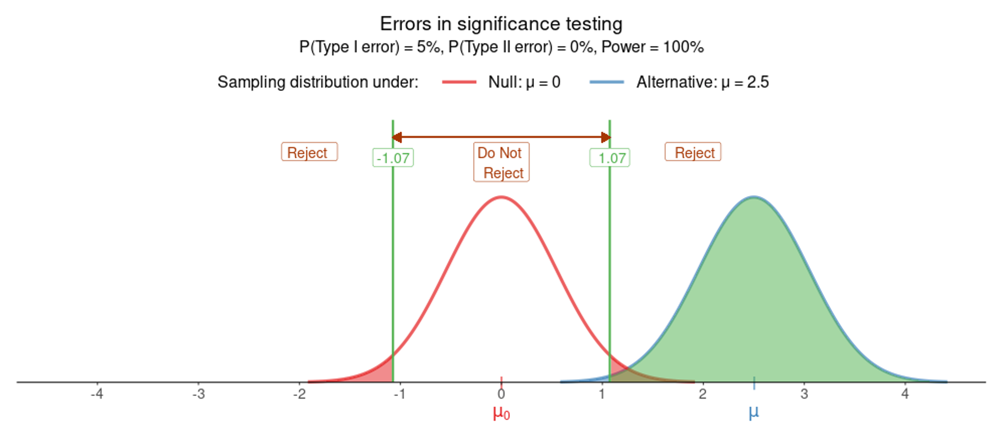
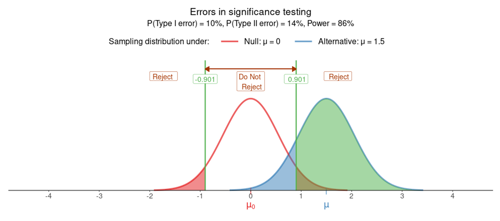

```{r setup, include=FALSE}
library(knitr)

options(htmltools.dir.version = FALSE)
options(digits = 4, scipen = 2)
options(knitr.table.format = "html")

knitr::opts_chunk$set(
  echo = FALSE,
  warning = FALSE, message = FALSE,
  cache = FALSE,
  dev = "png",
  fig.align = 'center',
  fig.height = 5, fig.width = 6,
  out.width = "80%",
  dpi = 300
)
```

```{r xaringan-panelset, echo=FALSE}
xaringanExtra::use_panelset()
```

```{r xaringan-themer, include = FALSE}
library(xaringanthemer)
style_mono_accent(
  base_color = "#0F4C81", # DAPR1
  # base_color = "#BF1932", # DAPR2
  # base_color = "#88B04B", # DAPR3 
  # base_color = "#FCBB06", # USMR
  # base_color = "#a41ae4", # MSMR
  header_color = "#000000",
  header_font_google = google_font("Source Sans Pro"),
  header_font_weight = 400,
  text_font_google = google_font("Source Sans Pro", "400", "400i", "600", "600i"),
  code_font_google = google_font("Source Code Pro"),
  outfile = "un-xaringan-themer.css"
)
```


```{r preamble, echo=FALSE, warning=FALSE, message=FALSE}
library(tidyverse)
library(patchwork)

theme_set(
    theme_classic(base_size = 15) +
    theme(plot.title = element_text(hjust = 0.5))
)
```


# Learning objectives

1. Understand what are Type I and Type II errors in hypothesis testing.

1. Recognise the significance level as measuring the tolerable chance of committing a Type I error.

1. Recognise the effect of sample size on power.

1. Be able to check the assumptions underlying the t-test for a population mean.


---
class: inverse, center, middle

---
class: inverse, center, middle

# Part A
## Errors and Power


---
# Where we're going to

- Hypothesis testing lets us determine whether, for example, an observed difference between a sample mean and an hypothesised value is real or just due to random sampling variation.

--

- However, statistical significance sometimes may lead us to wrong conclusions!

--

- It is possible to make two kinds of wrong decisions:

--

  - rejecting a true null hypothesis 
  
--

  - not rejecting a false null hypothesis

--

- This week we will discuss common pitfalls of hypothesis testing, as well as the factors that influence the probability of committing these errors.


---
# Errors in hypothesis testing

- Whether your decision is either to (a) reject the null hypothesis or (b) not reject the null hypothesis, you might be making an error.

--

- The reasoning of hypothesis tests often is compared to that of a court trial. The possibilities in such a trial are given in the following diagram.

<br>

- Possible outcomes of testing $H_0 : \text{Defendant = Not guilty}$:

```{r}
knitr::include_graphics('images/tbl1.png')
```


---
# Errors in hypothesis testing

- In our system of justice, convicting an innocent person is considered worse than letting a guilty person go.

<br>

- Possible outcomes of testing $H_0 : \text{Defendant = Not guilty}$:

```{r}
knitr::include_graphics('images/tbl2.png')
```


---
# Errors in hypothesis testing

- Similarly, there are two types of errors in hypothesis testing.

  - You could convict an innocent (true) null hypothesis
  
  - You could fail to convict a guilty (false) null hypothesis

--

- Like convicting an innocent person, the error of rejecting a true null hypothesis is considered serious, and so a null hypothesis isn't rejected unless the evidence against it is convincing beyond a reasonable doubt.


---
# Errors in hypothesis testing

- Possible outcomes of testing $H_0 : \mu = \mu_0$

```{r}
knitr::include_graphics('images/tbl3.png')
```


---
# When is a Type II error worse?

- Sometimes, we are more worried about committing a Type II error than a Type I error.

    + This is application-specific, but it happens less often in practice.
    
    + Think about your particular study.
    
```{r}
knitr::include_graphics('images/ht-errors-type2.png')
```


---
# When is a Type II error worse?

- Null hypothesis: Patient is not diabetic

- Alternative hypothesis: Patient is diabetic

- __Type I error__ = __False Positive__:

    + a test that indicates a patient has diabetes when in reality they don't.

- __Type II error__ = __False Negative__:

    + a test that indicates the patient does not have diabeteswhen in fact they do have it. That is, a test that fails to detect an actual diabetic.

    + More of concern, as a person will not receive available treatments.

---
# Errors in hypothesis testing

- Whether your decision is either to reject the null hypothesis or to not reject the null hypothesis, you might be making an error.

    + You make a **Type I error** when you reject a true null hypothesis

    + You make a **Type II error** when you don't reject a false null hypothesis


---
# The setting

```{r}
knitr::include_graphics('images/e1.png')
```

---
# The setting

```{r}
knitr::include_graphics('images/e2.png')
```

---
# The setting

```{r}
knitr::include_graphics('images/e3.png')
```

---
# The setting

```{r}
knitr::include_graphics('images/e4.png')
```

---
# The setting

```{r}
knitr::include_graphics('images/e5.png')
```

---
# The setting

```{r}
knitr::include_graphics('images/e6.png')
```

---
# The setting

```{r}

```

---
# The setting

```{r}
knitr::include_graphics('images/e8.png')
```

---
# The setting

```{r}
knitr::include_graphics('images/e9.png')
```

---
# The setting

```{r}
knitr::include_graphics('images/e10.png')
```


---
# The setting

```{r}
knitr::include_graphics('images/e8.png')
```

---
# The setting

```{r}

```


---
# In symbols

**Probability of Type I error**

- The significance level $\alpha$ represents the tolerable probability of committing a Type I error

$$\alpha = P(\text{Reject } H_0 \mid H_0 \text{ is true}) = P(\text{Type I error})$$

- If you are worried about committing a Type I error, then your best strategy is to have a low significance level.


**Probability of Type II error**

- The probability of committing a Type II error is denoted 

$$\beta = P(\text{Do not reject } H_0 \mid H_0 \text{ is false}) = P(\text{Type II error})$$

- If the null hypothesis is false, setting a low significance level increases the probability of making a Type II error.


---
# In symbols

The power of a test is the probability that the test correctly rejects a **false** null hypothesis.

$$
\begin{aligned}
\text{Power} 
&= P(\text{Reject }H_0 \mid H_0 \text{ is false}) \\
&= 1 - P(\text{Do not reject }H_0 \mid H_0 \text{ is false}) \\
&= 1 - \beta
\end{aligned}
$$

<br>

Recall, instead, that the probability of rejecting a **true** null hypothesis is the significance level:

$$
\alpha = P(\text{Reject }H_0 \mid H_0 \text{ is true})
$$
Do not confuse the two!


---
# Recap

```{r echo=FALSE, out.width = '75%'}
knitr::include_graphics('images/ht-errors-table-2.png')
```


---

# Factors affecting power

- Power increases as the sample size increases, all else being held constant. 

  This is because the distributions of the sample statistics become "narrower", and there will be less statistics on the left of the critical value.

--

- Power increases as the value of $\alpha$ increases, all else being held constant.

--

- Power increases when the true value of the parameter is farther from the hypothesised value in the null.
  
--

You cannot change the distance of the parameter from the null, so you can increase power by either taking a larger sample size, or making $\alpha$ larger (the latter however is not good practice).


---

# Significance level and errors


**IDEALLY**

While we wish to avoid both types of errors ...

--

**IN REALITY**

... in reality we have to accept some trade-off between them. 

--

- If we make it very hard to reject $H_0$, we could reduce the chance of making a Type I error, but then we would make Type II errors more often. 

- On the other hand, making it easier to reject $H_0$ would reduce the chance of making a Type II error, but increase the chance of making a Type I error and we would end up rejecting too many $H_0$'s that were actually true. 

- This balance is set by how easy or hard it is to reject $H_0$, which is exactly determined by the significance level!


---
class: inverse, center, middle

---
class: inverse, center, middle

# Part B
## Effect size


---
# Effect size

- We saw that a statistically significant result may not be important at all, i.e. may not have much real-world value.
    
    + Importance is related to the practical distance between the hypothesised value and the result found.
    
    + A difference between $\bar x$ and $\mu_0$ can be statistically significant and yet be too small in actual units to be of much importance

--

__Formal effect size index: Cohen's D__  

- Cohen's $D$ was introduced as a measure of "effect size", to report whether the result may be of real-world value or not.

- For a test of __one population mean__ this has the form:

$$D = \frac{\bar x - \mu_0}{s}$$

that is, the difference between the sample and the hypothesised mean, measured in units of the __standard deviation__. (Careful: not the standard error!)

---
# Effect size

- Why not just the difference $\bar x - \mu_0$?

--

- It depends on the units of measurement of the data.

--

- __Scenario 1__: 5 - 3 = 2

--

- __Scenario 2__: 50000 - 49998 = 2

--

- Clearly a difference of 2 in Scenario 1 is of higher practical impact, while a difference of 2 is of lower practical impact.

--

- Dividing by the SD of the data, which is in the same units of measurements as the data, you get a measure that does not depend on the unit of measurement.

---
# Effect size

Some rough guidelines on how to interpret the size of the effect:

| Verbal label | Magnitude of $D$ |
|:-------------|:-----------------|
| Small        | $d \leq 0.20$    |
| Medium       | $d \approx 0.50$ (e.g., $D$ between 0.20 and 0.79)   |
| Large        | $d \geq 0.80$    |


---
class: inverse, center, middle

---
class: inverse, center, middle

# Part C
## The t-test assumptions


---
# The t-test assumptions

- Check the technical conditions before interpreting the t-test results. If those are violated, the results may be incorrect.

--

- The results from the t-test for a population mean are valid when:

    1. When the obtained sample data are a random sample from population of interest
    
        + (This is called "independence" by some authors.)

    2. _Either_ the population follows a normal distribution _or_ the sample size is sufficiently large ($n \geq 30$ as a guideline)
    
        + (This is called "normality" by some authors, but the goal is normality of the sampling distribution of the mean)


---
# Random sample

- Consider whether or not the sample was randomly selected from the population of interest before generalizing the test conclusion to that population.


---
# Normality of sampling distribution of the mean

- All our formulas for confidence intervals and hypothesis testing started from the prerequisite that, when the population data are known, the sampling distribution of the mean is normal:

$$\bar X \sim N(0, \frac{\sigma}{\sqrt n})$$

--

- From this prerequisite, we derived a similar distribution to the standard normal distribution, called the __t-distribution__. We used the t-distribution when the population data are not known.

--

__Key question__  

- When is the sample mean normally distributed?


---
# The t-test assumptions

__Key question__  

- When is the sample mean normally distributed?


__Answer__

1. When the data are a simple random sample from population of interest

2. Either the population follows a normal distribution or the sample size is sufficiently large ($n \geq 30$ as a guideline)

When EITHER one of these holds:

- The sample size is large enough ($n \geq 30$ as a guideline)

    + irrespectively of the distribution of the population data

- The population data are normally distributed

    + irrespectively of the sample size

---
# Large enough sample size

.pull-left[
```{r, out.width = '100%', fig.height = 8, fig.width = 8}
set.seed(0)

par(mfrow = c(4, 1), 
    oma = c(1,5,2,3),
    mar = c(5,0,2,0))

x <- rchisq(10000, 4)
hist(x, main = "Population data", col = 'lightblue', border = 'lightblue4', breaks = 30,
     xlab = "Data")

fcn <- function(n, XLIM) {
  
  s1 <- replicate( 1000, mean(sample(x, size = n)) )
  
  hist(s1, breaks = 20, 
       col = 'darkolivegreen2', border = 'darkolivegreen4',
       main = paste0("Means from samples of size n = ", n, " each"),
       xlab = "Means", xlim = XLIM)
}

XLIM = c(0, 20)

fcn(5, XLIM)

fcn(30, XLIM)

fcn(100, XLIM)
```
]

.pull-right[
```{r, out.width = '100%', fig.height = 8, fig.width = 8}
set.seed(0)

par(mfrow = c(4, 1), 
    oma = c(1,5,2,3),
    mar = c(5,0,2,0))

x <- runif(10000, 10, 20)
hist(x, main = "Population data", col = 'lightblue', border = 'lightblue4', breaks = 30,
     xlab = "Data")

fcn <- function(n, XLIM) {
  
  s1 <- replicate( 1000, mean(sample(x, size = n)) )
  
  hist(s1, breaks = 20, 
       col = 'darkolivegreen2', border = 'darkolivegreen4',
       main = paste0("Means from samples of size n = ", n, " each"),
       xlab = "Means", xlim = XLIM)
}

XLIM = c(10, 20)

fcn(2, XLIM)

fcn(30, XLIM)

fcn(100, XLIM)
```
]


---
# Population data normally distributed

.pull-left[
```{r, out.width = '100%', fig.height = 8, fig.width = 8}
set.seed(0)

par(mfrow = c(4, 1), 
    oma = c(1,5,2,3),
    mar = c(5,0,2,0))

x <- rnorm(10000, 12, 2)
hist(x, main = "Population data", col = 'lightblue', border = 'lightblue4', breaks = 30,
     xlab = "Data")

fcn <- function(n, XLIM) {
  
  s1 <- replicate( 1000, mean(sample(x, size = n)) )
  
  hist(s1, breaks = 20, 
       col = 'darkolivegreen2', border = 'darkolivegreen4',
       main = paste0("Means from samples of size n = ", n, " each"),
       xlab = "Means", xlim = XLIM)
}

XLIM = c(5, 20)

fcn(1, XLIM)

fcn(2, XLIM)

fcn(5, XLIM)
```
]


.pull-right[
```{r, out.width = '100%', fig.height = 8, fig.width = 8}
set.seed(0)

par(mfrow = c(4, 1), 
    oma = c(1,5,2,3),
    mar = c(5,0,2,0))

x <- rnorm(10000, 12, 2)
hist(x, main = "Population data", col = 'lightblue', border = 'lightblue4', breaks = 30,
     xlab = "Data")

fcn <- function(n, XLIM) {
  
  s1 <- replicate( 1000, mean(sample(x, size = n)) )
  
  hist(s1, breaks = 20, 
       col = 'darkolivegreen2', border = 'darkolivegreen4',
       main = paste0("Means from samples of size n = ", n, " each"),
       xlab = "Means", xlim = XLIM)
}

XLIM = c(5, 20)

fcn(5, XLIM)

fcn(30, XLIM)

fcn(100, XLIM)
```
]

---
# Checking for normality of the population data

- Example data: a sample of 30 IQ scores:

```{r}
iq_sample <- tibble(iq = rnorm(30, 100, 15))
```

```{r echo=T}
head(iq_sample)
```


---
# Checking for normality of the population data

.pull-left[
Histogram

```{r echo=T}
ggplot(iq_sample, aes(x = iq)) + 
    geom_histogram()
```


]


.pull-right[
Density

```{r echo=T}
ggplot(iq_sample, aes(x = iq)) + 
    geom_density()
```
]

---
# Checking for normality of the population data

Quantile-Quantile plot (qq-plot): the points should roughly follow the line.

.pull-left[
```{r echo=T, eval=F}
ggplot(iq_sample, aes(sample = iq)) + 
    geom_qq() +
    geom_qq_line()
```
]

.pull-right[
```{r echo=F}
ggplot(iq_sample, aes(sample = iq)) + 
    geom_qq() +
    geom_qq_line()
```
]

---
# Shapiro-Wilk normality test

Another hypothesis test, but this time:

- the null hypothesis states that the population data follow a normal distribution
- the alternative hypothesis states that the population data do not follow a normal distribution


```{r}
shapiro.test(iq_sample$iq)
```

At the 5% significance level, we performed a Shapiro-Wilk test against the null hypothesis of normality of the population data: $W = 0.94, p = 0.1$. The sample data do not provide sufficient evidence to reject the null hypothesis of normality in the population.

---
class: inverse, center, middle
