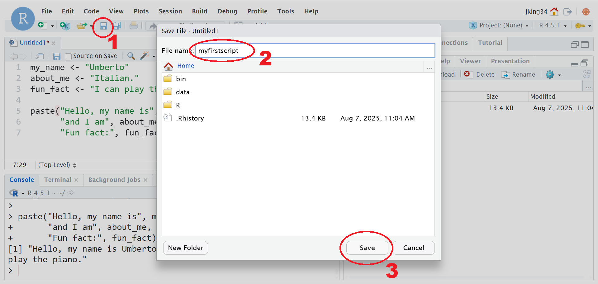
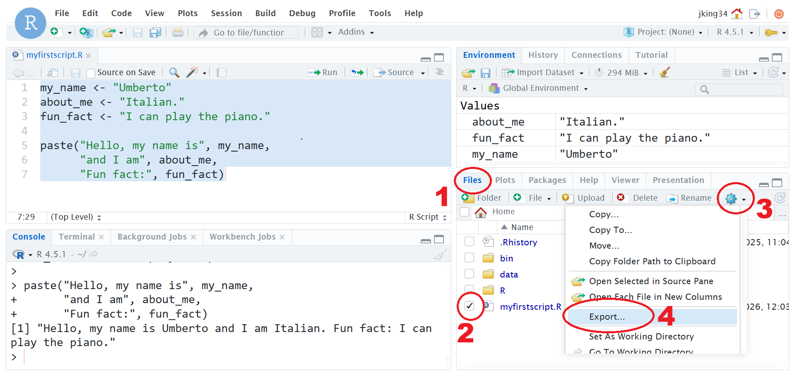
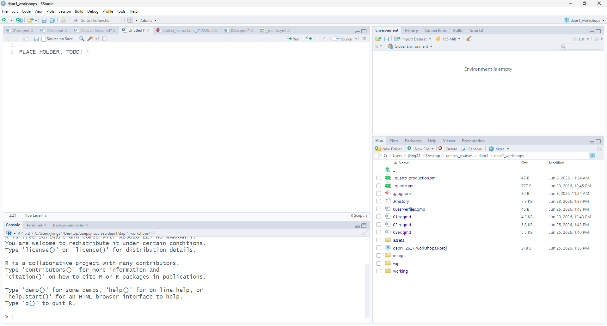

## 1. Save the file.  

- Click on the little save icon, or go to File > Save/Save as.  
- In the box that opens, give your file a name, and click save. 

```{r results="asis",echo=FALSE, out.width="20%",fig.cap="click to zoom in"}

```

## 2. *If* you're working on the RStudio Server, then download the file to your computer.  

- In the bottom right pane of RStudio, click on the "Files" tab.  
- Find the file that you saved in step 1, and check the box next to it.  
- Click "More" > "Export". 
- In the box that opens, save the exported file to a location on your computer.

```{r results="asis",echo=FALSE, out.width="20%",fig.cap="click to zoom in"}

```

## 3. Go to Learn and find the Group Discussion Space

- Go to the course Learn page
- Click on Discussions, and then click on your group discussion space.  

```{r results="asis",echo=FALSE, out.width="20%",fig.cap="click to zoom in"}
knitr::include_graphics("images/serverfiles/groupspace.png")
```

## 4. Post the file! 

- Start a new post
- Click attachment
- In the box that opens, find the file that you saved on your computer in the previous step.  
- Click post! 

```{r results="asis",echo=FALSE, out.width="20%",fig.cap="click to zoom in"}

```


<script src="https://ajax.googleapis.com/ajax/libs/jquery/3.1.1/jquery.min.js"></script>
  
  <style>
  .zoomDiv {
    opacity: 0;
    position:fixed;
    top: 50%;
    left: 50%;
    z-index: 50;
    transform: translate(-50%, -50%);
    box-shadow: 0px 0px 50px #888888;
    max-height:100%; 
    overflow: scroll;
  }

.zoomImg {
  width: 100%;
}
</style>
  
  
  <script type="text/javascript">
  $(document).ready(function() {
    $('body').prepend("<div class=\"zoomDiv\"></div>");
    // onClick function for all plots (img's)
    $('img:not(.zoomImg)').click(function() {
      $('.zoomImg').attr('src', $(this).attr('src'));
      $('.zoomDiv').css({opacity: '1', width: '60%'});
    });
    // onClick function for zoomImg
    $('img.zoomImg').click(function() {
      $('.zoomDiv').css({opacity: '0', width: '0%'});
    });
  });
</script>
