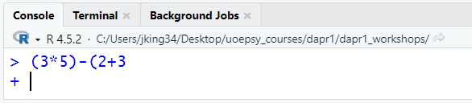

```{r}
#| include: false
library(tidyverse)
source('assets/dropdowns.R')
source('assets/setup.R')
```

<!-- MAX 5 QUESTIONS -->
<!-- make each question ~10 minute work -->
<!-- MAX 5 QUESTIONS -->
<!-- MAX 5 QUESTIONS -->

:::frame
This week's workshop is quite minimal. All we're really wanting you to do is:

1. Explore the software and start playing around.  
2. Meet some new people, make some new friends, and form a group to work with in these workshops.

From next week, you'll be working in these groups collaboratively on the workshop questions, with one person doing the typing (the 'driver') and the others telling them what to type (the 'navigators'). The role of driver will swap each week, so you'll always get a turn at typing.  
:::


`r qbegin(qcounter())`
The very first task here is to open RStudio.  

R and RStudio is software that you can download and install on your computer, but for the duration of this course, we are providing you with a version on a server.  

You can access the RStudio server here: [https://rstudio.ppls.ed.ac.uk](https://rstudio.ppls.ed.ac.uk){target="_blank"}.  

We would recommend you bookmark the page so that you can easily find it again! 

`r qend()`


`r qbegin(qcounter())`
The first thing to do is start using R just like a calculator.  

Try doing some basic calculations by typing in the bottom left where you see the blue <span color="blue">></span> and pressing enter.  

Playing with these: `*`, `/`, `+`, `-`, `^` and seeing what happens - can you work out what each one does?  


::: {.callout-tip collapse="true"}
#### stuck seeing a + symbol?  

If we give R an incomplete request, then it will just stay waiting for it to be finished. 

e.g., if we typed a query and missed a bracket, then R would just leave a <span color="blue">+</span> symbol to say "I'm waiting for more...":



To get out of this we can either type the required stuff to finish the query, or, much more simply, just press the Escape key (Esc) and it will cancel the query and let you start it again.  

:::

`r qend()`


`r qbegin(qcounter())`
In order to save our work, we need to start writing our commands in a document. Something we can edit, save, come back to later on, and share with other people.  

1. Open an R Script (File > New File > R Script).  
2. A new window will pop up in the top left of RStudio. Write some calculations in there (put each one on a new line).  
3. You'll notice that writing in the script doesn't actually perform the calculations. We need to "Run" the commands we are writing, which we can do by ensuring the cursor is on the line we want to run, and then either: 
  - press Ctrl+Enter (or Cmd+Enter for Mac)
  - clicking the "Run" button in the top right of the R Script. 

`r qend()`

`r qbegin(qcounter())`

```{r}
#| eval: false
#| echo: true
my_name <- "Umberto"
about_me <- "Italian."
fun_fact <- "I can play the piano."

paste("Hello, my name is", my_name, 
      "and I am", about_me,
      "Fun fact:", fun_fact)
```

1. Copy-Paste the lines of code below into your R Script and edit them to provide some text about yourself (if you don't want to share a fun fact about yourself, just share a random fun fact!)
2. Save your script (File > Save).
3. Close your script (there's a little cross in the tab label at the top of the script)
4. Re-open your script (File > Open)
5. Celebrate!  

`r qend()`


`r qbegin(qcounter())`

TODO need fix once group naming conventions fixed. 

Finally, we'd like you to join your group on Blackboard Learn. 

Groups are named based on the workshop (1, 2, 3, 4) and your table number.  
So if this is Workshop 3, and you are sitting at table 6, you should join group "WS3.6".  

1. Go to the course LEARN page
2. click Groups on the top menu bar.
3. click Workshops_1_2_3_4 
4. Join your group
5. Now click on "Group Discussion Space" in the top menu of the course LEARN page.
6. Upload your script to the discussion space, to share your fun fact with your group members.  

`r qend()`

