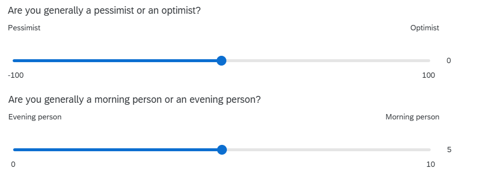

```{r}
#| include: false
library(tidyverse)
source('assets/dropdowns.R')
source('assets/setup.R')
```

<!-- MAX 5 QUESTIONS -->
<!-- make each question ~10 minute work -->
<!-- MAX 5 QUESTIONS -->
<!-- MAX 5 QUESTIONS -->

:::frame
Pick someone new to be the driver this week. They will type the code. 
The rest of you are navigators, you need to tell the driver where to go (i.e., what to type!).  

Driver instructions:

1. Log in to the bigger screen at your table
2. Open [RStudio Server](https://rstudio.ppls.ed.ac.uk){target="_blank"}
3. Listen to your navigators

Navigator instructions:

1. Tell your driver where to go (i.e., what to type)!

:::

`r qbegin(qcounter())`
We're continuing to use the same dataset for the next couple of weeks (the survey that many of you completed in the first week). The data are stored at [https://uoepsy.github.io/data/dapr1_2526_survey.csv](https://uoepsy.github.io/data/dapr1_2526_survey.csv){target="_blank"} (Check back to your work from the previous weeks to remind yourself how to get the data into R).  

Calculate the Inter Quartile Range (IQR) for: 

a. `distance_born` - the distances from Edinburgh that the respondents were born. The IQR is appropriate here because the variable is highly skewed.  
b. `spicy_num` - the levels of spice that respondents like. The IQR is appropriate here because the variable is ordinal.  

:::flash
🗂️
See [Measure variability > IQR](https://uoepsy.github.io/dapr1/2627/flashcards/block1/variability.html#inter-quartile-range-iqr){target="_blank"} flash card.
:::

`r qend()`
`r solbegin(show=params$SHOW_SOLS, toggle=params$TOGGLE)`

```{r}
library(tidyverse)
sdata <- read_csv("https://uoepsy.github.io/data/dapr1_2526_survey.csv")

sdata |> 
  summarise(
    dist_IQR = IQR(distance_born, na.rm = TRUE),
    spice_IQR = IQR(spicy_num, na.rm = TRUE)
  )
```

`r solend()`


`r qbegin(qcounter())`
The survey also asked people to rate, on scales of 0 to 100, three things:

| variable | question | 
| -------- |---------- |
| `sleepqual` | "how well do you tend to sleep on average?" | 
| `procrast` | "how often do you tend to procrastinate on tasks or responsibilities on average?" |
| `multitask` | "how well do you think you can handle multiple tasks or responsibilities at the same time on average?" | 

Calculate the mean and standard deviation for one of these variables.  

:::flash
🗂️
See [Measure variability > SD](https://uoepsy.github.io/dapr1/2627/flashcards/block1/variability.html#standard-deviation-sd){target="_blank"} flash card.
:::

`r qend()`
`r solbegin(show=params$SHOW_SOLS, toggle=params$TOGGLE)`

```{r}
sdata |> 
  summarise(
    sleep_M = mean(sleepqual, na.rm = TRUE),
    sleep_SD = sd(sleepqual, na.rm = TRUE),
    procr_M = mean(procrast, na.rm = TRUE),
    procr_SD = sd(procrast, na.rm = TRUE),
    mutli_M = mean(multitask, na.rm = TRUE),
    multi_SD = sd(multitask, na.rm = TRUE)
  )
```

`r solend()`

`r qbegin(qcounter())`
For the sleep-quality, procrastination, and multitasking variables, respondents were given the scale from 0 to 100. That doesn't necessarily mean that people used the whole scale.  

For the same variable you chose in the previous question, calculate its range.  

:::flash
🗂️
See [Measure variability > Range](https://uoepsy.github.io/dapr1/2627/flashcards/block1/variability.html#range){target="_blank"} flash card.
:::

`r qend()`
`r solbegin(show=params$SHOW_SOLS, toggle=params$TOGGLE)`

```{r}
sdata |> 
  summarise(
    sleep_R = max(sleepqual, na.rm = TRUE) - min(sleepqual, na.rm = TRUE)
  )
```

`r solend()`


`r qbegin(qcounter())`
In one call to `summarise()` (that is, using the function only once), calculate descriptive statistics of central tendency and variability for **all three** variables `sleepqual`, `procrast` and `multitask`.  

`r qend()`
`r solbegin(show=params$SHOW_SOLS, toggle=params$TOGGLE)`

```{r}
sdata |> 
  summarise(
    sleep_m = mean(sleepqual, na.rm = TRUE),
    sleep_s = sd(sleepqual, na.rm = TRUE),
    procr_m = mean(procrast, na.rm = TRUE),
    procr_s = sd(procrast, na.rm = TRUE),
    multi_m = mean(multitask, na.rm = TRUE),
    multi_s = sd(multitask, na.rm = TRUE)
  )
```


`r solend()`


`r qbegin(qcounter())`
The survey also included questions asking about whether people perceive themselves as pessimists vs optimists (the `outlook` variable), and as an "evening person" vs a "morning person" (the `ampm` variable). 



TODO UPDATE ONCE SURVEY DATA IS IN


Fill in the blanks in this description. 

> A total sample of **(1)______** participants completed the survey. 
> 
> In their general outlook on life (measured with **(2)______**), participants reported an average score of **(3)______** (**(4)______**), indicating a **(5)______** disposition overall.  
>
> For chronotype --- as measured on a sliding scale from 0 ("evening person") to 10 ("morning person") --- the distribution was **(6)______**. Consequently, the central tendency for chronotype is best described by the **(7)______** of **(8)______** (**(9)______**), with scores ranging from **(10)______** to **(11)______**.

::: {.callout-tip collapse="true"}
#### Hints

1. how many people are there in the data? (check back to week 2, or the [Read in and inspect data](https://uoepsy.github.io/dapr1/2627/flashcards/block1/read-data.html#to-inspect-data){target="_blank"} flashcard)
2. give a brief explanation of how the optimism/pessimism was measured. Otherwise the reader won't really know what any of the numbers mean! 
3. calculate an appropriate measure of central tendency for the `outlook` variable.
4. calculate an appropriate measure of dispersion for the `outlook` variable.
5. what do 3 & 4 tell you about the sample?  
6. describe the shape of the distribution of the `ampm` variable (you'll need to plot it!)
7. what metric is best for characterising the central tendency of the `ampm` variable
8. calculate an appropriate measure of central tendency for the `ampm` variable.
9. calculate an appropriate measure of dispersion for the `ampm` variable.
10. calculate the range for the `ampm` variable.
11. calculate the range for the `ampm` variable.


:::

`r qend()`
`r solbegin(show=params$SHOW_SOLS, toggle=params$TOGGLE)`
```{r}
#| include: false
outlookm = mean(sdata$outlook,na.rm=T)
disp = ifelse(outlookm>0,"optimistic","pessimistic")
adj = ifelse(abs(outlookm)-30<0, "slightly",
              ifelse(abs(outlookm)-60<0, "moderately",
                     "highly"))
```


A total sample of **`r nrow(sdata)`** participants completed the survey. 

In their general outlook on life (measured with **a sliding scale from -100 to 100, with 'Pessimist' and 'Optimist' at the extreme labels**), participants reported an average score of **`r outlookm`** (**SD = `r sd(sdata$outlook,na.rm=T)`**), indicating a **paste(adj,disp)** disposition overall.  

For chronotype --- as measured by a sliding scale from 0 ("evening person") to 10 ("morning person") --- the distribution was **(6) TODO **. Consequently, the central tendency for chronotype is best described by the **(7) TODO** of **(8) TODO ** (**(9) TODO **), with scores ranging from **`r min(sdata$ampm,na.rm=T)`** to **`r max(sdata$ampm,na.rm=T)`**.


`r solend()`


:::frame
__Finishing up__  

Once you've finished, don't forget to: 

1. Save your R script
2. Post the R script to the group discussion space on Learn, to ensure that everyone has access to it! (For step-by-step instructions on how to do this, click [here](00serverfiles.html){target="_blank"})  


:::


