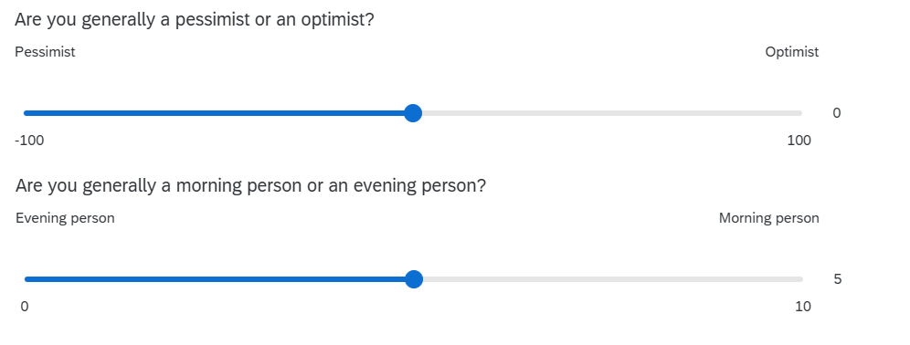

<!--
WHEN RENDERING: 

- tutor-facing: 
  - either use the build button, or render specific files. or in the terminal using `quarto render`
  - resulting file will land in `docs/YEAR/workshops/tutors/`
  - solutions will always be visible
  
- student-facing:
  - set current_block: to the block we're in
  - render in Terminal using either: 
      - `quarto render --profile production`
      - `quarto render FILE.qmd --profile production`
  - resulting file will land in `docs/YEAR/workshops/`
  - solutions will be available for previous blocks.  
  
-->

```{r}
#| include: false
library(tidyverse)
source('assets/dropdowns.R')
source('assets/setup.R')

vars <- readRDS("block_sols.rds")
# set params manually rather than yaml params
params <- list(
  SHOW_SOLS = tryCatch({ vars$sols[[tools::file_path_sans_ext(knitr::current_input(dir=FALSE))]]},
                       error = function(e) { TRUE } ),
  TOGGLE = TRUE
)
```

<!-- MAX 5 QUESTIONS -->
<!-- make each question ~10 minute work -->
<!-- MAX 5 QUESTIONS -->
<!-- MAX 5 QUESTIONS -->

:::frame
Pick someone new to be the driver this week. If everyone in the group has already had a week as the driver, start going round again!  

The driver will type the code. The rest of you are navigators, you need to tell the driver where to go (i.e., what to type!). 

Driver instructions:

1. Log in to the bigger screen at your table
2. Open [RStudio Server](https://rstudio.ppls.ed.ac.uk){target="_blank"}
3. Open a new .R script, and load the **tidyverse** package.
4. Listen to your navigators

Navigator instructions:

1. Tell your driver where to go (i.e., what to type)!

:::

<!-- # q1 -->

`r qbegin(qcounter())`

Once again, **read in** the survey data from [https://uoepsy.github.io/data/dapr1_2627_survey.csv](https://uoepsy.github.io/data/dapr1_2627_survey.csv){target="_blank"}.
Store it under the variable name `sdata`.

:::flash
🗂️
See [Read in and inspect data](https://uoepsy.github.io/dapr1/2627/flashcards/block1/read-data.html){target="_blank"} flash card.
:::

This week, we'll work with the data about people's outlook (how pessimistic vs. optimistic they are) and their chronotype (how much of an evening person vs. a morning person they are).
Here are the questions that generated that data:

{fig-align="center"}

You'll notice that each question uses a quite different scale: `outlook` ranges from –100 to 100, while `ampm` (the chronotype variable) ranges from 0 to 10.
So someone with an `outlook` score of 10 is in a very different part of the scale, compared to someone with an `ampm` score of 10!

**Create two new variables** in your dataframe.
One should be the z-scored version of `outlook` (call it `outlookZ`), and the other should be the z-scored version of `ampm` (call it `ampmZ`).

:::flash
🗂️
See [Mutate columns](https://uoepsy.github.io/dapr1/2627/flashcards/block1/mutate.html){target="_blank"} and [Calculate z-scores](https://uoepsy.github.io/dapr1/2627/flashcards/block2/zscore.html){target="_blank"} flash card.
:::

`r qend()`
`r solbegin(show=params$SHOW_SOLS, toggle=params$TOGGLE)`
```{r}
library(tidyverse)

sdata <- read_csv("https://uoepsy.github.io/data/dapr1_2627_survey.csv")

sdata <- sdata |>
  mutate(
    outlookZ = ( outlook - mean(outlook) ) / sd(outlook),
    ampmZ = ( ampm - mean(ampm) ) / sd(ampm)
  )
```

`r solend()`


<!-- # q2 -->

`r qbegin(qcounter())`

In this question, you'll find the pseudonyms, scores, and z-scores of the three most optimistic people and the three "morning people"-est people.

First, **sort** your dataframe by your `outlookZ` column, in **descending** order.

:::flash
🗂️
See [Sort a dataframe with `arrange()`](https://uoepsy.github.io/dapr1/2627/flashcards/block2/arrange.html){target="_blank"} flash card.
:::

Next, **extract** the top three rows of your sorted dataframe.

:::flash
🗂️
See [Subset a dataframe > Extract row(s)](https://uoepsy.github.io/dapr1/2627/flashcards/block2/subset.html#extract-rows){target="_blank"} flash card.
:::

Finally, **extract** only the columns that we care about for this question: `pseudonym`, `outlook`, and `outlookZ`.

:::flash
🗂️
See [Subset a dataframe > Extract columns(s) > `select()`](https://uoepsy.github.io/dapr1/2627/flashcards/block2/subset.html#select){target="_blank"} flash card.
:::

**Repeat** this process for the `ampm` variable to find the three people who identify most strongly as morning people.

Is any of these people you?

`r qend()`
`r solbegin(show=params$SHOW_SOLS, toggle=params$TOGGLE)`

Here's how we'd do all of these steps, piped together into a single statement for `outlook` and another one for `ampm`.

```{r}
sdata |> 
  arrange(desc(outlook)) |>
  slice(1:3) |>
  select(pseudonym, outlook, outlookZ)

sdata |> 
  arrange(desc(ampm)) |>
  slice(1:3) |>
  select(pseudonym, ampm, ampmZ)
```

`r solend()`

<!-- # q3 -->

`r qbegin(qcounter())`

From now on, we'll just focus on `outlook` and its z-scores.

**Plot** your standardised outlook scores (that is, `outlookZ`) as a density curve.

:::flash
🗂️
See [Make a density plot](https://uoepsy.github.io/dapr1/2627/flashcards/block2/density-plot.html){target="_blank"} flash card.
:::


Once you have made your plot, **add** this bit of code to the end of it.
This additional code will overlay a red standard normal distribution (with mean 0, standard deviation 1) over your density curve.
(The `...`s in the code chunk represents the code you used to make the density plot.)

```{r}
#| eval: false
... 
  ... +
  stat_function(fun = dnorm, args = list(mean = 0, sd = 1), colour = "red")
```


::: {.callout-caution collapse="true"}
#### Rabbit hole: What do the parts of `stat_function()` mean?

You don't have to know or remember any of this!
But if you're curious:

- `stat_function()` adds a statistical function to the plot. This is different from adding a "geom" because geoms are based on data—statistical functions are calculated based on the information we give next.
- `fun = dnorm` specifies that the function (`fun`) to add is the normal (`norm`) distribution (`d`).
- `args = list(mean = 0, sd = 1)` specifies that the function should use a mean of 0 and a standard deviation of 1, which are the parameters of the standard normal distribution.
- `colour = "red"` tells R that we want the distribution to be coloured red.

:::

`r qend()`
`r solbegin(show=params$SHOW_SOLS, toggle=params$TOGGLE)`

```{r}
ggplot(sdata , aes(x = outlookZ)) +
  geom_density() +
  stat_function(fun = dnorm, args = list(mean = 0, sd = 1), colour = "red")
```

`r solend()`

<!-- # q4 -->

`r qbegin(qcounter())`

This is a challenging question, get ready!

To start: Did anyone in your group give a pseudonym in the survey? 
If yes, use your groupmate's pseudonym for this question; if no, use "noodle_horse" (that's what Josiah calls his greyhound Dougal).

Next, **extract** the row containing that pseudonym from the dataset using the tidyverse function `filter()`.

:::flash
🗂️
See [Subset a dataframe > `filter()`](https://uoepsy.github.io/dapr1/2627/flashcards/block2/subset.html#rows-that-meet-a-condition-filter){target="_blank"} flash card.
:::

Now: using the function `pnorm()`, **compute** the probability of seeing somebody *less* optimistic than this person.
In other words, you want to find the probability that somebody has a lower `outlookZ` score than your chosen person (or greyhound).

Next: still using `pnorm()`, **compute** the probability of seeing somebody *more* optimistic than your chosen person (or greyhound).

:::flash
🗂️
See [Explore a normally-distributed variable](https://uoepsy.github.io/dapr1/2627/flashcards/block2/pnorm-qnorm.html){target="_blank"} flash card.
:::

Finally: **Check** that these two probabilities sum up to 1.

`r qend()`
`r solbegin(show=params$SHOW_SOLS, toggle=params$TOGGLE)`

Dougal the noodle horse is a little bit of a pessimist:

```{r}
sdata |> 
  filter(pseudonym == "noodle_horse") |>
  select(pseudonym, outlook, outlookZ)
```

For convenience, let's extract his `outlookZ` value and save it under its own name.

```{r}
dougalZ <- sdata |>
  filter(pseudonym == "noodle_horse") |>
  pull(outlookZ)
```


To compute the probability of observing a z-score that's lower than Dougal's z-score of `r round(dougalZ, 2)`, we give this z-score as an argument to `pnorm()` (see the [flash card](https://uoepsy.github.io/dapr1/2627/flashcards/block2/pnorm-qnorm.html){target="_blank"} for helpful illustrations!).

```{r}
pnorm(dougalZ)
```

There's a `r pnorm(dougalZ)*100`% probability of seeing someone less optimistic than Dougal.

And on the flip side, to compute the probability of observing a z-score that's *higher* than Dougal's z-score, we subtract the output of `pnorm()` from 1:

```{r}
1 - pnorm(dougalZ)
```

There's a `r (1-pnorm(dougalZ))*100`% probability of seeing someone more optimistic than Dougal.

These values do indeed sum to 1, and this should make a little bit of sense: for anyone else that you sample, they will either be more optimistic than Dougal or less optimistic than Dougal.
So the probability of seeing someone either more or less optimistic than Dougal is 100%.

`r solend()`


<!-- # q5 -->

`r qbegin(qcounter())`

Finally, z-scoring is not just a one-way process.
Sometimes you might start with variables in z-scored form, and you might want to transform them back onto their original scale (in other words, you might want to "back-transform" them).

Here's the process that will "undo" a z-score by back-transforming it onto the original scale:

$$
\text{value on original scale} = \text{original mean} + (\text{z-score} \times \text{original SD})
$$
Here's the more mathematical version of this formula from the lecture slides:

$$
X = M + (Z \times SD)
$$

where $X$ is the raw score / the score on the original scale, $M$ is the population mean (or our best guess about it based on our sample), $Z$ is the z-score, and $SD$ is the population standard deviation (or our best guess about it based on our sample).

<br>

First, to get the parts of this formula that we need, **run** the following code to find the original mean and SD of `outlook` and store them under their own variable names:

```{r}
outlook_mean <- mean(sdata$outlook)
outlook_sd   <- sd(sdata$outlook)
```


Using the formula above, **calculate** the value on the original `outlook` scale that corresponds to a z-score of 1.
(In other words, what value of `outlook` is one standard deviation above the mean?)

Finally, **calculate** the value on the `outlook` scale that corresponds to a z-score of –2.
(In other words, what value of `outlook` is two standard deviations below the mean?)

:::flash
🗂️
See [Calculate z-scores > Back-transform](https://uoepsy.github.io/dapr1/2627/flashcards/block2/zscore.html#how-to-back-transform-z-scores-onto-the-original-scale){target="_blank"} flash card.
:::

`r qend()`
`r solbegin(show=params$SHOW_SOLS, toggle=params$TOGGLE)`

Back-transforming from a z-score of 2, the `outlook` score that's one SD above the mean is:

```{r}
outlook_mean + (1 * outlook_sd)
```


<br>

Back-transforming from a z-score of –1, the `outlook` score that's two SDs below the mean is:

```{r}
outlook_mean + (-2 * outlook_sd)
```


`r solend()`


:::frame
__Finishing up__  

Once you've finished, don't forget to: 

1. Save your R script
2. Post the R script to the group discussion space on Learn, to ensure that everyone has access to it! (For step-by-step instructions on how to do this, click [here](00serverfiles.html){target="_blank"})  


:::

