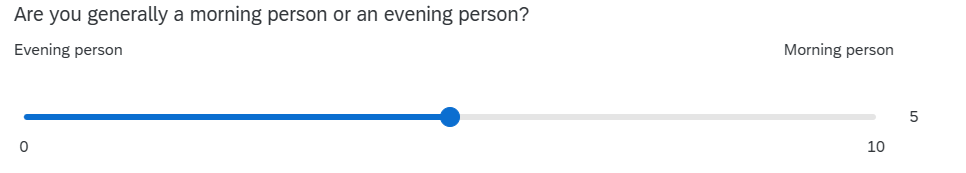

<!--
WHEN RENDERING: 

- tutor-facing: 
  - either use the build button, or render specific files. or in the terminal using `quarto render`
  - resulting file will land in `docs/YEAR/workshops/tutors/`
  - solutions will always be visible
  
- student-facing:
  - set current_block: to the block we're in
  - render in Terminal using either: 
      - `quarto render --profile production`
      - `quarto render FILE.qmd --profile production`
  - resulting file will land in `docs/YEAR/workshops/`
  - solutions will be available for previous blocks.  
  
-->

```{r}
#| include: false
library(tidyverse)
source('assets/dropdowns.R')
source('assets/setup.R')

vars <- readRDS("block_sols.rds")
# set params manually rather than yaml params
params <- list(
  SHOW_SOLS = tryCatch({ vars$sols[[tools::file_path_sans_ext(knitr::current_input(dir=FALSE))]]},
                       error = function(e) { TRUE } ),
  TOGGLE = TRUE
)
```

<!-- MAX 5 QUESTIONS -->
<!-- make each question ~10 minute work -->
<!-- MAX 5 QUESTIONS -->
<!-- MAX 5 QUESTIONS -->

:::frame
Pick someone new to be the driver this week. If everyone in the group has already had a week as the driver, start going round again!  

The driver will type the code. The rest of you are navigators, you need to tell the driver where to go (i.e., what to type!). 

Driver instructions:

1. Log in to the bigger screen at your table
2. Open RStudio Server. See the first drop-down in the [FAQs page](https://uoepsy.github.io/dapr1/2627/misc/faqs-dapr1.html){target="_blank"} for instructions
3. Open a new .R script, and load the **tidyverse** package.
4. Listen to your navigators

Navigator instructions:

1. Tell your driver where to go (i.e., what to type)!

:::

<!-- q1 t.test(sdata$outlook, mu=0, alternative="greater")
q2 RQ "are DAPR1 students identify more as evening people or as morning people?"
  set up hypothesis
q3 plot
q4 t test
q5 write up -->


`r qbegin(qcounter())`

:::frame
Last week, you tested whether the average optimism score among DAPR1 students is greater than the general population average.
You conducted a z-test to show that, yes, DAPR1 students *are* significantly more optimistic than the general population!

However, we don't know the true population values for every variable, so we can't always run z-tests.
In real research settings, where we don't know any of this information about the population, the kind of test we run is t-tests.

This week, you're going to run some t-tests using `t.test()`!
The cool thing about t-tests is that (unlike z-tests) you don't need to know any information about the population at all.

:::


This week, we're going to look at the `ampm` variable, which ranges from 0 (total evening person) to 10 (total morning person).
Here's what that question in the survey looked like.

{fig-align="center"}

Our RQ is going to be: **Do first year undergraduate students identify more as morning people or as evening people?**

**Read in** the DAPR1 survey data from <https://uoepsy.github.io/data/dapr1_2627_survey.csv>.

In a one-sample t-test, we compare our sample to a specific value.
Based on the RQ and the information above, **identify** the value that we want to compare our sample to.

::: {.callout-tip collapse="true"}
#### Hint

What value between 0 and 10 distinguishes evening people from morning people?

In other words, what value is the halfway point between someone being an evening person and someone being a morning person?

:::

`r qend()`
`r solbegin(show=params$SHOW_SOLS, toggle=params$TOGGLE)`

```{r}
library(tidyverse)

sdata <- read_csv('https://uoepsy.github.io/data/dapr1_2627_survey.csv')
```

The value that distinguishes evening people from morning people is 5.
People with `ampm` scores 0–4 are evening people, 5 is the midpoint, and people with scores 6–10 are morning people.

So we are going to compare our `ampm` sample to the value 5.
This is the value that will appear in our null and alternative hypotheses.

`r solend()`

`r qbegin(qcounter())`

Based on the RQ, **decide** whether your alternative hypothesis $H_1$ will be one-sided or two-sided.

Then, using the value you identified in Q1, **specify** the null and alternative hypotheses to address the research question.

:::flash
🗂️
See the [One-sample t-test > Define hypotheses](https://uoepsy.github.io/dapr1/2627/flashcards/block2/one-sample-t.html#define-hypotheses){target="_blank"} flash card.
:::

`r qend()`
`r solbegin(show=params$SHOW_SOLS, toggle=params$TOGGLE)`

We'll denote the mean "morningness" score of all first year undergraduate students as $\mu$ or "mu".
(We're calling it "morningness" and not "eveningness" because higher values correspond to higher "morningness".)

We are testing the two competing hypotheses:

$$H_0: \mu = 5$$
$$H_1: \mu \neq 5$$

To write these in plain text in your R script, you can write:

```{r}
# H0: mu = 5
# H1: mu != 5
```


We have written a two-sided alternative hypothesis, because the RQ doesn't specifically want us to test whether DAPR1 students are more evening people (which would be one-sided to the left, $\mu < 5$) or more morning people (which would be one-sided to the right, $\mu > 5$).
The RQ just wants us to find out which direction the tendency goes, and so we have to leave both options open and write a non-directional, two-sided $H_1$.

`r solend()`

`r qbegin(qcounter())`

**Create** a visualisation that presents the data in a way that is relevant to the research question.

There are lots of different ways you could do this—the choice is yours!
Have some fun with it. 
Change colours, tidy up axis labels, etc.  

:::flash
🗂️
See the [Plot a variable](https://uoepsy.github.io/dapr1/2627/flashcards/block1/intro-ggplot.html){target="_blank"} flash card.
:::

`r qend()`
`r solbegin(show=params$SHOW_SOLS, toggle=params$TOGGLE)`

Here's one way, where the dotted vertical line shows the midpoint of 5 and the dashed vertical line shows the mean `ampm` score:

```{r fig.width=4, fig.height=3, out.width=800}
ggplot(sdata, aes(x = ampm)) +
  geom_histogram(alpha = .5, fill = "darkblue") + 
  geom_vline(xintercept = 5, linetype = "dotted") +
  geom_vline(xintercept = mean(sdata$ampm), linetype = "dashed") +
  labs(
    x = "Chronotype\n(evening person <–> morning person)",
    y = 'Count'
  )
```


Here's another option that combines `geom_density()` with a new geom that draws a little tick up from the x axis when there's an observation at that value: `geom_rug()`.

```{r fig.width=4, fig.height=3, out.width=800}
sdata |> 
  ggplot(aes(x = ampm)) +
  geom_density(colour = 'darkseagreen4', fill = 'darkseagreen4', alpha = 0.4) +
  geom_rug(colour = 'darkseagreen4') +
  theme_classic() +
  scale_x_continuous(
    labels = c('0\n(evening\nperson)', 2.5, 5, 7.5, '10\n(morning\nperson)')
  ) +
  labs(
    y = 'Density',
    x = '"Are you generally a morning person\nor an evening person?"'
  )
```

If you're not sure about what a given line of code does, try commenting it out and running everything else to see what changes.

`r solend()`

`r qbegin(qcounter())`

Using a 5% significance level, perform a `t.test()` to test the hypotheses you specified above.  


:::flash
🗂️
See the [One-sample t-test > Run the test](https://uoepsy.github.io/dapr1/2627/flashcards/block2/one-sample-t.html#run-the-test){target="_blank"} flash card.
:::


`r qend()`
`r solbegin(show=params$SHOW_SOLS, toggle=params$TOGGLE)`

```{r}
t.test(sdata$ampm, mu = 5, alternative = "two.sided", conf.level = 0.95)
```


`r solend()`

`r qbegin(qcounter())`

Write it up!

To help, here's the example write-up from the lecture:  


> To investigate whether the mean body temperature of all healthy humans differs from the commonly thought value of $37^\circ\text{C}$, we performed (at the 5\% significance level) a one-sample t-test of $H_0: \mu = 37^\circ\text{C}$ against $H_1: \mu \neq 37^\circ\text{C}$.  
>
> The sample results provided very strong evidence against the null hypothesis ($t(49)=-3.14, p = .003$, two-sided). We therefore concluded that the mean body temperature of healthy humans differs from 37 and, with 95\% confidence, is between $36.69^\circ\text{C}$ and $36.93^\circ\text{C}$.

Here's how this same report might be written up in plain text in your R script:

```{r}
# To investigate whether the mean body temperature of all healthy humans differs
# from the commonly thought value of 37C, we performed (at the 5% significance 
# level) a one-sample t-test of H0: mu = 37C against H1: mu != 37C.
#
# The sample results provided very strong evidence against the null hypothesis 
# (t(49) = -3.14, p = .003, two-sided). We therefore concluded that the mean 
# body temperature of healthy humans differs from 37 and, with 95% confidence, 
# is between 36.69C and 36.93C.
```

`r qend()`
`r solbegin(show=params$SHOW_SOLS, toggle=params$TOGGLE)`

We wanted to find out whether DAPR1 students identify more as morning people or as evening people.
To test this, we ran a one-sample t-test at the 5% significance level, testing $H_0: \mu = 5$ (the midpoint of the evening-to-morning scale) against $H_1: \mu \neq 5$.

On average, DAPR1 students in our sample differ significantly from this midpoint, with a mean score of 3.47 and a 95% confidence interval between 2.98 and 3.95 points ($t$(133) = –6.31, $p$ < .001, two-sided).
Thus, DAPR1 students identify significantly more as evening people.

`r solend()`


:::frame
__Finishing up__  

Once you've finished, don't forget to: 

1. Save your R script
2. Post the R script to the group discussion space on Learn, to ensure that everyone has access to it! (For step-by-step instructions on how to do this, click [here](00serverfiles.html){target="_blank"})  


:::


