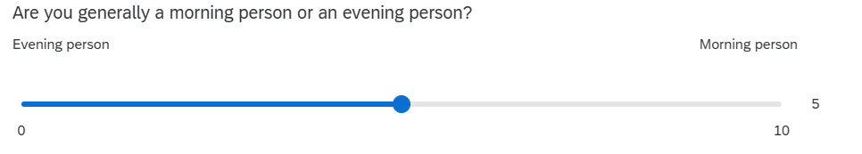

```{r}
#| include: false
library(tidyverse)
source('assets/dropdowns.R')
source('assets/setup.R')
```

<!-- MAX 5 QUESTIONS -->
<!-- make each question ~10 minute work -->
<!-- MAX 5 QUESTIONS -->
<!-- MAX 5 QUESTIONS -->

:::frame
Pick someone new to be the driver this week. If everyone in the group has already had a week as the driver, start going round again!  

The driver will type the code. The rest of you are navigators, you need to tell the driver where to go (i.e., what to type!). 

Driver instructions:

1. Log in to the bigger screen at your table
2. Open [RStudio Server](https://rstudio.ppls.ed.ac.uk){target="_blank"}
3. Open a new .R script, and load the **tidyverse** package.
4. Listen to your navigators

Navigator instructions:

1. Tell your driver where to go (i.e., what to type)!

:::

q1 t.test(sdata$outlook, mu=35, alternative="greater")
q2 RQ "are DAPR1 students identify more as evening people or as morning people?"
  set up hypothesis
q3 plot
q4 t test
q5 write up


`r qbegin(qcounter())`

Our work last week culminated in performing our first null hypothesis test. We were testing whether the average optimism score in DAPR1 students is greater than the general population average (35).  

To do this, we calculated a test statistic (Lines 6-9 below) and then computed the p-value (Line 11), to quantify the probability of observing a test-statistic at least as extreme as the one we have got.  
```{r}
#| code-line-numbers: true
# packages:
library(tidyverse)
# data:
sdata <- read_csv("https://uoepsy.github.io/data/dapr1_2526_survey.csv")

# standard error of mean:
se <- sd(sdata$outlook) / sqrt(nrow(sdata))
# test statistic:  
zstat <- (mean(sdata$outlook) - 35) / se
# p-value
1-pnorm(zstat)
```

Good news everyone! There's a function in R that does this test for us! It's the `t.test()` function.  

Note... it's $t$, and not $Z$. That's because when we have been calculating the standard error, we have been using our _sample_ standard deviation, `sd(sdata$outlook)`, rather than the population standard deviation $\sigma$. That's because we **don't know** what $\sigma$ is.  

When we use the sample standard deviation, we're using an *estimate* of $\sigma$, which means we are introducing more uncertainty. This uncertainty depends on how big our sample is.  

Our test statistic $\frac{M-35}{s/\sqrt{n}}$, when we use $s$ not $\sigma$, is *actually* a $t$-statistic. It doesn't follow a normal distribution, it follows a $t$-distribution.  

$t$-distributions look very like the normal distribution, but the tails get thicker as the "degrees of freedom" decrease. The "degrees of freedom" here are $n-1$, because we have $n$ observations and need to use 1 estimate (the mean) to calculate $s$.  

**Task:** Use `t.test()` to perform the same hypothesis test but as a $t$-test, not $z$.  
**Challenge yourselves:** compared to the output from the code above, you might be able to predict which bits will be different and which bits will be the same!


:::flash
🗂️
See [t test flashcard](https://uoepsy.github.io/dapr1/2627/flashcards/){target="_blank"} flash card.
:::

::: {.callout-tip collapse="true"}
#### Hint

it's just one line of code!  

:::

`r qend()`
`r solbegin(show=params$SHOW_SOLS, toggle=params$TOGGLE)`

We have the same test statistic (we're just calling it $t$ now)  
we have the same mean, but we should have a different (slightly) p-value.  
```{r}
t.test(sdata$outlook, mu = 35, alternative = "greater")
```

`r solend()`


`r qbegin(qcounter())`
> **New Research Question:** Do first year undergraduate students identify more as morning people or as evening people?  

Here's what the question in the survey looked like. In our data it is the `ampm` variable.  


Specify the null and alternative hypotheses to address the research question.  

`r qend()`
`r solbegin(show=params$SHOW_SOLS, toggle=params$TOGGLE)`

$H_0: \mu = 5$  
$H_1: \mu \neq 5$

`r solend()`

`r qbegin(qcounter())`
Create a visualisation that presents the data in a way that is relevant to the research question.   
There are lot's of different ways you could do this - the choice is yours!   
Have some fun with it. Change colours, tidy up axis labels etc.  

:::flash
🗂️
See the [plot a variable](https://uoepsy.github.io/dapr1/2627/flashcards/block1/intro-ggplot.html){target="_blank"} flash card.
:::

`r qend()`
`r solbegin(show=params$SHOW_SOLS, toggle=params$TOGGLE)`

```{r}
ggplot(sdata, aes(x = ampm)) +
  geom_histogram(alpha = .5, fill = "#0F4C81") + 
  geom_vline(xintercept = 5, lty = "dotted") +
  geom_vline(xintercept = mean(sdata$ampm), lty = "dashed") +
  scale_x_continuous("Chronotype\n(evening person <--> morning person)",
                     limits = c(0,10))
```


`r solend()`


`r qbegin(qcounter())`
Perform a `t.test()` to test the hypotheses you specified above.  


:::flash
🗂️
See [TODO t test flashcard](https://uoepsy.github.io/dapr1/2627/flashcards/){target="_blank"} flash card.
:::


`r qend()`
`r solbegin(show=params$SHOW_SOLS, toggle=params$TOGGLE)`

```{r}
t.test(sdata$ampm, mu = 5, alternative = "two.sided")
```


`r solend()`

`r qbegin(qcounter())`
Write it up!  

To help, here's the example write-up from the lecture:  


> To investigate whether the mean body temperature of all healthy humans differs from the commonly thought value of $37^\circ\text{C}$, we performed (at the 5\% significance level) a one-sample t-test of $H_0: \mu = 37^\circ\text{C}$ against $H_0: \mu \neq 37^\circ\text{C}$.  
> The sample results provided very strong evidence against the null hypothesis ($t(49)=-3.14, p = .003$, two-sided). We therefore concluded that the mean body temperature of healthy humans differs from 37 and, with 95\% confidence, is likely to be between $36.69^\circ\text{C}$ and $36.93^\circ\text{C}$.

`r qend()`
`r solbegin(show=params$SHOW_SOLS, toggle=params$TOGGLE)`


`r solend()`


:::frame
__Finishing up__  

Once you've finished, don't forget to: 

1. Save your R script
2. Post the R script to the group discussion space on Learn, to ensure that everyone has access to it! (For step-by-step instructions on how to do this, click [here](00serverfiles.html){target="_blank"})  


:::


