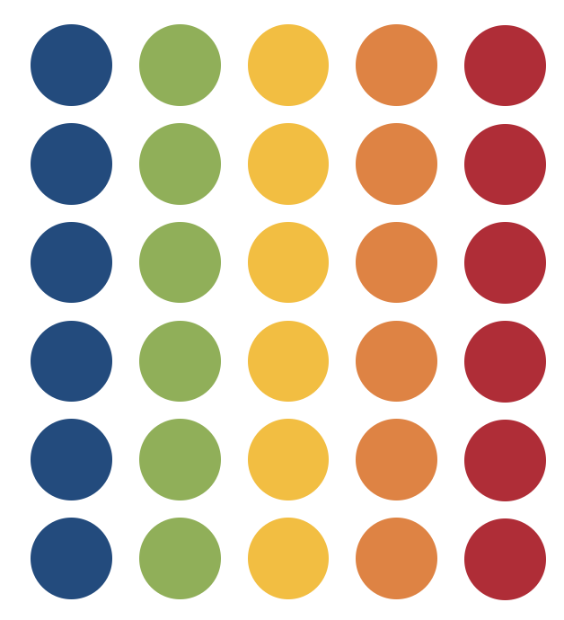

```{r setup, include=FALSE}
options(htmltools.dir.version = FALSE)
knitr::opts_chunk$set(
  dev = "svg",
  warning = FALSE,
  message = FALSE
)

xaringanExtra::use_xaringan_extra(c("tile_view","animate_css","tachyons"))
xaringanExtra::use_extra_styles(
  mute_unhighlighted_code = FALSE
)

library(knitr)
library(tidyverse)
library(ggplot2)
library(kableExtra)
library(sjPlot)

baseColor <- "#0F4C81"
```

```{r xaringan-themer, include = FALSE}
library(xaringanthemer)
style_mono_accent(
  base_color = "#0F4C81", # DAPR1
  # base_color = "#BF1932", # DAPR2
  # base_color = "#88B04B", # DAPR3 
  # base_color = "#FCBB06", # USMR
  # base_color = "#a41ae4", # MSMR
  header_color = "#000000",
  header_font_google = google_font("Source Sans Pro"),
  header_font_weight = 400,
  text_font_google = google_font("Source Sans Pro", "400", "400i", "600", "600i"),
  code_font_google = google_font("Source Code Pro")
)
```

# Week's Learning Objectives

1. Understand the difference between $\chi^2$ goodness-of-fit and $\chi^2$ test of independence

2. Perform a $\chi^2$ goodness-of-fit and interpret results

3. Perform a $\chi^2$ test of independence and interpret results

4. Understand the assumptions for $\chi^2$ tests

---


class: inverse, center, middle

# Part 1
## Introduction to $\chi^2$

---

# Moving on from $t$-tests...

+ $t$-tests have allowed you to make comparisons using *continuous* data:

  + A continuous outcome variable from two separate groups (independent-samples $t$-test)
  + A continuous outcome variable from one group at two timepoints (paired-samples $t$-test)
  + One continuous variable against a single value (one-sample $t$-test)

--

+ You may instead want to test whether data are distributed across *categories* in the way that you would expect:

  + Is your sample distributed equally across levels of education?
  + Is smoking (Y/N) associated with cardiovascular disease (Y/N)? 
  + Do sharks prefer to eat humans or fish? 

--

+ In this case, you will will need a test that checks whether data are grouped according to your expectations.

+ $\chi^2$-tests are used to compare **frequencies** across categories in your data


---
# $\chi^2$-tests vs $t$-tests

+ Similar to a $t$-test,
    1. Compute a test statistic
    2. Locate the test statistic on a distribution that reflects the probability of each test statistic value, given that $H_0$ is true.
    3. If the probability associated with your test statistic is small enough, your results are considered significant.

--

+ Like the $t$-distribution, the shape of the distribution depends on the degrees of freedom

+ Unlike the $t$-distribution, *df* in a $\chi^2$ test isn't computed using sample size, but the number of groups within your data.

.pull-left[
.center[
** $t$ Distribution **
```{r, echo = F, fig.height = 2.5, fig.width = 4.5}
ggplot(data.frame(x = c(-3.5, 3.5)), aes(x = x)) +
  stat_function(fun = dt, args = list(df = 5), colour = '#002060', size = .8) +
  stat_function(fun = dt, args = list(df = 10), colour = '#BF1932', size = .8) +
  stat_function(fun = dt, args = list(df = 25), colour = '#88B04B', size = .8) +
  stat_function(fun = dt, args = list(df = 50), colour = '#FCBB06', size = .8) +
  labs(x='t', y = 'Probability') +
  annotate(geom = 'text', x = 2.5, y = 0.38, label = 'df = 50', colour = '#FCBB06', size = 4) +
  annotate(geom = 'text', x = 2.5, y = 0.34, label = 'df = 25', colour = '#88B04B', size = 4) +
  annotate(geom = 'text', x = 2.5, y = 0.30, label = 'df = 10', colour = '#BF1932', size = 4) +
  annotate(geom = 'text', x = 2.5, y = 0.26, label = 'df = 5', colour = '#002060', size = 4) +
  theme(axis.text = element_text(size = 12), axis.title = element_text(size = 14, face = 'bold'))
```
]
]

.pull-right[
.center[
** $\chi^2$ Distribution**
```{r, echo = F, fig.height = 2.5, fig.width = 4.5}
chiDist <- ggplot(data.frame(x = c(0, 15)), aes(x = x)) +
  stat_function(fun = dchisq, args = list(df = 2), colour = '#002060', size = 1) +
  stat_function(fun = dchisq, args = list(df = 4), colour = '#BF1932', size = 1) +
  stat_function(fun = dchisq, args = list(df = 6), colour = '#88B04B', size = 1) +
  stat_function(fun = dchisq, args = list(df = 8), colour = '#FCBB06', size = 1) +
  labs(x=expression(chi^{2}), y = 'Probability') +
  annotate(geom = 'text', x = 12, y = 0.45, label = 'df = 2', colour = '#002060', size = 4) +
  annotate(geom = 'text', x = 12, y = 0.4, label = 'df = 4', colour = '#BF1932', size = 4) +
  annotate(geom = 'text', x = 12, y = 0.35, label = 'df = 6', colour = '#88B04B', size = 4) +
  annotate(geom = 'text', x = 12, y = 0.3, label = 'df = 8', colour = '#FCBB06', size = 4) +
  theme(axis.text = element_text(size = 12), axis.title = element_text(size = 14, face = 'bold'))

chiDist
```

]
]

---
# $\chi^2$ distribution

.pull-left[
+ As the number of comparison groups increases, the distribution curve flattens

  + Larger $\chi^2$ values become more probable
  + A wider range of $\chi^2$ values become more likely

+ The $\chi^2$ distribution begins at 0

  + Categorical variables don't have direction
  + We can investigate this further by looking at the $\chi^2$ formula
]

.pull-right[
.center[
** $\chi^2$ Distribution**
```{r, echo = F, fig.height = 4, fig.width = 5}
chiDist
```

]
]

---

# The basic $\chi^2$ formula

.center.f2[
$\chi^2 = \Sigma \frac{{(O-E)}^2}{E}$
]


+ $\Sigma$ = sum up

+ $E$ = Expected Cases
  + The values that you expect, given $H_0$ is true
  
+ $O$ = Observed Cases
  + The values you actually have


---

# The basic $\chi^2$ formula

.center.f2[
$\chi^2 = \Sigma \frac{{(O-E)}^2}{E}$
]


+ $\Sigma$ = sum up

+ $E$ = Expected Cases
  + The values that you expect, given $H_0$ is true
  
+ $O$ = Observed Cases
  + The values you actually have

---

# Assumptions of $\chi^2$ tests

+ Sufficiently large $n$ so that data approximate a normal distribution

+ Expected and observed cases > 5

+ Observations are independent

  + Each observation appears only in a single cell.

---

# Types of $\chi^2$ tests

+ Goodness of Fit

+ Test of Independence

---

class: inverse, center, middle

# Part 2 
## $\chi^2$ Goodness of Fit test

---

# $\chi^2$ Goodness of Fit test

.pull-left[
+ Tests whether the values you actually have are consistent with the values you expect.

+ Looks at the distribution of data across a single category

+ **Hypotheses:**

  + $H_0: p_1 = p_{1,0},\ p_2 = p_{2,0},\ ...,\ p_C = p_{C,0}$
  
  + $H_1:$ Some $p_i \neq p_{i,0}$
]

---
count: false

# $\chi^2$ Goodness of Fit test
.pull-left[
+ Tests whether the values you actually have are consistent with the values you expect.

+ Looks at the distribution of data across a single category

+ **Hypotheses:**

  + $H_0: p_1 = p_{1,0},\ p_2 = p_{2,0},\ ...,\ p_C = p_{C,0}$
  
  + $H_1:$ Some $p_i \neq p_{i,0}$

]

.pull-right[
.pull-left.center[**Expected Values ** 

```{r, echo = F, out.width='80%'}

```
]

.pull-right.center[ **Observed Values **

```{r, echo = F, out.width = '80%'}
knitr::include_graphics('figures/chiSqGoF_Obs.png')
```
]
]


---

# $\chi^2$ Goodness of Fit test

.center.f3[ 
$\chi^2 = \sum\limits_{i=1}^k \frac{(O_i - E_i)^2}{E_i}$
]

+ $\sum\limits_{i=1}^k$ : Sum all values from levels 1 through k

+ $i$ : Current level

---

# Performing a $\chi^2$ Goodness of Fit test


.pull-left[

+ A new flower shop is trying to decide which days of the week they will be open 

+ They want to know whether order number is consistent across days of the week

+ They count the total number of orders they take each day of the week over the course of a month

]


.pull-right.center[
<br>
```{r, echo = F, results='asis'}
flowerDat <- tibble(Day=as.factor(c('Monday', 'Tuesday', 'Wednesday', 'Thursday', 'Friday', 'Saturday', 'Sunday')),
                    Orders = c(54, 39, 44, 47, 68, 72, 53))

kable(flowerDat)
```
]

---
count: false

# Performing a $\chi^2$ Goodness of Fit test


.pull-left[

+ A new flower shop is trying to decide which days of the week they will be open 

+ They want to know whether order number is consistent across days of the week

+ They count the total number of orders they take each day of the week over the course of a month

+ $H_0$: Orders will be consistent throughout the week 
  + $p_{Monday}=p_{Tuesday}=\cdots\ p_{Sunday}$
  
+ $H_1$: Orders will differ across the week
  + Some $p_{i}\not=p_{i0}$
  
]


.pull-right.center[
<br>
```{r, echo = F, results='asis'}
kable(flowerDat)
```
]

---

# Performing a $\chi^2$ Goodness of Fit test

**Compute the test statistic**

.center.f3[
$\chi^2 = \sum\limits_{i=1}^k \frac{(O_i-E_i)^2}{E_i}$
]

+ $E_i=n\cdot\ p_i$

+ In this example, we expect each level to be approximately equal, so the expected proportion will be the same across levels.

---
count: false

# Performing a $\chi^2$ Goodness of Fit test

**Compute the test statistic**

.center.f3[
$\chi^2 = \sum\limits_{i=1}^k \frac{(O_i-\color{#BF1932}{E_i})^2}{\color{#BF1932}{E_i}}$
]

+ $E_i=n\cdot\ p_i$

+ In this example, we expect each level to be approximately equal, so the expected proportion will be the same across levels.

  
```{r}
exVal <- sum(flowerDat$Orders)*(1/length(levels(flowerDat$Day)))

round(exVal, 2)
```

---

# Performing a $\chi^2$ Goodness of Fit test

**Compute the test statistic**

.center.f3[
$\chi^2 = \sum\limits_{i=1}^k \frac{(O_i-\color{#BF1932}{E_i})^2}{\color{#BF1932}{E_i}}$
]

```{r, echo = F}
flowerDat$Expected <- exVal

kable(flowerDat, digits = 2)
```


---

# Performing a $\chi^2$ Goodness of Fit test

**Compute the test statistic**

.center.f3[
$\chi^2 = \sum\limits_{i=1}^k \frac{(\color{#BF1932}{O_i - E_i})^2}{E_i}$
]

```{r, echo = F}
flowerDat$Difference <- flowerDat$Orders-flowerDat$Expected

kable(flowerDat, digits = 2)
```

---

# Performing a $\chi^2$ Goodness of Fit test

**Compute the test statistic**

.center.f3[
$\chi^2 = \sum\limits_{i=1}^k \frac{(O_i - E_i)\color{#BF1932}{^2}}{E_i}$
]

```{r, echo = F}
flowerDat$Squared <- flowerDat$Difference^2

kable(flowerDat, digits = 2)
```

---

# Performing a $\chi^2$ Goodness of Fit test

**Compute the test statistic**

.center.f3[
$\chi^2 = \sum\limits_{i=1}^k \color{#BF1932}{\frac{(O_i - E_i)^2}{E_i}}$
]

```{r, echo = F}
flowerDat$SqbyExp <- flowerDat$Squared/flowerDat$Expected

kable(flowerDat, digits = 2)
```

---

# Performing a $\chi^2$ Goodness of Fit test

**Compute the test statistic**

.center.f3[
$\chi^2 = \color{#BF1932}{\sum\limits_{i=1}^k} \frac{(O_i - E_i)^2}{E_i}=$ `r round(sum(flowerDat$SqbyExp), 2)`
]

```{r, echo = F}
kable(flowerDat, digits = 2) %>%
  column_spec(6, color = '#BF1932')
```

---

# Performing a $\chi^2$ Goodness of Fit test

**Find the test statistic on the distribution**

.pull-left[
+ $df=k-1$
+ $k$ = number of levels within categorical variable
]

---
count: false

# Performing a $\chi^2$ Goodness of Fit test

**Find the test statistic on the distribution**

.pull-left[
+ $df=k-1$
+ $k$ = number of levels within categorical variable

```{r}
length(levels(flowerDat$Day))-1
```
]

.pull-right[

```{r, echo = F, fig.height=4.5}
GOFplot <- ggplot(data.frame(x = c(0, 20)), aes(x = x)) +
  stat_function(fun = dchisq, args = list(df = 6), colour = baseColor, size = 1) +
  labs(x=expression(chi^{2}), y = 'Probability') +
  annotate(geom = 'text', x = 12, y = 0.1, label = 'df = 6', colour = baseColor, size = 8) +
  theme(axis.text = element_text(size = 12), axis.title = element_text(size = 14, face = 'bold'))

GOFplot
```
]

---
count: false

# Performing a $\chi^2$ Goodness of Fit test

**Find the test statistic on the distribution**

.pull-left[
+ $df=k-1$
+ $k$ = number of levels within categorical variable

```{r}
length(levels(flowerDat$Day))-1
```

+ $\chi^2 =$ `r round(sum(flowerDat$SqbyExp), 2)`
]

.pull-right[

```{r, echo = F, fig.height=4.5}
GOFplot + geom_vline(xintercept = sum(flowerDat$SqbyExp), linetype = 'dashed', colour = baseColor)
```
]

---

# Performing a $\chi^2$ Goodness of Fit test

**Compute the probability a score at least as extreme as the test statistic**

.pull-left[
+ What proportion of the plot falls in the shaded area?
]

.pull-right[
```{r, echo = F, fig.height=4.5}
testDat <- seq(sum(flowerDat$SqbyExp), 20, by = .1)
dTest <- dchisq(testDat, df = 6)
testDat <- data.frame(vals=testDat, prob=dTest)

GOFplot + geom_area(data = testDat, aes(x=vals,y=prob), fill = baseColor) +
  geom_vline(xintercept=sum(flowerDat$SqbyExp), linetype = 'dashed', color = baseColor)

```
]

---
# Performing a $\chi^2$ Goodness of Fit test

**Compute the probability a score at least as extreme as the test statistic**

.pull-left[
+ What proportion of the plot falls in the shaded area?

```{r}
pchisq(sum(flowerDat$SqbyExp), 
       df = 6, 
       lower.tail = F)
```
+ The probability that we would have a $\chi^2$ value as extreme as `r round(sum(flowerDat$SqbyExp), 2)` if $H_0$ is true is only `r round(pchisq(sum(flowerDat$SqbyExp),df = 6,lower.tail = F), 2)`.

]


.pull-right[
```{r, echo = F, fig.height=4.5}
GOFplot + geom_area(data = testDat, aes(x=vals,y=prob), fill = baseColor) +
  geom_vline(xintercept=sum(flowerDat$SqbyExp), linetype = 'dashed', color = baseColor)
```
]

---

class: center, middle

.f1[Questions?]

---

# Exploring our Results Further

+ If our results are significant, we are likely interested in knowing which levels within our category had the biggest differences.

+ We can get this information by looking at the Pearson residuals (AKA, standardized residuals).

+ $\frac{O_i-E_i}{\sqrt{E_i}}$

--
```{r}
(flowerDat$Orders[1]-flowerDat$Expected[1])/sqrt(flowerDat$Expected[1])
```

```{r, echo = F}
GOFtest <- chisq.test(flowerDat$Orders)
flowerDat$Residuals <- GOFtest$residuals

kable(flowerDat[1,], digits = 2)
```

---

# Exploring our Results Further

.pull-left[
+ Positive residuals indicate the the frequency of the corresponding level is higher than expected

+ Negative residuals indicate that the frequency of the corresponding level is lower than expected

+ More extreme residuals indicate that the values are contributing more strongly to the results

  + Values $\leq$ -2 indicate the frequency of that level is **much lower** than expected
  
  + Values $\geq$ 2 indicate the frequency of that level is **much higher** than expected
]

.pull-right[
<br>
```{r, echo = F}
kable(flowerDat[,c('Day', 'Orders', 'Residuals')], digits = 2)
```
]
---

# Drawing Conclusions

.pull-left[
**If you owned the flower shop, which two days would you choose to close each week?**
]

.pull-right[
<br>
```{r, echo = F}
kable(flowerDat[,c('Day', 'Orders', 'Residuals')], digits = 2)
```
]

---

class: inverse, center, middle

# Part 3 
## $\chi^2$ Test of Independence

---
# $\chi^2$ Test of Independence

.pull-left[

+ Checks whether two categorical variables from a single population are independent of each other.

+ Specifically, tests whether membership in Variable 1 is dependent upon membership in Variable 2

+ **Hypotheses:**

  + $H_0:$ Variable A is not associated with variable B
  
  + $H_1:$  Variable A is associated with variable B

]

  
---
count: false

# $\chi^2$ Test of Independence

.pull-left[

+ Checks whether two categorical variables from a single population are independent of each other.

+ Specifically, tests whether membership in Variable 1 is dependent upon membership in Variable 2

+ **Hypotheses:**

  + $H_0:$ Variable A is not associated with variable B
  
  + $H_1:$  Variable A is associated with variable B
  
]

.pull-right.center[

**Expected Values **

```{r, echo = F, out.width='90%'}
knitr::include_graphics('figures/chiSqToI_Exp.png')
```

**Observed Values **

```{r, echo = F, out.width = '90%'}

```
]


---

# $\chi^2$ Test of Independence

.center.f3[ 
$\chi^2 = \sum\limits_{i=1}^r \sum\limits_{j=1}^c \frac{(O_{ij} - E_{ij})^2}{E_{ij}}$
]

+ $i$ : current level within Variable A

+ $r$ : total levels within A

+ $j$ : levels within Variable B

+ $c$ : total levels within B

---

# Performing a $\chi^2$ Test of Independence


.pull-left[

+ The flower shop is trying to decide on their flower stock

+ They want to know whether the flower type that sells the best depends on the season

+ $H_0$: Flower orders will be independent of season
  
+ $H_1$: Flower orders will be dependent on season

]


.pull-right.center[
<br>
```{r, echo = F, results='asis'}

seasonDat <- tibble(Season=as.factor(rep(c('Spring', 'Summer', 'Autumn', 'Winter'), times=c(603, 592, 551, 602))), 
                    Flowers=as.factor(c(rep('Roses', 232), rep('Tulips', 185), rep('Lilies', 186), rep('Roses', 228),
                              rep('Tulips', 192), rep('Lilies', 172), rep('Roses', 219), rep('Tulips', 164),
                              rep('Lilies', 168), rep('Roses', 246), rep('Tulips', 173), rep('Lilies', 183))))

seasonDat$Season <- factor(seasonDat$Season, levels = c('Spring', 'Summer', 'Autumn', 'Winter'))
flowerCols <- c('Lilies', 'Roses', 'Tulips')
ObsVals <- table(seasonDat$Season, seasonDat$Flowers)
kable(ObsVals)
```
]

---

# Performing a $\chi^2$ Test of Independence

**Compute the test statistic**

.center.f3[ 
$\chi^2 = \sum\limits_{i=1}^r \sum\limits_{j=1}^c \frac{(O_{ij} - E_{ij})^2}{E_{ij}}$
]

+ $E_{ij}=\frac{R_i\ \cdot\ C_j}{n}$


+ In this example, we expect the orders to be distributed evenly across season and flower type

---

# Performing a $\chi^2$ Test of Independence

**Compute the test statistic**

+ $E_{ij}=\frac{R_i\ \cdot\ C_j}{n}$

```{r, echo = F}

kable(addmargins(ObsVals)) %>%
  column_spec(5, color = '#BF1932') %>%
  row_spec(5, color = '#BF1932')

```
<br>

| Season |       Lilies     |      Roses       |      Tulips      |
|--------|------------------|------------------|------------------|
| Spring |(`r length(which(seasonDat$Season=='Spring'))` x `r length(which(seasonDat$Flowers=='Lilies'))`)/`r nrow(seasonDat)`|(`r length(which(seasonDat$Season=='Spring'))` x `r length(which(seasonDat$Flowers=='Roses'))`)/`r nrow(seasonDat)`|(`r length(which(seasonDat$Season=='Spring'))` x `r length(which(seasonDat$Flowers=='Tulips'))`)/`r nrow(seasonDat)`| 
| Summer |(`r length(which(seasonDat$Season=='Summer'))` x `r length(which(seasonDat$Flowers=='Lilies'))`)/`r nrow(seasonDat)`|(`r length(which(seasonDat$Season=='Summer'))` x `r length(which(seasonDat$Flowers=='Roses'))`)/`r nrow(seasonDat)`|(`r length(which(seasonDat$Season=='Summer'))` x `r length(which(seasonDat$Flowers=='Tulips'))`)/`r nrow(seasonDat)`|
| Autumn |(`r length(which(seasonDat$Season=='Autumn'))` x `r length(which(seasonDat$Flowers=='Lilies'))`)/`r nrow(seasonDat)`|(`r length(which(seasonDat$Season=='Autumn'))` x `r length(which(seasonDat$Flowers=='Roses'))`)/`r nrow(seasonDat)`|(`r length(which(seasonDat$Season=='Autumn'))` x `r length(which(seasonDat$Flowers=='Tulips'))`)/`r nrow(seasonDat)`|
| Winter |(`r length(which(seasonDat$Season=='Winter'))` x `r length(which(seasonDat$Flowers=='Lilies'))`)/`r nrow(seasonDat)`|(`r length(which(seasonDat$Season=='Winter'))` x `r length(which(seasonDat$Flowers=='Roses'))`)/`r nrow(seasonDat)`|(`r length(which(seasonDat$Season=='Winter'))` x `r length(which(seasonDat$Flowers=='Tulips'))`)/`r nrow(seasonDat)`|


---

# Performing a $\chi^2$ Test of Independence

**Compute the test statistic**

.center.f3[
$\chi^2 = \sum\limits_{i=1}^k \frac{(O_i-\color{#BF1932}{E_i})^2}{\color{#BF1932}{E_i}}$
]

.pull-left.center[
**Observed Values**
```{r, echo = F}
kable(ObsVals[1:2,])
```
]

.pull-right.center[ 
**Expected Values**
```{r, echo = F}
exVals <- tibble(Seasons=as.factor(c('Spring', 'Summer', 'Autumn', 'Winter')),
                 Lilies=c(length(which(seasonDat$Season=='Spring'))*length(which(seasonDat$Flowers=='Lilies'))/nrow(seasonDat),
                          length(which(seasonDat$Season=='Summer'))*length(which(seasonDat$Flowers=='Lilies'))/nrow(seasonDat),
                          length(which(seasonDat$Season=='Autumn'))*length(which(seasonDat$Flowers=='Lilies'))/nrow(seasonDat),
                          length(which(seasonDat$Season=='Winter'))*length(which(seasonDat$Flowers=='Lilies'))/nrow(seasonDat)),
                 Roses=c(length(which(seasonDat$Season=='Spring'))*length(which(seasonDat$Flowers=='Roses'))/nrow(seasonDat),
                          length(which(seasonDat$Season=='Summer'))*length(which(seasonDat$Flowers=='Roses'))/nrow(seasonDat),
                          length(which(seasonDat$Season=='Autumn'))*length(which(seasonDat$Flowers=='Roses'))/nrow(seasonDat),
                          length(which(seasonDat$Season=='Winter'))*length(which(seasonDat$Flowers=='Roses'))/nrow(seasonDat)),
                 Tulips=c(length(which(seasonDat$Season=='Spring'))*length(which(seasonDat$Flowers=='Tulips'))/nrow(seasonDat),
                          length(which(seasonDat$Season=='Summer'))*length(which(seasonDat$Flowers=='Tulips'))/nrow(seasonDat),
                          length(which(seasonDat$Season=='Autumn'))*length(which(seasonDat$Flowers=='Tulips'))/nrow(seasonDat),
                          length(which(seasonDat$Season=='Winter'))*length(which(seasonDat$Flowers=='Tulips'))/nrow(seasonDat)))

kable(exVals[1:2,], digits = 2)
```
]

---

# Performing a $\chi^2$ Test of Independence

**Compute the test statistic**

.center.f3[
$\chi^2 = \sum\limits_{i=1}^k \frac{\color{#BF1932}{(O_i-E_i)}^2}{E_i}$
]

.pull-left.center[
**Observed Values**
```{r, echo = F}
kable(ObsVals[1:2,])
```
]

.pull-right.center[ 
**Expected Values**
```{r, echo = F}
kable(exVals[1:2,], digits = 2)
```
]

.center[
**Difference**
```{r, echo = F}
DiffTab <- tibble(Seasons=as.factor(c('Spring', 'Summer', 'Autumn', 'Winter')),
                  Lilies=ObsVals[,'Lilies']-exVals$Lilies,
                  Roses=ObsVals[,'Roses']-exVals$Roses,
                  Tulips=ObsVals[,'Tulips']-exVals$Tulips)
kable(DiffTab[1:2,], digits = 2)
```
]

---

# Performing a $\chi^2$ Test of Independence

**Compute the test statistic**

.center.f3[
$\chi^2 = \sum\limits_{i=1}^k \frac{(O_i-E_i)\color{#BF1932}{^2}}{E_i}$
]

.pull-left.center[
**Difference**
```{r, echo = F}
kable(DiffTab, digits = 2)
```
]

.pull-right.center[ 
**Squared**
```{r, echo = F}
sqTab <- DiffTab
sqTab[,flowerCols] <- sqTab[,flowerCols]^2
kable(sqTab, digits = 2)
```
]

---

# Performing a $\chi^2$ Test of Independence

**Compute the test statistic**

.center.f3[
$\chi^2 = \sum\limits_{i=1}^k \color{#BF1932}{\frac{(O_i-E_i)^2}{E_i}}$
]

.pull-left.center[
**Squared**
```{r, echo = F}
kable(sqTab[1:2,], digits = 2)
```
]

.pull-right.center[ 
**Expected**
```{r, echo = F}
kable(exVals[1:2,], digits = 2)
```
]

.center[ 
**Squared over Expected**
```{r, echo = F}
divTab <- sqTab
divTab[,flowerCols] <- divTab[,flowerCols]/exVals[,flowerCols]
kable(divTab[1:2,], digits = 2)
```
]

---
# Performing a $\chi^2$ Test of Independence

**Compute the test statistic**

.center.f3[
$\chi^2 = \color{#BF1932}{\sum\limits_{i=1}^k} \frac{(O_i-E_i)^2}{E_i}$
]

.pull-left.center[
**Squared over Expected**
```{r}
kable(divTab, digits = 2)
```
]

.pull-right.center[ 
** $\chi^2$**
```{r}
sum(divTab[flowerCols])
```
]

---

# Performing a $\chi^2$ Test of Independence

**Find the test statistic on the distribution**

.pull-left[
+ $df=(r-1)(c-1)$

+ $c$ = number of levels within Variable 1

+ $r$ = number of levels within Variable 2
]

---
count: false

# Performing a $\chi^2$ Test of Independence

**Find the test statistic on the distribution**

.pull-left[
+ $df=(r-1)(c-1)$

+ $c$ = number of levels within Variable 1

+ $r$ = number of levels within Variable 2


```{r}
r <- length(levels(seasonDat$Season))
c <- length(levels(seasonDat$Flowers))

(r-1)*(c-1)
```
]

.pull-right[

```{r, echo = F, fig.height=4.5}
TOIplot <- ggplot(data.frame(x = c(0, 30)), aes(x = x)) +
  stat_function(fun = dchisq, args = list(df = 6), colour = baseColor, size = 1) +
  labs(x=expression(chi^{2}), y = 'Probability') +
  annotate(geom = 'text', x = 12, y = 0.1, label = 'df = 6', colour = baseColor, size = 8) +
  theme(axis.text = element_text(size = 12), axis.title = element_text(size = 14, face = 'bold'))

TOIplot
```
]

---
count: false

# Performing a $\chi^2$ Test of Independence

**Find the test statistic on the distribution**

.pull-left[
+ $df=(r-1)(c-1)$

+ $c$ = number of levels within Variable 1

+ $r$ = number of levels within Variable 2


```{r}
r <- length(levels(seasonDat$Season))
c <- length(levels(seasonDat$Flowers))

(r-1)*(c-1)
```
]

.pull-right[

```{r, echo = F, fig.height=4.5}
TOIplot + geom_vline(xintercept = sum(sum(divTab[flowerCols])), linetype = 'dashed', colour = baseColor)
```
]

---

# Performing a $\chi^2$ Test of Independence

**Compute the probability a score at least as extreme as the test statistic**

.pull-left[
+ What proportion of the plot falls in the shaded area?
]

.pull-right[
```{r, echo = F, fig.height=4.5}
testDat <- seq(sum(divTab[flowerCols]), 30, by = .1)
dTest <- dchisq(testDat, df = 6)
testDat <- data.frame(vals=testDat, prob=dTest)

TOIplot + geom_area(data = testDat, aes(x=vals,y=prob), fill = baseColor) +
  geom_vline(xintercept=sum(sum(divTab[flowerCols])), linetype = 'dashed', color = baseColor)

```
]

---
# Performing a $\chi^2$ Test of Independence

**Compute the probability a score at least as extreme as the test statistic**

.pull-left[
+ What proportion of the plot falls in the shaded area?

```{r}
pchisq(sum(divTab[flowerCols]), 
       df = 6, 
       lower.tail = F)
```
+ The probability that we would have a $\chi^2$ value as extreme as `r round(sum(divTab[flowerCols]), 2)` if $H_0$ is true is `r round(pchisq(sum(divTab[flowerCols]),df = 6,lower.tail = F), 2)`.

]


.pull-right[
```{r, echo = F, fig.height=4.5}
TOIplot + geom_area(data = testDat, aes(x=vals,y=prob), fill = baseColor) +
  geom_vline(xintercept=sum(divTab[flowerCols]), linetype = 'dashed', color = baseColor)
```
]

---
class: center, middle

.f1[Questions?]

---

# Exploring our Results Further

+ We can also compute standardized residuals for the Test of Independence

+ In this case, you will calculate them separately by cell.

+ $\frac{O_{ij}-E_{ij}}{\sqrt{E_{ij}}}$

--
```{r}
(ObsVals['Spring', 'Lilies']-exVals[1, 'Lilies'])/sqrt(exVals[1, 'Lilies'])
```

```{r, echo = F}
TOItest <- chisq.test(seasonDat$Season, seasonDat$Flowers)

kable(TOItest$residuals, digits = 2)
```

---

# Effect Sizes

+ There are 3 possibilities:

  + Phi coefficient
  + Cramer's V
  + Odds Ratios

+ You will learn more about odds ratios in DapR2, so we will focus on Phi and Cramer's V

---

# Phi coefficient

.center.f3[
$\phi=\sqrt{\frac{\chi^2}{n}}$
]

+ $n$: total number of observations

+ Should only be used when you have a 2x2 contingency table (2 categorical variables with 2 levels each)

+ Interpretation:
  + 0.1: small effect
  + 0.3: medium effect
  + 0.5: large effect

---

# Cramer's V

.center.f3[
$V=\sqrt{\frac{\chi^2}{n\cdot\ df^*}}$
]

+ where $df^* = min(r-1, c-1)$

+ Can be used when you aren't working with a 2x2 contingency table

+ Interpretation:
  + Cramer's V is interpreted based on $df^*$:

| $df^*$ | small | medium | large |
|--------|-------|--------|-------|
|   1    |  .10  |  .30   |  .50  |
|   2    |  .07  |  .21   |  .35  |
|   3    |  .06  |  .17   |  .29  |
|   4    |  .05  |  .15   |  .25  |
|   5    |  .04  |  .13   |  .22  |

---

class: center, middle

.f1[Questions?]
  
---

# Summary of Today

+ We learned about the $\chi^2$ distribution and how it compares to the $t$ distribution.

+ We discussed the assumptions of $\chi^2$ tests.

+ We differentiated between the $\chi^2$ Goodness of Fit test and the $\chi^2$ Test of Independence

+ We walked through how to calculate both types of $\chi^2$ values.

+ We talked about standardized residuals and how they relate to your $\chi^2$ results

+ We covered the measures of effect size you may use with $\chi^2$ tests.

---

class: center, middle

.f1[Thanks for listening!]
